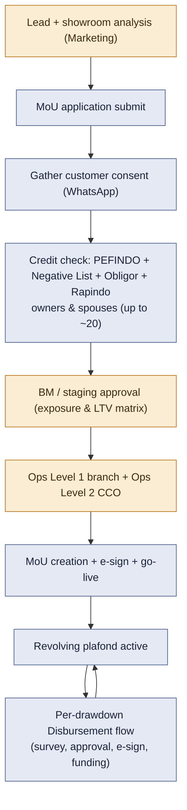

# What it would take to bring SSF onto Bravo

This is a high-level assessment of implementing Showroom Stock Financing (SSF) as a product on Bravo's unified Camunda workflow.

Sources, all read from Confluence on 2026-09-09: the SSF PRDs for MoU Lead Submission, Survey, Underwriting and MoU Creation, and for Loan Origination and Disbursement; the LORA SSF MoU and Disbursement TRDs; the Direct Marketing architecture page; and the SSF platform overview. Plus the Bravo unified analysis in `workflow-analysis.md`.

## 1. Read this first: SSF is being built on LORA, not Bravo

SSF today runs on a **different stack from Bravo**. It uses a Go **Backoffice Service** for marketing and MoU orchestration, plus **LORA**, which is Temporal-based, for underwriting and pre-go-live operation. Its ArangoDB schema is `mou-ssf-v0_0_1`. An MVP is in UAT, with a go-live checklist dated 2026-09-15 to 2026-09-17.

In other words, BFI has deliberately placed SSF on the platform it is migrating *toward*. Not on Bravo.

So "bring SSF to Bravo" runs against the current direction. This document answers the question as asked — what it would take. But the first finding is that doing so would re-implement, on the legacy-side platform, a product that already has a home on the target platform.

That trade-off is management's to make. The estimate below assumes it is wanted anyway, for example to consolidate all origination on Camunda in the near term.

## 2. What SSF's process looks like

From the SSF/LORA specs, the end-to-end shape is:

Two things make SSF structurally unlike Bravo's current products. First, it is a **two-level product**: a revolving MoU umbrella contract, and then many disbursements drawing down a plafond. Second, it is **showroom and corporate**: many assets, and multiple owners and directors.

## 3. What Bravo unified already gives SSF

Reusable as-is or with light change, from the existing unified activities and children:

- **Credit-check building blocks.** PEFINDO for customer and spouse, negative list, obligor and RAC. All of these exist as `*UnifiedActivity` classes.
- **KYC / e-KYC and e-sign**: present in the unified KYC child and the operation/go-live path.
- **Document submission, create-CIF, operation go-live, pending-take-over**: existing unified children.
- **The orchestration spine, and config-driven activity selection.** A new `OPTION_SSF` selector type slots into the same pattern the DF products use.
- **The human-task pattern.** Survey, BM approval and multi-level operation tasks already exist in unified form. They map onto SSF's BM, Ops-L1 and Ops-L2 roles.

## 4. The real gaps to close

| # | Gap | Why Bravo doesn't have it | Rough size |
|---|---|---|---|
| G1 | **Revolving MoU + plafond** | Bravo is one application to one loan; SSF needs an umbrella MoU with a reserve/release plafond and many child disbursements | Large — new domain + data model |
| G2 | **Two-level workflow** | Needs an MoU-creation workflow and a separate, repeatable Disbursement workflow keyed to the MoU | Large — a second spine or a child workflow family |
| G3 | **Corporate / multi-owner** | Bravo credit-checks individual + spouse; SSF checks a company plus up to ~20 owners and their spouses | Medium — fan-out of existing checks |
| G4 | **Showroom multi-asset survey** | 20 to 250 assets per showroom; Bravo multi-asset is limited to a handful | Medium — data model + survey UI |
| G5 | **Staging approval matrix** | SSF routes approval dynamically by exposure/LTV/rate; Bravo underwriting is fixed BM/CA | Medium — config-driven approval routing |
| G6 | **Consent via WhatsApp + showroom analysis** | New SSF-specific activities (consent collection, showroom feasibility scoring) | Medium — new activities |
| G7 | **Marketing front end** | SSF uses the Backoffice web app; Bravo has the underwriting console, not a marketing MoU UI | Medium to large — UI work outside bpm-service |

G1 and G2 are the load-bearing gaps. They are not workflow wiring. They are a product-model change — a revolving umbrella plus drawdowns — that Bravo has never had. Everything else is additive.

## 5. High-level step-by-step (if pursued)

1. **Decide the two-level model on Camunda.** Design the MoU workflow and a repeatable Disbursement child workflow, with plafond reserve and release as a first-class domain service. This is the make-or-break design step.
2. **Add `OPTION_SSF` and its config.** That means a new selector type, plus `workflow_selector_order` and master-config rows. Reuse the existing check, scoring and operation activities wherever they fit.
3. **Build the gap activities.** Revolving plafond management, corporate multi-owner credit-check fan-out, showroom multi-asset survey, staging-approval matrix, consent-via-WhatsApp, showroom analysis.
4. **Integrate the front end.** Either point the existing Backoffice and marketing UI at Bravo APIs, or extend the Bravo console for MoU and disbursement. Either way this is a sizeable workstream outside `bpm`.
5. **Parallel-run against the LORA MVP.** Diff outcomes on the same applications before moving any real volume.
6. **Pilot one branch/segment, then ramp.**

## 6. Bottom line

- **Feasible, but not small.** SSF reuses Bravo's credit-check, KYC, e-sign and operation building blocks. But its revolving two-level model — MoU plus disbursement — and its corporate showroom shape are genuinely new to Bravo. So expect a DF4W-scale platform effort, which is the pathfinder cost. Do not expect a DF2W-scale config delta. SSF does not fit the existing five-stage single-loan spine.
- **It runs against the current direction.** SSF already lives on LORA, the platform BFI is migrating toward. Re-homing it on Bravo needs a specific consolidation goal to justify it. Without one, the cheaper path is to leave SSF on LORA, and spend Bravo's effort on migrating the legacy NDF products onto the unified spine (see `bravo-unified-legacy-to-unified.md`).
