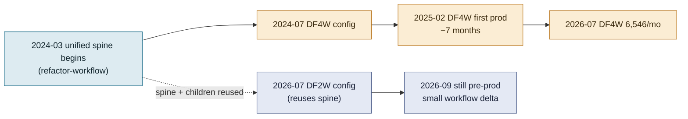

# How fast does the Bravo unified workflow let a new product ship?

This document reads the unified workflow's quality through delivery speed. It compares DF4W, the product that built the spine, with DF2W, the product that reused it. The evidence comes from the git history of `bravo-bpm-service`, the D2W and DF Jira projects, and the production `ms-bpm` database, all read on 2026-09-09.

Jira boards: the DF2W timeline is `D2W` board 2877, and the DF4W timeline is `DF` board 2099. The cycle-time and volume figures below come from a 200-issue sample per programme — the most recent pages of each project's child issues — plus full production counts from the application table.

## 1. Verdict

**The unified workflow's central claim holds in the data.** That claim is that the second product onto the spine is far cheaper than the first.

DF4W was the pathfinder. It effectively built the unified generation — the `refactor-workflow` work of 2024 — and took about seven months from workflow setup to first production loan.

DF2W came a year later. It reused the same spine and most of the same domain children. Its workflow layer was a small database-config delta plus a handful of new activities. Its build effort went almost entirely into product-specific concerns: 2-wheel insurance, calculation and the Sharia variant. Very little went into workflow plumbing.

There is a caveat. DF2W is **not yet in production** — the database held zero applications as of 2026-09-09. So this comparison measures "time to build", not "time to a proven live product".

**Corroborated 2026-09-10, and this document was the only one in the pack that had it right.** DF2W is in active pre-release testing. UAT branch mapping is seeded (`INS-6245`, 2026-09-07). `[DF2W] E2E Testing` is resolved (`LN-6479`). The go-live worker TAC is closed (`TDF-4273`, 2026-09-09). An **LOS penetration test is running** (`ADI-1312` firewall access Done 2026-09-09, `BLCS-4799` sample data Done 2026-09-07). And the pre-go-live epics are still open (`D2W-5`, `LN-4573`, `LN-4554`).

Four other documents described DF2W as *"fully configured in production"*, which reads as released and unused. They have been corrected to match this one.

One more limit. DF4W itself runs at about 6,500 applications a month, which is still only 5.5% of Bravo's volume. So neither DF product has been stress-tested at the scale of the legacy monoliths.

## 2. DF4W — the pathfinder that built the spine

| Milestone | Date | Source |
|---|---|---|
| `refactor-workflow` / unified prefix introduced | 2024-03-05 | git `chore(refactor): add prefix unified` |
| DF4W workflow config set up | 2024-07-12 | git `feat(df4w): setup workflow` |
| Heavy build phase | 2024-09 to 2024-12 | 154 DF4W-tagged commits; BLOSCS build issues median cycle 11 days |
| First production application | 2025-02-07 | application table, product_id 4 |
| Ramp to 1,000/month | 2025-10 | 1,101 applications |
| Ramp to steady state | 2026-07 | 6,546 applications/month |

DF4W's build issues were small and fast: median 11 days, p75 18, p90 26. That is the signature of a team building many small activities and config rows, rather than wrestling with one large workflow.

But the calendar cost was real. It took **about 7 months from workflow setup to the first production loan, and about 11 months to reach 1,000 loans a month.** That time bought the platform: the orchestration spine, the config-driven `BaseActivity` mechanism, and the shared domain children every later product reuses.

The DF Jira project, `DF-*`, tells the after-story. Its epics are all dated 2025-12 or later, and they are all enhancements: calculator redesign, PD model, tax calculation, supplier management, insurance expansion. That is continuous product iteration once the spine was live. It is not workflow construction.

## 3. DF2W — the product that reused the spine

| Milestone | Date | Source |
|---|---|---|
| D2W epics created (16 in one batch) | 2026-06-02 | Jira D2W project |
| DF2W workflow config set up | 2026-07-07 | git `feat(df2w): setup workflow config df2w` |
| Build burst | 2026-07 to 2026-09 | 309 df2w-tagged commits (179 in July alone) |
| Production go-live | not yet | zero applications for product_id 11 |

DF2W's workflow footprint on the spine is deliberately small. In the database configuration, the entire DF2W-against-NDF2W scoring difference is **two config-gated activities** — `SurveyRACUnifiedActivity` and `PDModelAlternativeOverlayUnifiedActivity` — plus a few gateway flags. DF2W reuses the same Check, Initial Scoring, Survey, Underwriting and Operation orchestrators, and the same KYC, Pefindo, RAC and PD-model children, as every other product.

The git history confirms where the effort actually went. The 2026 DF2W commits are dominated by 2-wheel calculation, insurance (the INS issues under epic D2W-9), and the Sharia variant. That is product economics, not workflow structure.

DF2W's child-issue cycle time is much longer than DF4W's build issues: median 56 days, p75 73, p90 87. And about half the sampled issues are still open. That fits a programme still mid-flight, working through the breadth of its business logic. It does not fit workflow-plumbing difficulty.

## 4. Reading the two together

- **What speed says about the design.** The unified workflow front-loads cost into the first product, and makes later products a configuration exercise. DF2W added a full loan product by seeding config rows and two activities. DF4W needed seven months to stand the platform up. That is the intended payoff, and it is visible in both git and the database.
- **The unproven half.** "Cheap to add" is demonstrated. "Cheap to run at scale, and safe to change" is not, because DF2W is pre-production and DF4W is still a small fraction of volume. And the config-skip mechanism that makes products cheap also hides what each product runs (see `workflow-gap.md`). So the maintenance cost of many products on one spine is still ahead of the team.
- **Fair comparison.** DF4W's 7-month clock included building the spine. A third product today would look like DF2W, not DF4W. So the right expectation for the next product on Bravo unified is a quarter of config and product-specific activities — provided its shape fits the existing five-stage spine.

## 5. What could not be measured

- **True DF2W time-to-market**, because it has not gone live; only time-to-build is known.
- **Defect and rework rates** per product, which would require the bug/incident projects, not the feature issues sampled here.
- **Effort in person-days.** Jira issue counts and cycle times are only proxies. The `Estimated Effort` and story-point fields were empty on every issue we sampled.
