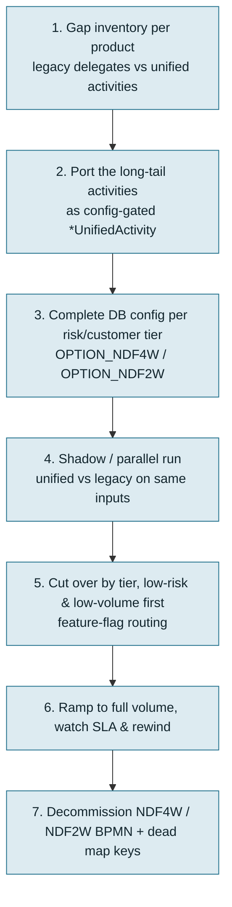

# Moving NDF4W and NDF2W from the legacy monoliths to the unified workflow

This is a high-level, step-by-step account of what it takes to migrate Bravo's two legacy per-product monoliths, `NDF4W` and `NDF2W`, onto `Unified_Process_Main_Workflow`. It is a companion to `workflow-analysis.md` and `workflow-gap.md`. The evidence comes from `bravo-bpm-service` and the production `ms-bpm` database, read on 2026-09-09.

## 1. The headline: more of this is already done than it looks

Two facts from the database change the shape of this migration:

- **The unified configuration for both products already exists.** The selector types `OPTION_NDF4W` and `OPTION_NDF2W` are seeded in `workflow_selector_type`, with master configs per customer and risk type — 6 for NDF4W and 16 for NDF2W. The NDF2W-specific scoring activities `CollateralVerification`, `FatalScore` and `SimpleSurvey` are already active for `OPTION_NDF2W`. And NDF4W has even run in production on the spine: 4 "company" applications went through `Unified_Process_Main_Workflow` as `OPTION_NDF4W`.
- **Most domain activities already have unified equivalents.** By name, 31 of the 71 NDF4W delegate beans and 25 of the 74 NDF2W beans already exist as `*UnifiedActivity` classes. Those cover KYC, Pefindo, RAC, PD model, anti-fraud, dedupe, create-CIF and operation. The rest are the long tail of product-specific variants.

So this is not a green-field rebuild. It is **completing a partial port, and then moving live traffic across safely.** The "safely" is the hard part, because NDF2W alone starts about 248,000 process instances every 90 days.

## 2. What is genuinely missing

The gap is the product-specific long tail, roughly 40 NDF4W and 49 NDF2W delegates with no unified equivalent today. It clusters into:

- **PD-model variants** — NTB/NTC, RO-tele, partnership, pre-overlay (many `PDModel*2wActivity` classes).
- **Legacy scoring and profile activities** — Asliri, iziData, one-obligor, Shopee, income/ATP/WTP calculations, retrieve-Pefindo-profile variants.
- **Channel and RO specifics** — Pallav customer creation, RO same-asset, RO-digital operation assignment, forced-survey and survey-type flags.
- **The human flows** — survey, negotiation, document pickup, and the underwriting and operation user tasks. In the monoliths these are deeply branched by risk tier.

## 3. Step-by-step (high level)

1. **Gap inventory per product.** Turn the name-match analysis into an exact list. Map every legacy delegate to one of three outcomes: an existing unified activity, a new one that has to be written, or "drop" if it is dead or duplicated. That list is the backlog.
2. **Port the long-tail activities.** Implement the missing beans as `*UnifiedActivity` classes extending `BaseActivity`, so they take part in the config-skip mechanism. Where legacy variants are near-duplicates — the many PD-model variants, for instance — merge them into fewer parameterised activities rather than porting one for one.
3. **Complete the database configuration.** Fill `workflow_selector_order` and `workflow_master_config_detail` for every NDF4W and NDF2W combination of customer type and risk type, so the spine reproduces each tier's real path. Start from the seeded configs that already exist.
4. **Shadow or parallel run.** Drive real applications through both the legacy monolith and the unified spine, then diff the outcomes: decisions, statuses, assignments, documents. At this volume, that is the critical safety gate. The config-skip design means a missing row silently drops a check. So parity has to be proven, not assumed.
5. **Cut over by tier.** Route the safest, lowest-volume segment first, behind the existing workflow-routing flags. NDF4W company is a good start, because it has already been piloted. Then low-risk new customers. Keep the legacy process warm for rollback.
6. **Ramp to full volume.** Move risk tiers across one at a time, watching SLA, stuck-instance and human-task-queue metrics. NDF2W's survey and follow-up queues are the highest-volume human work in the estate, so they are the most likely to surface load problems.
7. **Decommission.** Once a product runs entirely on the spine, retire its legacy BPMN. Remove the dead `setting.workflow.map` entries. And delete the unreferenced `Process_NDF4W_Scoring_1_Mock_Ro`.

## 4. Effort shape and risks

- **Effort is concentrated in steps 2 and 4**, not in the spine. The orchestration is done. The work is the activity long tail and, above all, proving parity at scale.
- **NDF2W is the harder of the two.** It has more product-specific delegates, 49 against 40. It has far higher volume, 248,000 instances per 90 days against 60,000. And it has more risk tiers, 16 master configs against 6. So do NDF4W first to build confidence, then NDF2W.
- **The config-skip trap.** An unconfigured activity no-ops silently. So the migration's main risk is a missing config row removing a credit or compliance check, without anything failing. Two things mitigate it: parallel-run diffing, and a "fail loud on missing config" guard.
- **RO and channel variants** — RO same-asset, Pallav, RO-digital — are the messiest legacy corners, and the least reusable. Scope them as their own workstream, or decide that some low-volume variants stay on legacy until last.
- **Do not migrate onto a spine you cannot see per product.** `workflow-gap.md` describes the visibility gap: no per-product diagram, and product logic split across config, Java `isXxx()` branches and gateways. Address that in parallel, or the migrated products become hard to operate.
