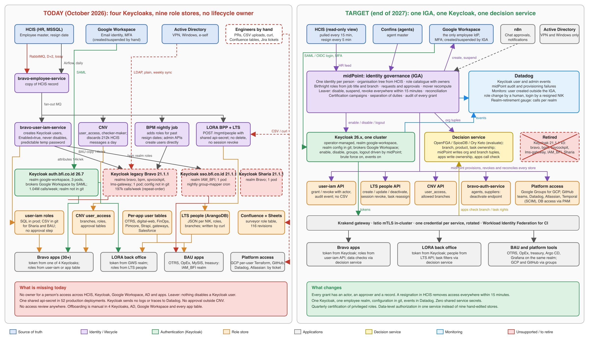

> **Status:** version 1, 3 October 2026. Child of [Identity Governance and Administration](https://bfifinance.atlassian.net/wiki/spaces/EA/pages/2814771240). That page holds the findings and the reasons. This page holds the steps. Author: Andre Laksmana.

# 1. How to read this page

The parent page found that BFI has no single owner for the life of a person's access, four Keycloak deployments, nine role stores, no leaver path, no audit and no review. It recommends eight prerequisites, then midPoint as the identity governance core, with one decision service for data-level authorization beside Keycloak.

This page turns that into numbered steps. Each step has an owner, what it depends on, what it produces, and how we know it is done. Steps are grouped into phases. Inside a phase they can run in parallel unless a dependency says otherwise. Owners are teams; the identity owner named in step 0.1 assigns people.

Ten workstreams run through the phases:

| Code | Workstream | What it delivers |
| --- | --- | --- |
| A | Stop the bleeding | The five fixes that remove live exposure this month |
| B | One identity source | HCIS is the only feed, pull-based, monitored, with a resign fast path |
| C | One Keycloak | One operator-managed cluster, one employee realm, config in git, events in Datadog |
| D | Role stores behind APIs | Every role store can be written and read by the IGA, with a real actor and an audit event |
| E | Service identities | One credential per service, no shared environment key, mesh identity in-cluster |
| F | Audit and monitoring | Keycloak and IGA events in Datadog with monitors |
| G | IGA platform | midPoint in production, HCIS to targets, requests and approvals |
| H | Data-level authorization | One decision service for branch, product and task permissions |
| I | Platform and SaaS access | GCP, GitHub, Datadog, Atlassian, Temporal, databases through the IGA |
| J | Review and compliance | Certification campaigns, separation of duties, audit pack |

## 1.1 Architecture: today and target

Left: how identity and access work today, with the gaps in red. Right: the end state this plan builds. Workstreams B and C change the top and middle of the left panel (one HCIS feed, one Keycloak). Workstream D turns the hand-edited role stores into APIs. Workstream G adds midPoint as the one system that provisions and revokes. Workstream H adds the decision service.

On Confluence the image is the page attachment `iga-architecture-today-vs-target.png`; the SVG source is `docs/diagrams/iga-architecture-today-vs-target.svg`, generated by a Python script, re-render with `rsvg-convert -w 2400`.

# 2. Goals and how we measure them

| Goal | Measure today | Target | By |
| --- | --- | --- | --- |
| A resignation removes all access | Not automated anywhere; D+2 at best; LORA never | Keycloak disabled, GWS suspended, LORA deactivated within 15 minutes of HCIS, with an audit record | End of Phase 2 |
| One authentication platform | 4 production Keycloaks, 9 realms, 3 on 21.1.1 | 1 cluster, 1 employee realm, realm config in git | End of Phase 1 |
| Every role grant has an actor, an approver and a record | Only CNV | 100% of Bravo and LORA grants through the IGA | End of Phase 3 |
| No shared service secret | 1 secret in 52 deployments; 1 for all of LORA | 0 shared secrets; per-service credentials rotated | End of Phase 1 |
| Keycloak is observable | No logs or traces in Datadog | Login, admin and IGA events in Datadog with 3 monitors | End of Phase 1 |
| Access is reviewed | Never | Quarterly certification of privileged roles with evidence | End of Phase 5 |
| Platform access through groups | Per-user lists in Terraform | 0 individual IAM or RBAC bindings; all through IGA-managed groups | End of Phase 4 |

# 3. Governance

**Identity owner.** One named person, accountable for the whole lifecycle across HR, Keycloak, Google Workspace, AD and every application. Decision 1 on the parent page. Until named, the Architecture lead holds it.

**Steering.** Identity owner, SRE lead, Internal Service squad lead, LORA Core lead, Tech Enterprise Security head, Enterprise System head, Human Capital representative. Monthly, 45 minutes, on this page.

**Working group.** The two IGA engineers, one SRE, one engineer each from Internal Service, LORA Core and Scoring & Underwriting, part time. Weekly, 30 minutes.

| Area | Responsible | Accountable | Consulted | Informed |
| --- | --- | --- | --- | --- |
| HCIS feed and employee-service | Internal Service squad | Identity owner | Human Capital, Data | All squads |
| Keycloak platform, realms, operator | SRE | Identity owner | Architecture, Security | All squads |
| Google Workspace, Active Directory | Enterprise System | Identity owner | Security | SRE |
| user-iam, CNV, bravo-auth-service APIs | Internal Service squad | Internal Service lead | Agency, Scoring & Underwriting | IGA engineers |
| LORA LTS people and BPP | LORA Core squad | LORA Core lead | Digital Partnership, Supplier Platform | IGA engineers |
| BPM realm, surveyor and underwriting users | Scoring & Underwriting squad | Squad lead | Security | IGA engineers |
| midPoint and the decision service | IGA engineers | Identity owner | Architecture, SRE | All squads |
| Secrets, rotation, mesh identity | SRE with each squad | Security head | Architecture | IT Production |
| GCP, GitHub, Datadog, Atlassian, Temporal access | SRE | Identity owner | Security | Engineering leads |
| Certification and audit pack | Identity owner | Security head | Internal Audit, Compliance | Steering |

**Tracking.** One Jira epic per workstream (A to J) in a new project `IGA`, each step below as a story with the step ID in the summary. Monthly status in section 9 of this page.

# 4. Step-by-step plan

## Phase 0: decisions and urgent fixes (October 2026)

| ID | Step | Owner | Depends on | Output | Done when |
| --- | --- | --- | --- | --- | --- |
| 0.1 | Name the identity owner and record decisions 1 to 4 from the parent page (owner, retire the 21.1.1 instances, midPoint plus two engineers, Google Workspace as the only employee IdP) | CTO, Architecture | None | Decision log on this page | Four decisions recorded with names and dates |
| 0.2 | Create Jira project `IGA`, ten epics A to J, and the stories from this page | Identity owner | 0.1 | Jira board | Every step has a story and an assignee |
| A.1 | diff-inspector: set `AUTH_MODE` to `oidc` in `lora-diff-inspector/values-prod.yaml`, point the issuer at `auth.bfi.co.id/realms/google-workspace`, create the `oh-my-lora` client there, confirm `ALLOWED_USERNAMES`. The same host was shown internet-reachable for `/bpm/engine-rest` in the RCE access-log work, so treat this as internet-exposed | LORA Core, SRE | None | app-deployment PR | Unauthenticated request to `/diff-inspector` returns a login redirect in prod |
| A.2 | BPM: stop giving user tokens `ROLE_SYSTEM_SERVICE`; set `GWS_MOCK_USERS` to empty in prod values; fix the resign-date condition in `EmployeeDataUpdateServiceImpl` so a past resign date removes roles; enable `@EnableMethodSecurity` behind a flag | Scoring & Underwriting | None | bravo-bpm-service PR, app-deployment PR | A user token cannot call a service-only endpoint; a test employee with a past resign date loses roles on the next run |
| A.3 | Rotate the credentials listed in finding F11: `platform-dev` client secret, Apigee keys, cypress values, pbf-live RSA keys, OTRS vendor login, UAT LORA api-secret (and edit page 2515107911), automation-monorepo cookies and passwords; remove `errored.tfstate` from git and purge history | Security with each owning squad | None | Rotation log (names only) | Old values rejected; files removed; page edited |
| A.4 | CNV: log `record not found` at debug, alert on any other `UpdateMetadataConsumer` failure | Internal Service | None | bravo-cnv-service PR, Datadog monitor | Error volume on `prod-ms-cnv` drops from ~212k/day to near zero; monitor exists |
| A.5 | Freeze: no new Keycloak realms or clients outside `google-workspace` without Architecture approval; RI-118 and RI-104 re-pointed to the GWS realm | Architecture | 0.1 | Note on RI-118, RI-104 | Both tickets reference the GWS realm |
| 0.3 | Request an Evolveum subscription quote and a 60-day evaluation; request OpenFGA, SpiceDB and Ory Keto evaluation licences where needed (all open source) | Identity owner | 0.1 | Quotes on file | Quote received |
| 0.4 | Confirm with Human Capital: read-only MSSQL account on the HCIS employee view, `updated_at` reliability, and the agreed definition of "resigned" | Internal Service, Human Capital | None | Signed-off data contract | Contract page linked here |
| 0.5 | Confirm with Enterprise System how Google Workspace accounts are created and suspended today, and whether an API service account for the Admin SDK can be issued to the IGA | Enterprise System | 0.1 | Written answer | Answer linked here |

## Phase 1: prerequisites (November to December 2026)

| ID | Step | Owner | Depends on | Output | Done when |
| --- | --- | --- | --- | --- | --- |
| B.1 | Ship the HCIS Airflow sync to production: pick one `bravo-airflow` copy as the owner, add the 5-minute resign DAG from the May 2026 TRD, keep the 15-minute full sync | Internal Service | 0.4 | DAGs running in prod | Both DAGs green for 14 days |
| B.2 | Turn off the RabbitMQ `HCEmployeeListener` in prod (`AIRFLOW_SYNC_ENABLED=true`) and remove the HC broker dependency | Internal Service | B.1 | app-deployment PR | No HC MQ consumer in prod; employee table matches HCIS on a daily reconciliation |
| B.3 | Datadog monitors: DAG failure; employee table drift; "NIK resigned in HCIS but enabled in Keycloak" (daily job comparing employee-service to Keycloak) | Internal Service, SRE | B.1 | 3 monitors routed to a channel with an on-call | Each monitor has fired in a test and reached a person |
| C.1 | Put the `google-workspace` realm in git: export from `auth.bfi.co.id`, strip secrets, store under `bfi-app-deployment/auth` as an operator realm import; same for the `qa` realm in nonprod | SRE | None | Realm JSON in git, applied by the operator | A change to a client in git appears in the running realm |
| C.2 | Migrate the remaining `bravo` realm consumers to `google-workspace`: repeat-order, lms-ops, collateral, inventory, agent-marketing, SPV cockpit, RMS, AQM, DMS data admin, LMS password login (`lms-ui`), agency `spvcockpit` realm clients | Each owning squad, coordinated by SRE | C.1 | One PR per service | 7-day Datadog spans show zero calls to `realms/bravo`, `realms/spvcockpit`, `realms/lms-gateway` |
| C.3 | Migrate BPM from the `bpm` realm to `google-workspace`: realm roles become client roles on `los-*` clients; AD federation is dropped (GWS is the IdP); surveyor and underwriting user creation moves to the IGA in Phase 3, until then BPM admin APIs target the GWS realm | Scoring & Underwriting, SRE | C.1 | bravo-bpm-service PR, realm change | Zero calls to `realms/bpm` in 7-day spans |
| C.4 | Migrate `IAM_BFI` consumers (OTRS, Operation Excellence, MySIS, treasury, ARES, AMS, PCMS, Argo CD) to `google-workspace`; replace the nightly `keycloak-user-mapper` cron with group mapping in the IGA (Phase 3) or, until then, with the same cron pointed at the GWS realm | Owning squads, SRE | C.1 | PRs | Zero calls to `realms/IAM_BFI` in 7-day spans |
| C.5 | Retire the three Keycloak 21.1.1 instances and their Cloud SQL databases after a 30-day read-only period; keep a database export for 12 months | SRE | C.2, C.3, C.4 | Terraform and Argo removal PRs | Statefulsets gone; Datadog shows one Keycloak |
| C.6 | Realm hardening on `google-workspace`: brute-force protection on, password policy on for any remaining password users, refresh-token revocation on, offline session idle 1 day, `impersonation` and `token-exchange` off in prod | SRE | C.1 | Realm JSON change | Settings visible in git and in the admin console |
| F.1 | Keycloak events to Datadog: enable user and admin events on `google-workspace`, ship JSON logs through the Agent, add three monitors (user created outside the IGA, role or group change by a human, login by a resigned NIK) | SRE | C.1 | Log pipeline, 3 monitors | A test login appears in Datadog within 1 minute; each monitor fired once in a test |
| D.1 | user-iam: add an authenticated grant and revoke API (real actor from the token, no `x-internal-actor`), emit an audit-trail event per change, add `USER.ROLE.GRANT` and `USER.ROLE.REVOKE` event types to audit-trail; retire CSV mode for Sharia and BAU by moving them to SQL | Internal Service | None | user-iam PRs, audit-trail PR | A role grant shows actor, target and time in audit-trail; no CSV in the Sharia and BAU images |
| D.2 | user-iam: add disable and enable of the Keycloak user, and session logout, callable by the IGA; stop generating predictable temporary passwords (use a required action or no password for GWS users) | Internal Service | D.1 | user-iam PR | A disable call logs the user out within 1 minute |
| D.3 | LORA LTS: add `DELETE /mgmt/people/{id}` (soft delete with `active=false`), session revocation on deactivation (fill the "VALIDATE USER HERE" placeholder), cache invalidation across pods, reassignment of open tasks on deactivation, and make `DirectAssign` honour `active` | LORA Core | None | lora-task-service PRs | A deactivated user is logged out within 1 minute on every pod and has no open tasks |
| D.4 | LORA: a provisioning path for SSF and corporate users (extend BPP CSV or a management UI in the IS Platform), and the schema realm string aligned (`bfi_employees`) | LORA Core, Digital Partnership | D.3 | BPP PR or IS Platform page | An SSF area manager can be created and deactivated without curl |
| D.5 | bravo-auth-service: a deactivate endpoint for agents and supplier users; agency deactivation calls it | Internal Service, Agency | None | PRs | Deactivating an agent revokes their refresh tokens |
| D.6 | BPM: user creation and role assignment move behind one API with a real actor and an audit event; drop the shared default password | Scoring & Underwriting | C.3 | PR | No `KEYCLOAK_DEFAULT_USER_PASSWORD` in prod values |
| E.1 | Per-service secrets: replace `prod-internal-service-key-secret` with one sealed secret per service in app-deployment; same for the LORA internal key; constant-time comparison in the middlewares | SRE with each squad | None | 52 app-deployment PRs, middleware PRs | Zero references to the shared secret name in prod values |
| E.2 | In-cluster identity: Istio `PeerAuthentication` STRICT and `AuthorizationPolicy` per namespace for service-to-service calls, aligned with SRE-1803 (backends private behind Krakend) | SRE | SRE-1803 end state | Terraform and app-deployment PRs | A call without a sidecar identity is rejected |
| E.3 | GitHub Actions to GCP through Workload Identity Federation; delete the weekly-rotated service-account key | SRE | None | bravo-terraform PR | No `BRAVO_GCP_SA_KEY` org secret |
| F.2 | Keycloak metrics and a Datadog dashboard (logins per client, failures, admin changes, token volume per realm as the retirement gauge) | SRE | F.1 | Dashboard | Dashboard linked here |

## Phase 2: midPoint pilot (January to March 2027)

| ID | Step | Owner | Depends on | Output | Done when |
| --- | --- | --- | --- | --- | --- |
| G.1 | Deploy midPoint on GKE: Helm chart, 2 replicas, Cloud SQL Postgres, Sealed Secrets, SSO through `google-workspace` for the midPoint UI, backups | IGA engineers, SRE | 0.3, C.1 | app-deployment chart, Terraform | midPoint UI reachable by SSO in nonprod and prod |
| G.2 | HCIS resource: DatabaseTable connector on the read-only view; import all active employees; map NIK, name, email, job title, work location, status, resign date; nightly reconciliation | IGA engineers | 0.4, G.1 | Resource and object template | Every HCIS employee has a midPoint user; reconciliation report shows zero unmatched |
| G.3 | Organisation tree from HCIS: directorate, division, department, branch; job title as a reference | IGA engineers | G.2 | Org objects | Branch membership visible per user |
| G.4 | Keycloak target: Keycloak connector on `google-workspace`; outbound mapping of enable, disable, attributes, groups; logout on disable through D.2 | IGA engineers | C.1, D.2 | Resource | A disable in midPoint logs the user out of Keycloak within 1 minute |
| G.5 | Google Workspace target: Google connector with the Admin SDK service account; suspend on leaver, reactivate on rehire; no creation yet | IGA engineers, Enterprise System | 0.5 | Resource | A resignation in HCIS suspends the GWS account |
| G.6 | LORA LTS target: REST connector on `/mgmt/people`; create, update, deactivate; birthright `dp_role`, `ssf_role`, `corp_role` and branches from job title and org | IGA engineers, LORA Core | D.3, D.4 | Resource, role objects | A new VD in HCIS can log in to LORA with the right branch on the next sync |
| G.7 | Leaver policy: on HCIS resign date, disable Keycloak, suspend GWS, deactivate LORA, revoke all roles, within 15 minutes; mover policy: job title or branch change recomputes birthright roles | IGA engineers | G.4, G.5, G.6 | Policies | End-to-end test with three test employees passes; audit shows each action |
| G.8 | Audit to Datadog: midPoint audit table shipped as logs; monitor on provisioning failures | IGA engineers, SRE | G.1 | Log pipeline, monitor | A failed provisioning shows in Datadog within 5 minutes |
| G.9 | Pilot sign-off: run for 30 days with LORA as the only application target; weekly review of exceptions | Identity owner | G.7 | Pilot report | Steering approves Phase 3 |

## Phase 3: Bravo roles through the IGA (April to June 2027)

| ID | Step | Owner | Depends on | Output | Done when |
| --- | --- | --- | --- | --- | --- |
| D.7 | Role catalogue: import user-iam domains, roles and permissions into midPoint as role objects; name an owner per domain (lms, agency, dms, egc, sharia, marketing, platform, backoffice); mark privileged roles | IGA engineers, Internal Service, domain owners | D.1, G.9 | Catalogue page and role objects | Every role has an owner and a description |
| G.10 | user-iam target: REST connector on the D.1 API; `job_title_has_role` becomes birthright in midPoint; `employee_has_role` becomes requestable roles | IGA engineers | D.7 | Resource | A role granted in midPoint appears in user-iam with midPoint as the actor |
| G.11 | CNV target: `user_access` and allowed branches through the CNV API; keep CNV's checker-maker as the approval step or move it to midPoint (decision at D.7) | IGA engineers, Internal Service | G.10 | Resource | CNV grants originate in midPoint |
| G.12 | BPM target: surveyor, CRE, underwriting and branch-ops roles as midPoint roles on the `los-*` client roles; retire the BPM nightly job and the direct admin APIs | IGA engineers, Scoring & Underwriting | C.3, D.6 | Resource | No calls to the Keycloak Admin API from `prod-ms-bpm` |
| G.13 | Access requests and approvals: request a role in midPoint, approver is the role owner or the line manager from HCIS; Google Chat notification by n8n; SLA 2 working days with escalation | IGA engineers | G.10 | Workflow, n8n flow | 10 real requests completed end to end |
| G.14 | Retire the surveyor Confluence table (436535330), the CSV role files, the `keycloak-user-mapper` cron and the BPP CSV upload | Owning squads | G.10, G.12 | Removal PRs | None of the four exists |
| G.15 | Agents: bravo-auth-service and Confins as midPoint resources for agent and supplier users (create, deactivate), with Agency as the role owner | IGA engineers, Agency | D.5 | Resource | Agent deactivation flows from Confins through midPoint to auth-service |
| H.1 | Decision service evaluation: OpenFGA, SpiceDB and Ory Keto against three BFI cases (LORA task filters by role and branch, CNV allowed branches, BPM work-location maps); pick one | IGA engineers, Architecture, LORA Core | G.9 | Evaluation page, decision | Decision recorded with the three cases passing |

## Phase 4: platform access and data-level authorization (July to September 2027)

| ID | Step | Owner | Depends on | Output | Done when |
| --- | --- | --- | --- | --- | --- |
| I.1 | GCP: all IAM and IAP bindings through Google Groups named per the SRE policy; midPoint manages group membership through the Google connector; delete per-user lists in Terraform; enable GKE Google Groups for RBAC; remove contractor and personal identities or move them to governed groups | SRE, IGA engineers | G.5 | Terraform PRs | Zero `user:` bindings in bravo-terraform |
| I.2 | GitHub: teams managed by midPoint through the GitHub connector; SAML SSO enforced on the org; Argo CD and Grafana RBAC by those teams | SRE, IGA engineers | G.9 | Resource, org setting | A leaver loses GitHub access within 15 minutes |
| I.3 | Datadog, Atlassian, Temporal Cloud: users and roles through SCIM or API connectors; remove manual invitations | SRE, IGA engineers | G.9 | Resources | Leaver test passes for each |
| I.4 | Database access: requests go through midPoint, fulfilled by DOE through the PAM; standing access expires after 90 days | DOE, IGA engineers | G.13 | Workflow | No Jira ticket path for database access |
| H.2 | Deploy the decision service beside Keycloak; midPoint writes organisation and branch membership tuples; LORA writes task ownership tuples; LTS and CNV call the check API; BPM work-location maps migrate | IGA engineers, LORA Core, Internal Service, Scoring & Underwriting | H.1 | Service, tuples, client libraries | LORA task list and CNV branch filters are enforced by the service in prod |
| E.4 | Non-person identities: inventory of bank portal logins, SLIK OJK, Vonage, FINOPS token, gateway app secrets; each with an owner, a store (Vault or Secret Manager) and a rotation date; gateway secrets hashed | Security, owning squads | None | Inventory page | Every entry has an owner and a last-rotated date |

## Phase 5: review and compliance (October to December 2027)

| ID | Step | Owner | Depends on | Output | Done when |
| --- | --- | --- | --- | --- | --- |
| J.1 | First certification campaign: privileged roles (platform.iam.editor, GLOBAL_ADMIN, LOS admin, SRE groups, GCP admin groups) reviewed by role owners in midPoint; unreviewed access revoked after 14 days | Identity owner, role owners | G.13, I.1 | Campaign report | Campaign closed with evidence |
| J.2 | Separation-of-duties rules: maker versus checker in CNV; requester versus approver in user access; the LORA credit approver chain; alert on violation and block on request | IGA engineers, Risk | D.7 | Policy rules | A test violation is blocked |
| J.3 | Audit pack for OJK and internal audit: who has what, how it was granted, when reviewed; generated from midPoint and Datadog | Identity owner, Compliance | J.1 | Report template | First report delivered to Internal Audit |
| J.4 | Quarterly cadence: certification every quarter; realm, client and secret review every quarter; KPI review at steering | Identity owner | J.1 | Calendar | Second campaign scheduled |

## Phase 6: later (2028)

| ID | Step | Owner | Notes |
| --- | --- | --- | --- |
| K.1 | Active Directory and VPN as midPoint targets; ADManagerPlus retired or kept as a target | Enterprise System, IGA engineers | Depends on the AD roadmap |
| K.2 | Salesforce (pbf-live) permission sets through midPoint | PBF squad, IGA engineers | 167 permission sets; start with the roles |
| K.3 | Customers stay out of scope; partners and insurers get API-key lifecycle through the secrets inventory | Security | Not IGA |

# 5. Timeline

| Month | Phase | Main deliveries |
| --- | --- | --- |
| October 2026 | 0 | Decisions, owner, Jira, A.1 to A.5 fixes, HCIS and GWS confirmations, Evolveum quote |
| November 2026 | 1 | HCIS DAGs in prod, realm in git, per-service secrets started, user-iam and LTS APIs started |
| December 2026 | 1 | Legacy realm consumers migrated, Keycloak events in Datadog, LTS leaver path, WIF for GitHub |
| January 2027 | 1, 2 | Three 21.1.1 instances retired; midPoint deployed; HCIS imported |
| February 2027 | 2 | Keycloak, GWS and LORA targets live; leaver policy tested |
| March 2027 | 2 | 30-day pilot; sign-off |
| April to June 2027 | 3 | Role catalogue, user-iam, CNV, BPM targets, requests and approvals, decision-service choice |
| July to September 2027 | 4 | GCP, GitHub, SaaS, database access; decision service in prod; non-person inventory |
| October to December 2027 | 5 | First certification, SoD rules, audit pack, quarterly cadence |
| 2028 | 6 | AD and VPN, Salesforce |

# 6. People and cost

| Item | Estimate | Notes |
| --- | --- | --- |
| IGA engineers | 2 full time from January 2027, 1 from January 2028 | Java or Go background; midPoint training in month 1 |
| SRE | 0.5 full time through Phase 1, 0.25 after | Keycloak, secrets, mesh, Terraform |
| Squad engineers | Internal Service 1 full time in Phases 1 and 3; LORA Core 0.5 in Phases 1 and 2; Scoring & Underwriting 0.5 in Phases 1 and 3; Agency 0.25 in Phase 3 | Mostly API work on their own services |
| Enterprise System | 0.25 in Phases 0 and 2 | GWS service account, AD questions |
| midPoint infrastructure | 2 pods (4 GB each), 1 Cloud SQL Postgres instance per environment, nonprod and prod | Small next to the Keycloak estate it replaces part of |
| Evolveum subscription | Quote pending (0.3) | Per identity; optional but recommended for the first year |
| Decision service | 2 pods plus Postgres | OpenFGA, SpiceDB and Keto are open source |
| Savings | Three Keycloak 21.1.1 instances and their Cloud SQL databases retired; the user-iam Keycloak sync, the mapper cron and the BPP CSV path removed | Realised at C.5 and G.14 |

# 7. Risks

| Risk | Effect | Mitigation |
| --- | --- | --- |
| HCIS data quality (missing emails, shared emails, email on an old NIK, the 2025 SSO page lists these) | Wrong or failed provisioning | Data contract in 0.4; reconciliation report from G.2 reviewed weekly with Human Capital before targets go live |
| Squads do not finish the API work in Phase 1 | midPoint has nothing to provision to | Steps D.1 to D.6 tracked as blockers for Phase 3; identity owner escalates at steering |
| The `bravo` realm migration breaks repeat-order (189k calls a week, agents with passwords) | Field staff cannot log in | Migrate repeat-order last in C.2, behind a feature flag, with the Datadog realm gauge from F.2 as the rollback signal |
| Google Workspace outage | No logins anywhere | Already the case for GWS-realm apps today; document the outage procedure; keep break-glass admin accounts in Keycloak with MFA and alerts |
| midPoint learning curve | Pilot slips | Evolveum support in year one; LORA first because its model is smallest |
| Shared-secret rotation breaks a service | Outage | Rotate per service with a dual-accept window; E.1 ships one service at a time with Datadog error-rate checks |
| Scope creep into customer identity | Programme stalls | Customers are out of scope on both pages; K.3 keeps it that way |

# 8. Dependencies on other work

- **SRE-1803, backends private behind Krakend.** E.2 builds on its Istio policies; agreed end state October 2026.
- **APPSEC-5, Camunda RCE.** A.2 and E.1 remove the shared credential that made it possible; app-deployment PR #14169 (Istio deny from the ingress namespace) is the same control E.2 generalises.
- **GWS SSO migration (PRD 2471920352).** C.2 to C.4 finish it. The December 2025 deadline has passed; this plan sets January 2027 for retirement.
- **HCIS Airflow sync (TRD 2420506705).** B.1 ships it.
- **Keycloak operator and the `auth.bfi.co.id` cluster.** Already running 26.7; C.1 adds realm-as-code. Who installs the operator is still unknown and must be written down in C.1.
- **IS Platform (bravo-platform-fe).** D.4 and the LORA version-retirement web app both extend it; coordinate with the Digital Partnership squad.

# 9. Status log

| Date | Update |
| --- | --- |
| 3 October 2026 | Plan published. No step started. Decisions 1 to 4 pending. |

# 10. First 30 days checklist

1. Identity owner named and decisions recorded (0.1).
2. Jira project and epics created (0.2).
3. diff-inspector auth fixed in prod (A.1).
4. BPM `ROLE_SYSTEM_SERVICE`, `GWS_MOCK_USERS` and resign-date fixes merged and deployed (A.2).
5. Credential rotation log complete (A.3).
6. CNV error volume down and monitored (A.4).
7. Realm freeze noted on RI-118 and RI-104 (A.5).
8. Evolveum quote requested (0.3).
9. HCIS data contract signed (0.4).
10. Google Workspace Admin SDK service account agreed (0.5).
