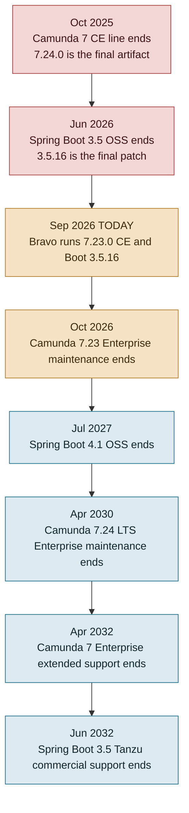

# Option 1 — Upgrade Camunda and Spring Boot to escape end of support

**Companion to** [option-2.md](option-2.md) (Temporal), [option-3.md](option-3.md) (LORA) and [option-summary.md](option-summary.md) (comparison and decision framework).

**Status of the wider decision.** No decision has been taken about Bravo's long-term platform. This document assesses Option 1 on its own merits, under both futures: Bravo as a long-lived platform, and Bravo as a platform with a finite life.

**Verdict in one line.** There is no free upgrade left — Bravo already sits on the terminal public release of both stacks, so "upgrade" means buying a Camunda 7 Enterprise licence. Its distinctive virtue is that it is the only option that changes nothing about how Bravo works, which makes it both the cheapest way to buy decision time and the natural choice if Bravo is to be kept.

**Evidence base.** `squads/Scoring and Underwriting/bravo-bpm-service` at `master` (commit `2d5d856`, 2026-09-07), its `pom.xml` and `Dockerfile`; Maven Central metadata for the Camunda artifacts; the Camunda and Spring published support calendars. Production volumes from [workflow-gap.md §8](workflow-gap.md). Date of writing: 2026-09-10.

---

## 1. The exposure, stated precisely

Bravo's runtime, as pinned in [`pom.xml`](../../squads/Scoring%20and%20Underwriting/bravo-bpm-service/pom.xml) and `Dockerfile`:

| Component | Bravo pin | Where |
|---|---|---|
| Spring Boot | **3.5.16** | `pom.xml:8` (parent) |
| Spring Cloud | **2025.0.1** (Northfields) | `pom.xml:39` |
| Camunda Platform 7 | **7.23.0**, Community Edition | `pom.xml:26`, group `org.camunda.bpm.springboot` |
| Camunda Keycloak identity plugin | **7.23.0** | `pom.xml:425`, `org.camunda.bpm.extension` |
| Java | **17** | `pom.xml:22`, `FROM gcr.io/distroless/java17-debian12` |

Against the vendors' published calendars:

| Component | Support event | Date | Status on 2026-09-10 |
|---|---|---|---|
| **Camunda 7 Community Edition** | Line ended; final CE artifact `7.24.0` published, GitHub repo archived, no further releases *including security patches* | **14 Oct 2025** | **Ended 11 months ago.** Bravo is on 7.23.0, one release *behind* the final CE build |
| Spring Boot 3.5.x | OSS support ends; `3.5.16` is the last OSS patch (25 Jun 2026) | **30 Jun 2026** | **Ended 2.5 months ago.** Bravo is on exactly that last patch |
| Camunda 7.23 (Enterprise) | End of maintenance | **13 Oct 2026** | 33 days away — but only relevant with an EE licence, which Bravo does not have |
| Java 17 (Oracle) | Premier support ends | **30 Sep 2026** | 20 days away; extended to Sep 2029. Bravo runs distroless/Temurin, not Oracle, so this is a posture issue rather than a hard cliff |
| Camunda 7.24 LTS (Enterprise) | End of maintenance / extended support | **13 Apr 2030** / Apr 2032 | The only remaining supported destination inside Camunda 7 |
| Spring Boot 3.5.x (commercial) | Tanzu commercial support ends | **30 Jun 2032** | Available for purchase |

Two facts do most of the work in this document.

**Fact one: the public Camunda 7 well is dry.** Maven Central's `org.camunda.bpm:camunda-engine` metadata ends at `7.24.0`, `lastUpdated 2025-10-14`. Nothing has been published since. The patch releases that carry security fixes — `7.24.1`, `7.24.2`, `7.24.3` — are Enterprise-only and are not on Maven Central. So the entire free upgrade path available to Bravo is **7.23.0 → 7.24.0**, a single notch, after which there is nothing.

**Fact two: Spring Boot 4 requires a Camunda Enterprise licence.** Camunda's own compatibility matrix says Spring Boot 4 support starts at **7.24.3**, shipped as separate `-4`-suffixed artifacts. 7.24.3 is Enterprise-only. Camunda 7.24.0 CE supports **Spring Boot 3.5.x only**. Therefore, on Community Edition, Bravo is permanently frozen on a Spring Boot line whose OSS support ended in June 2026.

That is the shape of the trap: **Camunda CE and Spring Boot 3.5 OSS both terminated within eight months of each other, and Bravo is sitting on the last build of each.**

**One thing that is not a version problem but shares the blast radius.** [SECURITY-FINDING-camunda-rce.md](SECURITY-FINDING-camunda-rce.md) records 61 injected remote-code-execution process definitions in the production BPM engine, one confirmed executed, reachable because `SecurityConfig.java:65` makes `/camunda/**` `permitAll()`. That is a configuration defect fixable in days and it must be fixed under **every** option in this pack. It matters here because an engine with no security patch channel has no second line of defence: the next Camunda CVE is unpatchable on CE.

---

## 2. What "upgrade" can actually mean — three variants

Because the ceiling is a licensing boundary rather than an engineering one, Option 1 is not one plan. It is three, and they differ by an order of magnitude.

| | **1A — Minimal hold** | **1B — Licensed hold** | **1C — Full modernisation** |
|---|---|---|---|
| Camunda | 7.23.0 CE → **7.24.0 CE** | 7.24.0 → **7.24.x EE** (patched) | 7.24.x EE, `-4` artifacts |
| Spring Boot | stays **3.5.16** | stays 3.5.16, **Tanzu commercial** | **4.1.x** + Spring Cloud 2025.1 (Oakwood) |
| Java | 17 → **21** | 17 → 21 | 17 → 21 (or 25) |
| Licences to buy | none | Camunda 7 EE **+** Tanzu Spring | Camunda 7 EE |
| Patch channel after | **none** | Camunda: to Apr 2030. Boot: to Jun 2032 | Camunda: to Apr 2030. Boot 4.1 OSS: to Jul 2027, then annual upgrades |
| Effort | **3.5–5.5 eng-months** | **4.5–7 eng-months** | **11–19 eng-months** |
| Elapsed | 2–3 months | 2–3 months + procurement | 5–8 months, 3–4 engineers |
| Fits which future | Bravo has a finite, near-term life | Bravo runs 2–4 more years | Bravo is a long-term platform |

### 1A — Minimal hold (no licence)

Move to the last free build of everything, harden, and accept that the engine and framework will not receive another security patch.

| Work item | Detail | Eng-months |
|---|---|---|
| Security hardening | Remove `permitAll()` on `/camunda/**`; disable `camunda-bpm-spring-boot-starter-rest` and `-webapp` in prod or put them behind authentication; purge the 61 injected definitions; network-isolate the engine | 0.5 |
| Camunda 7.23.0 → 7.24.0 CE | Bump `camunda.spring-boot.version` and `camunda-platform-7-keycloak` (7.24.0 exists, published 2025-10-24). Engine schema upgrade scripts against `act_*` — the history tables hold **~50M rows per 90 days** ([workflow-gap.md §8](workflow-gap.md) Q4), so this needs a rehearsed maintenance window, not an in-place migration on a Friday | 0.5–1.0 |
| Java 17 → 21 | Camunda 7.24 supports JDK 17/21/25; Boot 3.5 supports 17–25. New distroless base image, JVM flag review, rebuild of the 40-odd manually pinned dependencies | 0.5–1.0 |
| Regression | 53 BPMN files, 483 service-task bindings, 96 user tasks. **Only 4 of 1,457 test files deploy and run a Camunda process** ([compare.md §3.10](compare.md)), so a minimal parity harness has to be built before this bump can be trusted | 1.5–3.0 |
| **Total** | | **3.5–5.5** |

**What 1A buys: no runway, and that is the point.** It moves Bravo from one release behind the terminal build to the terminal build itself, and removes the live exposure. It buys *decision time* rather than *support*: 3.5–5.5 engineer-months is small enough that it does not prejudge the platform question, and every hour of it is useful under all three options.

### 1B — Licensed hold (buy support, change nothing else)

Buy the two commercial support contracts and stop. No framework upgrade.

- **Camunda 7 Enterprise** unlocks the `7.24.x` patch stream: Environment Update Releases twice a year (April and October) carrying security and bug fixes, through **13 Apr 2030**, extended support to **Apr 2032**.
- **Tanzu Spring commercial support** keeps Spring Boot 3.5.x patched through **30 Jun 2032**.

Effort is 1A plus EE onboarding (private artifact repository, `-ee` artifact swap, licence-key deployment, first patch application): **+1.0–1.5 eng-months**, so **4.5–7 eng-months** total. The dominant cost is procurement, not engineering. Neither vendor publishes list pricing for this shape of deployment; both need to be quoted.

**What 1B buys: runway to Apr 2030 on the engine and Jun 2032 on the framework**, with no code modernisation and no change to how anyone works. If the platform decision is going to take a year and Bravo must be demonstrably supported meanwhile, this is the variant that matches.

### 1C — Full modernisation (EE licence + Spring Boot 4.1)

The version of Option 1 people usually mean, and the one that treats Bravo as a platform with a future. Requires the Camunda EE licence first, because Boot 4 needs `7.24.3+`.

| Work item | Detail | Eng-months |
|---|---|---|
| Everything in 1A | | 3.5–5.5 |
| Camunda EE onboarding | Private repo, `-ee` artifacts, licence key | 0.5–1.0 |
| **Spring Boot 3.5 → 4.1** | Spring Framework 6.2 → 7.0, Jakarta EE 10 → 11, Spring Security 6.5 → 7, Hibernate 6.x → 7.x, Spring Cloud 2025.0 (Northfields) → **2025.1 (Oakwood)**. Surface: **5,070 main Java files / 497,970 LOC**, **238 `@Entity`**, **113 `@FeignClient`**, **979 `@Authorize` AOP sites** and a bespoke security aspect, plus roughly **40 hand-pinned CVE overrides in `pom.xml`** that all have to be re-derived against the new BOM (the pom already carries a comment saying exactly this) | 4.0–7.0 |
| Camunda `-4` artifact swap | Swap starter/webapp/rest to the `-4`-suffixed builds; webapp and Keycloak-plugin compatibility on Security 7 | 0.5–1.0 |
| Regression, UAT, parallel run | The full estate: 483 service tasks, 113 upstream integrations, 1,350 Flyway migrations, the underwriting console contract | 3.0–5.0 |
| **Total** | | **11–19** |

**Two structural cautions on 1C.**

1. **Spring Cloud OpenFeign is feature-complete.** It is still in the Oakwood train and works on Boot 4, but Spring's guidance is to migrate to HTTP Service Clients. Bravo has 113 `@FeignClient` interfaces. That is not a Boot 4 blocker today; it is the *next* one.
2. **The runway ends on a frozen product.** Boot 4.1 OSS support ends **31 Jul 2027**. The next Boot upgrade after that needs a Camunda 7.24.x artifact built against Boot 4.2 or 5.0 — from a product line Camunda has declared feature-frozen with no new minor releases. Camunda has committed to *security and bug* patches to 2030; it has **not** committed to tracking future Spring Boot majors. So even 1C does not make Bravo self-sufficient: it re-opens the same question in 2027–2028, at which point the realistic answers are Camunda 8 (a different engine — Zeebe, no embedded engine, no `JavaDelegate`, no shared JDBC transaction with the business data; an orchestration-tier rewrite comparable in size to Option 2), or one of Options 2 and 3.

That last point is the honest limit of Option 1 in every variant: **it buys time, priced by the year, but it does not remove the decision.**

---

## 3. Cost

**One-off engineering.** Converted at an assumed **Rp30–50M fully-loaded per engineer-month** — replace with BFI's own rate card.

| Variant | Eng-months | Indicative one-off |
|---|---|---|
| 1A Minimal hold | 3.5–5.5 | Rp105M – 275M |
| 1B Licensed hold | 4.5–7.0 | Rp135M – 350M **+ licences** |
| 1C Full modernisation | 11–19 | Rp330M – 950M **+ licence** |

**Recurring.** Camunda 7 Enterprise and Tanzu Spring commercial support are both quote-only. Both must be priced before 1B or 1C can be compared honestly with Options 2 and 3 — this is the largest single unknown in the pack. Bravo's infrastructure run-rate does not change under any variant: the orchestration tier stays at **≈Rp58M/month prod** (`ms-bpm` pods Rp5.3M + Cloud SQL `prod-postgres-bpm-d2bpm` Rp52.7M), ≈Rp70M with SIT/UAT, per [compare.md §3.12](compare.md). On a like-for-like orchestration tier that is the cheapest of the three options by a wide margin.

One cost item is worth attacking under any variant: Camunda history is at `full` level with `historyTimeToLive: P90D`, and every variable write on 483 service tasks lands in `ACT_HI_DETAIL`. That is a meaningful slice of the Rp52.7M database line and is reducible today by lowering the history level on non-audited processes.

---

## 4. Risks

| Risk | Severity | Note |
|---|---|---|
| **No safety net for the upgrade itself** | High | 4 of 1,457 tests run a process. There is no end-to-end walk from application start to go-live. A framework upgrade on 498k LOC with no orchestration test suite is validated by UAT and production, not by CI. The parity-harness line item is the single most important one in the table |
| **Engine schema migration on a live 50M-row history** | High | `act_hi_*` upgrade scripts against a database carrying 90 days of `full` history for ~338,858 process instances. Needs a restore-tested rehearsal |
| **1A leaves an unpatchable engine** | High | Acceptable only with real compensating controls and a bounded horizon. The RCE finding proves the current controls are not real |
| **Every variant's runway ends on a frozen vendor** | Medium | Camunda 7 will not gain support for Spring Boot majors after 4.0/4.1. The decision returns in 2027–2028 |
| **Licence procurement is on the critical path** | Medium | 1B and 1C cannot start the technical work until the EE artifacts are available |
| **In-flight process instances** | Low–Medium | Bravo sets no `calledElementBinding` on any of its 56 `callActivity` elements, so every child resolves to the latest deployed version at call time ([compare.md §3.11](compare.md)). A redeploy changes behaviour for running loans immediately. Already true, but a version bump amplifies it |

---

## 5. What this option does and does not solve

**Solves:** the end-of-support finding, on the timescale bought (none / 2030 / 2030). Under every variant it also removes the RCE exposure, and it does all of this **without changing how a single engineer or analyst works** — no new language, no new paradigm, no retraining, no migration risk to live loans. Among the three options this is uniquely true of Option 1, and it is worth more than it looks: the alternatives each ask the organisation to absorb a change of model on top of a change of runtime.

**Does not solve:**

- Five legacy per-product monoliths still carry **~94% of production volume** — NDF2W 248,682, NDF4W 59,909, NDF4W_RO 11,458 process starts per 90 days against the unified spine's 18,809 ([workflow-gap.md §8.1](workflow-gap.md)).
- Product identity is still a magic number in five places; lifecycle state is still spread across 30 `ApplicationStatus` values plus ~105 other status enums and 197 `setStatus` call sites ([compare.md §3.3](compare.md)).
- No process metrics, no saga compensation, no per-product visibility, essentially no orchestration tests.
- The dependency itself. Camunda 7 is end-of-life as a product line; every variant rents time on it.

**Worth noting on the other side of the ledger:** the same analysis found things Bravo's current stack does genuinely well and that Option 1 preserves at zero cost — bounded and classified failure handling with a designed dead-letter path, relational fleet queries ("all loans stuck at survey" is a `WHERE` clause), durable reprocess generations, cheap version coexistence, an analyst-readable BPMN model, and commodity Java/Spring/Camunda skills ([compare.md §5](compare.md)).

---

## 6. When Option 1 is the right answer

- **1A** — when the platform decision is still open and the priority is to remove live risk without prejudging it. It is the cheapest way to convert an urgent problem into a scheduled one, and none of the work is wasted under Options 2 or 3.
- **1B** — when Bravo must demonstrably be *supported* for the next 2–4 years, whether because a risk function requires it or because the platform decision will take that long to play out. It deliberately declines the Boot 4 work as premature.
- **1C** — when the intent is that Bravo remains a strategic platform. It is the only variant that leaves Bravo on a current framework, and it is the right call if the answer to the platform question turns out to be "keep and invest in Bravo".

Under all three, the security hardening is not really part of this decision: do it in the next sprint regardless of which option wins.

---

## Sources

- [Camunda Support Announcements](https://docs.camunda.org/enterprise/announcement/) — 7.24 LTS released 14 Oct 2025, EoM 13 Apr 2030, extended to Apr 2032; 7.23 EoM 13 Oct 2026
- [Camunda 7 Community Edition End of Life Announced](https://forum.camunda.io/t/important-update-camunda-7-community-edition-end-of-life-announced/50921) — final CE release 7.24 on 14 Oct 2025, repo archived, no further security patches
- [Camunda 7.24 Spring Boot version compatibility](https://docs.camunda.org/manual/7.24/user-guide/spring-boot-integration/version-compatibility/) — 7.24.x supports Boot 3.5.x and 4.0.x, Boot 4 from 7.24.3 via `-4` artifacts
- [Camunda 7.24 supported environments](https://docs.camunda.org/manual/7.24/introduction/supported-environments/) — JDK 11/17/21/25, PostgreSQL 15–18
- [Spring Boot support timeline](https://endoflife.date/spring-boot) — 3.5 OSS ended 30 Jun 2026, commercial to 30 Jun 2032; 4.1 OSS to 31 Jul 2027
- [Spring Cloud release trains](https://spring.io/projects/spring-cloud) — 2025.1.x (Oakwood) is the Boot 4.0/4.1 train
- Maven Central metadata for `org.camunda.bpm:camunda-engine` and `org.camunda.bpm.springboot:camunda-bpm-spring-boot-starter` — last published version `7.24.0`, `lastUpdated 2025-10-14`
