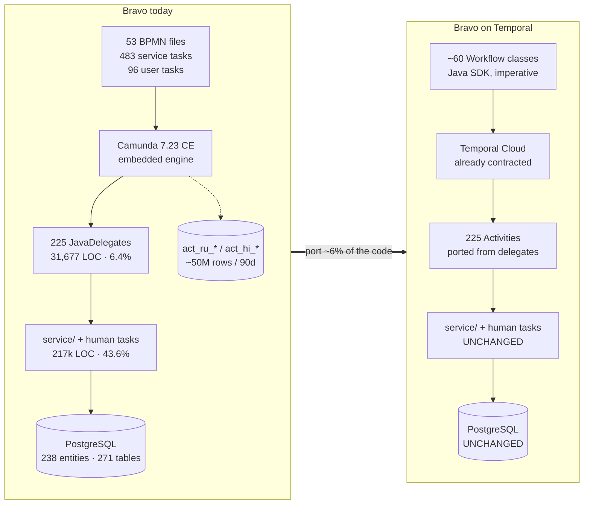
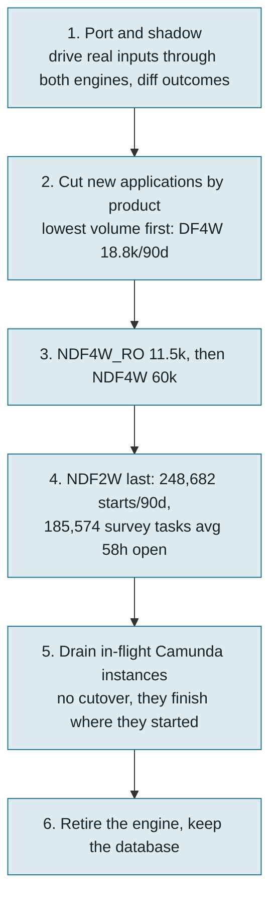

# Option 2 — Migrate Bravo to Temporal, keeping the pure workflow paradigm

**Companion to** [option-1.md](option-1.md) (version upgrade), [option-3.md](option-3.md) (LORA) and [option-summary.md](option-summary.md) (comparison and decision framework).

**Status of the wider decision.** No decision has been taken about Bravo's long-term platform. This document assesses Option 2 on its own merits.

**Verdict in one line.** The only option that permanently removes the workflow-engine vendor dependency **while keeping the imperative workflow paradigm the team already thinks in** — on infrastructure BFI already owns — at a cost of 30–56 engineer-months and the loss of the BPMN diagram.

**Scope of "pure workflow".** This option deliberately does *not* adopt LORA's Guard-Stage-Milestone planner. The BPMN spine is ported to imperative Temporal workflow code — the same steps, in the same order, with the same gateways expressed as `if` statements. `JavaDelegate` implementations become Temporal Activities. Order stays explicit and authored, not emergent from data readiness. This is the "same design, different engine" option.

---

## 1. Why this option is credible

Three facts make it more than a thought experiment.

**BFI already runs Temporal Cloud.** The contract is **Rp1,679,950,003/year ≈ Rp139,995,834/month**, bought as a prepaid commitment through the GCP Marketplace in **March 2026** ([LORA cost findings](../../lora-workspace/docs/production-findings/cost.md)). No new platform to buy, no new vendor to onboard, and an in-house team that has run Temporal in production for a year.

**The paradigm decides only ~6% of Bravo's code.** [compare.md §7](compare.md) puts it plainly: the orchestration paradigm shaped roughly 6% of Bravo (the `activity/` package, 31,677 LOC) and ~10% of LORA. The other 94% — 217k LOC of human-task services (43.6%), 113 Feign clients, 238 JPA entities, 271 tables, 1,350 Flyway migrations — is engine-agnostic and **does not have to move**. Option 2 swaps the engine underneath a service that otherwise stays where it is, in the same repository, in the same language, against the same PostgreSQL.

**It is the option that does not ask anyone to change how they think.** Temporal workflow-as-code is imperative: "do A, then B, then if X do C". That is the same mental model as the BPMN it replaces, and the same model the LORA production challenges record engineers reaching for — *"Human tendency is to think in terms of Workflow (e.g: Underwriting will start after Survey) rather than remembering if asset list fields and customer address are filled then start Survey"* ([Current LORA challenges in Production](../../lora-workspace/docs/production-findings/Current%20LORA%20challenges%20in%20Production.md)). Option 2 changes the runtime without changing the paradigm, and the Temporal Java SDK means it does not change the language either.

---

## 2. What has to be ported

The engine-coupled surface, counted from the checkout at `2d5d856`:

| Artefact | Count | Translation to Temporal | Difficulty |
|---|---|---|---|
| Root process definitions carrying live volume | **4** (`NDF2W`, `NDF4W`, `NDF4W_RO`, `Unified_Process_Main_Workflow`) | Top-level `@WorkflowInterface` classes | Medium |
| BPMN files total | 53 (3 DMN, one unreferenced) | ~60 workflow/child classes; the two legacy monoliths are 9,494 and 8,464 lines of XML | High |
| `callActivity` chaining | 56 | Child workflows or plain method calls | Low |
| `camunda:delegateExpression` bindings | 483, over 274 distinct beans | Activity method invocations | Low |
| `JavaDelegate` implementations | 225 direct (276 with subclasses) | Activity implementations. The bodies port near-verbatim; the `DelegateExecution` variable API is replaced by typed arguments and returns | **Low — the big win** |
| Exclusive gateways | 137 in `ndf4w.bpmn` alone | `if`/`switch` in workflow code | Low, but voluminous |
| **Escalation event definitions** | **190** | Child-to-parent return channel. Becomes exceptions or typed return values — a redesign per process, not a mechanical mapping | **High** |
| **Link events** | **194** | Intra-process "goto" into shared terminal handlers. Becomes structured control flow | **High** |
| BPMN error definitions | 210 (legacy files) | Non-retryable `ApplicationFailure` subtypes | Medium |
| `userTask` latches | 96 | Signals, or async activities completed by token, exactly as LORA's `TaskWorkflow` does | Medium |
| `failedJobRetryTimeCycle` declarations | **186, 30 distinct values** | `RetryOptions` per activity | **Low — see below** |
| `BaseActivity` config-skip gate | 55 gated activity classes, per-application jsonb matrix | Preserve as-is: it is plain Java reading `ApplicationWorkflowConfig`, and works identically inside an Activity | Low |

**Bravo is unusually well-prepared for the retry translation.** [compare.md §3.6](compare.md) found that Bravo already has the retry *policy* LORA never wrote: bounded attempts, `R0/PT0M` fail-fast checkpoints, `BpmnError` separating business outcomes from transient faults, a degrade-on-last-attempt framework (`OutboundAutoErrorHandlerEngineServiceImpl`, 62 call sites, 50 `customErrorHandle` implementations), and an operator queue (`ApplicationErrorTracking`). Every one of those maps onto a Temporal primitive — `MaximumAttempts`, `NonRetryableErrorTypes`, `ScheduleToCloseTimeout`. Bravo would start with the discipline that the same execution layer, used without it, has cost LORA ~20–25 permanent wedged loans a month.

**The two genuinely hard translations are escalation and link events**, 384 elements between them. These are not steps; they are control-flow idioms with no Temporal equivalent, and each one is a small design decision. This is the line item that separates a 30-month estimate from a 56-month one.

---

## 3. Effort

| Workstream | Detail | Eng-months |
|---|---|---|
| **Discovery and target design** | Workflow decomposition, Temporal Search Attributes defined up front (LORA has **zero**, and pays for it — "which loans are stuck at survey?" is not answerable from Temporal Visibility), error taxonomy, port of the 186 retry declarations into a policy table | 2–3 |
| **Orchestration port** | ~60 process definitions. The two legacy monoliths (`ndf4w.bpmn` 9,494 lines / 111 service tasks / 137 gateways / 48 sub-processes; `ndf2w.bpmn` 8,464 lines) dominate. Includes the 190 escalations and 194 links | **12–24** |
| **Activity adaptation** | 225 delegates → Activities, preserving the `BaseActivity` skip gate and the 50 `customErrorHandle` degrade paths | 4–8 |
| **Human-task latches** | 96 user tasks → signals / token-completed activities. The 217k LOC of assignment and approval services stays untouched; only the wait mechanism changes. `taskService.complete()` appears at 48 sites | 3–5 |
| **Operability rebuild** | Replace Camunda Cockpit: incident list, `setVariable` + `setJobRetries` operator actions, the ~25 manual retry/reprocess/revive endpoints. Search attributes, dashboards, alerting. Bravo has **0 custom process metrics** today, so some of this is net-new capability rather than replacement | 2–4 |
| **Test suite for the orchestration layer** | Essentially net new: **4 of 1,457 test files** deploy and run a process today, and there is no end-to-end walk from start to go-live. Temporal's test framework makes this genuinely achievable, which is a real side benefit | 3–5 |
| **Dual run, parity diffing, cutover, drain** | See §4 | 4–7 |
| **Total** | | **30–56** |

**Elapsed:** 12–18 months with 5–8 engineers. Bravo has **23 active authors in 2026** across the whole service, so this consumes roughly a third of the squad's capacity for over a year while the rest of the team continues shipping product changes (4,514 commits in 2026 to date).

**Indicative one-off cost** at an assumed Rp30–50M fully-loaded per engineer-month: **Rp900M – Rp2.8B**. Replace the rate with BFI's own.

**Scope lever worth pricing separately.** The estimate above ports all four live roots. Production volume is heavily concentrated, so a partial port is a real option: **DF4W on the unified spine alone** (18,809 starts/90d, an 8-step spine, 36 children, activities already config-gated) is perhaps **8–14 engineer-months**, and would prove the pattern on 5.5% of volume before committing to the two legacy monoliths that carry 91%.

---

## 4. The migration itself, which is the harder half

Camunda process instances **cannot** be migrated into Temporal. There is no state transfer. The only safe pattern is dual running.

- **Both engines run in production simultaneously** for the whole drain. Two orchestration tiers, two operator surfaces, two on-call runbooks.
- **Drain length is set by loan lifetime, not by the port.** Survey tasks average 55–131 hours open ([workflow-gap.md §8.6](workflow-gap.md)) and Camunda history is retained 90 days. Realistic drain: **3–6 months** after the last cutover.
- **NDF2W is the risk.** 248,682 process starts per 90 days and the highest-volume human queue in the estate. It should be last, and it is 73% of the book.
- **Parity must be proven, not assumed.** A missing configuration row silently drops a credit or compliance check rather than failing — the same trap flagged for the legacy-to-unified migration ([bravo-unified-legacy-to-unified.md §4](bravo-unified-legacy-to-unified.md)).

---

## 5. Run-rate cost — the pleasant surprise

Temporal Cloud bills **Actions + Storage + Plan**, at roughly **$50 per million Actions** pay-as-you-go after plan allocation.

| Input | Value | Source |
|---|---|---|
| Bravo process starts | ~120k/month (338,858 in 90 days) | [workflow-gap.md §8.1](workflow-gap.md) |
| Actions per loan, sanely built | 45–120 | LORA measures 118.8/loan including 62% notify bookkeeping Bravo would not replicate; without it, ~45 |
| **Bravo Actions/month** | **5.4M – 14.4M** | |
| At $50/M, Rp16,800/USD | **≈ Rp4.5M – 12.1M/month** | |
| LORA's current consumption | ~17M Actions/month (LPW 3,247,506/week) | [cost.md](../../lora-workspace/docs/production-findings/cost.md) |
| Existing commitment | Rp140.0M/month prepaid, year from ~March 2026 | |

Two conclusions:

1. **The marginal Temporal cost of putting Bravo on the existing contract is single-digit millions of rupiah per month** — a rounding error against the Rp140M/month already committed. LORA's own finding is that the entire addressable Actions programme is worth ~Rp7.2M/month; Temporal's bill is dominated by the commitment, not by usage. Whether Bravo's volume fits *inside* the current allocation must be checked against the contract, and the commitment renews around **March 2027** — a natural point to re-scope it.
2. **Bravo's own infrastructure line would fall slightly.** The Camunda `act_hi_*` tables at `full` history with 90-day retention are a material slice of the Rp52.7M/month Cloud SQL bill; removing the engine removes them. The `ms-bpm` pods and the business database stay.

**Net run-rate: roughly neutral, plausibly a small saving,** and with no licence to buy — which compares favourably with Option 1's quote-only Camunda EE and Tanzu contracts. Option 2's cost is entirely one-off engineering.

---

## 6. What is gained and what is lost

**Gained**

- **The end-of-support problem disappears permanently.** No Camunda licence, ever. Spring Boot upgrades stop being gated by a frozen vendor's artifact roadmap — the reason Option 1's runway is fragile in every variant.
- **The paradigm is preserved.** Imperative, authored order; same language; same mental model as the BPMN it replaces. Of the two options that leave Camunda, this is the one that asks least of the people.
- The Camunda webapp attack surface goes away, and with it the class of exposure in [SECURITY-FINDING-camunda-rce.md](SECURITY-FINDING-camunda-rce.md).
- A testable orchestration layer, for the first time. Temporal's test framework turns "4 of 1,457 tests run a process" into something fixable.
- Native parallelism where Bravo wants it. Bravo has **14 parallel gateways across 53 files and zero in the unified spine** ([compare.md §2](compare.md)) — sequential-by-default is a modelling habit Temporal does not impose.
- Bravo's already-good retry policy becomes explicit and enforced rather than spread across 30 XML retry vocabularies.

**Lost**

- **BPMN legibility.** [compare.md §5](compare.md) rates this as something Bravo genuinely did better than LORA: "the happy path is eight boxes in one file", readable by a business analyst in Camunda Modeler. Workflow-as-code deletes that, and the mitigation (generating diagrams from code) is unproven. Note this is a *smaller* loss than Option 3 imposes — the order is still authored and readable in sequence, just in Java rather than XML — but it is a real one, and analysts are the people who feel it.
- **Camunda Cockpit.** The incident list, `setVariable` + `setJobRetries` retry actions and the operator console are real operational assets. Temporal UI is not a like-for-like replacement — LORA's experience is a flooded UI with no search attributes.
- **Cheap version coexistence.** Camunda versions definitions for free; Temporal needs versioning discipline (`GetVersion` / worker versioning) and deterministic replay constraints.

**Not addressed:** every architectural finding in [compare.md](compare.md) and [workflow-gap.md](workflow-gap.md) survives the port unchanged — five monoliths carrying 94% of volume, product identity as a magic number in five places, 30 `ApplicationStatus` values plus ~105 other status enums, 197 `setStatus` sites, no saga compensation, no per-product visibility. A faithful port faithfully ports the problems. If those findings are what the organisation most wants fixed, Option 2 does not fix them; it makes them cheaper to keep.

---

## 7. Risks

| Risk | Severity | Note |
|---|---|---|
| **Value depends on Bravo having a long life** | **High** | 30–56 engineer-months is justified over a 5–10 year horizon and is not justified over a 2-year one. This is the risk the platform decision governs: if Bravo is later replaced, the investment is stranded. The partial-port lever in §3 is the hedge |
| Escalation and link translation | High | 384 control-flow elements with no direct Temporal equivalent, each a design decision. Dominates the estimate spread |
| Porting without a test net | High | 4 of 1,457 tests exercise a process. Parity has to be established empirically, by shadow running |
| NDF2W cutover | High | 248,682 starts/90d, the entire 2-wheel retail book, on a newly written engine layer |
| Dual-engine operations for 6–12 months | Medium | Two runbooks, two on-call surfaces, two sets of stuck-loan queries |
| Determinism defects | Medium | `JavaDelegate` code does whatever it likes. Most becomes Activity code where that is fine — but anything pulled into workflow code (137+ gateway conditions) must be deterministic |
| Loss of analyst-readable process model | Medium | A real regression in business legibility that Bravo's stakeholders currently rely on |
| Temporal commitment headroom | Low | Verify Bravo's ~5–14M Actions/month fits the existing allocation before the ~March 2027 renewal |
| Concentrating both platforms on one vendor | Low–Medium | If Option 3 also proceeds for other products, Temporal becomes a single point of dependency for all BFI origination |

---

## 8. When Option 2 is the right answer

Option 2 is the right answer when **two conditions hold together**: Bravo is expected to run for a long time, and the organisation wants to keep the imperative workflow paradigm rather than adopt a data-centric one. It is the only option that satisfies both.

Against Option 1C, its nearest competitor on that reading, it costs roughly 2–3× more up front but removes the vendor dependency permanently instead of renting time on a feature-frozen product, needs no licence, and leaves behind a testable orchestration layer. If the answer to "will Bravo still be here in 2030?" is yes, Option 2 is very likely better value than paying Camunda through 2030 and re-opening the question in 2027.

It is the wrong answer if Bravo's horizon is short, or if the organisation's actual complaint is about Bravo's architecture rather than its engine — Option 2 changes the engine and preserves the architecture exactly.

**The hedged version.** Port DF4W on the unified spine only (8–14 engineer-months), prove the pattern and the operability story on 5.5% of volume, and defer the decision on the two legacy monoliths. That converts a 30–56 month commitment into a 8–14 month experiment with an exit, and it is the sensible shape if the platform question is still open.

---

## Sources

- [LORA Temporal cost findings](../../lora-workspace/docs/production-findings/cost.md) — contract Rp1,679,950,003/year, prepaid via GCP Marketplace March 2026; ~$50/M Actions; 118.8 Actions/loan of which 62% notify bookkeeping; ~45 Actions/loan achievable
- [Current LORA challenges in Production](../../lora-workspace/docs/production-findings/Current%20LORA%20challenges%20in%20Production.md) — the "changed cognitive perspective" complaint
- [compare.md](compare.md) — engine-coupled inventory, retry policy, testing, cost tier
- [workflow-gap.md §8](workflow-gap.md) — production volumes by root definition, human-task queues
- [Temporal Cloud pricing](https://docs.temporal.io/cloud/pricing)
- `squads/Scoring and Underwriting/bravo-bpm-service` at `2d5d856` — all counts
