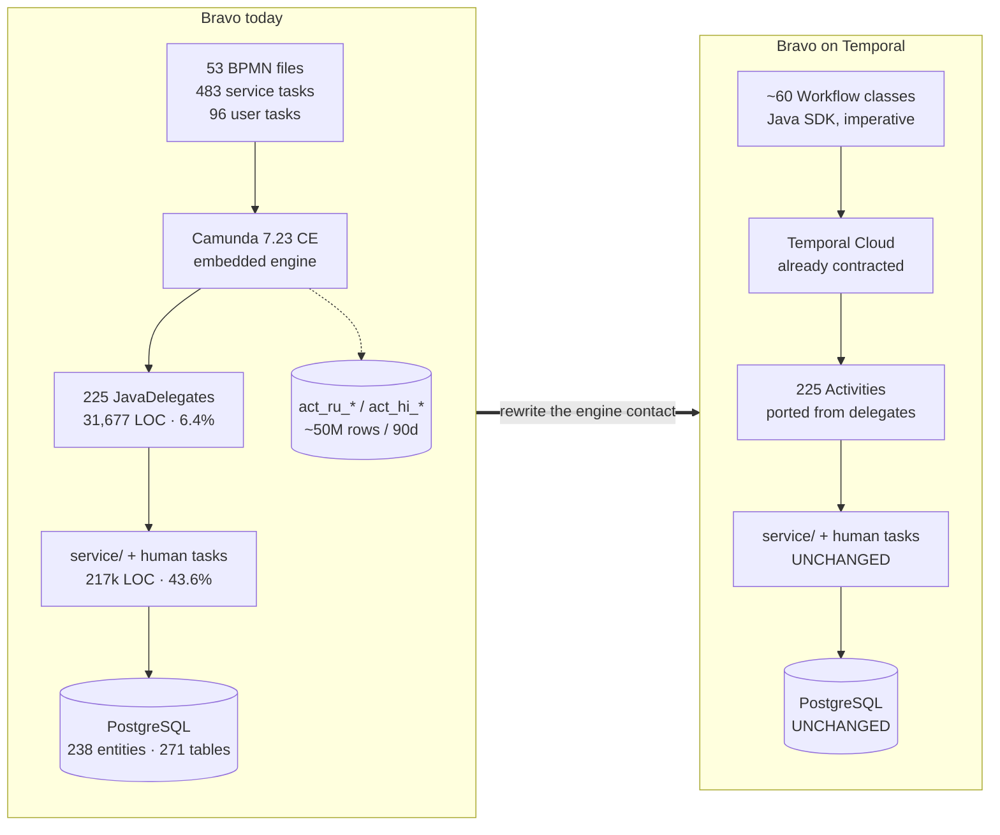
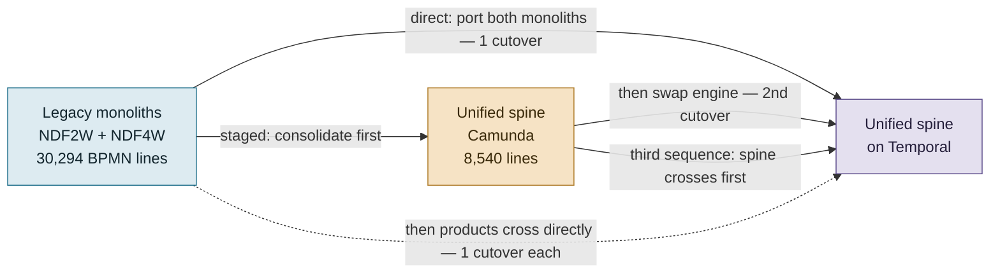
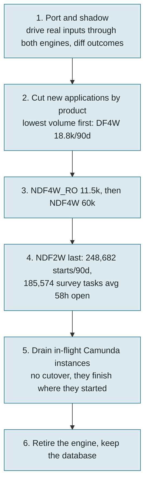

# Option 2 — Migrate Bravo to Temporal, keeping the pure workflow paradigm

**Companion to** [option-1.md](option-1.md) (version upgrade), [option-3.md](option-3.md) (LORA) and [option-summary.md](option-summary.md) (comparison and decision framework).

**Status of the wider decision.** No decision has been taken about Bravo's long-term platform. This document assesses Option 2 on its own merits.

**Verdict in one line.** This is the only option that removes the workflow-engine vendor dependency for good **while keeping the imperative workflow paradigm the team already thinks in**. It runs on infrastructure BFI already owns, in the same language, against the same database. The direct route costs 31–57 engineer-months. Consolidating the legacy monoliths onto the unified spine first brings it to 30–54 ([§5](#5-sequencing-consolidate-onto-unified-first)).

**Scope of "pure workflow".** This option deliberately does *not* adopt LORA's Guard-Stage-Milestone planner. The BPMN spine is ported to imperative Temporal workflow code: the same steps, in the same order, with the same gateways written as `if` statements. `JavaDelegate` implementations become Temporal Activities. Order stays explicit and authored. It does not emerge from data readiness. This is the "same design, different engine" option.

---

## 1. Why this option is credible

Three facts make it more than a thought experiment.

**One thing this option does not avoid.** The Spring Boot 3.5 → 4 upgrade is owed under Option 2 too. Only the engine leaves; the service stays on Spring Boot. The [Camunda 7 Exit Plan](production-findings/Camunda%207%20Exit%20Plan.pdf) measures that half at **12–20 engineer-days**: 308 `@MockBean` sites across 186 files, Hibernate 6→7, ShedLock 4.42→7.9, and removing the dangerous `spring-framework-bom` pin. It is not in the §4 table below, and any Option 2 plan should add it. What Option 2 *does* buy is that the upgrade stops being gated by a workflow-engine vendor's artifact roadmap.

**BFI already runs Temporal Cloud.** The contract is **Rp1,679,950,003 a year, about Rp139,995,834 a month**. It was bought as a prepaid commitment through the GCP Marketplace in **March 2026** ([LORA cost findings](../../lora-workspace/docs/production-findings/cost.md)). So there is no new platform to buy and no new vendor to onboard. And an in-house team has run Temporal in production for a year.

**The paradigm decides only a fraction of Bravo's code.** [compare.md §7](compare-architecture.md) puts it plainly: the orchestration paradigm shaped roughly 6% of Bravo, the `activity/` package at 31,677 lines. §3 below measures the engine coupling directly and finds it smaller still. The bulk of the service is engine-agnostic and **does not have to move**: 217,000 lines of human-task code, 113 Feign clients, 238 JPA entities, 271 tables and 1,350 Flyway migrations.

**This is the option that does not ask anyone to change how they think.** Temporal workflow-as-code is imperative: do A, then B, then if X do C. That is the same mental model as the BPMN it replaces. It is also the model the LORA production challenges record engineers reaching for: *"Human tendency is to think in terms of Workflow (e.g: Underwriting will start after Survey) rather than remembering if asset list fields and customer address are filled then start Survey"* ([Current LORA challenges in Production](../../lora-workspace/docs/production-findings/Current%20LORA%20challenges%20in%20Production.md)). Option 2 changes the runtime without changing the paradigm. And because it uses the Temporal Java SDK, it does not change the language either.

---

## 2. What has to be ported

The engine-coupled surface, counted from the checkout at `2d5d856`:

| Artefact | Count | Translation to Temporal | Difficulty |
|---|---|---|---|
| Root process definitions carrying live volume | **4** (`NDF2W`, `NDF4W`, `NDF4W_RO`, `Unified_Process_Main_Workflow`) | Top-level `@WorkflowInterface` classes | Medium |
| BPMN files total | 53 (3 DMN, one unreferenced) | ~60 workflow/child classes; the two legacy monoliths are 9,494 and 8,464 lines of XML | High |
| `callActivity` chaining | 56 | Child workflows or plain method calls | Low |
| `camunda:delegateExpression` bindings | 483, over 274 distinct beans | Activity method invocations | Low |
| `JavaDelegate` implementations | 225 direct (276 with subclasses) | Activity implementations. The bodies port near-verbatim; the `DelegateExecution` variable API is replaced by typed arguments and returns | **Low — the big win** |
| Exclusive gateways | **513** — 96 unified / **417 legacy** (137 in `ndf4w.bpmn` alone) | `if`/`switch` in workflow code | Low, but voluminous |
| **Escalation event definitions** | **190** — 137 unified / 53 legacy | Child-to-parent return channel. Becomes exceptions or typed return values — a redesign per process, not a mechanical mapping | **High** |
| **Link events** | **194** — 35 unified / **159 legacy** | Intra-process "goto" into shared terminal handlers. Becomes structured control flow | **High** |
| BPMN error definitions | 210 — 5 unified / **205 legacy** | A *second* return-channel idiom: the monoliths use errors where unified uses escalations. Non-retryable `ApplicationFailure` subtypes | Medium |
| Embedded sub-processes | 154 — 7 unified / **147 legacy** | Inlined or extracted as child workflows | Medium |
| `userTask` latches | 96 | Signals, or async activities completed by token | Medium |
| `failedJobRetryTimeCycle` declarations | **186, 30 distinct values** | `RetryOptions` per activity | **Low — see below** |
| `BaseActivity` config-skip gate | 55 gated activity classes, per-application jsonb matrix | Preserve as-is: it is plain Java reading `ApplicationWorkflowConfig`, and works identically inside an Activity | Low |

**Bravo is unusually well prepared for the retry translation.** [compare.md §3.6](compare-architecture.md) found that Bravo already has the retry *policy* LORA never wrote. It has bounded attempts. It has `R0/PT0M` fail-fast checkpoints. It uses `BpmnError` to separate business outcomes from transient faults. It has a degrade-on-last-attempt framework in `OutboundAutoErrorHandlerEngineServiceImpl`, with 62 call sites and 50 `customErrorHandle` implementations. And it has an operator queue, `ApplicationErrorTracking`. Every one of those maps onto a Temporal primitive: `MaximumAttempts`, `NonRetryableErrorTypes`, `ScheduleToCloseTimeout`.

**The two genuinely hard translations are escalation and link events**, 384 elements between them. These are not steps. They are control-flow idioms with no Temporal equivalent, and each one is a small design decision. This is the line item that separates a 31-month estimate from a 57-month one.

**And they are not spread evenly.** 212 of those 384 elements sit in the legacy monoliths. So do 205 of the 210 error definitions and 147 of the 154 sub-processes. The legacy files are 78% of all BPMN by line. That concentration is what makes the Bravo team's sequencing proposal worth taking seriously. [§5](#5-sequencing-consolidate-onto-unified-first) assesses it.

---

## 3. How much of Bravo survives the port — measured

The intuition behind this option runs like this. Porting Camunda → Temporal reuses most of the codebase, because the paradigm is the same. That makes it a smaller and safer change than porting Camunda → LORA. The intuition is testable against the checkout, so this section tests it instead of asserting it.

### 3.1 The engine-coupling measurement

Greps over `src/main/java` at `2d5d856`:

| Measure | Value | Share of codebase |
|---|--:|--:|
| Main Java files | 5,070 | 100% |
| Main Java LOC | 497,970 | 100% |
| Files that `import org.camunda.*` | **351** | **6.9%** |
| LOC contained in those 351 files | 100,419 | 20.2% |
| Files referencing `DelegateExecution` | 300 | 5.9% |
| **Lines that actually reference an engine API** | **2,004** | **0.40%** |

The last row is the one that matters. "Engine API" counts any line mentioning `camunda`, `Camunda`, `DelegateExecution`, `BpmnError`, `ProcessInstance`, `taskService`, `runtimeService` or `repositoryService`. Across the whole service, **2,004 lines out of 497,970 touch the workflow engine**.

The 20.2% figure above measures something different. It is the size of whole *files* that contain at least one such line. That is an upper bound on "files a reviewer must open", not on code to be rewritten. The true contact surface is two-fifths of one percent.

That coupling is also concentrated rather than smeared:

| Where | Coupled files |
|---|--:|
| `activity/` — the delegate package | **287** |
| `service/` — mostly surveyor-assignment and underwriting services that complete user tasks | 55 |
| `dto/`, `utils/`, `config/`, `handlers/`, `exception/` — a nameable infrastructure set (`BaseActivity`, `EscalationUtil`, `BpmnException`, `FailingOnLastRetryAspect`, `KeycloakIdentityProviderConfig`, `CamundaServiceImpl`, `CamundaErrorNotificationServiceImpl`, `OutboundAutoErrorHandlerEngineServiceImpl`) | 9 |

Two-thirds of the non-`activity` coupling is the same idiom repeated. A service completes a Camunda user task after changing a domain table. Replacing `taskService.complete()` with a Temporal signal is a mechanical change, at 48 call sites.

### 3.2 What survives each port

| Bravo asset | Camunda → **Temporal** | Camunda → **LORA** |
|---|---|---|
| 497,970 LOC of Java | Same language — **kept** | Go — none of it transfers |
| 238 `@Entity`, 271 tables, 1,350 Flyway migrations | **Untouched — no data migration at all** | Relational aggregate → one JSON document; a full data remodel |
| 113 `@FeignClient` integrations | **Untouched** | Re-plumbed through the gateway proxy layer |
| ~217k LOC of human-task services (43.6%) | **Untouched** except the wait mechanism (48 `taskService.complete()` sites) | Re-expressed as task managers and FSMs |
| 979 `@Authorize` AOP sites and the bespoke security aspect | **Untouched** | Re-implemented |
| 225 `JavaDelegate` bodies | Port near-verbatim into Activities | Re-written as ProcessSteps with ReadSet/WriteSet |
| `BaseActivity` per-application config-skip matrix | **Works as-is inside an Activity** | Replaced by data-readiness preconditions |
| 53 BPMN files | **Rewritten** as workflow code | **Re-derived** as guards and preconditions |
| 2,004 lines of engine-API contact | Rewritten | Gone |

### 3.3 What the numbers support

**1. Blast radius.** Option 2 rewrites 0.4% of the lines and holds the other 99.6% constant. That is a different kind of job from re-expressing 100% of the codebase in another language against another data model. A defect introduced by Option 2 lands in the orchestration tier. A defect introduced by a language-and-model change can land anywhere.

**2. Parity can be checked, not re-derived.** The paradigm is preserved, so every element has a counterpart. This gateway becomes that `if`. This delegate becomes that Activity. This `failedJobRetryTimeCycle` becomes those `RetryOptions`. A reviewer can walk the BPMN and the Java side by side.

A port to a data-centric model has no element-by-element correspondence to check. The order is not written down anywhere in the target; it emerges. So equivalence has to be established by experiment, for every path, rather than argued from structure.

**3. Shadow-running is cheap, and rollback is real.** Both engines write the same schema in the same database. So diffing outcomes during a dual run is a SQL comparison on one data model, not a reconciliation across two. The service, the entities and the integrations do not move, so rollback means redeploying the previous orchestration path.

**4. No retraining, no rehiring.** Same language, same framework, same mental model, same operational database. The organisational cost is close to zero, which is not true of a paradigm change.

### 3.4 Where the intuition is overstated

Three honest qualifications, without which this section would be advocacy rather than analysis.

- **Reuse share does not translate into effort one for one.** The expensive parts of the Temporal port are the 190 escalation and 194 link events — 384 control-flow elements with no Temporal equivalent. Those are exactly the parts that are *not* reused. Keeping 99.6% of the lines does not make the remaining work small. It makes it *bounded and easy to locate*, which is a different virtue.
- **Bravo-on-Temporal's target does not exist yet.** Every line of the new orchestration tier is written from scratch, and none of it has ever run. A port to LORA moves onto a system already carrying production volume, where much of the target is proven. So "safer" cuts both ways. Option 2 reuses more *source*. Option 3 reuses more *proven target*. Option 2 trades target risk for source risk, and source risk is the one Bravo's team is equipped to manage.
- **The migration mechanics are equally hard either way.** Both need dual running, shadow diffing, tier-by-tier cutover, and a long drain of in-flight Camunda instances. Both must put NDF2W last. And both inherit the parked-instance tail described in §6, because 96 user tasks across 26 BPMN files mean a residue never completes on its own. Nothing in §3.1 makes that half easier.

**Conclusion.** The claim holds, with its emphasis corrected.

Porting Camunda → Temporal is **much safer and organisationally cheaper** than porting Camunda → LORA. The engine contact is 0.4% of the code. The data model does not move. And parity can be argued element by element rather than demonstrated path by path.

But it is **not** dramatically less work. The totals in §4 (31–57 engineer-months) and in [option-3.md](option-3.md) (30–57) land in the same range, because the reuse advantage is cancelled out by having to build a target from nothing. **The reuse buys predictability, reversibility and zero retraining. It does not buy fewer engineer-months.** For a change to a system originating about 120,000 loan applications a month, predictability and reversibility are arguably worth more. That is the honest case for Option 2.

---

## 4. Effort

| Workstream | Detail | Eng-months |
|---|---|---|
| **Discovery and target design** | Workflow decomposition, Temporal Search Attributes defined up front (LORA has **zero**, and pays for it — "which loans are stuck at survey?" is not answerable from Temporal Visibility), error taxonomy, port of the 186 retry declarations into a policy table | 2–3 |
| **Orchestration port** | ~60 process definitions. The two legacy monoliths (`ndf4w.bpmn` 9,494 lines / 111 service tasks / 137 gateways / 48 sub-processes; `ndf2w.bpmn` 8,464 lines) dominate — together 46% of all BPMN. Includes the 190 escalations and 194 links. **This is the row [§5](#5-sequencing-consolidate-onto-unified-first) changes**: consolidating the monoliths onto the unified spine first would remove most of it | **12–24** |
| **Activity adaptation** | 225 delegates → Activities, preserving the `BaseActivity` skip gate and the 50 `customErrorHandle` degrade paths. The 2,004 lines of engine contact in §3.1 are the whole of the mechanical change | 4–8 |
| **Human-task latches** | 96 user tasks → signals / token-completed activities. The 217k LOC of assignment and approval services stays untouched; only the wait mechanism changes. `taskService.complete()` appears at 48 sites | 3–5 |
| **Diagram generation and intent-diff loop** | Emit a flowchart from the workflow code in CI and diff it against Product's maintained diagram (§8). Nothing off-the-shelf exists for Temporal Java, but the control flow is explicit in the source, so the generator is a walk of the workflow methods | **0.5–1** |
| **Operability rebuild** | Replace Camunda Cockpit: incident list, `setVariable` + `setJobRetries` operator actions, the ~25 manual retry/reprocess/revive endpoints. Search attributes, dashboards, alerting. Bravo has **0 custom process metrics** today, so some of this is net-new capability rather than replacement | 2–4 |
| **Test suite for the orchestration layer** | Essentially net new: **4 of `ms-bpm`'s 1,457 test files** deploy and run a process today, and there is no end-to-end walk from start to go-live. Temporal's test framework makes this genuinely achievable, which is a real side benefit | 3–5 |
| **Dual run, parity diffing, cutover, drain** | See §6 | 4–7 |
| **Total** | | **31–57** |

**Elapsed:** 12–18 months with 5–8 engineers. Bravo has **23 active authors in 2026** across the whole service. So this takes roughly a third of the squad's capacity for over a year, while the rest of the team keeps shipping product changes — 4,514 commits in 2026 so far.

**Indicative one-off cost** at an assumed Rp30–50M fully-loaded per engineer-month: **Rp930M – Rp2.85B**. Replace the rate with BFI's own.

**Two levers change this table, and both are worth pricing separately.**

- **Scope.** The estimate above ports all four live roots. But production volume is heavily concentrated, so a partial port is a real option. **DF4W on the unified spine alone** is perhaps **8–14 engineer-months**: 18,809 starts per 90 days, an 8-step spine, 36 children, and activities that are already config-gated. That would prove the pattern on 5.5% of volume before committing to the two legacy monoliths that carry 91%.
- **Sequencing.** The Bravo team proposes consolidating the legacy monoliths onto the unified spine *before* porting anything to Temporal. That would remove 78% of the BPMN from this table. It would also add a migration of its own. [§5](#5-sequencing-consolidate-onto-unified-first) measures the trade.

---

### 4a. The front end: 763k lines that the port does *not* have to touch

**Added 2026-09-10.** This document priced the port without counting Bravo's three operator consoles: `bravo-surveyor-console`, `bravo-operation-console` and `bravo-underwriting-console`. Together they hold **763,861 lines of source, 829 test files and 4,334 commits in the last 12 months** ([bravo-testing.md §1.1](bravo-testing.md#11-the-console-tier-what-actually-gates-a-bravo-front-end-change)). Read naively, that is a large uncosted exposure for a port that replaces the orchestration engine. **It is not, and the reason is a design decision Bravo got right.**

**The consoles never see the engine.** We verified this by search: **zero references to Camunda in console source.** They call domain verbs — `PUT /v1/operation-assignment/release-assignment`, `POST /v1/head-surveyor/assignment-request/reprocess`, `PATCH /v1/underwritings/{id}/approval/bm-decision` — and never a Camunda task id. [compare-architecture.md §3.6](compare-architecture.md) already recorded this as a UI-contract strength. Nobody had drawn out what it means for *this* option.

**So the port's front-end cost is conditional, not fixed:**

| If the port… | Console cost |
|---|---|
| Preserves the existing domain endpoints and their payloads, with Temporal behind them | **≈zero.** No console change; the 829 tests become the boundary regression suite |
| Changes endpoint shapes, status vocabularies or the 30 `ApplicationStatus` values the consoles render | **Large and previously unpriced** — 763k LOC across three repos and two squads, plus re-testing |

**This is a real argument for the port, and a real constraint on how it is done.** The insulation is an asset, and a "clean rewrite" would throw it away. So make **endpoint-contract preservation an explicit, non-negotiable constraint of the port**. Then run the three console suites against the Temporal-backed service as an acceptance gate. The same caveat applies as elsewhere: console coverage thresholds are 0% and 1%, so gate them properly before trusting the suites as an acceptance criterion.

**It also narrows the "no retraining, no rehiring" claim in §3 point 4.** That claim is about `ms-bpm`'s Java engineers. The console squads — **Team Surveyor & Verificator (`LN`) and Team Scoring & Underwriting (`BLCS`)** — are unaffected either way. That strengthens the claim: the port touches one of Bravo's four repositories and one of its two delivery projects.

## 5. Sequencing: consolidate onto unified first?

**The Bravo team's proposal.** Do not port all four live roots to Temporal. Instead, migrate the legacy `NDF2W` and `NDF4W` monoliths onto `Unified_Process_Main_Workflow` first — the team believes that can be done quickly — and then port the unified spine to Temporal in one piece. §4 costs the direct route. This section assesses the staged one.

It is a serious proposal and the BPMN inventory supports its central claim strongly. The reservation is about the word "fast", not about the architecture.

### 5.1 The process model is overwhelmingly legacy

Counts over the 53 BPMN files at `2d5d856`, split into the 37 `unified-*` files and the 16 legacy/other files:

| Element | Unified | Legacy | Total | Legacy share |
|---|--:|--:|--:|--:|
| **BPMN lines** | 8,540 | 30,294 | 38,834 | **78%** |
| `errorEventDefinition` | 5 | 205 | 210 | **98%** |
| Embedded sub-processes | 7 | 147 | 154 | **95%** |
| `parallelGateway` | 2 | 12 | 14 | 86% |
| `failedJobRetryTimeCycle` | 29 | 163 | 192 | 85% |
| `serviceTask` | 82 | 401 | 483 | **83%** |
| `linkEventDefinition` | 35 | 159 | 194 | **82%** |
| `exclusiveGateway` | 96 | 417 | 513 | **81%** |
| `userTask` | 24 | 72 | 96 | 75% |
| `callActivity` | 38 | 18 | 56 | 32% |
| `escalationEventDefinition` | 137 | 53 | 190 | **28%** |

`ndf4w.bpmn` and `ndf2w.bpmn` alone are **17,958 lines — 46% of all BPMN in the service**.

### 5.2 What the proposal gets right

Four things, and they are substantial.

1. **It removes 78% of the process model from the Temporal port.** You never translate `ndf4w.bpmn` or `ndf2w.bpmn`. You decommission them. §2 named escalation and link events as the line item separating a 31-month estimate from a 57-month one, and **212 of those 384 elements are legacy-only**.
2. **It removes an entire translation category.** 205 of the 210 BPMN error definitions live in legacy files. The monoliths use errors as the child-to-parent return channel, where unified uses escalations. So the direct route means designing **two** return-channel translations. Port only the unified spine and there is one.
3. **The remaining target is genuinely tractable.** It is 37 files and 8,540 lines: 82 service tasks, 24 user tasks, 38 call activities and 7 sub-processes. Per-product variation on the spine is already **data, not diagram** — the `BaseActivity` config-skip gate over 55 activity classes. So one ported spine serves every product through configuration.
4. **The engine swap happens once.** Under the direct route, each monolith is ported separately. Under the staged route, every product converges on one spine and crosses to Temporal together.

### 5.3 Where "fast" does not survive contact with the data

The mechanism for moving a product onto the spine has existed since the 2024 unified rewrite. The production record for the 90 days to 2026-09-09 ([workflow-gap.md §8](workflow-gap.md)) is:

- The unified spine started **18,809 applications, all DF4W**, and the weekly series is **flat across all 90 days — no migration trend**.
- **DF2W has a complete configuration seeded and ran zero applications** — it is in UAT and pen test, not released (verified 2026-09-10).
- **NDF4W has run four** "company" applications on the spine, in total.
- The legacy monoliths started ~321,000 applications over the same window and were edited more often in 2026 than the spine.

So consolidation is not a new capability waiting to be switched on. It is an existing capability that has not been used at volume in the last quarter. That does not make the team wrong — priorities, not capability, may explain the flat line. But "we can do it fast" is a forecast the trailing 90 days actively contradict. Treat it as a hypothesis to test, not as a planning input.

The work underneath it is not small either ([bravo-unified-legacy-to-unified.md](bravo-unified-legacy-to-unified.md)). Roughly **40 NDF4W and 49 NDF2W delegates** have no unified equivalent. The human flows — survey, negotiation, document pickup, underwriting and operation user tasks — are "deeply branched by risk tier" in the monoliths, and they are 75% of all user tasks. And the database configuration has to be completed for **6 NDF4W and 16 NDF2W master configs**.

That document's own verdict is that the effort concentrates in porting the long tail and, "above all, proving parity at scale". That means parity against NDF2W's 248,682 instances per 90 days. And the config-skip design means a missing configuration row **silently drops a credit or compliance check** instead of failing.

### 5.4 Costing the staged route

No engineer-month figures exist for legacy → unified. `bravo-unified-legacy-to-unified.md` deliberately carries none. So these are this document's own estimates, on the same basis as §4.

| Stage | Detail | Eng-months |
|---|---|--:|
| **Legacy → unified** | Gap inventory; port ~89 long-tail delegates as config-gated `*UnifiedActivity` (merging near-duplicate PD-model variants rather than porting one-for-one); the risk-tier-branched human flows; complete DB config for 6 + 16 master configs; shadow run and parity diffing; cut over NDF4W then NDF2W by tier; decommission both monoliths | **18–34** |
| **Unified → Temporal** | The 37-file spine serving every product: all 225 activities, every product's configuration validated, full operability and test suite | **12–20** |
| **Staged total** | | **30–54** |
| *Direct route (§4), for comparison* | | *31–57* |

### 5.5 The conclusion, which is not the obvious one

**The staged route is not meaningfully cheaper in total.** The legacy complexity does not disappear. It moves from "port to Temporal" into "port to unified". You pay for the same roughly 89 delegates and the same parity problem at 248,000 instances a quarter either way. Only the target changes. What genuinely differs is everything except the total:

| | Direct route | Staged route |
|---|---|---|
| Total effort | 31–57 eng-months | 30–54 eng-months |
| Elapsed | 12–18 months | **17–27 months — the stages are serial** |
| Retail-book cutovers | **1** (Camunda → Temporal) | **2** (legacy → unified, then → Temporal) |
| Time on unpatched Camunda 7.23 CE | shorter | **longer** |
| Translation idioms to design | escalation **and** error | escalation only |
| Value if Temporal is never done | none | **high** — two monoliths retired, one config-driven spine |
| Exposure if consolidation stalls | none | the Temporal port is blocked behind it |

The staged route's real attraction is the second-to-last row. **Consolidation is worth doing on its own merits**, whatever happens to the engine question. Porting `ndf4w.bpmn` to Temporal only has value if Temporal goes ahead. Retiring `ndf4w.bpmn` onto the spine has value under Options 1 and 3 as well. That is a genuine argument, and the effort totals do not capture it.

Its real cost is the two rows above it: a longer serial timeline on an unpatched engine, and migrating the highest-volume book in the estate **twice**.

### 5.6 A third sequence the analysis surfaces

Delegate bodies port almost verbatim into Temporal Activities (§3.2). So the expensive part of consolidation, the roughly 89 long-tail delegates, **barely depends on the target**. The same domain logic can be written once as `*UnifiedActivity` classes, or once as Temporal Activities. That allows a third ordering:

> **Port the unified spine to Temporal first** (the pilot in §10), **then migrate the legacy products directly onto the Temporal spine** — writing the long-tail work once as Activities, rather than once as `*UnifiedActivity` and then translating it again.

Each product then moves **once**, straight to its final home. The Camunda estate only ever shrinks. And the end-of-support clock stops for each product as it crosses, instead of after two full migrations.

What this gives up is the staged route's hedge. Under the Bravo team's proposal, if Temporal is later abandoned, the consolidation still stands on its own. Under the third sequence, a product that has not yet moved is still on a legacy monolith.

### 5.7 How to decide, without adjudicating a forecast

The disagreement is not architectural — it is a disagreement about velocity, and velocity is measurable. Rather than accepting or rejecting "fast" in advance:

> **Run legacy → unified for NDF4W only, and set a date.** If NDF4W reaches full volume on the spine and holds there inside the agreed window, the team's claim is validated and the staged route is the right one. If it does not, the spine's flat 90-day trend was the better predictor, and products should cross directly to Temporal as they move.

NDF4W is the right probe. It runs 59,909 starts per 90 days, which is a fifth of NDF2W's volume and still large enough to be a real test. It has only 6 master configs against NDF2W's 16, and about 40 missing delegates against 49. And it has already run on the spine. **Whichever way it lands, the work is not wasted.** Those delegates and that parity harness are needed under every sequence in this section.

---

## 6. The migration itself, which is the harder half

Camunda process instances **cannot** be migrated into Temporal. There is no state transfer. The only safe pattern is dual running.

- **Both engines run in production simultaneously** for the whole drain. Two orchestration tiers, two operator surfaces, two on-call runbooks.
- **Drain length is set by loan lifetime, not by the port. And a clean drain may never finish.** Survey tasks stay open 55–131 hours on average ([workflow-gap.md §8.6](workflow-gap.md)), so the bulk clears **3–6 months** after the last cutover. But the [Camunda 7 Exit Plan](production-findings/Camunda%207%20Exit%20Plan.pdf) establishes that **96 `userTask` elements across 26 of the 53 BPMN files let instances park on human action indefinitely**. A tail of instances will sit on a user task nobody ever completes. So waiting alone will never let you switch Camunda off. Budget an explicit terminal sweep — force-complete, cancel or migrate the residue — as part of the cutover, not as an afterthought.
- **NDF2W is the risk.** 248,682 process starts per 90 days and the highest-volume human queue in the estate. It should be last, and it is 73% of the book.
- **Parity must be proven, not assumed.** A missing configuration row silently drops a credit or compliance check rather than failing. That is the same trap flagged for the legacy-to-unified migration ([bravo-unified-legacy-to-unified.md §4](bravo-unified-legacy-to-unified.md)). One thing helps, from §3.3: both engines write the same tables, so the diff is a SQL comparison rather than a cross-model reconciliation.

---

## 7. Run-rate cost — the pleasant surprise

Temporal Cloud bills **Actions + Storage + Plan**, at roughly **$50 per million Actions** pay-as-you-go after plan allocation.

| Input | Value | Source |
|---|---|---|
| Bravo process starts | ~120k/month (338,858 in 90 days) | [workflow-gap.md §8.1](workflow-gap.md) |
| Actions per loan, sanely built | 45–120 | LORA measures 118.8/loan including 62% notify bookkeeping Bravo would not replicate; without it, ~45 |
| **Bravo Actions/month** | **5.4M – 14.4M** | |
| At $50/M, Rp16,800/USD | **≈ Rp4.5M – 12.1M/month** | |
| LORA's current consumption | ~17M Actions/month (LPW 3,247,506/week) | [cost.md](../../lora-workspace/docs/production-findings/cost.md) |
| Existing commitment | Rp140.0M/month prepaid, year from ~March 2026 | |

Two conclusions:

1. **Putting Bravo on the existing Temporal contract costs single-digit millions of rupiah a month.** That is a rounding error against the Rp140M a month already committed. Whether Bravo's volume fits *inside* the current allocation still has to be checked against the contract. The commitment renews around **March 2027**, which is a natural point to re-scope it.
2. **Bravo's own infrastructure line would fall slightly.** The Camunda `act_hi_*` tables run at `full` history with 90-day retention, and they are a material slice of the Rp52.7M a month Cloud SQL bill. Removing the engine removes them. The `ms-bpm` pods and the business database stay.

**Net run-rate: roughly neutral, and plausibly a small saving.** There is no licence to buy. Option 2's cost is entirely one-off engineering. So is Option 1's, though, because the community forks are Apache 2.0 and need no licence either.

---

## 8. What is gained and what is lost

**Gained**

- **The end-of-support problem disappears for good.** No Camunda licence, ever. And Spring Boot upgrades stop being gated by a frozen vendor's artifact roadmap. That gate is why Option 1's runway is fragile in every variant.
- **The paradigm is preserved.** Order stays imperative and authored. Same language. Same mental model as the BPMN it replaces. Of the two options that leave Camunda, this is the one that asks least of the people, and §3 quantifies why: 0.4% engine contact, no data migration, no rehiring.
- **Process legibility improves, and becomes verifiable for the first time.** One objection says workflow-as-code deletes the diagram a business analyst can read. That assumes the diagram has to be hand-drawn in a modeller. It does not. The working loop is:

  > **Product draws the workflow diagram** as the statement of intent → **engineers write the Temporal workflow code** → **CI generates the as-built diagram from that code** → **the generated diagram is compared against the one Product drew**, and any divergence is the feedback signal back to both sides.

  This is strictly better than what Bravo has now, for three reasons.

  1. **Today there is no check at all.** The BPMN file is both the intent and the implementation. It cannot disagree with itself, so nothing ever verifies that what was built is what Product asked for. Split them into a maintained intent diagram and a generated as-built diagram, and you create a comparison that did not exist before.
  2. **Today's diagram is already an incomplete picture of behaviour.** Product routing sits in four places: gateway string comparisons, Spring property lookups, the `WorkflowSelectorActivity` configuration tables, and a per-application jsonb on/off matrix. Lifecycle truth is spread over 197 `setStatus` sites, 53 of which write `Application.status` directly ([compare.md §3.1, §3.3, §3.4](compare-architecture.md)). [workflow-gap.md](workflow-gap.md) records the consequence plainly: **no per-product diagram exists**, and we had to recover the effective per-product flow by querying the production database. A generated diagram can render the config-resolved path *per product*. The hand-drawn BPMN has never been able to show that.
  3. **Imperative workflow code can be diagrammed directly.** The control flow *is* the sequence of statements and branches in the source. So the generator walks the workflow methods; it does not have to infer anything. A data-readiness model is the opposite: the order is never written down, and has to be reconstructed by dependency analysis.

  The honest caveat. No off-the-shelf generator exists for Temporal Java, so this is a build item. §4 costs it at 0.5–1 engineer-month. And the loop only pays off if someone actually runs the diff in CI and acts on it.
- The Camunda webapp attack surface goes away, and with it the class of exposure in [SECURITY-FINDING-camunda-rce.md](SECURITY-FINDING-camunda-rce.md).
- A testable orchestration layer, for the first time. Temporal's test framework turns "4 of `ms-bpm`'s 1,457 tests run a process" into something fixable.
- Native parallelism where Bravo wants it. Bravo has **14 parallel gateways across 53 files, and none at all in the unified spine** ([compare.md §2](compare-architecture.md)). Running everything in sequence is a modelling habit, and Temporal does not impose it.
- Bravo's already-good retry policy becomes explicit and enforced rather than spread across 30 XML retry vocabularies.

**Lost**

- **Camunda Cockpit.** The incident list, the `setVariable` and `setJobRetries` retry actions, and the operator console are real operational assets. This is the genuine loss in the column. Temporal UI is not a like-for-like replacement: LORA's experience is a flooded UI with no search attributes. §4 budgets 2–4 engineer-months to rebuild the operator surface, and that budget should be defended.
- **Camunda Modeler as an authoring tool.** Analysts who currently open the BPMN directly would move to a Confluence-hosted diagram plus the generated as-built view. The information survives the change; the specific tool does not.
- **Cheap version coexistence.** Camunda versions definitions for free. Temporal needs versioning discipline — `GetVersion` or worker versioning — plus deterministic replay constraints.

**Not addressed.** Every architectural finding in [compare.md](compare-architecture.md) and [workflow-gap.md](workflow-gap.md) survives the port unchanged: five monoliths carrying 94% of volume, product identity as a magic number in five places, 30 `ApplicationStatus` values plus about 105 other status enums, 197 `setStatus` sites, and no saga compensation. A faithful port faithfully ports the problems. If those findings are what the organisation most wants fixed, Option 2 does not fix them. It makes them cheaper to keep.

---

## 9. Risks

| Risk | Severity | Note |
|---|---|---|
| **Value depends on Bravo having a long life** | **High** | 31–57 engineer-months is justified over a 5–10 year horizon and is not justified over a 2-year one. This is the risk the platform decision governs: if Bravo is later replaced, the investment is stranded. The partial-port lever in §4 is the hedge |
| Escalation and link translation | High | 384 control-flow elements with no direct Temporal equivalent, each a design decision. Dominates the estimate spread, and is the part §3 shows is *not* helped by code reuse |
| Porting without a test net | High | 4 of `ms-bpm`'s 1,457 tests exercise a process. Parity has to be established empirically, by shadow running. **The three consoles' 829 PR-gating tests cover the domain-endpoint boundary** and would catch contract drift there — provided the endpoints keep their contracts (see the front-end note in §4) |
| NDF2W cutover | High | 248,682 starts/90d, the entire 2-wheel retail book, on a newly written engine layer |
| **The target is new code** | Medium–High | Unlike a migration onto a running platform, every line of the orchestration tier is unproven until it carries traffic (§3.4) |
| Dual-engine operations for 6–12 months | Medium | Two runbooks, two on-call surfaces, two sets of stuck-loan queries |
| Determinism defects | Medium | `JavaDelegate` code does whatever it likes. Most becomes Activity code where that is fine — but anything pulled into workflow code (137+ gateway conditions) must be deterministic |
| Diagram loop is not actually run | Medium | The legibility gain in §8 is conditional on the generated-vs-intent diff running in CI and being acted on. If it decays, Bravo ends up with less process documentation than it has today |
| Temporal commitment headroom | Low | Verify Bravo's ~5–14M Actions/month fits the existing allocation before the ~March 2027 renewal |
| Concentrating both platforms on one vendor | Low–Medium | If Option 3 also proceeds for other products, Temporal becomes a single point of dependency for all BFI origination |

---

## 10. When Option 2 is the right answer

Option 2 is the right answer when **two conditions hold together**. First, Bravo is expected to run for a long time. Second, the organisation wants to keep the imperative workflow paradigm rather than move to a data-centric one. It is the only option that satisfies both.

**Option 1** is its nearest competitor on that reading, and the fork correction has moved the comparison sharply against Option 2. Option 1 Path B now lands a supported engine and a supported Spring Boot in **18–33 engineer-days, with no licence** ([option-1.md](option-1.md)). Option 2 costs 31–57 engineer-months, roughly 20–40× as much.

So Option 2's remaining distinct value is narrower than it was. State it precisely. It removes the workflow-engine dependency *altogether*, where the fork route only changes stewards and inherits a six-month support line and a concentrated maintainer base. It also leaves behind a testable orchestration layer, native parallelism, and no Cockpit-plugin dead end.

Is that worth 20–40×? That is the judgement. On a 5–10 year horizon with a core engine it is not obviously wrong. But it is no longer the easy call it looked like when Option 1 meant buying two licences.

Against **Option 3**, the totals are close — 31–57 against 30–57 engineer-months — but the risk profiles are not. §3 makes the case: 0.4% engine contact against a full language-and-data-model change, no data migration, parity arguable element by element, rollback onto the same database, and no retraining. What Option 2 does *not* buy is any architectural improvement. It changes the engine and keeps the architecture exactly as it is.

It is the wrong answer if Bravo's horizon is short, or if the organisation's actual complaint is about Bravo's architecture rather than its engine.

**The hedged version, and how it meets the sequencing question.** Port only DF4W on the unified spine, for 8–14 engineer-months. Prove the pattern, the operability story and the diagram loop on 5.5% of volume. Then defer the decision on the two legacy monoliths. That turns a 31–57 month commitment into an 8–14 month experiment with an exit. It is the sensible shape if the platform question is still open.

It also fits with [§5](#5-sequencing-consolidate-onto-unified-first) rather than competing with it. The pilot ports the spine. The only open question left is how the legacy products reach it: consolidate onto the Camunda spine first, which is the Bravo team's route, or cross directly to the Temporal one (§5.6). Both need the same roughly 89 long-tail delegates and the same parity harness. So the pilot can start before that question is settled, and §5.7's NDF4W probe can run alongside it.

---

## Sources

- `squads/Scoring and Underwriting/bravo-bpm-service` at `2d5d856` — all code counts, including the §3 coupling measurement (`grep` over `src/main/java`: 351 files importing `org.camunda`, 2,004 engine-API lines, 497,970 LOC total)
- [compare.md](compare-architecture.md) — engine-coupled inventory, retry policy, testing, cost tier, where product and lifecycle logic actually live
- [workflow-gap.md §8](workflow-gap.md) — production volumes by root definition, human-task queues, the absence of a per-product diagram
- [bravo-unified-legacy-to-unified.md](bravo-unified-legacy-to-unified.md) — migration method and the config-skip parity trap
- [LORA Temporal cost findings](../../lora-workspace/docs/production-findings/cost.md) — contract Rp1,679,950,003 a year, prepaid through the GCP Marketplace in March 2026. About $50 per million Actions. 118.8 Actions per loan, of which 62% notify bookkeeping
- [Current LORA challenges in Production](../../lora-workspace/docs/production-findings/Current%20LORA%20challenges%20in%20Production.md) — the "changed cognitive perspective" complaint
- [Temporal Cloud pricing](https://docs.temporal.io/cloud/pricing)
