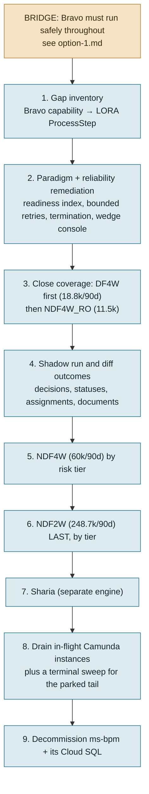

# Option 3 — Migrate Bravo to LORA

**Companion to** [option-1.md](option-1.md) (version upgrade), [option-2.md](option-2.md) (Temporal) and [option-summary.md](option-summary.md) (comparison and decision framework).

**Status of the wider decision.** No decision has been taken about Bravo's long-term platform, and this document does not assume one. LORA runs in production alongside Bravo; whether it becomes BFI's single loan origination system is exactly the question this pack exists to inform.

**Verdict in one line.** The only option that ends with one platform instead of two — and the only one that asks the organisation to change paradigm as well as runtime, which is where its most-cited objection lives and where this document spends its longest section.

---

## 1. Where the two platforms stand today

| | Bravo | LORA |
|---|---|---|
| Applications, Aug 2026 (billing sheet) | 118,253 — **41%** | 171,479 — **59%** |
| Trend Jul → Aug (billing sheet) | 118k → 118k — flat | rising |
| Bravo engine meter, same period | ~120k process starts/month | — |
| Orchestration tier cost | ≈Rp58M/month prod | ≈Rp431M/month all-in |
| Per application | ≈Rp490–515 | ≈Rp2,500–3,200 |
| Product families served | 4 live root workflows | 7 families, 13 repos |
| Paradigm | Imperative BPMN on Camunda | Data-centric GSM planner on Temporal |

Source: [compare.md §3.12](compare-architecture.md), [LORA cost findings](../../lora-workspace/docs/production-findings/cost.md).

**Two caveats on the volume figures, both from the LORA cost document itself.** The application counts in the billing sheet are the least-verified numbers in the pack — an application originated in LORA is plausibly counted again in Bravo when it is booked at go-live — and Bravo's engine meter reports ~120k process starts/month against the sheet's 118,253. The split is directionally clear and numerically soft. It should not be the sole basis for a platform decision, and the billing owner should be asked to define both columns before it is.

LORA already runs the NDF product family on the `dp-ndf` document schema, with `ndf4w` and `ndf2w` SKU packages. So Option 3 is not "build an LOS on LORA" — it is **close the coverage gap, prove parity, cut the remaining book over, and switch Bravo off.** That materially reduces the technical risk relative to a green-field build, and it is the strongest structural argument for this option.

---

## 2. What actually has to move

Counted from the production database, 90 days to 2026-09-09 ([workflow-gap.md §8](workflow-gap.md)):

| Root workflow | Product | Starts (90d) | Share | Migration difficulty |
|---|---|--:|--:|---|
| `NDF2W` | NDF 2-wheel | **248,682** | 73.4% | **Hardest.** The whole 2-wheel retail book, 16 master configs, 185,574 survey tasks averaging 58h open, 49 product-specific delegates with no unified equivalent |
| `NDF4W` | NDF 4-wheel | 59,909 | 17.7% | Hard. 6 master configs, 40 product-specific delegates, 50,650 high-risk survey tasks |
| `NDF4W_RO` | Repeat order | 11,458 | 3.4% | Messiest per unit. RO same-asset, Pallav customer creation, RO-digital operation assignment — the least reusable corners |
| `Unified_Process_Main_Workflow` | **DF4W only** | 18,809 | 5.5% | Easiest. 8-step spine, 36 children, activities already config-gated |
| `NDF4W_Sharia` | Sharia | separate engine | — | Own deployment; must be scoped separately |
| `UNSECURED`, pre-approval, multi-asset | | 0 in 90d | — | Dormant or elsewhere; confirm before scoping |

**The sharp finding from [workflow-gap.md §8.2](workflow-gap.md):** "a single workflow for all products" is false in production. The unified spine carries DF4W plus a 3-application NDF4W pilot. The legacy per-product monoliths carry **~94% of applications and the entire retail book**. So migrating Bravo to LORA is overwhelmingly a *legacy monolith* migration — and those monoliths are 9,494 and 8,464 lines of BPMN with product logic also living in Java `isNDF4W()` predicates, YAML maps, six-column selector tables and gateway string comparisons.

Beyond the workflows, three Bravo capability blocks need a LORA home:

1. **Human work** — 217k LOC, 43.6% of the service. `SurveyorAssignmentServiceImpl` (10,419 lines), `OperationAssignmentServiceImpl` (8,177), `BaseUnderwritingApprovalServiceImpl` (4,604), plus the data-driven approver ladder in `underwriting_job_level_lov_detail`. LORA has counterparts (`lora-task-service` 89k LOC, `survey.go` 5,473 lines / 125 transitions, `underwriting.go` 3,041 / 72) but coverage parity per product and risk tier is unproven.
2. **Operator surfaces** — `ApplicationErrorTracking` console, ~25 retry/reprocess/revive/cancel endpoints, Camunda Cockpit, and `bravo-underwriting-console`.
3. **Durable reprocess generations** — Bravo's `prevApplication`/`currentIndex` chain keeps every attempt as a queryable row. LORA rewinds and re-originates, which loses that history ([compare.md §3.7](compare-architecture.md), §6 lesson 3).

---

## 3. The paradigm objection, examined

This is the most-cited objection to Option 3 and it deserves to be assessed rather than dismissed or accepted. The complaint, in the LORA team's own words ([Current LORA challenges in Production](../../lora-workspace/docs/production-findings/Current%20LORA%20challenges%20in%20Production.md)):

> "Workflow (imperative) to be translated to (declarative) data readiness as a trigger to run Activity using Golang and LORA SDK. Human tendency is to think in terms of Workflow (e.g: Underwriting will start after Survey) rather than remembering if asset list fields and customer address are filled then start Survey."

> "You can get Java or Golang developers, but they won't be able to immediately read the code and understand. It will take time to understand the concept and go through the coding for SDK or Planner. Modifying SDK and the Planner will take longer time to understand."

LORA's own investigation ([people.md](../../lora-workspace/docs/production-findings/people.md)) tested each of these. Its verdicts are mixed, and the mix is the useful part:

| Claim | LORA's own verdict | What it means for Option 3 |
|---|---|---|
| GSM destroys the business order of the loan process | **Refuted.** GSM *de-indexes* it, it does not delete it. 155 `SetPrecondition` sites encode "when does this stage open?" in business language; the nine `$.status.application` milestones are the process | The order is recoverable, but only through a generated index (status × activity × product) that does not exist yet. Until it does, the objection is true *in practice* even though it is false in principle |
| Go/Java hires cannot onboard | **Overstated, but the entry point is inverted.** 14 onboarding files / ~5,550 lines exist and the tooling works — but there is **no week-1 curriculum and no ADRs**, so hires start at the SDK instead of at a loan moving | A fixable documentation problem, not a property of GSM. But it is unfixed, and it is what people experience |
| Business needs a hand-maintained readiness spreadsheet | **Refuted as necessary.** `depchain-generator` derives it statically — but it is unfinished (no CSV, no edges, LPW-only) and **not run in CI** | The tool that answers the objection exists and is 80% done. Finishing it is small and high-leverage |
| One team must master all LOS domains because `dp-ndf` is shared | **Confirmed as an organizational cost.** One document and one planner leave no seam for a UW/Surveyor team split; the top production incident spans both domains | The one verdict that is *confirmed*, and it is structural rather than educational. It constrains how BFI can organise squads, and Bravo's current split by LOS stage would not survive the move. **Strengthened 2026-09-10 — the seam Bravo would lose is not hypothetical; it is measured. See [§3a](#3a-the-seam-lora-lacks-is-one-bravo-is-actively-running).** |

### 3a. The seam LORA lacks is one Bravo is actively running

**Added 2026-09-10.** The fourth complaint above — that a shared document and a shared planner leave no seam to split UW and Surveyor teams — was assessed as *confirmed but abstract*: a constraint on how BFI could organise squads. New evidence makes it concrete on both sides, because **Bravo's LOS is already organised along exactly that seam, and the split is visible in four independent places**:

| Where | Team Scoring & Underwriting | Team Surveyor & Verificator |
|---|---|---|
| Jira project | **`BLCS`** — 4,811 keys | **`LN`** — ~6,600 keys, [board 703](https://bfifinance.atlassian.net/jira/software/c/projects/LN/boards/703) |
| Capability areas | `[4W Scoring]` `[2W Scoring]` `[All Scoring]` `[DF2W Scoring]` `[UW 4W]` `[DF2W UW]` | `[DF2W] [O]` `[DF2W] [S]` `[NDF2W]` `[NDF4W]` `[NDF]` |
| Console repositories | `bravo-underwriting-console` (249k LOC) | `bravo-surveyor-console` (307k LOC), `bravo-operation-console` (208k LOC) |
| Sprint testing | `BLCS-4808/4809` "Regression Test Sprint 18" | `LN-6599/6600/6602` "Regression Testing - Sprint 18" |

Cross-project issue links between them: **zero**. Assignee overlap in the sampled issues: **zero**. Two squads, one sprint train, disjoint scope, separate front ends — and each is full-stack within its own domain (`LN` sub-tasks are `[BE]` 18 / `[FE]` 15 / `[QA]` 7). Delivery figures in [bravo-people.md §3–§5](bravo-people.md).

**What this does to the option.** It converts "Bravo's split by LOS stage would not survive the move" from a prediction into a **priced loss**. Option 3 would merge two squads that today ship independently against separate repositories and separate boards, into a shared-document model whose own investigation says it offers no seam to split them back. That is not a reason to reject the option — LORA's [people.md](../../lora-workspace/docs/production-findings/people.md) proposes end-to-end teams per product family as the replacement organisation, which is a coherent answer. But it is the cost, it is **structural and unremediable** unlike the other three complaints, and it should be stated as *"merge two working squads and re-cut them by product family"* rather than as *"a constraint on how BFI can organise"*.

**The symmetric caution, so this is not read as one-sided:** Bravo's seam is not free either. [compare-architecture.md §3.14](compare-architecture.md) shows the surveyor-assignment boundary is the top ops complaint on **both** platforms at nearly the same rate (Bravo 21.8% of tickets, LORA 25.0%), and `BLCS-4405` *"[DF2W UW] Sync Surveyor Status Underwriting Return"* is exactly the kind of ticket a seam creates — work whose whole purpose is keeping two sides of a boundary consistent. Bravo has a seam that lets two squads ship independently, and it pays for it in cross-boundary synchronisation.

**The honest reading.** Three of the four complaints are about missing artefacts — a generated readiness index, a week-1 curriculum, ADRs — and are addressable with weeks of work, not by changing paradigm. The fourth, team ownership, is a genuine property of a shared-document design and does not go away. So the paradigm objection is **real but mostly remediable**, and the remediation is cheap relative to the migration. It should be priced into Option 3 explicitly (it is, in the effort table below) rather than treated as either a blocker or a grumble.

**The counter-consideration that should not be lost.** [compare.md §3.4](compare-architecture.md) rates GSM's central claim as validated: adding an automated check in LORA is a new Constructor with ReadSet/WriteSet and a precondition — no orchestration edit — verified at 172 activities with only 3 hard precursors. In Bravo the same change touches a `JavaDelegate`, a BPMN file, a gateway, a retry choice, a `WorkflowConstants` key and a configuration table. That is the capability being bought, and it is the thing the paradigm objection is the price of. Whether that trade is worth making is a judgement about which cost the organisation would rather carry — and it is properly the CTO's, not this document's.

---

## 4. Effort

The lowest-confidence estimate in this pack, because LORA's per-product coverage gap against Bravo has not been measured. Treat the first workstream as the one that makes the rest of the numbers real.

| Workstream | Detail | Eng-months |
|---|---|---|
| **Gap inventory, per product and risk tier** | The method already written down for the legacy→unified migration ([bravo-unified-legacy-to-unified.md §3](bravo-unified-legacy-to-unified.md)) applied across the LORA boundary: every Bravo delegate, status, assignment rule and approval path mapped to an existing LORA ProcessStep, a required new one, or "drop". **Do this before committing to any of the numbers below.** | 1–2 |
| **Close product coverage in LORA** | NDF2W (16 configs), NDF4W (6 configs), RO variants, Sharia. New ProcessSteps with ReadSet/WriteSet/preconditions; document schema extensions | **10–20** |
| **Human-task parity** | Surveyor assignment and coverage/level eligibility, operation assignment, the underwriting approval ladder and its feature-flagged chain rules, document submission. The largest single block and the one with the least reuse | **6–12** |
| **Paradigm-cost remediation** (§3) | Finish `depchain-generator` and run it in CI to produce the status × activity × product index per product family; a week-1 curriculum and ADRs; resolve the team-ownership seam. Small, and it de-risks everything downstream | **1–2** |
| **LORA reliability remediation — a hard prerequisite** | See §6. Bounded retries and a terminal-error class, the `SetTermination` defect (about **half of all loans never reach a terminal state**), an operator surface for wedged loans, per-family APM (6 of 7 families have no production APM presence), and a green nightly | **4–8** |
| **Parallel run, parity diffing, tier-by-tier cutover, drain** | Same pattern as §4 of the legacy→unified plan, at higher stakes: NDF2W alone is 248,682 instances per quarter. Includes a terminal sweep for the parked-instance tail (§8) | **6–10** |
| **Bravo decommission** | Retire `ms-bpm` and `prod-postgres-bpm-d2bpm`, the SIT/UAT/Sharia copies, the console, and the dead `setting.workflow.map` entries. Resolve data retention: Camunda history is purged at 90 days but the relational record is the system of record for booked loans | 2–3 |
| **Total** | | **30–57** |

**Elapsed:** 15–24 months. **Indicative one-off** at an assumed Rp30–50M per engineer-month: **Rp900M – Rp2.85B**.

**A material qualification on that total.** Some of this work overlaps with LORA's existing product roadmap and reliability backlog, and would be done whether or not Bravo migrates. The *incremental* cost attributable to a migration decision is therefore lower than the table's total — but by how much has not been quantified, and it should be before the number is used in a business case. The gap inventory is the workstream that produces that figure.

---

## 5. Sequence

Two ordering rules, both from evidence already in this repository:

- **Lowest volume and highest existing coverage first.** DF4W is already on the unified spine with config-gated activities; RO is small enough to absorb a mistake. NDF2W is 73% of the book and must be last.
- **Reliability and legibility before volume.** Moving the retail book onto LORA before steps 2 completes would multiply a measured defect rate by roughly 3×, and would do it while the people operating it still lack the readiness index.

**This sequence is also its own off-ramp.** Steps 1–4 — inventory, remediation, DF4W coverage, shadow run — are ~12–20 engineer-months and produce a *decision-grade* answer to "does LORA actually absorb a Bravo product cleanly?", on 5.5% of volume, without committing the retail book. If the answer is no, the work still leaves LORA measurably better and Bravo untouched.

---

## 6. The reliability prerequisite

LORA's own production findings are the strongest argument for sequencing Option 3 carefully. They come from the LORA team's measurements.

| Finding | Measured | Consequence for a retail-book cutover |
|---|---|---|
| **About half of all loans never reach a terminal state** | `SetTermination` requires terminal status **and** plate released **and** BPKB state; a licence-plate reservation renews itself, so the workflow never ends | Workflow versions can never be retired; 5 idle worker versions hold 82 cores / 154 GB. At 3× volume this compounds |
| Uncapped retries, no terminal-error class | `MaximumAttempts: 0`, zero `NewNonRetryableApplicationError`; ~50,000 4xx/week retried as transient; 4xx outnumber 5xx 111:1 | 47 loans wedged per 7-day window, one at attempt 1,890; **20–25 permanent wedges/month** at 171k applications |
| Undesigned dead-letter path | 1,269 force-cancel and ~705 rewind tickets Jan–Aug 2026; ops re-originates from event 1 | Bravo's operators today have `ApplicationErrorTracking` plus `setJobRetries`. They would be moving to a *worse* operator surface — though **not to a busier one**: measured on the same OTRS queue over the same months, Bravo generates 2,514 stuck-application tickets to LORA's 1,453, at ≈0.39% of applications against ≈0.13% ([ticket-analysis.md](production-findings/ticket-analysis.md)) |
| No per-family observability | 6 of 7 product families have no production APM presence; Temporal has **0 search attributes** | "Which loans are stuck at survey?" is a SQL `WHERE` clause on Bravo today. It is not answerable on LORA without APM |
| Testing | Nightly red for 5 weeks; `lora-super-test` has no CI runner; 4 repos at zero tests; product policy is not a merge gate | Parity for 16 NDF2W risk-tier configurations cannot be proven by a suite that does not run |

**One counterweight, added 2026-09-10.** Every row above is a LORA defect, and the table reads as a list of reasons to hesitate. The OTRS export supplies the missing comparison: on the only symmetric measurement in the pack, **LORA is the more reliable platform per application today** — ≈99.87% of applications complete with no support ticket against Bravo's ≈99.56%, and LORA's ticket load fell a third over eight months while Bravo's rose 82% against falling volume ([ticket-analysis.md](production-findings/ticket-analysis.md)). Both figures rest on the billing sheet's disputed application counts, Bravo's excludes silent operator-console recoveries, and the gap turns on one unexplained Bravo category — so this is a correction to the framing, not a licence to skip the gates below. But the reliability prerequisite is about *specific defect classes that would compound at 3× volume*, not about LORA being the shakier system.

None of these is an argument against Option 3 in principle. All are arguments for treating "green nightly, bounded retries, terminal statuses, wedge console, readiness index" as the entry gate to each cutover wave — and for reading the current defect rate as a statement about LORA's *maturity*, not about GSM or Temporal. Bravo's equivalents (§7 of [compare.md](compare-architecture.md)) took four years to reach their current state.

---

## 7. Cost after the migration

| Line | Change |
|---|---|
| `ms-bpm` pods + `prod-postgres-bpm-d2bpm` | **−≈Rp58M/month** prod; **−≈Rp70–100M/month** including SIT/UAT and Sharia copies |
| LORA marginal cost of Bravo's volume | **≈zero.** LORA went +23% Temporal-metered volume for +3% spend Jun→Aug; it pays for provisioned capacity, not work done |
| Second platform's staffing and on-call | Retires. Not in any GCP line, and plausibly the largest saving |
| Cloud Logging on the Bravo estate | Partially retires. `ms-bpm` logs full Feign request bodies (`loggerLevel: full`) into a Rp140.5M/month prod logging line |

**What does not retire, and this correction matters.** The earlier claim that retiring Bravo saves ≈Rp1.6B/month was withdrawn in [compare.md §3.12](compare-architecture.md). Most of the Bravo estate — Cloud SQL Rp584M, the ~26 `ms-*` data-plane services with ~50 Cloud SQL instances, Memorystore, Keycloak — is the shared BFI data plane that **LORA's 301 gateway proxies also call**. It stays. Only the LOS tier retires.

**And on a like-for-like tier LORA is currently the more expensive platform**: ≈Rp2,500–3,200 per application against Bravo's ≈Rp490–515. Option 3 is not justified by unit cost. Its financial case is *not running two loan origination systems* plus LORA's near-zero marginal cost as volume grows, and it strengthens materially if LORA's own right-sizing is done — retiring the five idle worker versions is worth ≈Rp63M/month, more than the entire Bravo LOS tier.

---

## 8. Risks

| Risk | Severity | Mitigation |
|---|---|---|
| **Bravo must stay running and secure throughout** | **Medium** *(was High)* | 15–24 months on an unpatched engine with a proven RCE path is not survivable on its own — but since the fork correction, [option-1.md](option-1.md) closes the *unpatched-engine* half for **18–33 engineer-days** with no licence, landing Bravo on a supported engine and Spring Boot for the duration. **The other half is not closed by any option here:** the RCE was reached with a valid credential, so rotating `INTERNAL_SERVICE_KEY`, moving to per-caller secrets and registering a `ProcessEngineAuthenticationFilter` are separate work that every option needs ([SECURITY-FINDING-camunda-rce.md](SECURITY-FINDING-camunda-rce.md)). Days, not months — but do not assume the fork carries it. This risk is now cheaply mitigated rather than structural |
| **Camunda cannot be retired by waiting** | Medium–High | **96 `userTask` elements across 26 of the 53 BPMN files** mean in-flight instances park on human action indefinitely ([Camunda 7 Exit Plan](production-findings/Camunda%207%20Exit%20Plan.pdf)). A residue will never complete on its own, so the final decommission needs an explicit force-complete/cancel sweep, and the two-platform period lasts until that sweep runs |
| Coverage gap is unmeasured | High | The gap inventory is the first workstream and gates the rest of the estimate |
| Moving 94% of the book onto a platform with a measured wedge rate | High | §6 remediation as an entry gate per wave |
| Silent parity failure | High | The config-skip trap: an unconfigured activity no-ops rather than failing. Shadow-run diffing on decisions, statuses, assignments and documents; a "fail loud on missing config" guard |
| **Paradigm adoption cost across the organisation** | Medium–High | §3. Mostly remediable with a generated readiness index, a week-1 curriculum and ADRs — but unremediated today, and the team-ownership seam is structural |
| NDF2W volume shock | High | Last, by risk tier, with the legacy path kept warm for rollback |
| Loss of relational fleet queries and reprocess generations | Medium | Decide deliberately what replaces them — [compare.md §6](compare-architecture.md) lesson 3 |
| Sharia runs in its own engine | Medium | Scope separately; it was not in the 90-day sample |
| Single-vendor concentration | Low–Medium | All BFI origination would depend on Temporal Cloud and ArangoDB contracts |

---

## 9. When Option 3 is the right answer

It is the right answer when BFI intends to run **one** loan origination system, and judges that the capability GSM buys — adding an automated step without editing an orchestration model, validated in production at 172 activities — is worth the adoption cost documented in §3 and the maturity gap in §6.

The honest qualifications, stated so they are not discovered later:

- It does **not** answer the end-of-support finding by itself. Fifteen to twenty-four months of Bravo runtime still has to be made safe — but that is now cheap: [option-1.md](option-1.md) Path B lands a supported engine and Spring Boot in 18–33 engineer-days with no licence, so the bridge is a small line item rather than a strategic constraint.
- It should **not** start with the retail book. It should start with a gap inventory, the paradigm remediation and the reliability work, and prove itself on DF4W.
- Its cost case is "stop running two platforms", not "LORA is cheaper per loan". On a like-for-like tier it is not, today.
- The paradigm objection is real. It is mostly remediable and the remediation is cheap — but it has not been done, and a migration decision that assumes it away will meet it at full strength during cutover.

---

## Sources

- [Current LORA challenges in Production](../../lora-workspace/docs/production-findings/Current%20LORA%20challenges%20in%20Production.md) — the paradigm and training complaints, verbatim
- [people.md](../../lora-workspace/docs/production-findings/people.md) — LORA's own verdicts on those complaints
- [workflow-gap.md §8](workflow-gap.md) — production volumes by root definition and product, per-product configuration, human-task queues
- [compare.md](compare-architecture.md) — like-for-like cost tiers, capability comparison, what each platform did better
- [bravo-unified-legacy-to-unified.md](bravo-unified-legacy-to-unified.md) — the migration method and its risks, at a smaller scale
- [LORA production findings](../../lora-workspace/docs/production-findings/) — reliability, cost, testing, delivery
- `squads/Scoring and Underwriting/bravo-bpm-service` at `2d5d856` — code counts
