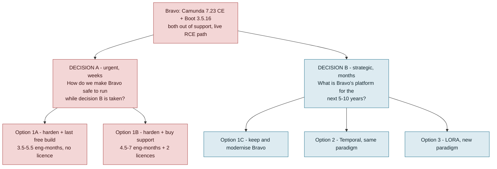

# Bravo end-of-support: three options compared

**Purpose.** Bravo's loan origination service runs Spring Boot 3.5.16 on Camunda 7.23.0 Community Edition. Both are out of support. This document compares three responses — [upgrade](option-1.md), [move to Temporal](option-2.md), [move to LORA](option-3.md) — and frames the decision for the CTO. **No decision has been taken about Bravo's long-term platform**, and nothing here assumes one.

**Date:** 2026-09-10. **Evidence:** `squads/Scoring and Underwriting/bravo-bpm-service` at `2d5d856` (2026-09-07); production BPM PostgreSQL, 90 days to 2026-09-09; GCP FinOps API, August 2026; vendor support calendars; LORA's own production-findings pack. Companion analysis: [compare.md](compare.md), [workflow-gap.md](workflow-gap.md), [workflow-analysis.md](workflow-analysis.md), [SECURITY-FINDING-camunda-rce.md](SECURITY-FINDING-camunda-rce.md).

---

## 1. The finding is sharper than "approaching end of support"

Bravo is not approaching two cliffs. It has gone over both, and it sits on the **last publicly available build of each stack**:

| Component | Bravo runs | Support ended |
|---|---|---|
| **Camunda 7 Community Edition** | 7.23.0 | **14 Oct 2025** — line closed, final artifact `7.24.0`, GitHub repo archived, *no security patches ever again* |
| **Spring Boot 3.5.x (OSS)** | 3.5.16 — the final OSS patch, 25 Jun 2026 | **30 Jun 2026** |
| Java 17 (Oracle premier) | 17, on distroless/Temurin | 30 Sep 2026 — 20 days |
| Camunda 7.23 (Enterprise maintenance) | — no licence held — | 13 Oct 2026 — 33 days |

Three consequences make this a decision rather than a maintenance ticket.

1. **The free upgrade path is one notch long.** Maven Central's Camunda artifacts stop at `7.24.0`, `lastUpdated 2025-10-14`. The security patches — `7.24.1` onward — are Enterprise-only.
2. **Spring Boot 4 requires a Camunda Enterprise licence.** Camunda's matrix puts Boot 4 support at **7.24.3+**, via `-4`-suffixed artifacts. On Community Edition, Bravo is permanently pinned to a Spring Boot line that OSS-expired in June.
3. **There is no second line of defence.** [SECURITY-FINDING-camunda-rce.md](SECURITY-FINDING-camunda-rce.md) records 61 injected remote-code-execution process definitions in the production engine, one confirmed executed inside the prod pod, reachable because `SecurityConfig.java:65` sets `/camunda/**` to `permitAll()`. An engine with no patch channel and a publicly reachable deployment endpoint is the worst combination on the list.

---

## 2. There are two decisions here, and they run on different clocks

Separating them is the single most useful thing this pack does.

**Decision A is not contingent on Decision B.** Every strategic path leaves Bravo running the retail book for at least 12 months — Option 1C takes 5–8 months to deliver, Option 2 takes 12–18, Option 3 takes 15–24. The hardening and the move to the last free build are useful under all of them and wasted under none. **This decision should not wait for the other one.**

**Decision B is the real question**, and it is not primarily a technology question. It is a question about which cost the organisation would rather carry for the next five years: a rented dependency on an end-of-life product, a large one-off rebuild that preserves the current model, or a paradigm change that buys a capability at the price of retraining and organisational rewiring.

---

## 3. Side by side

| | **Option 1** — Upgrade Camunda + Spring Boot | **Option 2** — Migrate to Temporal, pure workflow | **Option 3** — Migrate to LORA |
|---|---|---|---|
| **What it is** | 1A: Camunda 7.24.0 CE + Java 21 + hardening, no licence. 1B: buy Camunda 7 EE + Tanzu Spring, change nothing else. 1C: 1B plus Spring Boot 4.1 | Port ~60 BPMN definitions to Temporal Java SDK workflow code; 225 `JavaDelegate`s become Activities; the other 94% of the service stays put | Close LORA's coverage gap, prove parity, cut the remaining book over, switch Bravo off |
| **Paradigm change** | **None** | **None** — imperative workflow, same language | **Yes** — data-centric GSM, Go, custom SDK and planner |
| **Effort (eng-months)** | **1A 3.5–5.5** · **1B 4.5–7** · **1C 11–19** | **30–56** (or **8–14** for a DF4W-only pilot) | **30–57** (some overlaps LORA's existing roadmap) |
| **Elapsed** | 2–3 months (1A/1B); 5–8 months (1C) | 12–18 months, 5–8 engineers | 15–24 months |
| **Indicative one-off** (Rp30–50M/eng-month) | Rp105M–275M · Rp135M–350M+licences · Rp330M–950M+licence | Rp900M–2.8B | Rp900M–2.85B |
| **New licences** | 1A none · 1B Camunda 7 EE **+** Tanzu Spring · 1C Camunda 7 EE | None — Temporal already contracted at Rp140M/month | None |
| **Run-rate change** | None. Tier stays ≈Rp58M/month prod — the cheapest of the three | ≈neutral. +Rp4.5–12M/month Actions, likely inside the existing commitment; minus the Camunda history load on Cloud SQL | **−≈Rp58M/month** prod, **−≈Rp70–100M** with non-prod, plus a second platform's staffing |
| **Runway bought** | 1A **none** · 1B/1C **to Apr 2030**, Apr 2032 extended — then the question returns | **Permanent** — no workflow-engine vendor | **Permanent** — the platform ceases to exist |
| **Solves the EOL finding?** | 1A no (terminal versions, controls only) · 1B/1C yes | Yes | Yes, but only after 15–24 months |
| **Business capability gained** | None | None | Add an automated step with no orchestration edit — validated at 172 activities, 3 precursors |
| **Architectural findings addressed** | None | None — a faithful port ports the problems | Yes, by replacement |
| **Preserves what Bravo does well** | **All of it** — BPMN legibility, Cockpit, relational fleet queries, reprocess generations, bounded/classified failure | Partly — order stays authored and readable in Java; Cockpit and the BPMN diagram are lost | No — replaced by a different model with different strengths |
| **Ends with two platforms?** | Yes | Yes | **No** |
| **Biggest risk** | Every variant rents time on a feature-frozen product; the decision returns in 2027–28 | Large investment whose value depends on Bravo having a long life | Paradigm adoption cost, plus LORA's measured reliability gap at 3× volume |

---

## 4. The strategic decision, framed

Each option is the correct answer to a different question. The fastest route to a decision is to establish which question BFI is actually asking.

| If the governing belief is… | Then the answer is | Because |
|---|---|---|
| "Bravo should remain a strategic platform" | **Option 1C**, or **Option 2** | 1C is 11–19 eng-months and keeps everything, but rents time on an end-of-life engine and re-opens the question by 2028. Option 2 is 2–3× that and removes the vendor permanently. Over a 5–10 year horizon Option 2 is very likely better value; under 3 years, 1C is |
| "Bravo has a finite life, but we have not decided what replaces it" | **Option 1A now**, decide later | 3.5–5.5 eng-months converts an urgent problem into a scheduled one without prejudging anything. This is the *only* option that preserves optionality |
| "We want one LOS, and the GSM capability is worth its adoption cost" | **Option 3** | The only option that ends with one platform. Sequenced so DF4W proves it on 5.5% of volume before the retail book moves |
| "We want one LOS, but the GSM paradigm is the wrong model for us" | **Option 2 at full scope**, then consolidate onto it | Temporal is the execution layer both platforms would share. Bravo-on-Temporal keeps the imperative model; LORA's products could in principle converge on it later. This is the option nobody has costed and it deserves to be |
| "Risk/compliance will not accept unpatched runtime for any period" | **Option 1B as the bridge**, whatever Decision B turns out to be | Buys patches to Apr 2030 for 4.5–7 eng-months plus two quotes, and deliberately declines the Boot 4 work as premature |

### What each option optimises for

- **Option 1** optimises for *disruption avoided*. It is the only option that changes nothing about how a single engineer or analyst works, and it preserves everything the comparison found Bravo genuinely does better than LORA — bounded and classified failure handling with a designed dead-letter path, relational fleet queries, durable reprocess generations, an analyst-readable BPMN model, commodity skills, and the cheapest orchestration tier of the three at ≈Rp58M/month ([compare.md §5](compare.md)). It buys time, priced by the year, and does not remove the decision.
- **Option 2** optimises for *permanence without paradigm change*. It is the only option that removes the vendor dependency for good while keeping the imperative model the team already thinks in — and on infrastructure BFI already owns and staffs. Its weakness is that it changes the engine and preserves the architecture exactly: if the organisation's real complaint is about Bravo's design rather than its runtime, Option 2 does not answer it.
- **Option 3** optimises for *one platform and one capability*. Adding an automated step without editing an orchestration model is real, validated, and the clearest thing LORA does better ([compare.md §3.4](compare.md)). Its price is a paradigm change whose cost is documented, partly remediable, and currently unremediated.

### The paradigm objection, weighed

It is the most-cited objection to Option 3 and it should be neither dismissed nor accepted whole. LORA's own investigation ([people.md](../../lora-workspace/docs/production-findings/people.md)) tested four versions of it: **three are addressable artefacts** — a generated status × activity × product readiness index (the `depchain-generator` that produces it is ~80% built and not in CI), a week-1 curriculum, and ADRs — costing perhaps 1–2 engineer-months. **One is confirmed and structural**: a shared document and a shared planner leave no natural seam to split UW and Surveyor teams, which constrains how BFI can organise squads. [option-3.md §3](option-3.md) sets this out in full.

The fair summary: the objection is real, mostly remediable, and cheap to remediate relative to the migration — but it is unremediated today, and a decision that assumes it away will meet it at full strength during cutover. It is a reason to sequence Option 3 carefully, and it is a legitimate reason to prefer Option 2 if the organisation values the current mental model highly. It is not, on this evidence, a reason to rule Option 3 out.

---

## 5. What we do not know, and what would settle it

The four gaps below are what stand between this pack and a confident recommendation on Decision B. All are answerable in weeks.

| Open question | Why it decides something | How to close it |
|---|---|---|
| **What does Camunda 7 Enterprise + Tanzu Spring actually cost?** | Options 1B and 1C cannot be compared with 2 and 3 in money. If the licences are cheap, 1B is a strong low-risk answer; if expensive, Option 2 looks better on a 5-year view | Get quotes. Procurement, ~2–4 weeks |
| **How big is LORA's coverage gap against Bravo, per product and risk tier?** | The largest uncertainty in Option 3's 30–57 eng-months, and the input that says how much of it is incremental versus already-roadmapped | Gap inventory, 1–2 eng-months. Useful under every option |
| **What is Bravo's manual-intervention rate?** | LORA's is measured (~0.2% of applications, 20–25 permanent wedges/month). Bravo's is not. Nobody should claim either platform is more reliable until both are computed the same way | Derivable today from `application_error_tracking`, reprocess/revive endpoint hits and Cockpit incident history. Days |
| **How long must Bravo run?** | Selects 1A (short horizon), 1B (2–4 years), or 1C/2 (long) — and it is a business decision, not a technical one | Steering committee. Set and publish a horizon, even a provisional one |

Two smaller ones: whether Bravo's estimated 5.4–14.4M Temporal Actions/month fit inside the existing commitment before its ~March 2027 renewal, and what the Bravo/LORA application split really is — the billing sheet's counts are the least-verified numbers in the pack, and Bravo's engine meter reports ~120k process starts/month against the sheet's 76,446.

---

## 6. The one firm recommendation

> **Fund Decision A now, at Option 1A, and do not let it wait for Decision B.**

This is recommended without reservation because it is not a strategic bet. It is 3.5–5.5 engineer-months, every hour of it is useful under all three strategic options, and it addresses an exposure that is live today:

- fix `SecurityConfig.java:65`, disable or authenticate the Camunda REST and webapp surfaces in production, purge the 61 injected definitions, network-isolate the engine;
- move to Camunda **7.24.0 CE** — the last free build, so the position is "terminal supported-at-release version" rather than "one behind";
- Java 17 → 21 (Camunda 7.24 supports 17/21/25);
- build the minimal parity harness Bravo has never had — **4 of 1,457 test files run a Camunda process today**. This is worth doing on its own merits: it is the missing safety net for *any* subsequent change, including both migrations.

**Escalate to 1B if — and only if — the risk function will not accept unpatched runtime for the horizon in question.** That is a compliance judgement, and it should be taken explicitly rather than inherited by default. It adds two licence quotes and ~1–1.5 engineer-months, and it deliberately excludes the Spring Boot 4 work, which benefits only the future where Bravo is kept.

On **Decision B, this pack deliberately does not pick.** The three options answer different questions, the licence pricing that would separate 1B/1C from the others is unknown, and the coverage gap that would firm up Option 3's number has not been measured. What it does provide is the comparison, the effort ranges, the decision criteria in §4 and the four questions in §5 that would convert this into a recommendation. Closing those four is a matter of weeks, and Decision A buys exactly that time.

---

## 7. The next 30 days

Sequenced so that nothing on this list is wasted under any option.

| # | Action | Owner | Why it is unconditional |
|---|---|---|---|
| 1 | **Fix the Camunda RCE.** Remove `permitAll()` on `/camunda/**`; disable or authenticate the REST and webapp surfaces in prod; purge the 61 injected process definitions; treat as an incident and check for lateral movement using the pod's service account and `SPRING_DATASOURCE_*` credentials | Bravo + Security | Live, confirmed code execution in production. Required under all options |
| 2 | **Get quotes** for Camunda 7 Enterprise and Tanzu Spring commercial support | Procurement | Closes the largest pricing unknown in the pack; on the critical path for 1B and 1C |
| 3 | **Set and publish a Bravo horizon**, even provisionally | Steering / CTO | Selects the bridge variant, and is the main input to Decision B |
| 4 | **Take the risk decision** on running unpatched Camunda CE + Spring Boot 3.5 OSS for that horizon | Risk / Compliance + CTO | Selects 1A or 1B |
| 5 | **Start the LORA gap inventory** — every Bravo delegate, status, assignment rule and approval path mapped to an existing LORA ProcessStep, a required new one, or "drop", per product and risk tier | LORA + Bravo | Gates every number in [option-3.md](option-3.md); the resulting per-product map is useful under every option |
| 6 | **Compute Bravo's manual-intervention rate** from `application_error_tracking`, reprocess/revive endpoint hits and Cockpit incident history | Bravo | Makes the reliability comparison symmetric. Days of work |
| 7 | **Confirm Temporal commitment headroom** ahead of the ~March 2027 renewal | Platform + FinOps | Needed for Option 2's costing and for Option 3's capacity planning |
| 8 | **Reduce Camunda history level** on non-audited processes | Bravo | `full` history with 90-day retention on 483 service tasks is a material slice of the Rp52.7M/month Cloud SQL line. Free money under every option |

---

## 8. Estimation basis and what is not measured

**Basis.** Effort is in engineer-months of a competent engineer already familiar with the codebase, including that engineer's own testing but excluding UAT run by business users. Ranges are low-to-high, not confidence intervals. Rupiah figures apply an **assumed Rp30–50M fully-loaded cost per engineer-month** — substitute BFI's rate card. USD converts at Rp16,800 (derived from the Temporal contract: Rp139,995,834/month ≈ $8,333).

**Sizing inputs, all counted from the checkout at `2d5d856`:** 497,970 LOC main Java across 5,070 files; 1,457 test files of which 4 run a Camunda process; 53 BPMN and 3 DMN; 483 `delegateExpression` bindings over 274 beans; 225 `JavaDelegate` implementations (276 with subclasses); 96 user tasks; 56 `callActivity`; 190 escalation and 194 link event definitions; 186 `failedJobRetryTimeCycle` declarations; 113 `@FeignClient`; 238 `@Entity` over 271 tables; 1,350 Flyway migrations; 23 active authors and 4,514 commits in 2026.

**What is not measured, and would change the numbers:** the four open questions in §5 — licence pricing, LORA's coverage gap, Bravo's manual-intervention rate and Bravo's required horizon — plus Temporal commitment headroom and the true Bravo/LORA application split. Option 3's estimate additionally does not separate incremental cost from work already on LORA's roadmap; the gap inventory is the workstream that would.

---

## Sources

- [option-1.md](option-1.md) · [option-2.md](option-2.md) · [option-3.md](option-3.md) — the detailed cases
- [compare.md](compare.md) — Bravo against LORA, dimension by dimension, with the like-for-like cost tiers
- [workflow-gap.md §8](workflow-gap.md) — verified production volumes and per-product configuration
- [SECURITY-FINDING-camunda-rce.md](SECURITY-FINDING-camunda-rce.md) — the live RCE exposure
- [Current LORA challenges in Production](../../lora-workspace/docs/production-findings/Current%20LORA%20challenges%20in%20Production.md) and [people.md](../../lora-workspace/docs/production-findings/people.md) — the paradigm objection and LORA's own verdicts on it
- [Camunda 7 CE end of life](https://forum.camunda.io/t/important-update-camunda-7-community-edition-end-of-life-announced/50921) · [Camunda support announcements](https://docs.camunda.org/enterprise/announcement/) · [Camunda 7.24 Spring Boot compatibility](https://docs.camunda.org/manual/7.24/user-guide/spring-boot-integration/version-compatibility/) · [Spring Boot support timeline](https://endoflife.date/spring-boot)
