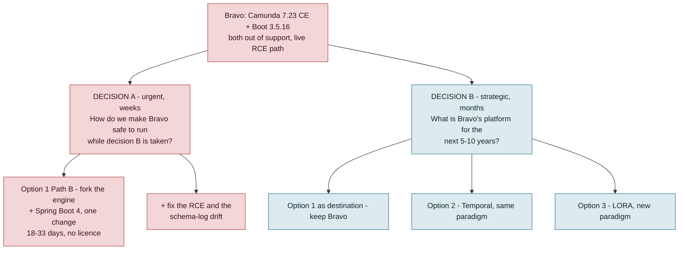

# Bravo end-of-support: three options compared

> **Corrected 2026-09-11, from the team.** Three changes, and the first moves every per-application figure below.
>
> 1. **Bravo's August application count is 118,253, not 76,446.** The old number came from a partial-month extract. 76,446/118,253 = 0.646, against a 0.601 cost-completeness factor on the same row. So August volume was **flat**, not −35%. Every rate derived from it has been recomputed here. The corrected count now agrees with Bravo's engine meter (≈113k) to within 5%. The two used to differ by 48%.
> 2. **`Surveyor Platform - Release reject` was fixed and deployed 2026-09-10.** Everything measured here predates the fix.
> 3. **LORA runs as three sub-teams: LORA 1, 2 and 3.** They execute tasks end to end, per the VMP LORA plan. So the bus-factor risk is specific to Bravo.
>
> **Open:** LORA's **171,479** comes from the same billing row and has not been re-verified.

**Purpose.** Bravo's loan origination service runs Spring Boot 3.5.16 on Camunda 7.23.0 Community Edition. Both are out of support. This document compares three responses: [upgrade](option-1.md), [move to Temporal](option-2.md), and [move to LORA](option-3.md). It then frames the decision for the CTO. **No decision has been taken about Bravo's long-term platform.** Nothing here assumes one.

**Date:** 2026-09-10.

**Evidence.**

- `squads/Scoring and Underwriting/bravo-bpm-service` at `2d5d856` (2026-09-07)
- the three operator consoles — `bravo-surveyor-console` `v2.83.12`, `bravo-operation-console` `v2.80.18`, `bravo-underwriting-console` `v1.63.13` — and the `LN` Jira project (**all added 2026-09-10**)
- production BPM PostgreSQL, 90 days to 2026-09-09
- GCP FinOps API, August 2026
- vendor support calendars
- LORA's own production-findings pack

**Companion analysis:** [compare.md](compare-architecture.md), [workflow-gap.md](workflow-gap.md), [workflow-analysis.md](workflow-analysis.md), [SECURITY-FINDING-camunda-rce.md](SECURITY-FINDING-camunda-rce.md).

---

## 1. The finding is sharper than "approaching end of support"

Bravo is not approaching two cliffs. It has already gone over both. It now sits on the **last publicly available build of each stack**:

| Component | Bravo runs | Support ended |
|---|---|---|
| **Camunda 7 Community Edition** | 7.23.0 | **14 Oct 2025** — line closed, final artifact `7.24.0`, GitHub repo archived, *no security patches ever again* |
| **Spring Boot 3.5.x (OSS)** | 3.5.16 — the final OSS patch, 25 Jun 2026 | **30 Jun 2026** |
| Java 17 (Oracle premier) | 17, on distroless/Temurin | 30 Sep 2026 — 20 days |
| Camunda 7.23 (Enterprise maintenance) | — no licence held — | 13 Oct 2026 — 33 days |

> **Correction, 2026-09-10.** This section used to say two things. First, that the free upgrade path ended at Camunda 7.24.0. Second, that Spring Boot 4 therefore required a Camunda **Enterprise licence**. Both were wrong.
>
> The Bravo team's [Camunda 7 Exit Plan](production-findings/Camunda%207%20Exit%20Plan.pdf) established the real position. Two Apache-2.0 community forks exist: **Operaton 2.1.4** and **CIB seven 2.2.0**. Both run on Spring Boot 4. Both keep the `ACT_` schema unchanged. Both accept the legacy `camunda:` BPMN namespace and ship automated migration recipes. Both are published on Maven Central with Spring Boot starters, verified 2026-09-10.
>
> So Option 1's cost falls from 11–19 engineer-months to **18–33 engineer-days**, with **no licence to buy**.

Three consequences make this a decision rather than a maintenance ticket.

1. **A supported destination exists, and it is cheap.** The community forks are a real, licence-free upgrade path off both cliffs at once. What ended is *Camunda's* stewardship, not the engine.
2. **The binding constraint is Spring Boot, not Camunda.** Camunda 7.23's Spring Boot starter will not run on Boot 4. The coupling runs one way only. Moving to Boot 4 forces an engine decision. Swapping the engine does not force Boot 4. So "upgrade Spring Boot first and decide about the engine later" **is not an option**.
3. **There is no second line of defence.** [SECURITY-FINDING-camunda-rce.md](SECURITY-FINDING-camunda-rce.md) records 61 injected remote-code-execution process definitions in the production engine. One of them ran inside the production pod. They were reachable because `SecurityConfig.java:65` sets `/camunda/**` to `permitAll()`. An engine with no patch channel and a publicly reachable deployment endpoint is the worst combination on this list. *(Vector corrected 2026-09-10: the deploy path required a credential. See the finding. The artifacts and the confirmed execution are unchanged.)*

---

## 2. There are two decisions here, and they run on different clocks

Separating them is the single most useful thing this pack does.

**Decision A does not depend on Decision B.** Every strategic path leaves Bravo running the retail book for at least 12 months. Option 2 takes 12–18 months. Option 3 takes 15–24.

**And Decision A no longer just holds the line.** At 18–33 engineer-days it lands Bravo on a fully supported engine and a supported Spring Boot outright. The Spring Boot 4 half, 12–20 of those days, is owed under Option 2 as well, because the framework upgrade does not disappear when Camunda does. **This decision should not wait for the other one.**

**Decision B is the real question**, and it is not mainly a technology question. It asks which cost the organisation would rather carry for the next five years. There are three: a rented dependency on an end-of-life product; a large one-off rebuild that keeps the current model; or a paradigm change that buys a new capability, and charges for it in retraining and reorganisation.

---

## 3. Side by side

| | **Option 1** — Upgrade Camunda + Spring Boot | **Option 2** — Migrate to Temporal, pure workflow | **Option 3** — Migrate to LORA |
|---|---|---|---|
| **What it is** | **Path B:** swap Camunda 7.23 CE for an Apache-2.0 fork (Operaton 2.1.4 or CIB seven 2.2.0) **and** upgrade Spring Boot 3.5.16 → 4.0.x in one change. Automated OpenRewrite recipe; `ACT_` schema, 53 BPMN and Java 17 all unchanged | Port ~60 BPMN definitions to Temporal Java SDK workflow code; 225 `JavaDelegate`s become Activities; the other 94% of the service stays put | Close LORA's coverage gap, prove parity, cut the remaining book over, switch Bravo off |
| **Paradigm change** | **None** | **None** — imperative workflow, same language | **Yes** — data-centric GSM, Go, custom SDK and planner |
| **Effort (eng-months)** | **≈1–1.5** build (18–33 eng-days), **1.5–2.5** with review and soak | **31–57** (or **8–14** for a DF4W-only pilot) | **30–57** (some overlaps LORA's existing roadmap) |
| **Elapsed** | 1–2 months, one engineer | 12–18 months, 5–8 engineers | 15–24 months |
| **Indicative one-off** (Rp30–50M/eng-month) | **Rp45M – Rp125M** | Rp930M–2.85B | Rp900M–2.85B |
| **New licences** | **None** — both forks are Apache 2.0 | None — Temporal already contracted at Rp140M/month | None |
| **Run-rate change** | None. Tier stays ≈Rp58M/month prod — the cheapest of the three | ≈neutral. +Rp4.5–12M/month Actions, likely inside the existing commitment; minus the Camunda history load on Cloud SQL | **−≈Rp58M/month** prod, **−≈Rp70–100M** with non-prod, plus a second platform's staffing |
| **Runway bought** | Supported engine **and** supported Spring Boot, maintained on 6-month lines (Operaton) or a purchasable contract (CIB seven) | **Permanent** — no workflow-engine vendor | **Permanent** — the platform ceases to exist |
| **Solves the EOL finding?** | **Yes, outright** — and fastest by an order of magnitude | Yes | Yes, but only after 15–24 months |
| **Business capability gained** | None | None | Add an automated step with no orchestration edit — validated at 172 activities, 3 precursors |
| **Architectural findings addressed** | None | None — a faithful port ports the problems | Yes, by replacement |
| **Preserves what Bravo does well** | **All of it** — BPMN legibility, Cockpit, relational fleet queries, reprocess generations, bounded/classified failure | Mostly — 0.4% engine contact, no data migration, no retraining; process legibility is preserved and made verifiable by a generated-vs-intent diagram diff. Cockpit is the real loss | No — replaced by a different model with different strengths |
| **Ends with two platforms?** | Yes | Yes | **No** |
| **Biggest risk** | Schema-log drift could fail startup at cutover (diagnosable in hours); and adopting a project with a 6-month support line is a *chosen* dependency, scrutinised differently from inherited drift | Large investment whose value depends on Bravo having a long life | Paradigm adoption cost, plus LORA's measured reliability gap at 3× volume |

---

## 4. The strategic decision, framed

Each option is the right answer to a different question. So the fastest route to a decision is to work out which question BFI is actually asking.

| If the governing belief is… | Then the answer is | Because |
|---|---|---|
| "Bravo should remain a strategic platform" | **Option 1**, then reassess | At 18–33 days it lands on a maintained engine and a current Spring Boot. Option 2 costs 20–40× more to reach a similar place; its distinct value is removing the workflow-engine dependency altogether, which the fork route does not do — it changes stewards |
| "Bravo has a finite life, but we have not decided what replaces it" | **Option 1 now**, decide later | 18–33 days removes the exposure entirely rather than deferring it, and prejudges nothing. It is the only option that preserves optionality, and the Spring Boot half is owed under Option 2 regardless |
| "We want one LOS, and the GSM capability is worth its adoption cost" | **Option 3** | The only option that ends with one platform. Sequenced so DF4W proves it on 5.5% of volume before the retail book moves |
| "We want one LOS, but the GSM paradigm is the wrong model for us" | **Option 2 at full scope**, then consolidate onto it | Temporal is the execution layer both platforms would share. Bravo-on-Temporal keeps the imperative model; LORA's products could in principle converge on it later. This is the option nobody has costed and it deserves to be |
| "Risk/compliance will not accept unpatched runtime for any period" | **Option 1 Path B**, whatever Decision B turns out to be | The only route that ends on a supported engine *and* a supported Spring Boot. If a contractual support agreement is mandatory, that selects CIB seven over Operaton — see [option-1.md §4](option-1.md) |

### What each option optimises for

- **Option 1** optimises for *disruption avoided*, and now for speed and cost as well. It changes nothing about how an engineer or an analyst works: no data migration, no paradigm change, no retraining, no new language. It also keeps everything the comparison found Bravo genuinely does better than LORA — bounded, classified failure handling with a designed dead-letter path; relational fleet queries; durable reprocess generations; an analyst-readable BPMN model; commodity skills; and the cheapest orchestration tier of the three at ≈Rp58M a month ([compare.md §5](compare-architecture.md)). Since the fork correction it no longer just *buys time*. It resolves the end-of-support exposure outright, for about 1–1.5 engineer-months. What it still does not do is address Bravo's **architecture**: five monoliths, product identity in five places, four status vocabularies. That is the ground Options 2 and 3 contest.
- **Option 2** optimises for *permanence without a paradigm change*, and for **low migration risk**. It is the only option that removes the vendor dependency for good while keeping the imperative model the team already thinks in, on infrastructure BFI already owns and staffs. [option-2.md §3](option-2.md) measures why it is the lower-risk migration. Only **2,004 of 497,970 lines, or 0.40%**, touch a Camunda API. The 238 entities and 271 tables do not move at all. Parity can be argued element by element rather than demonstrated path by path. And rollback lands on the same database. Note what that does *not* buy: at 31–57 engineer-months it is not meaningfully cheaper than Option 3. The reuse turns into predictability and reversibility, not into fewer engineer-months. Its weakness is that it changes the engine and keeps the architecture exactly as it is. If the organisation's real complaint is about Bravo's design rather than its runtime, Option 2 does not answer it.
- **Option 3** optimises for *one platform and one capability*. Adding an automated step without editing an orchestration model is real, validated, and the clearest thing LORA does better ([compare.md §3.4](compare-architecture.md)). The price is a paradigm change. That cost is documented and partly fixable. Nobody has fixed it yet.

### The paradigm objection, weighed

This is the objection to Option 3 people cite most often. It should be neither dismissed nor swallowed whole.

LORA's own investigation ([people.md](../../lora-workspace/docs/production-findings/people.md)) tested four versions of it. **Three are fixable with artefacts:** a generated status × activity × product readiness index (the `depchain-generator` that produces it is about 80% built and not in CI), a week-1 curriculum, and ADRs. Together those cost perhaps 1–2 engineer-months.

**One is confirmed and structural.** As of 2026-09-10 it is also *measured on both sides*. The UW/Surveyor seam LORA lacks is one **Bravo is actively running**: two squads (`BLCS` and `LN`), two boards, three consoles, separate sprint regression, and zero cross-project links ([option-3.md §3a](option-3.md#3a-the-seam-lora-lacks-is-one-bravo-is-actively-running)).

So Option 3's organisational cost is concrete, not abstract. It is *merge two working squads and re-cut them by product family*. A shared document and a shared planner leave no natural seam along which to split UW and Surveyor teams, and that constrains how BFI can organise squads. [option-3.md §3](option-3.md) sets this out in full.

The fair summary. The objection is real. It is mostly fixable, and cheap to fix next to the cost of the migration. But nobody has fixed it, and a decision that assumes it away will meet it at full strength during cutover. It is a reason to sequence Option 3 carefully. It is a legitimate reason to prefer Option 2 if the organisation values the current mental model highly. On this evidence it is not a reason to rule Option 3 out.

---

## 5. What we do not know, and what would settle it

The gaps below stand between this pack and a confident recommendation on Decision B. Every one of them is answerable in weeks. **One of the four closed on 2026-09-10:** the OTRS ticket export gave us Bravo's manual-intervention rate ([ticket-analysis.md](production-findings/ticket-analysis.md)). It stays in the table with its answer, because that answer arrived with a caveat that is itself a smaller open question.

| Open question | Why it decides something | How to close it |
|---|---|---|
| ~~**What does Camunda 7 Enterprise + Tanzu Spring cost?**~~ **Obsolete — no licence is needed.** Replaced by: **is a contractual support agreement required for the workflow engine, and can one be purchased for a BFI entity?** | Decides the **fork**, not the option. Yes → CIB seven (company-backed, cheaper migration, two ex-Camunda core engineers). No → Operaton (9× the commit volume, 52 contributors, Apache 2.0 with no paid tier). CIB seven's terms are unpublished and sales-contact-only | Architect + procurement. Start the CIB seven enquiry *before* finalising, not after |
| **Does `ACT_GE_SCHEMA_LOG` match the schema in SIT, UAT and PROD?** | Two Flyway migrations hand-replayed Camunda's 7.20→7.22 upgrade DDL with `IF NOT EXISTS` guards, so the columns arrived but the engine's version label may not have. If the label is below 7.22 while the columns exist, **engine startup fails at cutover**. Strong inference, not yet verified | Four SQL queries per environment, run independently. Hours ([option-1.md §7.1](option-1.md)) |
| **How big is LORA's coverage gap against Bravo, per product and risk tier?** | The largest uncertainty in Option 3's 30–57 eng-months, and the input that says how much of it is incremental versus already-roadmapped | Gap inventory, 1–2 eng-months. Useful under every option |
| ~~**What is Bravo's manual-intervention rate?**~~ **Answered 2026-09-10: ≈0.39%, about 3.1× LORA's ≈0.13%** — 1 application in 257 against 1 in 790, from 2,514 stuck-application tickets Jan–Aug against LORA's 1,453 ([ticket-analysis.md](production-findings/ticket-analysis.md)). Bravo's ticket load also rose 82% over eight months on flat volume | No longer blocks the comparison. Reliability now favours LORA as clearly as orchestration-tier cost favours Bravo | **Residual question, days of work:** the gap turns on one category, `Surveyor Platform - Release reject` (1,542 tickets, 28.4% of Bravo's load, grown 4.8×). Excluding it, Bravo's rate is 0.134% — level with LORA. **Fixed and deployed 2026-09-10** (Bravo team); the mapping is overtaken, and a Sep–Oct re-export is what now settles the rate |
| **How long must Bravo run?** | No longer selects an Option 1 variant — Path B is right at any horizon beyond about a year. It now decides **Decision B**: whether to spend 30–57 engineer-months on Option 2 or 3 at all, and it is a business decision, not a technical one | Steering committee. Set and publish a horizon, even a provisional one |

Three smaller questions remain.

1. What `Surveyor Platform - Release reject` actually is. See above — it is **now narrowed to six named endpoints and one squad**.
2. Whether Bravo's estimated 5.4–14.4M Temporal Actions a month fit inside the existing commitment, before its renewal around March 2027.
3. What the Bravo/LORA application split really is. The billing sheet's counts are the least-verified numbers in the pack. Bravo's engine meter reports about 120,000 process starts a month against the sheet's 118,253.

---

## 6. The one firm recommendation

> **Fund Decision A now — Option 1, Path B — and do not let it wait for Decision B.**

The fork correction makes this recommendation stronger, not weaker. The work is **18–33 engineer-days**. It needs **no licence**. And it ends with Bravo on a supported engine *and* a supported Spring Boot, rather than just holding an unpatched one. Every hour of it is useful under all three strategic options, because the Spring Boot 4 half is owed under Option 2 as well. It also addresses an exposure that is live today:

- fix `SecurityConfig.java:65`, disable or authenticate the Camunda REST and webapp surfaces in production, purge the 61 injected definitions, network-isolate the engine;
- run the **schema-log diagnostics** in every environment before committing a cutover date — this is the one finding that can change the plan;
- land the **six-item pre-decision cleanup** (1–2 days, four items pure deletion), which is independent of both the path and the fork;
- rehearse the cutover on a **PROD clone**; and build the minimal parity harness Bravo has never had at the engine layer. Today **4 of `ms-bpm`'s 1,457 test files run a Camunda process**. That is the missing safety net for *any* later change, including both migrations. **One partial net does exist, and nobody counted it until 2026-09-10.** The three consoles hold **829 PR-gating tests** that exercise the domain endpoints the engine sits behind. Console source contains **zero Camunda references**, so a fork swap leaves those tests untouched and they can be run as a boundary smoke test ([option-1.md §4a](option-1.md#4a-the-consoles-are-insulated-from-this-change)).

**The fork choice is the one genuinely open sub-decision.** It turns on a single question: is a contractual support agreement required, and can BFI buy one for a BFI entity? Yes → CIB seven. No → Operaton. [option-1.md §4](option-1.md) lays out the measured evidence on both sides.

On **Decision B, this pack deliberately does not pick.** The three options answer different questions, and nobody has measured the coverage gap that would firm up Option 3's number. What the pack does give you is the comparison, the effort ranges, the decision criteria in §4, and the open questions in §5.

**What has changed is the pressure.** Option 1 removes the end-of-support exposure in weeks rather than quarters. So Decision B can be taken on its merits — architecture, paradigm, one platform or two — instead of under a security deadline.

---

## 7. The next 30 days

Sequenced so that nothing on this list is wasted under any option.

| # | Action | Owner | Why it is unconditional |
|---|---|---|---|
| 1 | **Fix the Camunda RCE.** *Vector corrected 2026-09-10 — the deploy path required a credential, so this is a compromised-secret problem, not an open door.* **Rotate `INTERNAL_SERVICE_KEY`** (a single static shared value granting full engine rights) and the plaintext secrets in `bravo-e2e-test/cypress.config.js`; identify the caller from `POST /engine-rest/deployment/create` access logs, 2026-05-23 → 06-30; register a `ProcessEngineAuthenticationFilter`; purge the 61 injected process definitions; remove `permitAll()` on `/camunda/**` as hardening; treat as an incident and check for lateral movement using the pod's service account and `SPRING_DATASOURCE_*` credentials | Bravo + Security | Live, confirmed code execution in production. Required under all options |
| 2 | **Run the schema-log diagnostics** in SIT, UAT and PROD independently — four SQL queries ([option-1.md §7.1](option-1.md)) | Bravo | The one finding that can change the migration plan. If the label is below 7.22 while the columns exist, the engine will not start after the swap. Hours of work |
| 2b | **Land the six-item pre-decision cleanup** — `CollectionUtil` swap, delete `instance-tab-modify.js`, drop `camunda-bpm-mockito`, `hibernate-types-55`, the retired Jaeger stack and `OldSecurityConfig.java` | Bravo | 1–2 days, four items pure deletion, independent of path and fork. Delaying it costs a messier diff later |
| 3 | **Set and publish a Bravo horizon**, even provisionally | Steering / CTO | Selects the bridge variant, and is the main input to Decision B |
| 4 | **Answer the support-agreement question** — is a contractual support agreement required for the workflow engine, and can one be purchased for a BFI entity? If the answer may be yes, open the CIB seven enquiry now, since its terms are unpublished | Architect + procurement + Risk | **Selects the fork.** It is the critical path inside Option 1, and the only sub-decision that cannot be answered from the codebase |
| 5 | **Start the LORA gap inventory** — every Bravo delegate, status, assignment rule and approval path mapped to an existing LORA ProcessStep, a required new one, or "drop", per product and risk tier | LORA + Bravo | Gates every number in [option-3.md](option-3.md); the resulting per-product map is useful under every option |
| 6 | **~~Map `Surveyor Platform - Release reject` to a BPMN element or endpoint~~ — fixed and deployed 2026-09-10; re-export Sep–Oct tickets to confirm the category is gone.** The six candidate endpoints named below are kept for reference: four `release-assignment` handlers in `OperationAssignmentController` plus `voidAssignment`/`reprocess`, and `cancel-reject-notes` routes in `bravo-surveyor-console`. Then compute Bravo's intervention rate a second way from `application_error_tracking`, reprocess/revive endpoint hits and Cockpit history | Bravo — squad **`LN`** | The OTRS export gave the rate (≈0.39%); one category carries 61% of it. **Narrowed 2026-09-10 from days to hours** by opening the console repositories the pack had never held; note the queue says *Surveyor* Platform while the endpoints are all `OPERATION_*`, which may be why nobody found it ([ticket-analysis.md §5.3a](production-findings/ticket-analysis.md)) |
| 7 | **Confirm Temporal commitment headroom** ahead of the ~March 2027 renewal | Platform + FinOps | Needed for Option 2's costing and for Option 3's capacity planning |
| 8 | **Reduce Camunda history level** on non-audited processes | Bravo | `full` history with 90-day retention on 483 service tasks is a material slice of the Rp52.7M/month Cloud SQL line. Free money under every option |

---

## 8. Estimation basis and what is not measured

**Basis.** Effort is given in engineer-months for a competent engineer who already knows the codebase. It includes that engineer's own testing. It excludes UAT run by business users.

**Option 1 is the exception.** Its figures come from the Bravo team's [Camunda 7 Exit Plan](production-findings/Camunda%207%20Exit%20Plan.pdf), in engineer-*days* for one engineer. That plan explicitly excludes review, deployment soak and fallout from open questions. It gives 18–33 days to build, which this pack reconciles to ≈1–1.5 engineer-months, or 1.5–2.5 all-in. We re-verified its inventory counts against the working tree on 2026-09-10 and they matched exactly. Its day estimates carry the team's own "medium" confidence.

Ranges are low-to-high, not confidence intervals. Rupiah figures use an **assumed Rp30–50M fully-loaded cost per engineer-month** — substitute BFI's rate card. USD converts at Rp16,800, derived from the Temporal contract: Rp139,995,834 a month ≈ $8,333.

**Sizing inputs.** All counted from the `ms-bpm` checkout at `2d5d856`:

- 497,970 lines of main Java across 5,070 files
- 1,457 test files, of which 4 run a Camunda process. (Bravo LOS in total is four repositories: **2,286 test files**, plus **763,861 further lines of console source** that this option does not touch.)
- 53 BPMN and 3 DMN definitions
- 483 `delegateExpression` bindings over 274 beans
- 225 `JavaDelegate` implementations, or 276 counting subclasses
- 96 user tasks and 56 `callActivity`
- 190 escalation and 194 link event definitions
- 186 `failedJobRetryTimeCycle` declarations
- 113 `@FeignClient`
- 238 `@Entity` over 271 tables
- 1,350 Flyway migrations
- 23 active authors and 4,514 commits in 2026

**What is not measured, and would change the numbers.** All the open questions in §5: the fork support-agreement answer, the schema-log state in each environment, LORA's coverage gap, the meaning of `Release reject`, and Bravo's required horizon. Add to those the Temporal commitment headroom and the true Bravo/LORA application split. Option 3's estimate has one more gap: it does not separate incremental cost from work already on LORA's roadmap. The gap inventory is the workstream that would.

---

## Sources

- [option-1.md](option-1.md) · [option-2.md](option-2.md) · [option-3.md](option-3.md) — the detailed cases
- [compare.md](compare-architecture.md) — Bravo against LORA, dimension by dimension, with the like-for-like cost tiers
- [workflow-gap.md §8](workflow-gap.md) — verified production volumes and per-product configuration
- **[Camunda 7 Exit Plan](production-findings/Camunda%207%20Exit%20Plan.pdf)** — Bravo team decision memo, 2026-09-09: the community forks, the one-way Spring Boot coupling, the schema-log drift, blast radius and effort
- [SECURITY-FINDING-camunda-rce.md](SECURITY-FINDING-camunda-rce.md) — the live RCE exposure
- [Current LORA challenges in Production](../../lora-workspace/docs/production-findings/Current%20LORA%20challenges%20in%20Production.md) and [people.md](../../lora-workspace/docs/production-findings/people.md) — the paradigm objection and LORA's own verdicts on it
- [Camunda 7 CE end of life](https://forum.camunda.io/t/important-update-camunda-7-community-edition-end-of-life-announced/50921) · [Camunda support announcements](https://docs.camunda.org/enterprise/announcement/) · [Camunda 7.24 Spring Boot compatibility](https://docs.camunda.org/manual/7.24/user-guide/spring-boot-integration/version-compatibility/) · [Spring Boot support timeline](https://endoflife.date/spring-boot)
