# Bravo BPM workflow analysis

Every BPMN process (drawn individually in section 10) in `bravo-bpm-service` (`src/main/resources/bpmn`, 53 files, 53 executable processes, plus 3 DMN tables), how they call each other, and two structural questions: are human tasks separated from domain (system) tasks in child workflows, and are workflows separated by product?

The copies under `squads/Scoring and Underwriting` and `squads/Survey and Verification` have identical BPMN file lists. Counts below were parsed from the XML on 2026-09-08.

## Short answer

- **Two generations coexist.** A legacy generation of per-product root processes (`NDF4W`, `NDF2W`, `NDF4W_RO`, `NDF4W_Sharia`, `UNSECURED`, `unsecured-pre-mvp`, `preApprovalScoring`) and a "unified" generation (33 `Unified_*` / `Process_Unified_*` files, prefix added 2024-03-05) with one root, `Unified_Process_Main_Workflow`, for every product.
- **Human vs domain separation: only in the unified generation, and by business step rather than by task type.** All seven unified orchestration processes contain zero user tasks. Of the 26 unified leaf processes, 15 are system-only, 4 are human-only, and 11 mix user tasks with service tasks (for example `Unified_Process_Underwriting_CA` has 2 user tasks and 5 service tasks). The legacy `NDF4W` and `NDF2W` are monoliths: 21 and 20 user tasks next to 111 and 118 service tasks in 48 and 45 embedded subprocesses, with call activities used only for Schedule Selection, Long Survey Scoring and (in 2W) the borrowed unified Underwriting Regular.
- **Product separation: legacy yes, unified no.** Legacy picks a different root process key per product in Java from `setting.workflow.map` plus a repeat-order override. Unified runs one BPMN graph for NDF4W, DF4W, NDF2W, DF2W and DF2W Sharia; product differences live in a database configuration (`workflow_selector_type` OPTION_*, `workflow_master_config`, `workflow_selector_order`) that `BaseActivity` consults to silently skip service tasks not listed for that product, plus three gateway conditions on `applicationWorkflowSelectorType`.

## 1. Entry points: which process a product starts

Legacy routing lives in Java, not BPMN. `ApplicationServiceImpl.getWorkflow` reads `setting.workflow.map` (`{1:NDF4W, 2:NDF2W, 3:PREAPPROVAL, 4:DF4W, 10:NDF4W_Sharia, 9:UNSECURED, 11:DF2W, 15:DF2W_Sharia}`) and overrides product 1 to `NDF4W_RO` for RO customers. Four of those map values have no BPMN process with that key, so DF4W, DF2W, DF2W Sharia and pre-approval applications can only run through the v2.1 endpoint, which always starts `Unified_Process_Main_Workflow`.

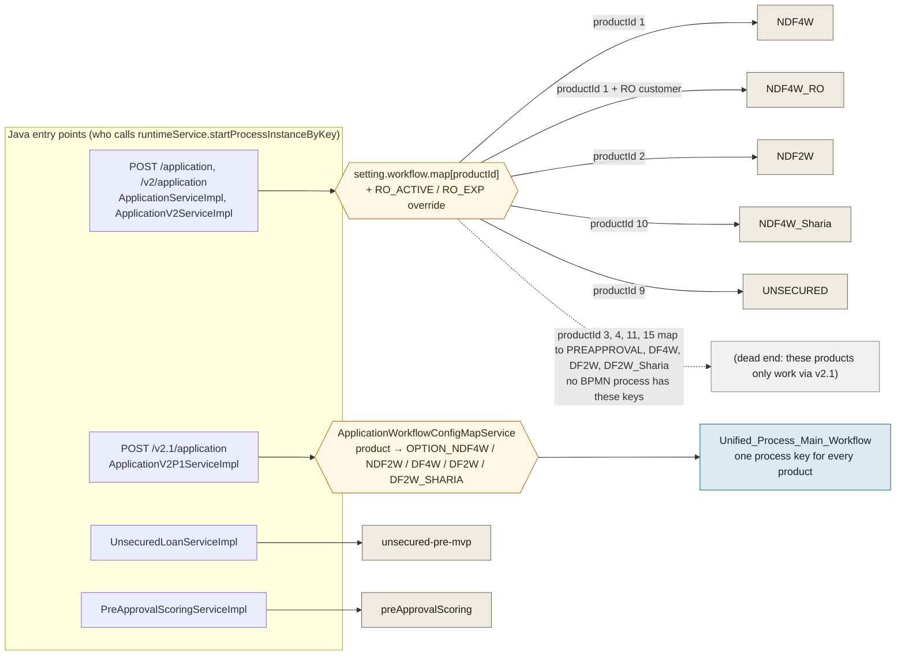
```mermaid
flowchart LR
  classDef legacy fill:#EFEAE2,stroke:#7A6E63,color:#1E1A16
  classDef unified fill:#DDEBF1,stroke:#1F6F8B,color:#12252D
  classDef other fill:#F1F1F1,stroke:#8A8A8A,color:#222
  classDef gate fill:#FFF7E6,stroke:#B8741A,color:#3A2A0E
  subgraph API["Java entry points (who calls runtimeService.startProcessInstanceByKey)"]
    v1["POST /application, /v2/application<br/>ApplicationServiceImpl, ApplicationV2ServiceImpl"]
    v21["POST /v2.1/application<br/>ApplicationV2P1ServiceImpl"]
    uns["UnsecuredLoanServiceImpl"]
    pre["PreApprovalScoringServiceImpl"]
  end
  map{{"setting.workflow.map[productId]<br/>+ RO_ACTIVE / RO_EXP override"}}:::gate
  sel{{"ApplicationWorkflowConfigMapService<br/>product → OPTION_NDF4W / NDF2W / DF4W / DF2W / DF2W_SHARIA"}}:::gate
  v1 --> map
  map -->|"productId 1"| NDF4W:::legacy
  map -->|"productId 1 + RO customer"| NDF4W_RO:::legacy
  map -->|"productId 2"| NDF2W:::legacy
  map -->|"productId 10"| NDF4W_Sharia:::legacy
  map -->|"productId 9"| UNSECURED:::legacy
  map -.->|"productId 3, 4, 11, 15 map to PREAPPROVAL, DF4W, DF2W, DF2W_Sharia<br/>no BPMN process has these keys"| none["(dead end: these products only work via v2.1)"]:::other
  v21 --> sel --> Main["Unified_Process_Main_Workflow<br/>one process key for every product"]:::unified
  uns --> pmvp["unsecured-pre-mvp"]:::legacy
  pre --> pas["preApprovalScoring"]:::legacy
```

## 2. Unified main workflow: the shared spine

The stage order is the same for every product. The only product-aware decisions are the bypass-scoring gateway (feature flag per OPTION_*), the DF2W-only "Underwriting Regular" branch inside `Unified_Process_Workflow_Underwriting`, and one PD-model branch (`applicationWorkflowSelectorType == "OPTION_NDF2W" || pdModelType == "NTB"`). Everything else varies by data, see section 7.


```mermaid
flowchart LR
  classDef orch fill:#DDEBF1,stroke:#1F6F8B,color:#12252D
  classDef sys fill:#E4E9F4,stroke:#4B5D8A,color:#1A2238
  classDef hum fill:#FBEDD4,stroke:#B8741A,color:#3A2A0E
  classDef gate fill:#FFF7E6,stroke:#B8741A,color:#3A2A0E
  classDef evt fill:#F6E3E3,stroke:#A94442,color:#3B1414
  S((start)) --> Check["Check"]:::orch
  Check --> G{"bypass scoring?<br/>feature flag × applicationWorkflowSelectorType"}:::gate
  G -->|no| IS["Initial Scoring"]:::orch
  G -->|"yes (DF4W / NDF4W / DF2W / DF2W_SHARIA flags)"| Upd
  IS --> Upd["Update Application"]:::sys
  Upd --> Cfg["Get Application Workflow Config (SUO)<br/>loads per-product activity switches"]:::sys
  Cfg --> Survey["Survey"]:::orch
  Survey --> UW["Underwriting"]:::orch
  Survey -->|"No Underwriting"| CIF
  UW --> CIF["Create CIF"]:::sys
  CIF --> A["status Approved"]:::sys --> Doc["Document Submission"]:::hum --> DP["status Document Picked"]:::sys --> Op["Create Operation Workflow<br/>(spawns Unified_Process_Operation_Workflow)"]:::sys --> E((end))
  Esc["Escalation Decision"]:::sys -->|"loops back to checkpoint"| Upd
  X["boundary events on every stage:<br/>Rejected · Cancelled by user · Cancelled by system · Salestrax · Escalation"]:::evt
```

## 3. Unified call tree: orchestration, system, human

Solid arrows are BPMN call activities (`calledElement`). Orchestrators (teal) hold no user tasks at all. Leaves are colored by what they contain: system-only (slate), human-only (amber), or mixed (dashed amber). `Unified_Process_KYC_Check` and `Process_Unified_Pefindo_Check` are reused from more than one parent. The operation workflow is not a call activity: the main workflow ends by having a Java delegate start it as an independent root instance, so approval and operations are decoupled at the engine level.


```mermaid
flowchart TB
  classDef orch fill:#DDEBF1,stroke:#1F6F8B,color:#12252D,stroke-width:2px
  classDef sys fill:#E4E9F4,stroke:#4B5D8A,color:#1A2238
  classDef hum fill:#FBEDD4,stroke:#B8741A,color:#3A2A0E
  classDef mix fill:#F3E8DE,stroke:#B8741A,stroke-dasharray:4 3,color:#3A2A0E
  Main["Unified_Process_Main_Workflow<br/>8 call activities · 0 user tasks"]:::orch
  Check["Workflow_Check<br/>8 CA · 0 UT · 0 ST"]:::orch
  IS["Workflow_Initial_Scoring<br/>5 CA · 0 UT · 0 ST"]:::orch
  Survey["Workflow_Survey<br/>5 CA · 0 UT · 1 ST"]:::orch
  UW["Workflow_Underwriting<br/>4 CA · 0 UT · 1 ST"]:::orch
  UWReg["Workflow_Underwriting_Regular<br/>1 CA"]:::orch
  Op["Unified_Process_Operation_Workflow<br/>5 CA · 0 UT"]:::orch
  Main --> Check
  Main --> IS
  Main --> UpdApp["Update_Application<br/>0 UT · 3 ST"]:::sys
  Main --> Survey
  Main --> UW
  Main --> CIF["Create_CIF<br/>0 UT · 1 ST"]:::sys
  Main --> DocSub["Document_Submission<br/>1 UT · 0 ST"]:::hum
  Main --> Esc["Escalation_Decision<br/>0 UT · 1 ST"]:::sys
  Main -. "service task createOperationWorkflowUnifiedActivity<br/>starts a separate root instance" .-> Op
  Check --> DupInt["Duplicate_Check_Internal<br/>0 UT · 1 ST"]:::sys
  Check --> MktId["Marketing_ID_Check<br/>1 UT · 2 ST"]:::mix
  Check --> GBLS["Get_Branch_Lead_And_Survey<br/>2 UT · 3 ST"]:::mix
  Check --> Pilot["Pilot_Branch_Check<br/>2 UT · 3 ST"]:::mix
  Check --> FUA["Follow_Up_Assignment<br/>1 UT · 1 ST"]:::mix
  Check --> Dedupe["Dedupe_Customer_Check<br/>0 UT · 1 ST"]:::sys
  Check --> AFE["Anti_Fraud_Engine<br/>0 UT · 1 ST"]:::sys
  Check --> KYC["KYC_Check<br/>0 UT · 4 ST"]:::sys
  IS --> PDP["Personal_Data_Prerequisite<br/>1 CA · 0 UT · 2 ST"]:::sys
  IS --> KYC
  IS --> RAC["RAC<br/>1 CA · 0 UT · 5 ST"]:::sys
  IS --> PDM["PD_Model<br/>0 UT · 4 ST"]:::sys
  PDP --> Pef["Pefindo_Check<br/>0 UT · 4 ST"]:::sys
  RAC --> Pef
  Survey --> SurvRes["Surveyor_Resolution<br/>0 UT · 3 ST"]:::sys
  Survey --> SurvAsg["Surveyor_Assignment<br/>3 UT · 3 ST"]:::mix
  Survey --> ScorAsg["Scoring_Assignment<br/>1 UT · 0 ST"]:::hum
  Survey --> NegAsg["Negotiation_Assignment<br/>1 UT · 0 ST"]:::hum
  Survey --> SurvRet["Survey_Returned<br/>2 UT · 2 ST"]:::mix
  UW --> CA["Underwriting_CA<br/>2 UT · 5 ST"]:::mix
  UW --> AE["Approval_Engine<br/>0 UT · 2 ST"]:::sys
  UW --> BM["Underwriting_BM<br/>2 UT · 4 ST"]:::mix
  UW -->|"only OPTION_DF2W / DF2W_SHARIA"| UWReg
  UWReg --> BM
  Op --> BDE["Branch_Data_Enrichment<br/>2 UT · 1 ST"]:::mix
  Op --> HODE["HO_Data_Enrichment<br/>1 UT · 0 ST"]:::hum
  Op --> HORGL["HO_Request_Go_Live<br/>1 UT · 2 ST"]:::mix
  Op --> GoLive["Go_Live<br/>0 UT · 3 ST"]:::sys
  Op --> PTO["Pending_Take_Over<br/>2 UT · 1 ST"]:::mix
  S2["Unified_Process_Scoring_2<br/>0 UT · 6 ST · started from Java, not a call activity"]:::sys
```

## 4. Legacy 4-wheel family

`NDF4W` is the monolith. The RO and Sharia variants are the only legacy processes that were decomposed: both reuse `Process_NDF4W_Scoring_1` (pure system scoring) and each has its own surveyor child that mixes user and service tasks. `NDF4W_RO` can also call the whole `NDF4W` process as a child when the RO shortcut does not apply. Operation is again started from Java, choosing `OPERATION` for conventional and `Sharia_NDF4W_Operation_Process` for Sharia.

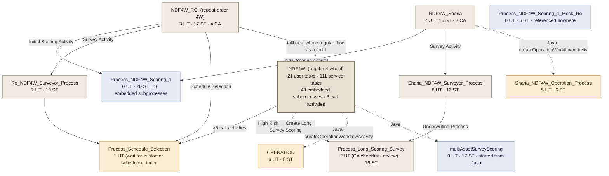
```mermaid
flowchart TB
  classDef mono fill:#E9DFD3,stroke:#7A6E63,stroke-width:3px,color:#1E1A16
  classDef legacy fill:#EFEAE2,stroke:#7A6E63,color:#1E1A16
  classDef hum fill:#FBEDD4,stroke:#B8741A,color:#3A2A0E
  classDef sys fill:#E4E9F4,stroke:#4B5D8A,color:#1A2238
  NDF4W["NDF4W  (regular 4-wheel)<br/>21 user tasks · 111 service tasks<br/>48 embedded subprocesses · 6 call activities"]:::mono
  RO["NDF4W_RO  (repeat-order 4W)<br/>3 UT · 17 ST · 4 CA"]:::legacy
  Sharia["NDF4W_Sharia<br/>2 UT · 16 ST · 2 CA"]:::legacy
  Sched["Process_Schedule_Selection<br/>1 UT (wait for customer schedule) · timer"]:::hum
  Long["Process_Long_Scoring_Survey<br/>2 UT (CA checklist / review) · 16 ST"]:::legacy
  S1["Process_NDF4W_Scoring_1<br/>0 UT · 20 ST · 10 embedded subprocesses"]:::sys
  RoSurv["Ro_NDF4W_Surveyor_Process<br/>2 UT · 10 ST"]:::legacy
  ShSurv["Sharia_NDF4W_Surveyor_Process<br/>8 UT · 16 ST"]:::legacy
  OPER["OPERATION<br/>6 UT · 8 ST"]:::hum
  ShOp["Sharia_NDF4W_Operation_Process<br/>5 UT · 6 ST"]:::hum
  MAS["multiAssetSurveyScoring<br/>0 UT · 17 ST · started from Java"]:::sys
  Mock["Process_NDF4W_Scoring_1_Mock_Ro<br/>0 UT · 6 ST · referenced nowhere"]:::sys
  NDF4W -->|"×5 call activities"| Sched
  NDF4W -->|"High Risk → Create Long Survey Scoring"| Long
  RO -->|"Initial Scoring Activity"| S1
  RO -->|"Survey Activity"| RoSurv
  RO -->|"Schedule Selection"| Sched
  RO -->|"fallback: whole regular flow as a child"| NDF4W
  RoSurv --> Sched
  Sharia -->|"Initial Scoring Activity"| S1
  Sharia -->|"Survey Activity"| ShSurv
  ShSurv -->|"Underwriting Process"| Long
  NDF4W -. "Java: createOperationWorkflowActivity" .-> OPER
  Sharia -. "Java: createOperationWorkflowActivity" .-> ShOp
  NDF4W -. Java .-> MAS
```

## 5. Legacy 2-wheel family

`NDF2W` is a second monolith, but it already leans on the unified generation: its underwriting is a call activity to `Unified_Process_Workflow_Underwriting_Regular`, and its Scoring 2 step is `Unified_Process_Scoring_2` started synchronously from Java. This is the migration seam between the two generations.

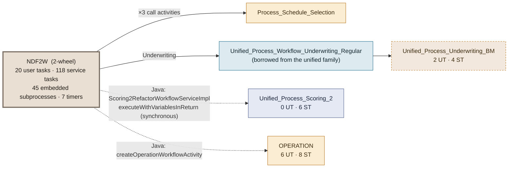
```mermaid
flowchart LR
  classDef mono fill:#E9DFD3,stroke:#7A6E63,stroke-width:3px,color:#1E1A16
  classDef hum fill:#FBEDD4,stroke:#B8741A,color:#3A2A0E
  classDef orch fill:#DDEBF1,stroke:#1F6F8B,color:#12252D
  classDef sys fill:#E4E9F4,stroke:#4B5D8A,color:#1A2238
  classDef mix fill:#F3E8DE,stroke:#B8741A,stroke-dasharray:4 3,color:#3A2A0E
  NDF2W["NDF2W  (2-wheel)<br/>20 user tasks · 118 service tasks<br/>45 embedded subprocesses · 7 timers"]:::mono
  Sched["Process_Schedule_Selection"]:::hum
  UWReg["Unified_Process_Workflow_Underwriting_Regular<br/>(borrowed from the unified family)"]:::orch
  BM["Unified_Process_Underwriting_BM<br/>2 UT · 4 ST"]:::mix
  S2["Unified_Process_Scoring_2<br/>0 UT · 6 ST"]:::sys
  OPER["OPERATION<br/>6 UT · 8 ST"]:::hum
  NDF2W -->|"×3 call activities"| Sched
  NDF2W -->|"Underwriting"| UWReg --> BM
  NDF2W -. "Java: Scoring2RefactorWorkflowServiceImpl<br/>executeWithVariablesInReturn (synchronous)" .-> S2
  NDF2W -. "Java: createOperationWorkflowActivity" .-> OPER
```

## 6. Stand-alone product silos

Unsecured, unsecured pre-MVP and pre-approval scoring are isolated roots with no call activities in or out. `unsecured-pre-mvp` is the only production process that uses DMN decision tables.

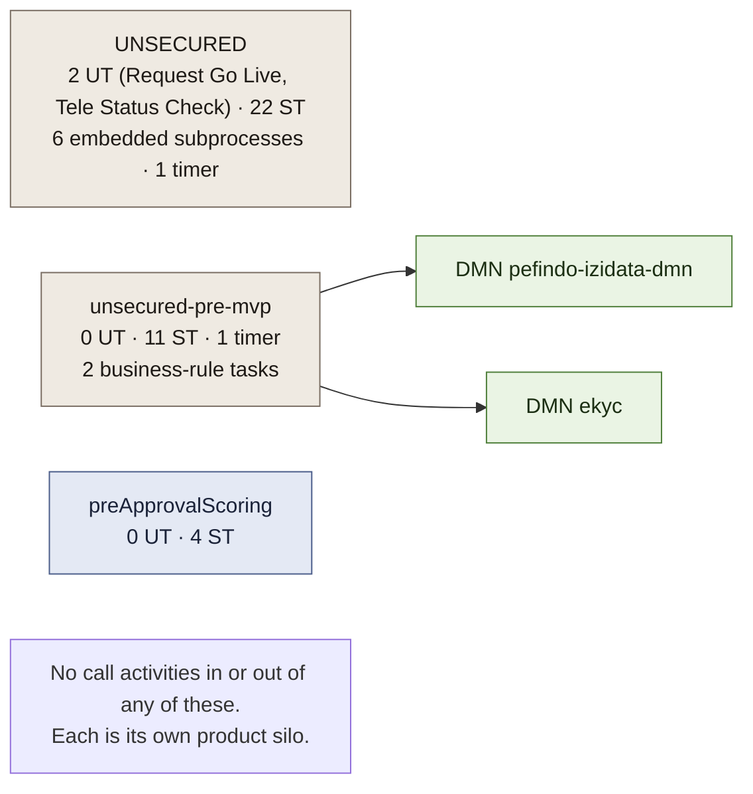
```mermaid
flowchart LR
  classDef legacy fill:#EFEAE2,stroke:#7A6E63,color:#1E1A16
  classDef sys fill:#E4E9F4,stroke:#4B5D8A,color:#1A2238
  classDef dmn fill:#EAF4E4,stroke:#4F7F3A,color:#1B2E12
  U["UNSECURED<br/>2 UT (Request Go Live, Tele Status Check) · 22 ST<br/>6 embedded subprocesses · 1 timer"]:::legacy
  P["unsecured-pre-mvp<br/>0 UT · 11 ST · 1 timer<br/>2 business-rule tasks"]:::legacy
  P --> dmn1["DMN pefindo-izidata-dmn"]:::dmn
  P --> dmn2["DMN ekyc"]:::dmn
  PA["preApprovalScoring<br/>0 UT · 4 ST"]:::sys
  note["No call activities in or out of any of these.<br/>Each is its own product silo."]
```

## 7. How one unified BPMN serves five products

Rather than product-specific diagrams, the unified generation drives variation from data. Every unified service task extends `BaseActivity`, whose `execute` first asks whether the activity class name is listed and active for this application in the `CI` (Check, Initial scoring) or `SUO` (Survey, Underwriting, Operation) config map; if not, the task is a no-op. Migrations such as `V2_0_202607240900__insert-workflow-scoring2-survey-rac-df2w.sql` add or remove steps for one product without touching any BPMN file. Consequence: reading the BPMN alone does not tell you what a DF2W application actually executes.

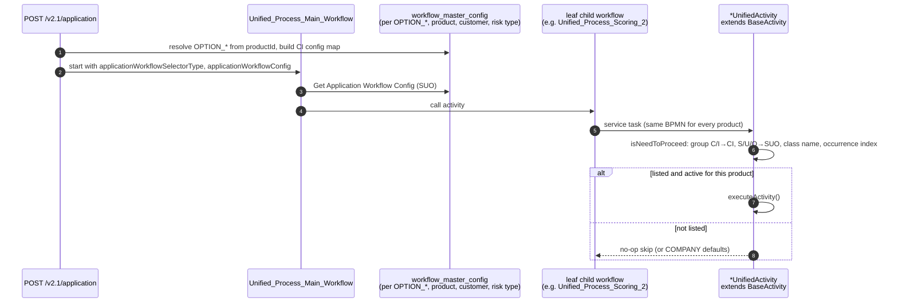
```mermaid
sequenceDiagram
  autonumber
  participant API as POST /v2.1/application
  participant M as Unified_Process_Main_Workflow
  participant DB as workflow_master_config<br/>(per OPTION_*, product, customer, risk type)
  participant L as leaf child workflow<br/>(e.g. Unified_Process_Scoring_2)
  participant A as *UnifiedActivity<br/>extends BaseActivity
  API->>DB: resolve OPTION_* from productId, build CI config map
  API->>M: start with applicationWorkflowSelectorType, applicationWorkflowConfig
  M->>DB: Get Application Workflow Config (SUO)
  M->>L: call activity
  L->>A: service task (same BPMN for every product)
  A->>A: isNeedToProceed: group C/I→CI, S/U/O→SUO, class name, occurrence index
  alt listed and active for this product
    A->>A: executeActivity()
  else not listed
    A-->>L: no-op skip (or COMPANY defaults)
  end
```

## 8. Verdict on the two questions

**Does it separate domain and human tasks into child workflows?**

| Generation | Separation | Evidence |
|---|---|---|
| Unified (33 processes) | Partial. Orchestrators are task-free; leaves are split per business step, and most leaves happen to be single-natured. | 7 orchestrators with 0 user tasks. Leaves: 15 system-only, 4 human-only (`Document_Submission`, `Scoring_Assignment`, `Negotiation_Assignment`, `Operation_Head_Office_Data_Enrichment`), 11 mixed (`Underwriting_CA` 2 UT / 5 ST, `Surveyor_Assignment` 3 / 3, `Pilot_Branch_Check` 2 / 3, ...). |
| Legacy 4W / 2W monoliths | No. | `NDF4W`: 21 UT and 111 ST in one process with 48 embedded subprocesses. `NDF2W`: 20 UT and 118 ST, 45 subprocesses. Child calls only for Schedule Selection, Long Survey Scoring, and the borrowed unified Underwriting Regular. |
| Legacy RO / Sharia variants | Partly. Scoring is a pure-system child; survey is a mixed child. | `Process_NDF4W_Scoring_1` 0 UT / 20 ST; `Sharia_NDF4W_Surveyor_Process` 8 UT / 16 ST. |

**Does it separate by product?**

| Generation | Separation | Mechanism |
|---|---|---|
| Legacy | Yes, one root process key per product. | Java: `setting.workflow.map[productId]` plus `NDF4W_RO` override on customer type; Sharia gets its own surveyor and operation processes. |
| Unified | No, one BPMN graph for NDF4W, DF4W, NDF2W, DF2W, DF2W Sharia. | DB config (`workflow_selector_type` OPTION_*, `workflow_master_config_detail.is_active`) consulted by `BaseActivity.isNeedToProceed`; 3 gateway conditions on `applicationWorkflowSelectorType`; feature flags such as `featDF2W`, `featBypassScoringProcessDF`. |

Two loose ends worth knowing: `Process_NDF4W_Scoring_1_Mock_Ro` is deployed but referenced by no call activity or Java constant, and the `setting.workflow.map` entries for DF4W, DF2W, DF2W_Sharia and PREAPPROVAL point at process keys that do not exist.

## 9. Full inventory

Counts parsed from the BPMN XML. Role: root means started from Java via `startProcessInstanceByKey`; child means targeted by a `calledElement`.

| Family | Process key | File | Role | Nature | Call act. | User tasks | Service tasks | Embedded subproc. | Timers | DMN |
|---|---|---|---|---|---|---|---|---|---|---|
| Unified | `Process_Unified_Escalation_Decision` | unified-escalation-decision.bpmn | child (call activity) | system only | 0 | 0 | 1 | 0 | 0 | 0 |
| Unified | `Process_Unified_Pefindo_Check` | unified-pefindo-check.bpmn | child (call activity) | system only | 0 | 0 | 4 | 0 | 0 | 0 |
| Unified | `Process_Unified_Personal_Data_Prerequisite` | unified-personal-data-prerequisite.bpmn | child (call activity) | system only | 1 | 0 | 2 | 0 | 0 | 0 |
| Unified | `Process_Unified_Update_Application` | unified-update-application.bpmn | child (call activity) | system only | 0 | 0 | 3 | 0 | 0 | 0 |
| Unified | `Unified_Process_Anti_Fraud_Engine` | unified-anti-fraud-engine.bpmn | child (call activity) | system only | 0 | 0 | 1 | 0 | 0 | 0 |
| Unified | `Unified_Process_Approval_Engine` | unified-underwriting-approval-engine.bpmn | child (call activity) | system only | 0 | 0 | 2 | 2 | 0 | 0 |
| Unified | `Unified_Process_Create_CIF` | unified-create-cif.bpmn | child (call activity) | system only | 0 | 0 | 1 | 0 | 0 | 0 |
| Unified | `Unified_Process_Dedupe_Customer_Check` | unified-dedupe-customer-check.bpmn | child (call activity) | system only | 0 | 0 | 1 | 0 | 0 | 0 |
| Unified | `Unified_Process_Document_Submission` | unified-document-submission.bpmn | child (call activity) | human only | 0 | 1 | 0 | 0 | 0 | 0 |
| Unified | `Unified_Process_Duplicate_Check_Internal` | unified-duplicate-check-internal.bpmn | child (call activity) | system only | 0 | 0 | 1 | 0 | 0 | 0 |
| Unified | `Unified_Process_Follow_Up_Assignment` | unified-follow-up-assignment.bpmn | child (call activity) | mixed | 0 | 1 | 1 | 0 | 0 | 0 |
| Unified | `Unified_Process_Get_Branch_Lead_And_Survey` | unified-get-branch-lead-and-survey.bpmn | child (call activity) | mixed | 0 | 2 | 3 | 0 | 0 | 0 |
| Unified | `Unified_Process_KYC_Check` | unified-kyc-check.bpmn | child (call activity) | system only | 0 | 0 | 4 | 0 | 0 | 0 |
| Unified | `Unified_Process_Main_Workflow` | unified-main-workflow.bpmn | root (Java) | orchestration | 8 | 0 | 9 | 0 | 0 | 0 |
| Unified | `Unified_Process_Marketing_ID_Check` | unified-marketing-id-check.bpmn | child (call activity) | mixed | 0 | 1 | 2 | 0 | 0 | 0 |
| Unified | `Unified_Process_Negotiation_Assignment` | unified-negotiation-assignment.bpmn | child (call activity) | human only | 0 | 1 | 0 | 0 | 0 | 0 |
| Unified | `Unified_Process_Operation_Workflow` | unified-operation-workflow.bpmn | root (Java) | orchestration | 5 | 0 | 2 | 0 | 0 | 0 |
| Unified | `Unified_Process_PD_Model` | unified-pd-model.bpmn | child (call activity) | system only | 0 | 0 | 4 | 0 | 0 | 0 |
| Unified | `Unified_Process_Pilot_Branch_Check` | unified-pilot-branch-check.bpmn | child (call activity) | mixed | 0 | 2 | 3 | 0 | 0 | 0 |
| Unified | `Unified_Process_RAC` | unified-rac.bpmn | child (call activity) | system only | 1 | 0 | 5 | 0 | 0 | 0 |
| Unified | `Unified_Process_Scoring_2` | unified-scoring-2.bpmn | root (Java) | system only | 0 | 0 | 6 | 0 | 0 | 0 |
| Unified | `Unified_Process_Scoring_Assignment` | unified-scoring-assignment.bpmn | child (call activity) | human only | 0 | 1 | 0 | 0 | 0 | 0 |
| Unified | `Unified_Process_Survey_Returned` | unified-survey-returned.bpmn | child (call activity) | mixed | 0 | 2 | 2 | 0 | 0 | 0 |
| Unified | `Unified_Process_Surveyor_Assignment` | unified-surveyor-assignment.bpmn | child (call activity) | mixed | 0 | 3 | 3 | 0 | 0 | 0 |
| Unified | `Unified_Process_Surveyor_Resolution` | unified-surveyor-resolution.bpmn | child (call activity) | system only | 0 | 0 | 3 | 0 | 0 | 0 |
| Unified | `Unified_Process_Underwriting_BM` | unified-underwriting-bm.bpmn | child (call activity) | mixed | 0 | 2 | 4 | 2 | 0 | 0 |
| Unified | `Unified_Process_Underwriting_CA` | unified-underwriting-ca.bpmn | child (call activity) | mixed | 0 | 2 | 5 | 3 | 0 | 0 |
| Unified | `Unified_Process_Workflow_Branch_Data_Enrichment` | unified-branch-data-enrichment-workflow.bpmn | child (call activity) | mixed | 0 | 2 | 1 | 0 | 0 | 0 |
| Unified | `Unified_Process_Workflow_Check` | unified-workflow-check.bpmn | child (call activity) | orchestration | 8 | 0 | 0 | 0 | 0 | 0 |
| Unified | `Unified_Process_Workflow_Go_Live` | unified-go-live.bpmn | child (call activity) | system only | 0 | 0 | 3 | 0 | 0 | 0 |
| Unified | `Unified_Process_Workflow_Initial_Scoring` | unified-workflow-initial-scoring.bpmn | child (call activity) | orchestration | 5 | 0 | 0 | 0 | 0 | 0 |
| Unified | `Unified_Process_Workflow_Operation_Head_Office_Data_Enrichment` | unified-operation-head-office-data-enrichment.bpmn | child (call activity) | human only | 0 | 1 | 0 | 0 | 0 | 0 |
| Unified | `Unified_Process_Workflow_Operation_Head_Office_Request_Go_Live` | unified-operation-head-office-request-go-live.bpmn | child (call activity) | mixed | 0 | 1 | 2 | 0 | 0 | 0 |
| Unified | `Unified_Process_Workflow_Pending_Take_Over` | unified-pending-take-over.bpmn | child (call activity) | mixed | 0 | 2 | 1 | 0 | 0 | 0 |
| Unified | `Unified_Process_Workflow_Survey` | unified-workflow-survey.bpmn | child (call activity) | orchestration | 5 | 0 | 1 | 0 | 0 | 0 |
| Unified | `Unified_Process_Workflow_Underwriting` | unified-workflow-underwriting.bpmn | child (call activity) | orchestration | 4 | 0 | 1 | 0 | 0 | 0 |
| Unified | `Unified_Process_Workflow_Underwriting_Regular` | unified-workflow-underwriting-regular.bpmn | child (call activity) | orchestration | 1 | 0 | 1 | 0 | 0 | 0 |
| Legacy 4W | `NDF4W` | ndf4w.bpmn | root (Java) + child (call activity) | monolith (mixed) | 6 | 21 | 111 | 48 | 2 | 0 |
| Legacy 4W | `NDF4W_RO` | ndf4w-ro.bpmn | root (Java) | mixed | 4 | 3 | 17 | 2 | 0 | 0 |
| Legacy 4W | `NDF4W_Sharia` | ndf4w-sharia.bpmn | root (Java) | mixed | 2 | 2 | 16 | 2 | 0 | 0 |
| Legacy 4W | `OPERATION` | operation.bpmn | root (Java) | mixed | 0 | 6 | 8 | 4 | 0 | 0 |
| Legacy 4W | `Process_Long_Scoring_Survey` | long-survey-scoring.bpmn | root (Java) + child (call activity) | mixed | 0 | 2 | 16 | 4 | 0 | 0 |
| Legacy 4W | `Process_NDF4W_Scoring_1` | ndf4w-scoring-1.bpmn | child (call activity) | system only | 0 | 0 | 20 | 10 | 0 | 0 |
| Legacy 4W | `Process_NDF4W_Scoring_1_Mock_Ro` | ndf4w-scoring-1-mock-ro.bpmn | unreferenced | system only | 0 | 0 | 6 | 1 | 0 | 0 |
| Legacy 4W | `Ro_NDF4W_Surveyor_Process` | ndf4w-ro-surveyor.bpmn | child (call activity) | mixed | 1 | 2 | 10 | 4 | 0 | 0 |
| Legacy 4W | `Sharia_NDF4W_Operation_Process` | ndf4w-sharia-operation.bpmn | root (Java) | mixed | 0 | 5 | 6 | 2 | 0 | 0 |
| Legacy 4W | `Sharia_NDF4W_Surveyor_Process` | ndf4w-sharia-surveyor.bpmn | child (call activity) | mixed | 1 | 8 | 16 | 7 | 0 | 0 |
| Legacy 4W | `multiAssetSurveyScoring` | multiasset-survey-scoring.bpmn | root (Java) | system only | 0 | 0 | 17 | 8 | 0 | 0 |
| Legacy 2W | `NDF2W` | ndf2w.bpmn | root (Java) | monolith (mixed) | 4 | 20 | 118 | 45 | 7 | 0 |
| Legacy shared | `Process_Schedule_Selection` | schedule-selection.bpmn | child (call activity) | mixed | 0 | 1 | 3 | 0 | 1 | 0 |
| Unsecured | `UNSECURED` | unsecured.bpmn | root (Java) | mixed | 0 | 2 | 22 | 6 | 1 | 0 |
| Unsecured | `unsecured-pre-mvp` | unsecured-pre-mvp-full-flow.bpmn | root (Java) | system only | 0 | 0 | 11 | 1 | 1 | 2 |
| Pre-approval | `preApprovalScoring` | pre-approval-scoring.bpmn | root (Java) | system only | 0 | 0 | 4 | 3 | 0 | 0 |

## 10. Every process, drawn

Top-level flow of each process as deployed. Embedded subprocesses are collapsed into one box (▣) with their task count; boundary events are dashed arrows from the activity they are attached to; call activities (⇢) show the `calledElement` key. Amber stadium = user task, slate box = service or rule task, red = error/escalation end.

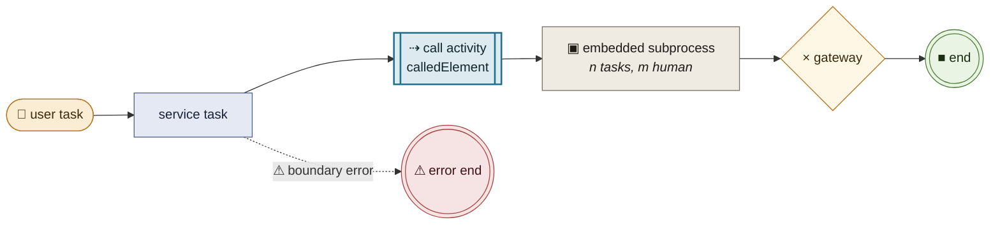
```mermaid
flowchart LR
  a(["👤 user task"]):::hum --> b["service task"]:::sys --> c[["⇢ call activity<br/>calledElement"]]:::ca --> d["▣ embedded subprocess<br/><i>n tasks, m human</i>"]:::sub --> e{"× gateway"}:::gw --> f((("■ end"))):::ok
  b -. "⚠ boundary error" .-> g((("⚠ error end"))):::ev
  classDef hum fill:#FBEDD4,stroke:#B8741A,color:#3A2A0E
  classDef sys fill:#E4E9F4,stroke:#4B5D8A,color:#1A2238
  classDef ca fill:#DDEBF1,stroke:#1F6F8B,color:#12252D,stroke-width:2px
  classDef sub fill:#EFEAE2,stroke:#7A6E63,color:#1E1A16
  classDef gw fill:#FFF7E6,stroke:#B8741A,color:#3A2A0E
  classDef ev fill:#F6E3E3,stroke:#A94442,color:#3B1414
  classDef ok fill:#EAF4E4,stroke:#4F7F3A,color:#1B2E12
```

### Unified: orchestration

#### `Unified_Process_Main_Workflow`

`unified-main-workflow.bpmn` · top level: 0 user tasks, 9 service/rule tasks, 8 call activities, 0 embedded subprocesses

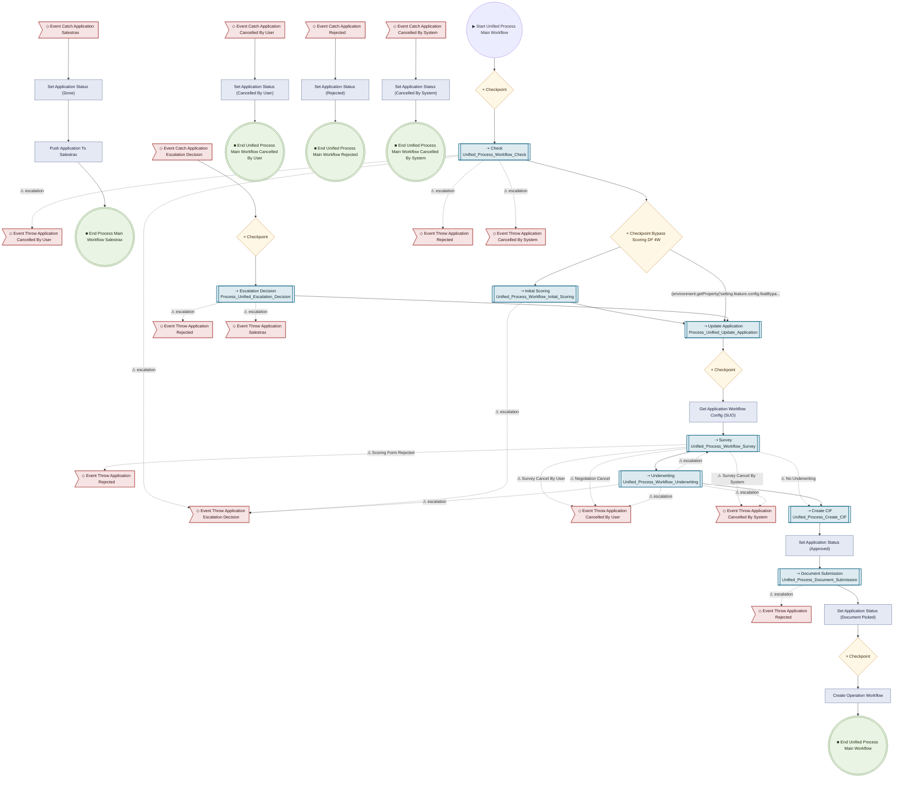
```mermaid
flowchart TD
  classDef hum fill:#FBEDD4,stroke:#B8741A,color:#3A2A0E
  classDef sys fill:#E4E9F4,stroke:#4B5D8A,color:#1A2238
  classDef ca fill:#DDEBF1,stroke:#1F6F8B,color:#12252D,stroke-width:2px
  classDef sub fill:#EFEAE2,stroke:#7A6E63,color:#1E1A16
  classDef gw fill:#FFF7E6,stroke:#B8741A,color:#3A2A0E
  classDef ev fill:#F6E3E3,stroke:#A94442,color:#3B1414
  classDef ok fill:#EAF4E4,stroke:#4F7F3A,color:#1B2E12
  n0(("▶ Start Unified Process Main Workflow"))
  n1((("■ End Unified Process Main Workflow"))):::ok
  n2[["⇢ Check<br/>Unified_Process_Workflow_Check"]]:::ca
  n3{"× Checkpoint"}:::gw
  n4>"◇ Event Catch Application Salestrax"]:::ev
  n5>"◇ Event Throw Application Cancelled By User"]:::ev
  n6["Set Application Status (Done)"]:::sys
  n7["Push Application To Salestrax"]:::sys
  n8((("■ End Process Main Workflow Salestrax"))):::ok
  n9((("■ End Unified Process Main Workflow Cancelled By User"))):::ok
  n10["Set Application Status (Cancelled By User)"]:::sys
  n11>"◇ Event Catch Application Cancelled By User"]:::ev
  n12>"◇ Event Catch Application Rejected"]:::ev
  n13["Set Application Status (Rejected)"]:::sys
  n14((("■ End Unified Process Main Workflow Rejected"))):::ok
  n15>"◇ Event Throw Application Escalation Decision"]:::ev
  n16[["⇢ Initial Scoring<br/>Unified_Process_Workflow_Initial_Scoring"]]:::ca
  n17[["⇢ Survey<br/>Unified_Process_Workflow_Survey"]]:::ca
  n18["Get Application Workflow Config (SUO)"]:::sys
  n19{"× Checkpoint"}:::gw
  n20>"◇ Event Throw Application Cancelled By User"]:::ev
  n21>"◇ Event Catch Application Cancelled By System"]:::ev
  n22["Set Application Status (Cancelled By System)"]:::sys
  n23((("■ End Unified Process Main Workflow Cancelled By System"))):::ok
  n24>"◇ Event Throw Application Cancelled By System"]:::ev
  n25>"◇ Event Throw Application Rejected"]:::ev
  n26[["⇢ Update Application<br/>Process_Unified_Update_Application"]]:::ca
  n27{"× Checkpoint Bypass Scoring DF 4W"}:::gw
  n28[["⇢ Create CIF<br/>Unified_Process_Create_CIF"]]:::ca
  n29[["⇢ Document Submission<br/>Unified_Process_Document_Submission"]]:::ca
  n30>"◇ Event Throw Application Rejected"]:::ev
  n31[["⇢ Underwriting<br/>Unified_Process_Workflow_Underwriting"]]:::ca
  n32["Create Operation Workflow"]:::sys
  n33{"× Checkpoint"}:::gw
  n34[["⇢ Escalation Decision<br/>Process_Unified_Escalation_Decision"]]:::ca
  n35>"◇ Event Throw Application Rejected"]:::ev
  n36>"◇ Event Throw Application Salestrax"]:::ev
  n37>"◇ Event Catch Application Escalation Decision"]:::ev
  n38{"× Checkpoint"}:::gw
  n39["Set Application Status (Approved)"]:::sys
  n40["Set Application Status (Document Picked)"]:::sys
  n41>"◇ Event Throw Application Rejected"]:::ev
  n42>"◇ Event Throw Application Cancelled By System"]:::ev
  n2 -. "⚠ escalation" .-> n5
  n2 -. "⚠ escalation" .-> n15
  n16 -. "⚠ escalation" .-> n15
  n17 -. "⚠ Survey Cancel By User" .-> n20
  n17 -. "⚠ Survey Cancel By System" .-> n24
  n17 -. "⚠ Scoring Form Rejected" .-> n25
  n17 -. "⚠ Negotiation Cancel" .-> n20
  n29 -. "⚠ escalation" .-> n30
  n31 -. "⚠ escalation" .-> n17
  n31 -. "⚠ escalation" .-> n24
  n31 -. "⚠ escalation" .-> n20
  n34 -. "⚠ escalation" .-> n35
  n34 -. "⚠ escalation" .-> n36
  n31 -. "⚠ escalation" .-> n15
  n2 -. "⚠ escalation" .-> n41
  n2 -. "⚠ escalation" .-> n42
  n17 -. "⚠ No Underwriting" .-> n28
  n0 --> n3
  n3 --> n2
  n4 --> n6
  n6 --> n7
  n7 --> n8
  n11 --> n10
  n10 --> n9
  n12 --> n13
  n13 --> n14
  n17 --> n31
  n18 --> n17
  n19 --> n18
  n21 --> n22
  n22 --> n23
  n16 --> n26
  n26 --> n19
  n2 --> n27
  n27 --> n16
  n27 -->|"(environment.getProperty('setting.feature.config.featBypa..."| n26
  n28 --> n39
  n29 --> n40
  n31 --> n28
  n32 --> n1
  n33 --> n32
  n34 --> n26
  n37 --> n38
  n38 --> n34
  n39 --> n29
  n40 --> n33
```

#### `Unified_Process_Workflow_Check`

`unified-workflow-check.bpmn` · top level: 0 user tasks, 0 service/rule tasks, 8 call activities, 0 embedded subprocesses

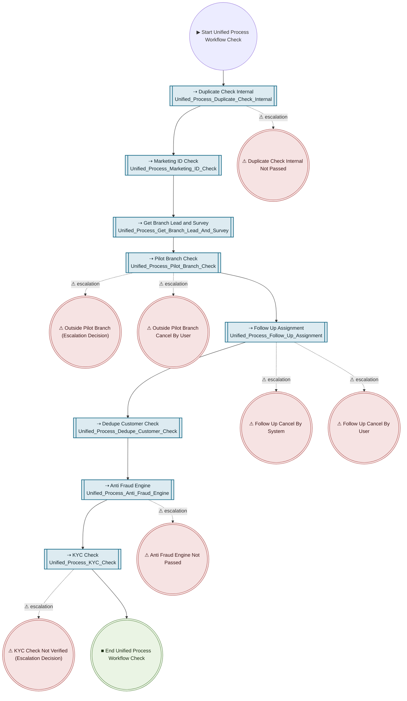
```mermaid
flowchart TD
  classDef hum fill:#FBEDD4,stroke:#B8741A,color:#3A2A0E
  classDef sys fill:#E4E9F4,stroke:#4B5D8A,color:#1A2238
  classDef ca fill:#DDEBF1,stroke:#1F6F8B,color:#12252D,stroke-width:2px
  classDef sub fill:#EFEAE2,stroke:#7A6E63,color:#1E1A16
  classDef gw fill:#FFF7E6,stroke:#B8741A,color:#3A2A0E
  classDef ev fill:#F6E3E3,stroke:#A94442,color:#3B1414
  classDef ok fill:#EAF4E4,stroke:#4F7F3A,color:#1B2E12
  n0(("▶ Start Unified Process Workflow Check"))
  n1[["⇢ Duplicate Check Internal<br/>Unified_Process_Duplicate_Check_Internal"]]:::ca
  n2((("■ End Unified Process Workflow Check"))):::ok
  n3[["⇢ Marketing ID Check<br/>Unified_Process_Marketing_ID_Check"]]:::ca
  n4[["⇢ Get Branch Lead and Survey<br/>Unified_Process_Get_Branch_Lead_And_Survey"]]:::ca
  n5[["⇢ Pilot Branch Check<br/>Unified_Process_Pilot_Branch_Check"]]:::ca
  n6[["⇢ Dedupe Customer Check<br/>Unified_Process_Dedupe_Customer_Check"]]:::ca
  n7[["⇢ KYC Check<br/>Unified_Process_KYC_Check"]]:::ca
  n8[["⇢ Anti Fraud Engine<br/>Unified_Process_Anti_Fraud_Engine"]]:::ca
  n9((("⚠ Anti Fraud Engine Not Passed"))):::ev
  n10((("⚠ Duplicate Check Internal Not Passed"))):::ev
  n11((("⚠ Outside Pilot Branch (Escalation Decision)"))):::ev
  n12((("⚠ Outside Pilot Branch Cancel By User"))):::ev
  n13((("⚠ KYC Check Not Verified (Escalation Decision)"))):::ev
  n14[["⇢ Follow Up Assignment<br/>Unified_Process_Follow_Up_Assignment"]]:::ca
  n15((("⚠ Follow Up Cancel By System"))):::ev
  n16((("⚠ Follow Up Cancel By User"))):::ev
  n1 -. "⚠ escalation" .-> n10
  n8 -. "⚠ escalation" .-> n9
  n5 -. "⚠ escalation" .-> n11
  n5 -. "⚠ escalation" .-> n12
  n7 -. "⚠ escalation" .-> n13
  n14 -. "⚠ escalation" .-> n15
  n14 -. "⚠ escalation" .-> n16
  n0 --> n1
  n1 --> n3
  n3 --> n4
  n4 --> n5
  n5 --> n14
  n6 --> n8
  n8 --> n7
  n7 --> n2
  n14 --> n6
```

#### `Unified_Process_Workflow_Initial_Scoring`

`unified-workflow-initial-scoring.bpmn` · top level: 0 user tasks, 0 service/rule tasks, 5 call activities, 0 embedded subprocesses

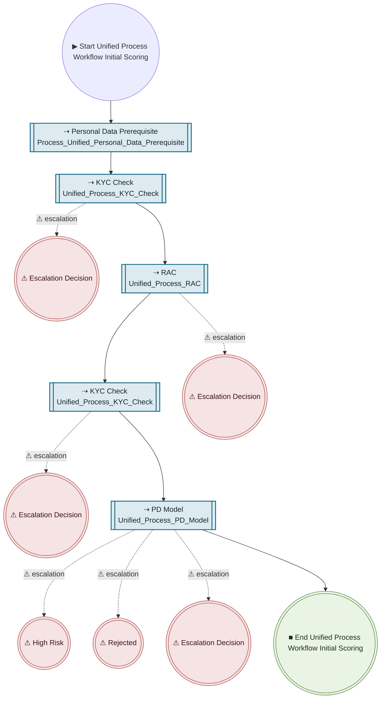
```mermaid
flowchart TD
  classDef hum fill:#FBEDD4,stroke:#B8741A,color:#3A2A0E
  classDef sys fill:#E4E9F4,stroke:#4B5D8A,color:#1A2238
  classDef ca fill:#DDEBF1,stroke:#1F6F8B,color:#12252D,stroke-width:2px
  classDef sub fill:#EFEAE2,stroke:#7A6E63,color:#1E1A16
  classDef gw fill:#FFF7E6,stroke:#B8741A,color:#3A2A0E
  classDef ev fill:#F6E3E3,stroke:#A94442,color:#3B1414
  classDef ok fill:#EAF4E4,stroke:#4F7F3A,color:#1B2E12
  n0(("▶ Start Unified Process Workflow Initial Scoring"))
  n1[["⇢ Personal Data Prerequisite<br/>Process_Unified_Personal_Data_Prerequisite"]]:::ca
  n2[["⇢ KYC Check<br/>Unified_Process_KYC_Check"]]:::ca
  n3[["⇢ KYC Check<br/>Unified_Process_KYC_Check"]]:::ca
  n4((("■ End Unified Process Workflow Initial Scoring"))):::ok
  n5((("⚠ Escalation Decision"))):::ev
  n6((("⚠ Escalation Decision"))):::ev
  n7[["⇢ RAC<br/>Unified_Process_RAC"]]:::ca
  n8((("⚠ Escalation Decision"))):::ev
  n9[["⇢ PD Model<br/>Unified_Process_PD_Model"]]:::ca
  n10((("⚠ High Risk"))):::ev
  n11((("⚠ Rejected"))):::ev
  n12((("⚠ Escalation Decision"))):::ev
  n2 -. "⚠ escalation" .-> n5
  n3 -. "⚠ escalation" .-> n6
  n7 -. "⚠ escalation" .-> n8
  n9 -. "⚠ escalation" .-> n10
  n9 -. "⚠ escalation" .-> n11
  n9 -. "⚠ escalation" .-> n12
  n0 --> n1
  n1 --> n2
  n2 --> n7
  n7 --> n3
  n3 --> n9
  n9 --> n4
```

#### `Unified_Process_Workflow_Survey`

`unified-workflow-survey.bpmn` · top level: 0 user tasks, 1 service/rule tasks, 5 call activities, 0 embedded subprocesses

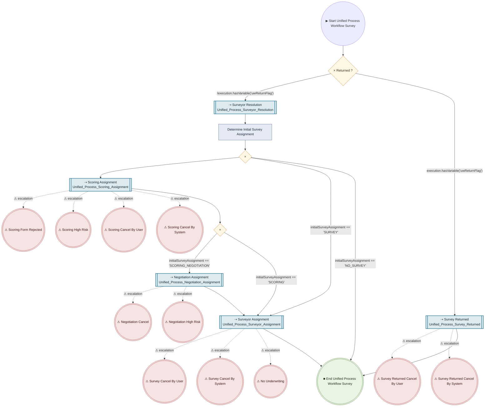
```mermaid
flowchart TD
  classDef hum fill:#FBEDD4,stroke:#B8741A,color:#3A2A0E
  classDef sys fill:#E4E9F4,stroke:#4B5D8A,color:#1A2238
  classDef ca fill:#DDEBF1,stroke:#1F6F8B,color:#12252D,stroke-width:2px
  classDef sub fill:#EFEAE2,stroke:#7A6E63,color:#1E1A16
  classDef gw fill:#FFF7E6,stroke:#B8741A,color:#3A2A0E
  classDef ev fill:#F6E3E3,stroke:#A94442,color:#3B1414
  classDef ok fill:#EAF4E4,stroke:#4F7F3A,color:#1B2E12
  n0(("▶ Start Unified Process Workflow Survey"))
  n1[["⇢ Surveyor Resolution<br/>Unified_Process_Surveyor_Resolution"]]:::ca
  n2[["⇢ Surveyor Assignment<br/>Unified_Process_Surveyor_Assignment"]]:::ca
  n3((("■ End Unified Process Workflow Survey"))):::ok
  n4((("⚠ Scoring Form Rejected"))):::ev
  n5((("⚠ Scoring High Risk"))):::ev
  n6((("⚠ Negotiation Cancel"))):::ev
  n7((("⚠ Survey Cancel By User"))):::ev
  n8((("⚠ Survey Cancel By System"))):::ev
  n9["Determine Initial Survey Assignment"]:::sys
  n10[["⇢ Scoring Assignment<br/>Unified_Process_Scoring_Assignment"]]:::ca
  n11[["⇢ Negotiation Assignment<br/>Unified_Process_Negotiation_Assignment"]]:::ca
  n12{"× "}:::gw
  n13{"× "}:::gw
  n14((("⚠ Negotiation High Risk"))):::ev
  n15{"× Returned ?"}:::gw
  n16[["⇢ Survey Returned<br/>Unified_Process_Survey_Returned"]]:::ca
  n17((("⚠ Survey Returned Cancel By User"))):::ev
  n18((("⚠ Survey Returned Cancel By System"))):::ev
  n19((("⚠ No Underwriting"))):::ev
  n20((("⚠ Scoring Cancel By User"))):::ev
  n21((("⚠ Scoring Cancel By System"))):::ev
  n10 -. "⚠ escalation" .-> n4
  n10 -. "⚠ escalation" .-> n5
  n11 -. "⚠ escalation" .-> n6
  n2 -. "⚠ escalation" .-> n7
  n2 -. "⚠ escalation" .-> n8
  n11 -. "⚠ escalation" .-> n14
  n16 -. "⚠ escalation" .-> n17
  n16 -. "⚠ escalation" .-> n18
  n2 -. "⚠ escalation" .-> n19
  n10 -. "⚠ escalation" .-> n20
  n10 -. "⚠ escalation" .-> n21
  n0 --> n15
  n1 --> n9
  n2 --> n3
  n9 --> n12
  n12 --> n10
  n10 --> n13
  n11 --> n2
  n12 -->|"initialSurveyAssignment == 'SURVEY'"| n2
  n13 -->|"initialSurveyAssignment == 'SCORING_NEGOTIATION'"| n11
  n13 -->|"initialSurveyAssignment == 'SCORING'"| n2
  n12 -->|"initialSurveyAssignment == 'NO_SURVEY'"| n3
  n15 -->|"!execution.hasVariable('uwReturnFlag')"| n1
  n16 --> n3
  n15 -->|"execution.hasVariable('uwReturnFlag')"| n16
```

#### `Unified_Process_Workflow_Underwriting`

`unified-workflow-underwriting.bpmn` · top level: 0 user tasks, 1 service/rule tasks, 4 call activities, 0 embedded subprocesses

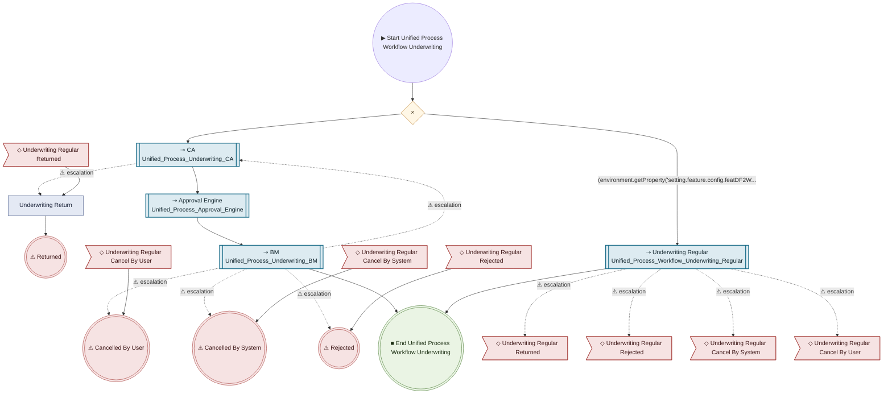
```mermaid
flowchart TD
  classDef hum fill:#FBEDD4,stroke:#B8741A,color:#3A2A0E
  classDef sys fill:#E4E9F4,stroke:#4B5D8A,color:#1A2238
  classDef ca fill:#DDEBF1,stroke:#1F6F8B,color:#12252D,stroke-width:2px
  classDef sub fill:#EFEAE2,stroke:#7A6E63,color:#1E1A16
  classDef gw fill:#FFF7E6,stroke:#B8741A,color:#3A2A0E
  classDef ev fill:#F6E3E3,stroke:#A94442,color:#3B1414
  classDef ok fill:#EAF4E4,stroke:#4F7F3A,color:#1B2E12
  n0(("▶ Start Unified Process Workflow Underwriting"))
  n1[["⇢ CA<br/>Unified_Process_Underwriting_CA"]]:::ca
  n2((("⚠ Returned"))):::ev
  n3["Underwriting Return"]:::sys
  n4[["⇢ BM<br/>Unified_Process_Underwriting_BM"]]:::ca
  n5((("■ End Unified Process Workflow Underwriting"))):::ok
  n6((("⚠ Cancelled By User"))):::ev
  n7((("⚠ Cancelled By System"))):::ev
  n8((("⚠ Rejected"))):::ev
  n9[["⇢ Approval Engine<br/>Unified_Process_Approval_Engine"]]:::ca
  n10{"× "}:::gw
  n11[["⇢ Underwriting Regular<br/>Unified_Process_Workflow_Underwriting_Regular"]]:::ca
  n12>"◇ Underwriting Regular Returned"]:::ev
  n13>"◇ Underwriting Regular Returned"]:::ev
  n14>"◇ Underwriting Regular Rejected"]:::ev
  n15>"◇ Underwriting Regular Rejected"]:::ev
  n16>"◇ Underwriting Regular Cancel By System"]:::ev
  n17>"◇ Underwriting Regular Cancel By System"]:::ev
  n18>"◇ Underwriting Regular Cancel By User"]:::ev
  n19>"◇ Underwriting Regular Cancel By User"]:::ev
  n1 -. "⚠ escalation" .-> n3
  n4 -. "⚠ escalation" .-> n1
  n4 -. "⚠ escalation" .-> n6
  n4 -. "⚠ escalation" .-> n7
  n4 -. "⚠ escalation" .-> n8
  n11 -. "⚠ escalation" .-> n12
  n11 -. "⚠ escalation" .-> n14
  n11 -. "⚠ escalation" .-> n16
  n11 -. "⚠ escalation" .-> n18
  n0 --> n10
  n3 --> n2
  n1 --> n9
  n4 --> n5
  n9 --> n4
  n10 --> n1
  n10 -->|"(environment.getProperty('setting.feature.config.featDF2W..."| n11
  n11 --> n5
  n13 --> n3
  n15 --> n8
  n17 --> n7
  n19 --> n6
```

#### `Unified_Process_Workflow_Underwriting_Regular`

`unified-workflow-underwriting-regular.bpmn` · top level: 0 user tasks, 1 service/rule tasks, 1 call activities, 0 embedded subprocesses

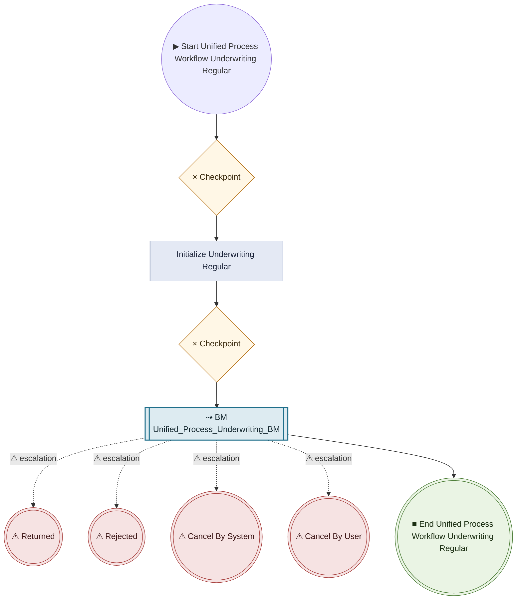
```mermaid
flowchart TD
  classDef hum fill:#FBEDD4,stroke:#B8741A,color:#3A2A0E
  classDef sys fill:#E4E9F4,stroke:#4B5D8A,color:#1A2238
  classDef ca fill:#DDEBF1,stroke:#1F6F8B,color:#12252D,stroke-width:2px
  classDef sub fill:#EFEAE2,stroke:#7A6E63,color:#1E1A16
  classDef gw fill:#FFF7E6,stroke:#B8741A,color:#3A2A0E
  classDef ev fill:#F6E3E3,stroke:#A94442,color:#3B1414
  classDef ok fill:#EAF4E4,stroke:#4F7F3A,color:#1B2E12
  n0(("▶ Start Unified Process Workflow Underwriting Regular"))
  n1{"× Checkpoint"}:::gw
  n2{"× Checkpoint"}:::gw
  n3[["⇢ BM<br/>Unified_Process_Underwriting_BM"]]:::ca
  n4((("■ End Unified Process Workflow Underwriting Regular"))):::ok
  n5["Initialize Underwriting Regular"]:::sys
  n6((("⚠ Returned"))):::ev
  n7((("⚠ Rejected"))):::ev
  n8((("⚠ Cancel By System"))):::ev
  n9((("⚠ Cancel By User"))):::ev
  n3 -. "⚠ escalation" .-> n6
  n3 -. "⚠ escalation" .-> n7
  n3 -. "⚠ escalation" .-> n8
  n3 -. "⚠ escalation" .-> n9
  n0 --> n1
  n1 --> n5
  n5 --> n2
  n2 --> n3
  n3 --> n4
```

#### `Unified_Process_Operation_Workflow`

`unified-operation-workflow.bpmn` · top level: 0 user tasks, 2 service/rule tasks, 5 call activities, 0 embedded subprocesses

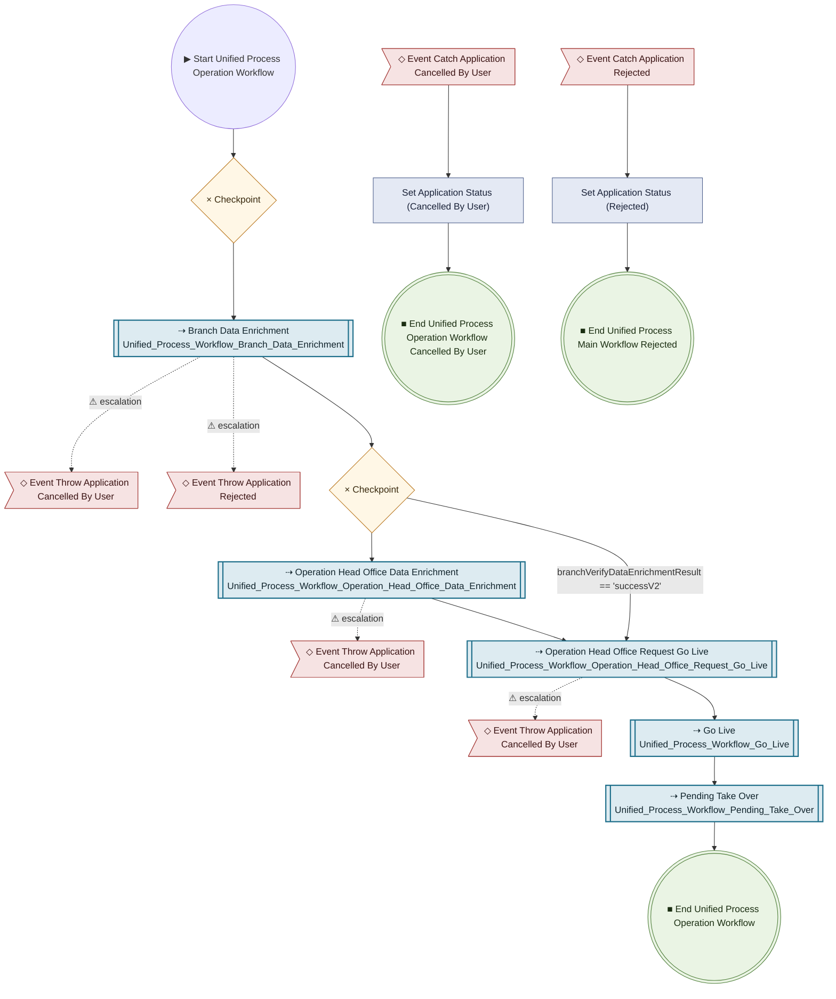
```mermaid
flowchart TD
  classDef hum fill:#FBEDD4,stroke:#B8741A,color:#3A2A0E
  classDef sys fill:#E4E9F4,stroke:#4B5D8A,color:#1A2238
  classDef ca fill:#DDEBF1,stroke:#1F6F8B,color:#12252D,stroke-width:2px
  classDef sub fill:#EFEAE2,stroke:#7A6E63,color:#1E1A16
  classDef gw fill:#FFF7E6,stroke:#B8741A,color:#3A2A0E
  classDef ev fill:#F6E3E3,stroke:#A94442,color:#3B1414
  classDef ok fill:#EAF4E4,stroke:#4F7F3A,color:#1B2E12
  n0(("▶ Start Unified Process Operation Workflow"))
  n1[["⇢ Branch Data Enrichment<br/>Unified_Process_Workflow_Branch_Data_Enrichment"]]:::ca
  n2[["⇢ Operation Head Office Data Enrichment<br/>Unified_Process_Workflow_Operation_Head_Office_Data_Enrichment"]]:::ca
  n3[["⇢ Operation Head Office Request Go Live<br/>Unified_Process_Workflow_Operation_Head_Office_Request_Go_Live"]]:::ca
  n4[["⇢ Go Live<br/>Unified_Process_Workflow_Go_Live"]]:::ca
  n5[["⇢ Pending Take Over<br/>Unified_Process_Workflow_Pending_Take_Over"]]:::ca
  n6((("■ End Unified Process Operation Workflow"))):::ok
  n7{"× Checkpoint"}:::gw
  n8>"◇ Event Catch Application Cancelled By User"]:::ev
  n9["Set Application Status (Cancelled By User)"]:::sys
  n10((("■ End Unified Process Operation Workflow Cancelled By User"))):::ok
  n11>"◇ Event Throw Application Cancelled By User"]:::ev
  n12>"◇ Event Throw Application Cancelled By User"]:::ev
  n13>"◇ Event Throw Application Cancelled By User"]:::ev
  n14>"◇ Event Throw Application Rejected"]:::ev
  n15>"◇ Event Catch Application Rejected"]:::ev
  n16["Set Application Status (Rejected)"]:::sys
  n17((("■ End Unified Process Main Workflow Rejected"))):::ok
  n18{"× Checkpoint"}:::gw
  n1 -. "⚠ escalation" .-> n11
  n2 -. "⚠ escalation" .-> n12
  n3 -. "⚠ escalation" .-> n13
  n1 -. "⚠ escalation" .-> n14
  n0 --> n7
  n1 --> n18
  n2 --> n3
  n3 --> n4
  n4 --> n5
  n5 --> n6
  n7 --> n1
  n8 --> n9
  n9 --> n10
  n15 --> n16
  n16 --> n17
  n18 --> n2
  n18 -->|"branchVerifyDataEnrichmentResult == 'successV2'"| n3
```

### Unified: leaves

#### `Unified_Process_Anti_Fraud_Engine`

`unified-anti-fraud-engine.bpmn` · top level: 0 user tasks, 1 service/rule tasks, 0 call activities, 0 embedded subprocesses

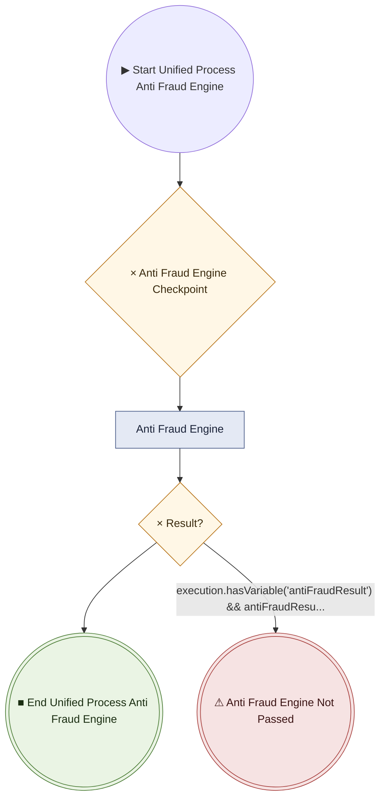
```mermaid
flowchart TD
  classDef hum fill:#FBEDD4,stroke:#B8741A,color:#3A2A0E
  classDef sys fill:#E4E9F4,stroke:#4B5D8A,color:#1A2238
  classDef ca fill:#DDEBF1,stroke:#1F6F8B,color:#12252D,stroke-width:2px
  classDef sub fill:#EFEAE2,stroke:#7A6E63,color:#1E1A16
  classDef gw fill:#FFF7E6,stroke:#B8741A,color:#3A2A0E
  classDef ev fill:#F6E3E3,stroke:#A94442,color:#3B1414
  classDef ok fill:#EAF4E4,stroke:#4F7F3A,color:#1B2E12
  n0(("▶ Start Unified Process Anti Fraud Engine"))
  n1{"× Anti Fraud Engine Checkpoint"}:::gw
  n2["Anti Fraud Engine"]:::sys
  n3{"× Result?"}:::gw
  n4((("■ End Unified Process Anti Fraud Engine"))):::ok
  n5((("⚠ Anti Fraud Engine Not Passed"))):::ev
  n1 --> n2
  n0 --> n1
  n2 --> n3
  n3 --> n4
  n3 -->|"execution.hasVariable('antiFraudResult') && antiFraudResu..."| n5
```

#### `Unified_Process_Workflow_Branch_Data_Enrichment`

`unified-branch-data-enrichment-workflow.bpmn` · top level: 2 user tasks, 1 service/rule tasks, 0 call activities, 0 embedded subprocesses

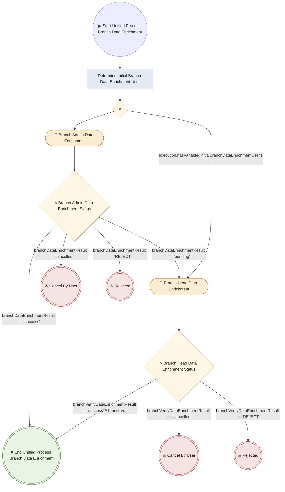
```mermaid
flowchart TD
  classDef hum fill:#FBEDD4,stroke:#B8741A,color:#3A2A0E
  classDef sys fill:#E4E9F4,stroke:#4B5D8A,color:#1A2238
  classDef ca fill:#DDEBF1,stroke:#1F6F8B,color:#12252D,stroke-width:2px
  classDef sub fill:#EFEAE2,stroke:#7A6E63,color:#1E1A16
  classDef gw fill:#FFF7E6,stroke:#B8741A,color:#3A2A0E
  classDef ev fill:#F6E3E3,stroke:#A94442,color:#3B1414
  classDef ok fill:#EAF4E4,stroke:#4F7F3A,color:#1B2E12
  n0(("▶ Start Unified Process Branch Data Enrichment"))
  n1(["👤 Branch Admin Data Enrichment"]):::hum
  n2(["👤 Branch Head Data Enrichment"]):::hum
  n3((("■ End Unified Process Branch Data Enrichment"))):::ok
  n4((("⚠ Cancel By User"))):::ev
  n5{"× Branch Admin Data Enrichment Status"}:::gw
  n6{"× Branch Head Data Enrichment Status"}:::gw
  n7((("⚠ Cancel By User"))):::ev
  n8((("⚠ Rejected"))):::ev
  n9((("⚠ Rejected"))):::ev
  n10["Determine Initial Branch Data Enrichment User"]:::sys
  n11{"× "}:::gw
  n0 --> n10
  n1 --> n5
  n2 --> n6
  n5 -->|"branchDataEnrichmentResult == 'success'"| n3
  n5 -->|"branchDataEnrichmentResult == 'cancelled'"| n4
  n6 -->|"branchVerifyDataEnrichmentResult == 'success' // branchVe..."| n3
  n6 -->|"branchVerifyDataEnrichmentResult == 'cancelled'"| n7
  n6 -->|"branchVerifyDataEnrichmentResult == 'REJECT'"| n8
  n5 -->|"branchDataEnrichmentResult == 'REJECT'"| n9
  n5 -->|"branchDataEnrichmentResult == 'pending'"| n2
  n10 --> n11
  n11 --> n1
  n11 -->|"execution.hasVariable('initialBranchDataEnrichmentUser') ..."| n2
```

#### `Unified_Process_Create_CIF`

`unified-create-cif.bpmn` · top level: 0 user tasks, 1 service/rule tasks, 0 call activities, 0 embedded subprocesses

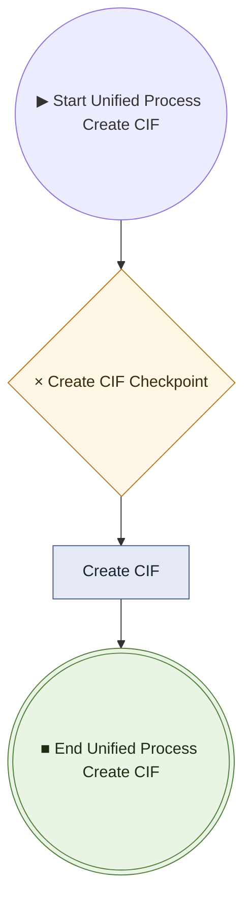
```mermaid
flowchart TD
  classDef hum fill:#FBEDD4,stroke:#B8741A,color:#3A2A0E
  classDef sys fill:#E4E9F4,stroke:#4B5D8A,color:#1A2238
  classDef ca fill:#DDEBF1,stroke:#1F6F8B,color:#12252D,stroke-width:2px
  classDef sub fill:#EFEAE2,stroke:#7A6E63,color:#1E1A16
  classDef gw fill:#FFF7E6,stroke:#B8741A,color:#3A2A0E
  classDef ev fill:#F6E3E3,stroke:#A94442,color:#3B1414
  classDef ok fill:#EAF4E4,stroke:#4F7F3A,color:#1B2E12
  n0(("▶ Start Unified Process Create CIF"))
  n1["Create CIF"]:::sys
  n2((("■ End Unified Process Create CIF"))):::ok
  n3{"× Create CIF Checkpoint"}:::gw
  n0 --> n3
  n1 --> n2
  n3 --> n1
```

#### `Unified_Process_Dedupe_Customer_Check`

`unified-dedupe-customer-check.bpmn` · top level: 0 user tasks, 1 service/rule tasks, 0 call activities, 0 embedded subprocesses

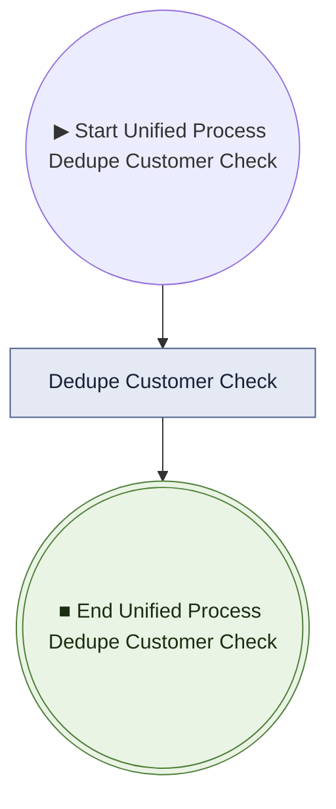
```mermaid
flowchart TD
  classDef hum fill:#FBEDD4,stroke:#B8741A,color:#3A2A0E
  classDef sys fill:#E4E9F4,stroke:#4B5D8A,color:#1A2238
  classDef ca fill:#DDEBF1,stroke:#1F6F8B,color:#12252D,stroke-width:2px
  classDef sub fill:#EFEAE2,stroke:#7A6E63,color:#1E1A16
  classDef gw fill:#FFF7E6,stroke:#B8741A,color:#3A2A0E
  classDef ev fill:#F6E3E3,stroke:#A94442,color:#3B1414
  classDef ok fill:#EAF4E4,stroke:#4F7F3A,color:#1B2E12
  n0(("▶ Start Unified Process Dedupe Customer Check"))
  n1["Dedupe Customer Check"]:::sys
  n2((("■ End Unified Process Dedupe Customer Check"))):::ok
  n0 --> n1
  n1 --> n2
```

#### `Unified_Process_Document_Submission`

`unified-document-submission.bpmn` · top level: 1 user tasks, 0 service/rule tasks, 0 call activities, 0 embedded subprocesses

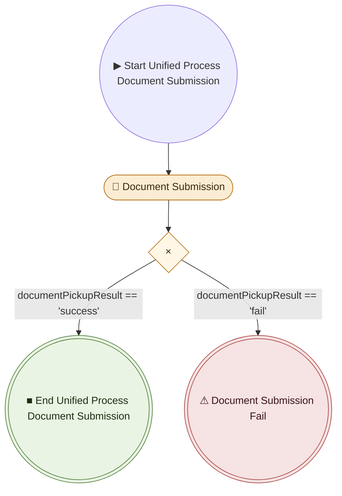
```mermaid
flowchart TD
  classDef hum fill:#FBEDD4,stroke:#B8741A,color:#3A2A0E
  classDef sys fill:#E4E9F4,stroke:#4B5D8A,color:#1A2238
  classDef ca fill:#DDEBF1,stroke:#1F6F8B,color:#12252D,stroke-width:2px
  classDef sub fill:#EFEAE2,stroke:#7A6E63,color:#1E1A16
  classDef gw fill:#FFF7E6,stroke:#B8741A,color:#3A2A0E
  classDef ev fill:#F6E3E3,stroke:#A94442,color:#3B1414
  classDef ok fill:#EAF4E4,stroke:#4F7F3A,color:#1B2E12
  n0(("▶ Start Unified Process Document Submission"))
  n1(["👤 Document Submission"]):::hum
  n2((("■ End Unified Process Document Submission"))):::ok
  n3{"× "}:::gw
  n4((("⚠ Document Submission Fail"))):::ev
  n0 --> n1
  n1 --> n3
  n3 -->|"documentPickupResult == 'success'"| n2
  n3 -->|"documentPickupResult == 'fail'"| n4
```

#### `Unified_Process_Duplicate_Check_Internal`

`unified-duplicate-check-internal.bpmn` · top level: 0 user tasks, 1 service/rule tasks, 0 call activities, 0 embedded subprocesses

```mermaid
flowchart TD
  classDef hum fill:#FBEDD4,stroke:#B8741A,color:#3A2A0E
  classDef sys fill:#E4E9F4,stroke:#4B5D8A,color:#1A2238
  classDef ca fill:#DDEBF1,stroke:#1F6F8B,color:#12252D,stroke-width:2px
  classDef sub fill:#EFEAE2,stroke:#7A6E63,color:#1E1A16
  classDef gw fill:#FFF7E6,stroke:#B8741A,color:#3A2A0E
  classDef ev fill:#F6E3E3,stroke:#A94442,color:#3B1414
  classDef ok fill:#EAF4E4,stroke:#4F7F3A,color:#1B2E12
  n0(("▶ Start Unified Process Duplicate Check Internal"))
  n1["Duplicate Check Internal"]:::sys
  n2{"× Duplicated?"}:::gw
  n3((("■ End Unified Process Duplicate Check Internal"))):::ok
  n4((("⚠ Duplicate Check Internal Not Passed"))):::ev
  n0 --> n1
  n1 --> n2
  n2 -->|"duplicatedCheckPass == true"| n3
  n2 -->|"duplicatedCheckPass == false"| n4
```

#### `Process_Unified_Escalation_Decision`

`unified-escalation-decision.bpmn` · top level: 0 user tasks, 1 service/rule tasks, 0 call activities, 0 embedded subprocesses

```mermaid
flowchart TD
  classDef hum fill:#FBEDD4,stroke:#B8741A,color:#3A2A0E
  classDef sys fill:#E4E9F4,stroke:#4B5D8A,color:#1A2238
  classDef ca fill:#DDEBF1,stroke:#1F6F8B,color:#12252D,stroke-width:2px
  classDef sub fill:#EFEAE2,stroke:#7A6E63,color:#1E1A16
  classDef gw fill:#FFF7E6,stroke:#B8741A,color:#3A2A0E
  classDef ev fill:#F6E3E3,stroke:#A94442,color:#3B1414
  classDef ok fill:#EAF4E4,stroke:#4F7F3A,color:#1B2E12
  n0(("▶ Start Unified Process Escalation Decision"))
  n1((("■ End Unified Process Escalation Decision"))):::ok
  n2{"× Escalation Decision"}:::gw
  n3((("⚠ Reject Salestrax"))):::ev
  n4((("⚠ Reject End"))):::ev
  n5["Escalation Decision"]:::sys
  n6{"× Checkpoint"}:::gw
  n0 --> n6
  n2 -->|"escalationDecisionResult == 'HIGH_REGULAR' // escalationD..."| n1
  n2 -->|"escalationDecisionResult == 'REJECTED_SALESTRAX'"| n3
  n2 -->|"escalationDecisionResult == 'REJECTED_END'"| n4
  n5 --> n2
  n6 --> n5
```

#### `Unified_Process_Follow_Up_Assignment`

`unified-follow-up-assignment.bpmn` · top level: 1 user tasks, 1 service/rule tasks, 0 call activities, 0 embedded subprocesses

```mermaid
flowchart TD
  classDef hum fill:#FBEDD4,stroke:#B8741A,color:#3A2A0E
  classDef sys fill:#E4E9F4,stroke:#4B5D8A,color:#1A2238
  classDef ca fill:#DDEBF1,stroke:#1F6F8B,color:#12252D,stroke-width:2px
  classDef sub fill:#EFEAE2,stroke:#7A6E63,color:#1E1A16
  classDef gw fill:#FFF7E6,stroke:#B8741A,color:#3A2A0E
  classDef ev fill:#F6E3E3,stroke:#A94442,color:#3B1414
  classDef ok fill:#EAF4E4,stroke:#4F7F3A,color:#1B2E12
  n0(("▶ Start Unified Process Follow Up Assignment"))
  n1{"× Gateway Application Follow Up Check"}:::gw
  n2((("■ End Unified Process Follow Up Assignment"))):::ok
  n3["Surveyor Assign Follow Up"]:::sys
  n4(["👤 Trigger Follow Up Submitted"]):::hum
  n5{"× "}:::gw
  n6((("⚠ Follow Up Cancel By User"))):::ev
  n7((("⚠ Follow Up Cancel By System"))):::ev
  n0 --> n1
  n1 -->|"applicationStatus == 'SUBMITTED'"| n2
  n1 -->|"applicationStatus == 'FOLLOW_UP'"| n3
  n3 --> n4
  n4 --> n5
  n5 -->|"followUp == 'success'"| n2
  n5 -->|"followUp == 'cancelbyuser'"| n6
  n5 -->|"followUp == 'cancel'"| n7
```

#### `Unified_Process_Get_Branch_Lead_And_Survey`

`unified-get-branch-lead-and-survey.bpmn` · top level: 2 user tasks, 3 service/rule tasks, 0 call activities, 0 embedded subprocesses

```mermaid
flowchart TD
  classDef hum fill:#FBEDD4,stroke:#B8741A,color:#3A2A0E
  classDef sys fill:#E4E9F4,stroke:#4B5D8A,color:#1A2238
  classDef ca fill:#DDEBF1,stroke:#1F6F8B,color:#12252D,stroke-width:2px
  classDef sub fill:#EFEAE2,stroke:#7A6E63,color:#1E1A16
  classDef gw fill:#FFF7E6,stroke:#B8741A,color:#3A2A0E
  classDef ev fill:#F6E3E3,stroke:#A94442,color:#3B1414
  classDef ok fill:#EAF4E4,stroke:#4F7F3A,color:#1B2E12
  n0(("▶ Start Unified Process Get Branch Lead and Survey"))
  n1["Get Branch Lead and Survey"]:::sys
  n2{"× Found?"}:::gw
  n3(["👤 Admin Input Branch Survey"]):::hum
  n4["Set Branch Survey"]:::sys
  n5((("■ End Unified Process Get Branch Lead and Survey"))):::ok
  n6{"× feat SSG NDF4W check"}:::gw
  n7["Get Branch Group Survey"]:::sys
  n8{"× "}:::gw
  n9(["👤 Admin Input Branch SSG"]):::hum
  n1 --> n2
  n2 -->|"branchSurveyFound == false"| n3
  n3 --> n4
  n4 --> n5
  n2 -->|"branchSurveyFound == true"| n5
  n0 --> n6
  n6 -->|"environment.getProperty('setting.ndf4w.enableSubSurveyGro..."| n1
  n8 --> n1
  n7 --> n8
  n8 -->|"execution.hasVariable('sgAndSsgIsEmpty') && sgAndSsgIsEmp..."| n9
  n6 -->|"environment.getProperty('setting.ndf4w.enableSubSurveyGro..."| n7
  n9 --> n4
```

#### `Unified_Process_Workflow_Go_Live`

`unified-go-live.bpmn` · top level: 0 user tasks, 3 service/rule tasks, 0 call activities, 0 embedded subprocesses

```mermaid
flowchart TD
  classDef hum fill:#FBEDD4,stroke:#B8741A,color:#3A2A0E
  classDef sys fill:#E4E9F4,stroke:#4B5D8A,color:#1A2238
  classDef ca fill:#DDEBF1,stroke:#1F6F8B,color:#12252D,stroke-width:2px
  classDef sub fill:#EFEAE2,stroke:#7A6E63,color:#1E1A16
  classDef gw fill:#FFF7E6,stroke:#B8741A,color:#3A2A0E
  classDef ev fill:#F6E3E3,stroke:#A94442,color:#3B1414
  classDef ok fill:#EAF4E4,stroke:#4F7F3A,color:#1B2E12
  n0(("▶ Start Unified Process Go Live"))
  n1((("■ End Unified Process Go Live"))):::ok
  n2["Request Go Live"]:::sys
  n3["Get Go Live Status"]:::sys
  n4["Set Application Status (Go Live)"]:::sys
  n5{"× Checkpoint"}:::gw
  n6{"× Checkpoint"}:::gw
  n7{"× Checkpoint"}:::gw
  n0 --> n5
  n2 --> n6
  n3 --> n7
  n4 --> n1
  n5 --> n2
  n6 --> n3
  n7 --> n4
```

#### `Unified_Process_KYC_Check`

`unified-kyc-check.bpmn` · top level: 0 user tasks, 4 service/rule tasks, 0 call activities, 0 embedded subprocesses

```mermaid
flowchart TD
  classDef hum fill:#FBEDD4,stroke:#B8741A,color:#3A2A0E
  classDef sys fill:#E4E9F4,stroke:#4B5D8A,color:#1A2238
  classDef ca fill:#DDEBF1,stroke:#1F6F8B,color:#12252D,stroke-width:2px
  classDef sub fill:#EFEAE2,stroke:#7A6E63,color:#1E1A16
  classDef gw fill:#FFF7E6,stroke:#B8741A,color:#3A2A0E
  classDef ev fill:#F6E3E3,stroke:#A94442,color:#3B1414
  classDef ok fill:#EAF4E4,stroke:#4F7F3A,color:#1B2E12
  n0(("▶ Start Unified Process KYC Check"))
  n1["KYC Check"]:::sys
  n2{"× Verified?"}:::gw
  n3((("⚠ KYC Check Not Verified (Escalation Decision)"))):::ev
  n4["Shopee Score"]:::sys
  n5{"× Phone Checking Checkpoint"}:::gw
  n6["Phone Checking"]:::sys
  n7{"× Address Verification Checkpoint"}:::gw
  n8((("■ End Unified Process KYC Check"))):::ok
  n9["Address Verification"]:::sys
  n0 --> n1
  n1 --> n2
  n2 -->|"execution.hasVariable('kycVerified') && kycVerified == false"| n3
  n2 --> n4
  n4 --> n5
  n5 --> n6
  n6 --> n7
  n7 --> n9
  n9 --> n8
```

#### `Unified_Process_Marketing_ID_Check`

`unified-marketing-id-check.bpmn` · top level: 1 user tasks, 2 service/rule tasks, 0 call activities, 0 embedded subprocesses

```mermaid
flowchart TD
  classDef hum fill:#FBEDD4,stroke:#B8741A,color:#3A2A0E
  classDef sys fill:#E4E9F4,stroke:#4B5D8A,color:#1A2238
  classDef ca fill:#DDEBF1,stroke:#1F6F8B,color:#12252D,stroke-width:2px
  classDef sub fill:#EFEAE2,stroke:#7A6E63,color:#1E1A16
  classDef gw fill:#FFF7E6,stroke:#B8741A,color:#3A2A0E
  classDef ev fill:#F6E3E3,stroke:#A94442,color:#3B1414
  classDef ok fill:#EAF4E4,stroke:#4F7F3A,color:#1B2E12
  n0(("▶ Start Unified Process Marketing ID Check"))
  n1["Marketing ID Check"]:::sys
  n2{"× Valid?"}:::gw
  n3(["👤 Admin Input Marketing ID"]):::hum
  n4["Set Marketing ID"]:::sys
  n5((("■ Unified End Process Marketing ID Check"))):::ok
  n0 --> n1
  n1 --> n2
  n2 -->|"marketingIdValid == true"| n5
  n2 -->|"marketingIdValid == false"| n3
  n3 --> n4
  n4 --> n1
```

#### `Unified_Process_Negotiation_Assignment`

`unified-negotiation-assignment.bpmn` · top level: 1 user tasks, 0 service/rule tasks, 0 call activities, 0 embedded subprocesses

```mermaid
flowchart TD
  classDef hum fill:#FBEDD4,stroke:#B8741A,color:#3A2A0E
  classDef sys fill:#E4E9F4,stroke:#4B5D8A,color:#1A2238
  classDef ca fill:#DDEBF1,stroke:#1F6F8B,color:#12252D,stroke-width:2px
  classDef sub fill:#EFEAE2,stroke:#7A6E63,color:#1E1A16
  classDef gw fill:#FFF7E6,stroke:#B8741A,color:#3A2A0E
  classDef ev fill:#F6E3E3,stroke:#A94442,color:#3B1414
  classDef ok fill:#EAF4E4,stroke:#4F7F3A,color:#1B2E12
  n0(("▶ Start Unified Process Negotiation Assignment"))
  n1((("■ End Unified Process Negotiation Assignment"))):::ok
  n2{"× "}:::gw
  n3((("⚠ Negotiation High Risk"))):::ev
  n4(["👤 Negotiation"]):::hum
  n5((("⚠ Negotiation Cancel"))):::ev
  n0 --> n4
  n2 -->|"negotiationResult == 'SUCCESS'"| n1
  n2 -->|"negotiationResult == 'HIGH_RISK'"| n3
  n4 --> n2
  n2 -->|"negotiationResult == 'CANCEL'"| n5
```

#### `Unified_Process_Workflow_Operation_Head_Office_Data_Enrichment`

`unified-operation-head-office-data-enrichment.bpmn` · top level: 1 user tasks, 0 service/rule tasks, 0 call activities, 0 embedded subprocesses

```mermaid
flowchart TD
  classDef hum fill:#FBEDD4,stroke:#B8741A,color:#3A2A0E
  classDef sys fill:#E4E9F4,stroke:#4B5D8A,color:#1A2238
  classDef ca fill:#DDEBF1,stroke:#1F6F8B,color:#12252D,stroke-width:2px
  classDef sub fill:#EFEAE2,stroke:#7A6E63,color:#1E1A16
  classDef gw fill:#FFF7E6,stroke:#B8741A,color:#3A2A0E
  classDef ev fill:#F6E3E3,stroke:#A94442,color:#3B1414
  classDef ok fill:#EAF4E4,stroke:#4F7F3A,color:#1B2E12
  n0(("▶ Start Unified Process Operation Head Office Data Enrichment"))
  n1(["👤 Operation Head Office Data Enrichment"]):::hum
  n2((("■ End Unified Process Operation Head Office Data Enrichment"))):::ok
  n3{"× Operation Head Office Data Enrichment Status"}:::gw
  n4((("⚠ Cancel By User"))):::ev
  n0 --> n1
  n1 --> n3
  n3 -->|"headOfficeDataEnrichmentResult== 'cancelled'"| n4
  n3 -->|"headOfficeDataEnrichmentResult== 'success'"| n2
```

#### `Unified_Process_Workflow_Operation_Head_Office_Request_Go_Live`

`unified-operation-head-office-request-go-live.bpmn` · top level: 1 user tasks, 2 service/rule tasks, 0 call activities, 0 embedded subprocesses

```mermaid
flowchart TD
  classDef hum fill:#FBEDD4,stroke:#B8741A,color:#3A2A0E
  classDef sys fill:#E4E9F4,stroke:#4B5D8A,color:#1A2238
  classDef ca fill:#DDEBF1,stroke:#1F6F8B,color:#12252D,stroke-width:2px
  classDef sub fill:#EFEAE2,stroke:#7A6E63,color:#1E1A16
  classDef gw fill:#FFF7E6,stroke:#B8741A,color:#3A2A0E
  classDef ev fill:#F6E3E3,stroke:#A94442,color:#3B1414
  classDef ok fill:#EAF4E4,stroke:#4F7F3A,color:#1B2E12
  n0(("▶ Start Unified Process Operation Head Office Request Go Live"))
  n1(["👤 Operation Head Office Request Go Live"]):::hum
  n2((("■ End Unified Process Operation Head Office Request Go Live"))):::ok
  n3["Set Application Status (Request Go Live)"]:::sys
  n4["Set Operation Assignment Status (Request Go Live)"]:::sys
  n5{"× Operation Head Office Request Go Live Status"}:::gw
  n6((("⚠ Cancel By User"))):::ev
  n7{"× Checkpoint"}:::gw
  n8{"× Checkpoint"}:::gw
  n0 --> n7
  n1 --> n5
  n3 --> n1
  n4 --> n8
  n5 -->|"headOfficeRequestGoLiveResult == 'cancelled'"| n6
  n5 -->|"headOfficeRequestGoLiveResult == 'success'"| n2
  n7 --> n4
  n8 --> n3
```

#### `Unified_Process_PD_Model`

`unified-pd-model.bpmn` · top level: 0 user tasks, 4 service/rule tasks, 0 call activities, 0 embedded subprocesses

```mermaid
flowchart TD
  classDef hum fill:#FBEDD4,stroke:#B8741A,color:#3A2A0E
  classDef sys fill:#E4E9F4,stroke:#4B5D8A,color:#1A2238
  classDef ca fill:#DDEBF1,stroke:#1F6F8B,color:#12252D,stroke-width:2px
  classDef sub fill:#EFEAE2,stroke:#7A6E63,color:#1E1A16
  classDef gw fill:#FFF7E6,stroke:#B8741A,color:#3A2A0E
  classDef ev fill:#F6E3E3,stroke:#A94442,color:#3B1414
  classDef ok fill:#EAF4E4,stroke:#4F7F3A,color:#1B2E12
  n0(("▶ Start Unified PD Model"))
  n1{"× Pefindo Send To High Risk Gateway"}:::gw
  n2{"× PD Model Overlay Checkpoint"}:::gw
  n3((("■ End Unified PD Model"))):::ok
  n4{"× Pefindo Profile Match Check"}:::gw
  n5{"× PD Model Alternative Overlay Checkpoint"}:::gw
  n6["PD Model"]:::sys
  n7["PD Model Overlay"]:::sys
  n8["PD Model Alternative"]:::sys
  n9["PD Model Alternative Overlay"]:::sys
  n10{"× "}:::gw
  n11((("⚠ Escalation Decision"))):::ev
  n0 --> n1
  n6 --> n2
  n2 --> n7
  n2 -->|"execution.hasVariable('redirectToNTC') && redirectToNTC =..."| n5
  n7 --> n10
  n1 -->|"pefindoSendToHighRisk == false"| n4
  n4 -->|"applicationWorkflowSelectorType == 'OPTION_NDF2W' // pdMo..."| n6
  n4 -->|"pdModelType == 'NTC'"| n8
  n8 --> n5
  n5 --> n9
  n9 --> n3
  n1 -->|"pefindoSendToHighRisk == true"| n2
  n10 -->|"creditModelPersonaOverlay != 'REJECT'"| n3
  n10 -->|"creditModelPersonaOverlay == 'REJECT'"| n11
```

#### `Process_Unified_Pefindo_Check`

`unified-pefindo-check.bpmn` · top level: 0 user tasks, 4 service/rule tasks, 0 call activities, 0 embedded subprocesses

```mermaid
flowchart TD
  classDef hum fill:#FBEDD4,stroke:#B8741A,color:#3A2A0E
  classDef sys fill:#E4E9F4,stroke:#4B5D8A,color:#1A2238
  classDef ca fill:#DDEBF1,stroke:#1F6F8B,color:#12252D,stroke-width:2px
  classDef sub fill:#EFEAE2,stroke:#7A6E63,color:#1E1A16
  classDef gw fill:#FFF7E6,stroke:#B8741A,color:#3A2A0E
  classDef ev fill:#F6E3E3,stroke:#A94442,color:#3B1414
  classDef ok fill:#EAF4E4,stroke:#4F7F3A,color:#1B2E12
  n0(("▶ Start Unified Process Pefindo Check"))
  n1{"× Pefindo Customer Checkpoint"}:::gw
  n2["Pefindo Customer"]:::sys
  n3{"× Pefindo Spouse Checkpoint"}:::gw
  n4["Pefindo Spouse"]:::sys
  n5((("■ End Unified Process Pefindo Check"))):::ok
  n6{"× Pefindo Status Rule Checkpoint"}:::gw
  n7["Pefindo Status Rule"]:::sys
  n8{"× Pefindo Matrix Checkpoint"}:::gw
  n9["Pefindo Matrix"]:::sys
  n0 --> n1
  n1 --> n2
  n2 --> n3
  n3 --> n4
  n4 --> n6
  n7 --> n8
  n6 --> n7
  n8 -->|"execution.hasVariable('pefindoStatusRule') && pefindoStat..."| n9
  n9 --> n5
  n8 --> n5
```

#### `Unified_Process_Workflow_Pending_Take_Over`

`unified-pending-take-over.bpmn` · top level: 2 user tasks, 1 service/rule tasks, 0 call activities, 0 embedded subprocesses

```mermaid
flowchart TD
  classDef hum fill:#FBEDD4,stroke:#B8741A,color:#3A2A0E
  classDef sys fill:#E4E9F4,stroke:#4B5D8A,color:#1A2238
  classDef ca fill:#DDEBF1,stroke:#1F6F8B,color:#12252D,stroke-width:2px
  classDef sub fill:#EFEAE2,stroke:#7A6E63,color:#1E1A16
  classDef gw fill:#FFF7E6,stroke:#B8741A,color:#3A2A0E
  classDef ev fill:#F6E3E3,stroke:#A94442,color:#3B1414
  classDef ok fill:#EAF4E4,stroke:#4F7F3A,color:#1B2E12
  n0(("▶ Start Unified Process Pending Take Over"))
  n1((("■ End Unified Process Pending Take Over"))):::ok
  n2{"× Pending Take Over ?"}:::gw
  n3(["👤 Branch Pending Take Over"]):::hum
  n4(["👤 Head Office Pending Take Over"]):::hum
  n5["Check Pending Take Over"]:::sys
  n6{"× Checkpoint"}:::gw
  n0 --> n6
  n2 -->|"isPendingTakeOver == true"| n3
  n3 -->|"branchPendingTakeOver == 'success'"| n4
  n4 -->|"headOfficePendingTakeOver == 'success'"| n1
  n2 -->|"isPendingTakeOver == false"| n1
  n5 --> n2
  n6 --> n5
```

#### `Process_Unified_Personal_Data_Prerequisite`

`unified-personal-data-prerequisite.bpmn` · top level: 0 user tasks, 2 service/rule tasks, 1 call activities, 0 embedded subprocesses

```mermaid
flowchart TD
  classDef hum fill:#FBEDD4,stroke:#B8741A,color:#3A2A0E
  classDef sys fill:#E4E9F4,stroke:#4B5D8A,color:#1A2238
  classDef ca fill:#DDEBF1,stroke:#1F6F8B,color:#12252D,stroke-width:2px
  classDef sub fill:#EFEAE2,stroke:#7A6E63,color:#1E1A16
  classDef gw fill:#FFF7E6,stroke:#B8741A,color:#3A2A0E
  classDef ev fill:#F6E3E3,stroke:#A94442,color:#3B1414
  classDef ok fill:#EAF4E4,stroke:#4F7F3A,color:#1B2E12
  n0(("▶ Start Unified Process Personal Data Prerequisite"))
  n1{"× One Obligor Checkpoint"}:::gw
  n2["One Obligor"]:::sys
  n3[["⇢ Pefindo Check<br/>Process_Unified_Pefindo_Check"]]:::ca
  n4{"× Income Model Checkpoint"}:::gw
  n5["Income Model"]:::sys
  n6((("■ End Unified Process Personal Data Prerequisite"))):::ok
  n0 --> n1
  n1 --> n2
  n2 --> n3
  n3 --> n4
  n4 --> n5
  n5 --> n6
```

#### `Unified_Process_Pilot_Branch_Check`

`unified-pilot-branch-check.bpmn` · top level: 2 user tasks, 3 service/rule tasks, 0 call activities, 0 embedded subprocesses

```mermaid
flowchart TD
  classDef hum fill:#FBEDD4,stroke:#B8741A,color:#3A2A0E
  classDef sys fill:#E4E9F4,stroke:#4B5D8A,color:#1A2238
  classDef ca fill:#DDEBF1,stroke:#1F6F8B,color:#12252D,stroke-width:2px
  classDef sub fill:#EFEAE2,stroke:#7A6E63,color:#1E1A16
  classDef gw fill:#FFF7E6,stroke:#B8741A,color:#3A2A0E
  classDef ev fill:#F6E3E3,stroke:#A94442,color:#3B1414
  classDef ok fill:#EAF4E4,stroke:#4F7F3A,color:#1B2E12
  n0(("▶ Unified Start Process Pilot Branch Check"))
  n1["Pilot Branch Check"]:::sys
  n2{"× Inside Pilot Branch?"}:::gw
  n3((("■ End Unified Process Pilot Branch Check"))):::ok
  n4((("⚠ Outside Pilot Branch (Escalation Decision)"))):::ev
  n5["Set Application Status (Waiting High Risk)"]:::sys
  n6{"× Application Follow Up Check"}:::gw
  n7(["👤 System Trigger Follow Up Submitted"]):::hum
  n8{"× Follow Up Status"}:::gw
  n9((("⚠ Outside Pilot Branch Cancel By User"))):::ev
  n10(["👤 Admin Input Pilot Branch Surveyor"]):::hum
  n11{"× Salestrax Replacement Check"}:::gw
  n12{"× "}:::gw
  n13["Set Branch Survey"]:::sys
  n0 --> n1
  n1 --> n2
  n2 -->|"pilotBranchCheckPass == true"| n3
  n2 -->|"pilotBranchCheckPass == false"| n11
  n6 -->|"applicationStatus == 'FOLLOW_UP'"| n5
  n6 -->|"applicationStatus == 'SUBMITTED'"| n4
  n5 --> n7
  n7 --> n8
  n8 -->|"followUp == 'cancelbyuser'"| n9
  n8 --> n4
  n11 --> n6
  n11 -->|"environment.getProperty('setting.feature.config.featSales..."| n10
  n12 -->|"branchPilotSurveyor == 'cancel'"| n9
  n10 --> n12
  n12 -->|"branchPilotSurveyor == 'success'"| n13
  n13 --> n1
```

#### `Unified_Process_RAC`

`unified-rac.bpmn` · top level: 0 user tasks, 5 service/rule tasks, 1 call activities, 0 embedded subprocesses

```mermaid
flowchart TD
  classDef hum fill:#FBEDD4,stroke:#B8741A,color:#3A2A0E
  classDef sys fill:#E4E9F4,stroke:#4B5D8A,color:#1A2238
  classDef ca fill:#DDEBF1,stroke:#1F6F8B,color:#12252D,stroke-width:2px
  classDef sub fill:#EFEAE2,stroke:#7A6E63,color:#1E1A16
  classDef gw fill:#FFF7E6,stroke:#B8741A,color:#3A2A0E
  classDef ev fill:#F6E3E3,stroke:#A94442,color:#3B1414
  classDef ok fill:#EAF4E4,stroke:#4F7F3A,color:#1B2E12
  n0(("▶ Start Unified RAC"))
  n1["Tax Check"]:::sys
  n2{"× External Data Check Customer Checkpoint"}:::gw
  n3["External Data Check"]:::sys
  n4{"× Result?"}:::gw
  n5["Soft RAC"]:::sys
  n6((("⚠ Escalation Decision"))):::ev
  n7{"× Result?"}:::gw
  n8((("■ End Unified RAC"))):::ok
  n9[["⇢ Pefindo Check<br/>Process_Unified_Pefindo_Check"]]:::ca
  n10{"× Biro RAC Checkpoint"}:::gw
  n11["Biro RAC"]:::sys
  n12{"× Result?"}:::gw
  n13{"× Result?"}:::gw
  n14["Pre Fatal RAC"]:::sys
  n0 --> n1
  n1 --> n2
  n2 --> n3
  n3 --> n4
  n4 --> n6
  n5 --> n7
  n7 -->|"softRACCheckStatus == 'PASS'"| n9
  n7 --> n6
  n9 --> n10
  n10 --> n11
  n11 --> n12
  n12 --> n8
  n12 -->|"execution.hasVariable('bureauRacResult') && bureauRacResu..."| n6
  n4 -->|"externalDataCheckResult == 'PASS' // externalDataCheckRes..."| n14
  n14 --> n13
  n13 -->|"!execution.hasVariable('preFatalRacResult') // preFatalRa..."| n5
  n13 --> n6
```

#### `Unified_Process_Scoring_2`

`unified-scoring-2.bpmn` · top level: 0 user tasks, 6 service/rule tasks, 0 call activities, 0 embedded subprocesses

```mermaid
flowchart TD
  classDef hum fill:#FBEDD4,stroke:#B8741A,color:#3A2A0E
  classDef sys fill:#E4E9F4,stroke:#4B5D8A,color:#1A2238
  classDef ca fill:#DDEBF1,stroke:#1F6F8B,color:#12252D,stroke-width:2px
  classDef sub fill:#EFEAE2,stroke:#7A6E63,color:#1E1A16
  classDef gw fill:#FFF7E6,stroke:#B8741A,color:#3A2A0E
  classDef ev fill:#F6E3E3,stroke:#A94442,color:#3B1414
  classDef ok fill:#EAF4E4,stroke:#4F7F3A,color:#1B2E12
  n0(("▶ Start Unified Scoring 2"))
  n1{"× Result?"}:::gw
  n2{"× Result?"}:::gw
  n3((("■ End Unified Scoring 2"))):::ok
  n4["Survey RAC"]:::sys
  n5["Fatal Score"]:::sys
  n6>"◇ Throw Error"]:::ev
  n7["Simple Survey"]:::sys
  n8["Collateral Verification"]:::sys
  n9>"◇ Throw Error"]:::ev
  n10>"◇ Throw Error"]:::ev
  n11>"◇ Catch Error"]:::ev
  n12["Handle Error"]:::sys
  n13>"◇ Throw Error"]:::ev
  n14{"× "}:::gw
  n15["Regular RAC"]:::sys
  n16>"◇ Throw Error"]:::ev
  n4 -. "⚠ error" .-> n6
  n5 -. "⚠ error" .-> n9
  n7 -. "⚠ error" .-> n10
  n8 -. "⚠ error" .-> n13
  n15 -. "⚠ error" .-> n16
  n0 --> n14
  n5 --> n1
  n1 -->|"fatalScoreResult == 'PASS'"| n7
  n7 --> n2
  n2 -->|"simpleSurveyorScoringStatus == 'PASS'"| n8
  n8 --> n3
  n1 --> n3
  n2 --> n3
  n4 --> n5
  n11 --> n12
  n12 --> n3
  n14 --> n4
  n14 -->|"environment.getProperty('setting.ndf2w.feat2WRegular') ==..."| n15
  n15 --> n3
```

#### `Unified_Process_Scoring_Assignment`

`unified-scoring-assignment.bpmn` · top level: 1 user tasks, 0 service/rule tasks, 0 call activities, 0 embedded subprocesses

```mermaid
flowchart TD
  classDef hum fill:#FBEDD4,stroke:#B8741A,color:#3A2A0E
  classDef sys fill:#E4E9F4,stroke:#4B5D8A,color:#1A2238
  classDef ca fill:#DDEBF1,stroke:#1F6F8B,color:#12252D,stroke-width:2px
  classDef sub fill:#EFEAE2,stroke:#7A6E63,color:#1E1A16
  classDef gw fill:#FFF7E6,stroke:#B8741A,color:#3A2A0E
  classDef ev fill:#F6E3E3,stroke:#A94442,color:#3B1414
  classDef ok fill:#EAF4E4,stroke:#4F7F3A,color:#1B2E12
  n0(("▶ Start Unified Process Scoring Assignment"))
  n1(["👤 Scoring Form"]):::hum
  n2((("■ End Unified Process Scoring Assignment"))):::ok
  n3{"× "}:::gw
  n4((("⚠ Scoring Form Rejected"))):::ev
  n5((("⚠ Scoring High Risk"))):::ev
  n6((("⚠ Scoring Cancel By User"))):::ev
  n7((("⚠ Scoring Cancel By System"))):::ev
  n0 --> n1
  n1 --> n3
  n3 -->|"scoringFormResult == 'SUCCESS'"| n2
  n3 -->|"scoringFormResult == 'REJECTED'"| n4
  n3 -->|"scoringFormResult == 'HIGH_RISK'"| n5
  n3 -->|"scoringFormResult == 'CANCEL_BY_SYSTEM'"| n7
  n3 -->|"scoringFormResult == 'CANCEL_BY_USER'"| n6
```

#### `Unified_Process_Survey_Returned`

`unified-survey-returned.bpmn` · top level: 2 user tasks, 2 service/rule tasks, 0 call activities, 0 embedded subprocesses

```mermaid
flowchart TD
  classDef hum fill:#FBEDD4,stroke:#B8741A,color:#3A2A0E
  classDef sys fill:#E4E9F4,stroke:#4B5D8A,color:#1A2238
  classDef ca fill:#DDEBF1,stroke:#1F6F8B,color:#12252D,stroke-width:2px
  classDef sub fill:#EFEAE2,stroke:#7A6E63,color:#1E1A16
  classDef gw fill:#FFF7E6,stroke:#B8741A,color:#3A2A0E
  classDef ev fill:#F6E3E3,stroke:#A94442,color:#3B1414
  classDef ok fill:#EAF4E4,stroke:#4F7F3A,color:#1B2E12
  n0(["👤 Survey Form Returned"]):::hum
  n1(["👤 External Survey Form"]):::hum
  n2(("▶ Start Unified Process Survey Returned"))
  n3((("■ End Unified Process Survey Returned"))):::ok
  n4["Survey Returned Participant Check"]:::sys
  n5["Send Feedback Return Asset to External"]:::sys
  n6{"○ Start Inclusive Gateway"}:::gw
  n7{"○ End Inclusive Gateway"}:::gw
  n8{"× "}:::gw
  n9{"× "}:::gw
  n10{"× "}:::gw
  n11((("⚠ Survey Cancel By User"))):::ev
  n12((("⚠ Survey Cancel By System"))):::ev
  n0 --> n10
  n7 --> n3
  n6 -->|"execution.hasVariable('isSurveyReturnAsset') && isSurveyR..."| n9
  n1 --> n7
  n2 --> n8
  n6 -->|"execution.hasVariable('isSurveyReturnCustomer') && isSurv..."| n0
  n5 --> n1
  n8 --> n4
  n9 --> n5
  n4 --> n6
  n10 -->|"surveyResult == 'SUCCESS'"| n7
  n10 -->|"surveyResult == 'CANCEL_BY_USER'"| n11
  n10 -->|"surveyResult == 'CANCEL_BY_SYSTEM'"| n12
```

#### `Unified_Process_Surveyor_Assignment`

`unified-surveyor-assignment.bpmn` · top level: 3 user tasks, 3 service/rule tasks, 0 call activities, 0 embedded subprocesses

```mermaid
flowchart TD
  classDef hum fill:#FBEDD4,stroke:#B8741A,color:#3A2A0E
  classDef sys fill:#E4E9F4,stroke:#4B5D8A,color:#1A2238
  classDef ca fill:#DDEBF1,stroke:#1F6F8B,color:#12252D,stroke-width:2px
  classDef sub fill:#EFEAE2,stroke:#7A6E63,color:#1E1A16
  classDef gw fill:#FFF7E6,stroke:#B8741A,color:#3A2A0E
  classDef ev fill:#F6E3E3,stroke:#A94442,color:#3B1414
  classDef ok fill:#EAF4E4,stroke:#4F7F3A,color:#1B2E12
  n0(("▶ Start Unified Process Surveyor Assignment"))
  n1((("■ End Unified Process Surveyor Assignment"))):::ok
  n2(["👤 Survey Form"]):::hum
  n3((("⚠ Survey Cancel By User"))):::ev
  n4((("⚠ Survey Cancel By System"))):::ev
  n5{"× "}:::gw
  n6["Set External Survey Participant"]:::sys
  n7(["👤 External Survey Form"]):::hum
  n8{"○ "}:::gw
  n9{"○ End Inclusive Gateway"}:::gw
  n10["Request Life Insurance Approval"]:::sys
  n11{"× Life Insurance Needed?"}:::gw
  n12(["👤 Life Insurance Approval"]):::hum
  n13{"× SPAJK"}:::gw
  n14((("⚠ Survey Cancel By User"))):::ev
  n15((("⚠ Survey Cancel By System"))):::ev
  n16{"× "}:::gw
  n17{"× "}:::gw
  n18((("⚠ No Underwriting"))):::ev
  n19["Check Underwriting Needed"]:::sys
  n2 --> n5
  n5 -->|"surveyResult == 'CANCEL_BY_USER'"| n3
  n5 -->|"surveyResult == 'CANCEL_BY_SYSTEM'"| n4
  n0 --> n6
  n8 -->|"execution.hasVariable('isNeedExternalSurveyParticipant') ..."| n2
  n9 --> n16
  n7 --> n9
  n5 -->|"surveyResult == 'SUCCESS'"| n9
  n6 --> n8
  n8 -->|"execution.hasVariable('isNeedExternalSurveyParticipant') ..."| n7
  n10 --> n11
  n13 -->|"surveyResult == 'CANCEL_BY_USER'"| n14
  n13 -->|"surveyResult == 'CANCEL_BY_SYSTEM'"| n15
  n12 --> n13
  n11 -->|"execution.hasVariable('isLifeInsuranceApprovalNeeded') &&..."| n12
  n11 --> n19
  n16 --> n10
  n17 --> n1
  n17 -->|"isUnderwritingNeeded == false"| n18
  n13 --> n19
  n19 --> n17
```

#### `Unified_Process_Surveyor_Resolution`

`unified-surveyor-resolution.bpmn` · top level: 0 user tasks, 3 service/rule tasks, 0 call activities, 0 embedded subprocesses

```mermaid
flowchart TD
  classDef hum fill:#FBEDD4,stroke:#B8741A,color:#3A2A0E
  classDef sys fill:#E4E9F4,stroke:#4B5D8A,color:#1A2238
  classDef ca fill:#DDEBF1,stroke:#1F6F8B,color:#12252D,stroke-width:2px
  classDef sub fill:#EFEAE2,stroke:#7A6E63,color:#1E1A16
  classDef gw fill:#FFF7E6,stroke:#B8741A,color:#3A2A0E
  classDef ev fill:#F6E3E3,stroke:#A94442,color:#3B1414
  classDef ok fill:#EAF4E4,stroke:#4F7F3A,color:#1B2E12
  n0(("▶ Start Unified Process Surveyor Resolution"))
  n1["Get Least Task Surveyor"]:::sys
  n2((("■ End Unified Process Surveyor Resolution"))):::ok
  n3["Create Surveyor Assignment"]:::sys
  n4{"× Surveyor Resolution Checkpoint"}:::gw
  n5{"× Create Surveyor Checkpoint"}:::gw
  n6["Set Application Status (Survey Assigned)"]:::sys
  n7{"× Set Application Status Checkpoint"}:::gw
  n0 --> n4
  n1 --> n7
  n3 --> n2
  n4 --> n1
  n5 --> n3
  n6 --> n5
  n7 --> n6
```

#### `Unified_Process_Approval_Engine`

`unified-underwriting-approval-engine.bpmn` · top level: 0 user tasks, 0 service/rule tasks, 0 call activities, 2 embedded subprocesses

```mermaid
flowchart TD
  classDef hum fill:#FBEDD4,stroke:#B8741A,color:#3A2A0E
  classDef sys fill:#E4E9F4,stroke:#4B5D8A,color:#1A2238
  classDef ca fill:#DDEBF1,stroke:#1F6F8B,color:#12252D,stroke-width:2px
  classDef sub fill:#EFEAE2,stroke:#7A6E63,color:#1E1A16
  classDef gw fill:#FFF7E6,stroke:#B8741A,color:#3A2A0E
  classDef ev fill:#F6E3E3,stroke:#A94442,color:#3B1414
  classDef ok fill:#EAF4E4,stroke:#4F7F3A,color:#1B2E12
  n0(("▶ Start Unified Process Approval Engine"))
  n1{"× Assignment Type Gateway"}:::gw
  n2["▣ Regular<br/><i>2 tasks, 0 human</i>"]:::sub
  n3["▣ High<br/><i>0 tasks, 0 human</i>"]:::sub
  n4((("■ End Unified Process Approval Engine"))):::ok
  n0 --> n1
  n1 -->|"underwritingAssignmentType == 'REGULAR'"| n2
  n1 -->|"underwritingAssignmentType == 'HIGH'"| n3
  n3 --> n4
  n2 --> n4
```

#### `Unified_Process_Underwriting_BM`

`unified-underwriting-bm.bpmn` · top level: 0 user tasks, 4 service/rule tasks, 0 call activities, 2 embedded subprocesses

```mermaid
flowchart TD
  classDef hum fill:#FBEDD4,stroke:#B8741A,color:#3A2A0E
  classDef sys fill:#E4E9F4,stroke:#4B5D8A,color:#1A2238
  classDef ca fill:#DDEBF1,stroke:#1F6F8B,color:#12252D,stroke-width:2px
  classDef sub fill:#EFEAE2,stroke:#7A6E63,color:#1E1A16
  classDef gw fill:#FFF7E6,stroke:#B8741A,color:#3A2A0E
  classDef ev fill:#F6E3E3,stroke:#A94442,color:#3B1414
  classDef ok fill:#EAF4E4,stroke:#4F7F3A,color:#1B2E12
  n0(("▶ Start Unified Process Underwriting BM"))
  n1{"× "}:::gw
  n2((("⚠ Rejected"))):::ev
  n3{"× Assignment Type Gateway"}:::gw
  n4["▣ Approval<br/><i>1 tasks, 1 human</i>"]:::sub
  n5["▣ Negotiation<br/><i>1 tasks, 1 human</i>"]:::sub
  n6{"× "}:::gw
  n7((("⚠ Rejected"))):::ev
  n8{"× "}:::gw
  n9{"× "}:::gw
  n10((("■ End Unified Process Underwriting BM"))):::ok
  n11((("⚠ Cancel By User"))):::ev
  n12((("⚠ Return"))):::ev
  n13((("⚠ Cancel By System"))):::ev
  n14((("⚠ Cancel By User"))):::ev
  n15["Set Assignment And Risk Type Underwriting Return"]:::sys
  n16["Surveyor - CA Sync"]:::sys
  n17{"× Checkpoint"}:::gw
  n18["Recalculate Offer"]:::sys
  n19["Initialize Underwriting For BM"]:::sys
  n4 -. "⚠ escalation" .-> n13
  n4 -. "⚠ escalation" .-> n14
  n1 --> n3
  n1 -->|"creditScoringEngineResult == 'REJECT'"| n2
  n3 -->|"underwritingAssignmentType == 'REGULAR'"| n4
  n3 -->|"underwritingAssignmentType == 'HIGH'"| n18
  n4 --> n6
  n6 -->|"customerDecision == 'REJECT'"| n7
  n5 --> n8
  n6 --> n8
  n8 --> n9
  n9 -->|"customerDecision == 'AGREE'"| n16
  n9 -->|"customerDecision == 'DISAGREE'"| n11
  n9 -->|"customerDecision == 'RETURN'"| n15
  n16 --> n10
  n15 --> n12
  n0 --> n17
  n17 --> n19
  n19 --> n1
  n18 --> n5
```

#### `Unified_Process_Underwriting_CA`

`unified-underwriting-ca.bpmn` · top level: 0 user tasks, 1 service/rule tasks, 0 call activities, 3 embedded subprocesses

```mermaid
flowchart TD
  classDef hum fill:#FBEDD4,stroke:#B8741A,color:#3A2A0E
  classDef sys fill:#E4E9F4,stroke:#4B5D8A,color:#1A2238
  classDef ca fill:#DDEBF1,stroke:#1F6F8B,color:#12252D,stroke-width:2px
  classDef sub fill:#EFEAE2,stroke:#7A6E63,color:#1E1A16
  classDef gw fill:#FFF7E6,stroke:#B8741A,color:#3A2A0E
  classDef ev fill:#F6E3E3,stroke:#A94442,color:#3B1414
  classDef ok fill:#EAF4E4,stroke:#4F7F3A,color:#1B2E12
  n0(("▶ Start Unified Process Underwriting CA"))
  n1["▣ NST Engine<br/><i>2 tasks, 0 human</i>"]:::sub
  n2["▣ Document Checklist<br/><i>2 tasks, 1 human</i>"]:::sub
  n3["▣ Review Application<br/><i>2 tasks, 1 human</i>"]:::sub
  n4((("■ End Unified Process Underwriting CA"))):::ok
  n5((("⚠ Return"))):::ev
  n6((("⚠ Return"))):::ev
  n7{"× "}:::gw
  n8["Check Return Status"]:::sys
  n2 -. "⚠ escalation" .-> n5
  n3 -. "⚠ escalation" .-> n6
  n0 --> n8
  n1 --> n2
  n2 --> n3
  n3 --> n4
  n7 -->|"underwritingReturnStatus == 'BM_RETURNED'"| n3
  n7 --> n1
  n8 --> n7
```

#### `Process_Unified_Update_Application`

`unified-update-application.bpmn` · top level: 0 user tasks, 3 service/rule tasks, 0 call activities, 0 embedded subprocesses

```mermaid
flowchart TD
  classDef hum fill:#FBEDD4,stroke:#B8741A,color:#3A2A0E
  classDef sys fill:#E4E9F4,stroke:#4B5D8A,color:#1A2238
  classDef ca fill:#DDEBF1,stroke:#1F6F8B,color:#12252D,stroke-width:2px
  classDef sub fill:#EFEAE2,stroke:#7A6E63,color:#1E1A16
  classDef gw fill:#FFF7E6,stroke:#B8741A,color:#3A2A0E
  classDef ev fill:#F6E3E3,stroke:#A94442,color:#3B1414
  classDef ok fill:#EAF4E4,stroke:#4F7F3A,color:#1B2E12
  n0(("▶ Start Unified Update Application"))
  n1((("■ End Unified Update Application"))):::ok
  n2["Set Application Status"]:::sys
  n3["Set Application Risk Type"]:::sys
  n4["Set Risk Type To Be Set"]:::sys
  n0 --> n4
  n3 --> n2
  n2 --> n1
  n4 --> n3
```

### Legacy 4-wheel family

#### `Process_Long_Scoring_Survey`

`long-survey-scoring.bpmn` · top level: 0 user tasks, 4 service/rule tasks, 0 call activities, 4 embedded subprocesses

```mermaid
flowchart TD
  classDef hum fill:#FBEDD4,stroke:#B8741A,color:#3A2A0E
  classDef sys fill:#E4E9F4,stroke:#4B5D8A,color:#1A2238
  classDef ca fill:#DDEBF1,stroke:#1F6F8B,color:#12252D,stroke-width:2px
  classDef sub fill:#EFEAE2,stroke:#7A6E63,color:#1E1A16
  classDef gw fill:#FFF7E6,stroke:#B8741A,color:#3A2A0E
  classDef ev fill:#F6E3E3,stroke:#A94442,color:#3B1414
  classDef ok fill:#EAF4E4,stroke:#4F7F3A,color:#1B2E12
  n0(("▶ Start"))
  n1((("■ End"))):::ok
  n2["▣ Document Checklist<br/><i>2 tasks, 1 human</i>"]:::sub
  n3{"× Gateway Result Check"}:::gw
  n4{"× Gateway Result Check"}:::gw
  n5["▣ Review Application<br/><i>2 tasks, 1 human</i>"]:::sub
  n6{"× Checkpoint"}:::gw
  n7["Set Credit Scoring Engine Result Regular"]:::sys
  n8["▣ NST Engine<br/><i>3 tasks, 0 human</i>"]:::sub
  n9["Approval Engine"]:::sys
  n10{"× Checkpoint"}:::gw
  n11((("⚠ Escalation Cancel By User"))):::ev
  n12((("⚠ Escalation Cancel By User"))):::ev
  n13["▣ PD Model 1P5C<br/><i>7 tasks, 0 human</i>"]:::sub
  n14{"× Checkpoint"}:::gw
  n15["Create Underwriting Negotiation Summary"]:::sys
  n16["RAC Negative Info"]:::sys
  n2 -. "⚠ Cancel By User" .-> n11
  n5 -. "⚠ Cancel By User" .-> n12
  n3 -->|"reviewApplicationResult== 'REVIEWED'"| n16
  n4 -->|"documentChecklistResult== 'DOCUMENT_CHECKED'"| n5
  n5 --> n3
  n2 --> n4
  n6 -->|"racNegativeInfoResult == 'PASS' && underwritingAssignment..."| n13
  n3 -->|"reviewApplicationResult== 'CANCELLED'"| n1
  n4 -->|"documentChecklistResult== 'CANCELLED'"| n1
  n6 -->|"underwritingAssignmentType == 'REGULAR'"| n9
  n7 --> n1
  n8 --> n2
  n9 --> n10
  n10 --> n7
  n0 --> n8
  n13 --> n14
  n15 --> n1
  n14 --> n15
  n16 --> n6
  n6 --> n1
```

#### `multiAssetSurveyScoring`

`multiasset-survey-scoring.bpmn` · top level: 0 user tasks, 4 service/rule tasks, 0 call activities, 4 embedded subprocesses

```mermaid
flowchart TD
  classDef hum fill:#FBEDD4,stroke:#B8741A,color:#3A2A0E
  classDef sys fill:#E4E9F4,stroke:#4B5D8A,color:#1A2238
  classDef ca fill:#DDEBF1,stroke:#1F6F8B,color:#12252D,stroke-width:2px
  classDef sub fill:#EFEAE2,stroke:#7A6E63,color:#1E1A16
  classDef gw fill:#FFF7E6,stroke:#B8741A,color:#3A2A0E
  classDef ev fill:#F6E3E3,stroke:#A94442,color:#3B1414
  classDef ok fill:#EAF4E4,stroke:#4F7F3A,color:#1B2E12
  n0(("▶ start"))
  n1["▣ Calculate DIR & DSR<br/><i>7 tasks, 0 human</i>"]:::sub
  n2["▣ Simple Survey Score<br/><i>4 tasks, 0 human</i>"]:::sub
  n3((("■ end"))):::ok
  n4["Handle Error"]:::sys
  n5["Scoring Truck Status - Low Risk"]:::sys
  n6{"× "}:::gw
  n7{"× "}:::gw
  n8["▣ Credit Checking<br/><i>1 tasks, 0 human</i>"]:::sub
  n9["▣ Vehicle Verification<br/><i>1 tasks, 0 human</i>"]:::sub
  n10{"× "}:::gw
  n11["Survey Score"]:::sys
  n12["Survey Score Overlay"]:::sys
  n13{"× "}:::gw
  n2 -. "⚠ error" .-> n3
  n2 -. "⚠ error" .-> n3
  n1 -. "⚠ error" .-> n4
  n2 -. "⚠ error" .-> n4
  n1 -. "⚠ error" .-> n3
  n1 -. "⚠ error" .-> n3
  n8 -. "⚠ Error Handler" .-> n4
  n9 -. "⚠ Error Handler" .-> n4
  n0 --> n6
  n2 --> n3
  n4 --> n3
  n5 --> n3
  n7 -->|"creditCheckingResult == 'HIGH_RISK' // creditCheckingResu..."| n3
  n6 -->|"execution.hasVariable('enableScoringTwoV2') && execution...."| n8
  n8 --> n7
  n9 --> n10
  n10 -->|"vehicleVerificationResult == 'PASS'"| n1
  n10 -->|"vehicleVerificationResult == 'HIGH_RISK' // vehicleVerifi..."| n3
  n11 --> n12
  n12 --> n3
  n6 --> n1
  n7 -->|"creditCheckingResult == 'PASS'"| n9
  n13 -->|"creditModelPersonaOverlay == 'MEDIUM_2'"| n2
  n13 -->|"creditModelPersonaOverlay == 'MEDIUM_1'"| n2
  n13 -->|"creditModelPersonaOverlay == 'MEDIUM_3'"| n2
  n13 -->|"creditModelPersonaOverlay == 'LOW' // (environment.getPro..."| n5
  n13 -->|"creditModelPersonaOverlay == 'HIGH_STP'"| n11
  n1 --> n13
```

#### `Ro_NDF4W_Surveyor_Process`

`ndf4w-ro-surveyor.bpmn` · top level: 0 user tasks, 2 service/rule tasks, 0 call activities, 4 embedded subprocesses

```mermaid
flowchart TD
  classDef hum fill:#FBEDD4,stroke:#B8741A,color:#3A2A0E
  classDef sys fill:#E4E9F4,stroke:#4B5D8A,color:#1A2238
  classDef ca fill:#DDEBF1,stroke:#1F6F8B,color:#12252D,stroke-width:2px
  classDef sub fill:#EFEAE2,stroke:#7A6E63,color:#1E1A16
  classDef gw fill:#FFF7E6,stroke:#B8741A,color:#3A2A0E
  classDef ev fill:#F6E3E3,stroke:#A94442,color:#3B1414
  classDef ok fill:#EAF4E4,stroke:#4F7F3A,color:#1B2E12
  n0(("▶ Start Ro NDF4W Surveyor Process"))
  n1{"× Checkpoint"}:::gw
  n2["▣ Create Surveyor Assignment<br/><i>5 tasks, 0 human</i>"]:::sub
  n3["▣ Survey<br/><i>1 tasks, 1 human</i>"]:::sub
  n4{"× Create Surveyor Assignment Checkpoint"}:::gw
  n5["▣ Create CIF<br/><i>1 tasks, 0 human</i>"]:::sub
  n6["▣ Document Pickup<br/><i>4 tasks, 1 human</i>"]:::sub
  n7((("■ Continue to Operation Process"))):::ok
  n8["Set Status Workflow Surveyor Ro"]:::sys
  n9((("⚠ Rejected"))):::ev
  n10((("⚠ Cancelled By System"))):::ev
  n11((("⚠ Cancelled By User"))):::ev
  n12>"◇ Survey Failed"]:::ev
  n13["Set Status Workflow - FAIL"]:::sys
  n14>"◇ Survey Failed"]:::ev
  n15((("■ End Ro NDF4W Surveyor Process"))):::ok
  n16((("⚠ High Risk"))):::ev
  n17{"× Survey Surveyor Assignment Checkpoint"}:::gw
  n18{"× Document Pickup Checkpoint"}:::gw
  n19{"× cif checkpoint"}:::gw
  n20((("⚠ Survey High Risk"))):::ev
  n3 -. "⚠ Survey Cancel By User" .-> n11
  n3 -. "⚠ Survey Cancel" .-> n10
  n3 -. "⚠ Survey Fail" .-> n12
  n3 -. "⚠ Survey Rejected" .-> n9
  n6 -. "⚠ End Document Missing" .-> n16
  n3 -. "⚠ Survey High Risk" .-> n20
  n0 --> n1
  n1 --> n2
  n2 --> n4
  n4 --> n3
  n8 --> n7
  n14 --> n13
  n13 --> n15
  n3 --> n17
  n17 --> n5
  n6 --> n18
  n18 --> n8
  n5 --> n19
  n19 --> n6
```

#### `NDF4W_RO`

`ndf4w-ro.bpmn` · top level: 1 user tasks, 13 service/rule tasks, 4 call activities, 2 embedded subprocesses

```mermaid
flowchart TD
  classDef hum fill:#FBEDD4,stroke:#B8741A,color:#3A2A0E
  classDef sys fill:#E4E9F4,stroke:#4B5D8A,color:#1A2238
  classDef ca fill:#DDEBF1,stroke:#1F6F8B,color:#12252D,stroke-width:2px
  classDef sub fill:#EFEAE2,stroke:#7A6E63,color:#1E1A16
  classDef gw fill:#FFF7E6,stroke:#B8741A,color:#3A2A0E
  classDef ev fill:#F6E3E3,stroke:#A94442,color:#3B1414
  classDef ok fill:#EAF4E4,stroke:#4F7F3A,color:#1B2E12
  n0(("▶ Start NDF4W RO Origination"))
  n1["Duplicate Check"]:::sys
  n2{"× Gateway Duplicate Checkpoint"}:::gw
  n3["▣ Marketing ID Check Activity<br/><i>3 tasks, 1 human</i>"]:::sub
  n4["▣ Get Branch Survey RO<br/><i>3 tasks, 1 human</i>"]:::sub
  n5{"× Checkpoint"}:::gw
  n6["Pilot Branch Check"]:::sys
  n7{"× Gateway Pilot Branch Check"}:::gw
  n8["KYC Check"]:::sys
  n9>"◇ Rejected Application"]:::ev
  n10>"◇ Rejected Application"]:::ev
  n11["Set Application Status (Rejected)"]:::sys
  n12{"× Gateway KYC check"}:::gw
  n13["Dedupe Customer Check"]:::sys
  n14[["⇢ Initial Scoring Activity<br/>Process_NDF4W_Scoring_1"]]:::ca
  n15{"× Checkpoint"}:::gw
  n16{"× Checkpoint"}:::gw
  n17[["⇢ Survey Activity<br/>Ro_NDF4W_Surveyor_Process"]]:::ca
  n18>"◇ High Risk"]:::ev
  n19((("■ End NDF4W RO Origination"))):::ok
  n20>"◇ High Risk Application"]:::ev
  n21["Set Application Risk Type (High Risk)"]:::sys
  n22>"◇ Rejected Application"]:::ev
  n23{"× Checkpoint Workflow Surveyor"}:::gw
  n24>"◇ Rejected Application"]:::ev
  n25>"◇ Cancelled By System"]:::ev
  n26>"◇ Cancelled By User"]:::ev
  n27>"◇ High Risk"]:::ev
  n28((("■ End NDF4W RO Origination"))):::ok
  n29((("■ End NDF4W RO Origination"))):::ok
  n30>"◇ Cancelled By System"]:::ev
  n31["Set Application Status (Cancelled By System)"]:::sys
  n32((("■ End NDF4W RO Origination"))):::ok
  n33>"◇ Cancelled By User"]:::ev
  n34((("■ End NDF4W RO Origination"))):::ok
  n35["Set Application Status (Cancelled By User)"]:::sys
  n36>"◇ Rejected Application"]:::ev
  n37["Create Operation Workflow"]:::sys
  n38[["⇢ NDF4W<br/>NDF4W"]]:::ca
  n39{"× Checkpoint"}:::gw
  n40>"◇ High Risk"]:::ev
  n41["Set Credit Model Persona Overlay"]:::sys
  n42{"× Gateway Application Follow Up Check"}:::gw
  n43["Surveyor Assign Follow Up"]:::sys
  n44[["⇢ Schedule Selection<br/>Process_Schedule_Selection"]]:::ca
  n45(["👤 System Trigger Follow Up Submitted"]):::hum
  n46>"◇ Cancelled By User"]:::ev
  n47{"× Gateway Follow Up Result"}:::gw
  n48>"◇ Cancelled By System"]:::ev
  n49["Regenerate Branch Lead Survey"]:::sys
  n50{"× Gateway Regenerate Branch Lead"}:::gw
  n51{"× "}:::gw
  n52>"◇ Duplicate Check"]:::ev
  n53>"◇ Duplicate Check"]:::ev
  n54["Publish User Information (Register Keycloak)"]:::sys
  n14 -. "⚠ Customer Rejected" .-> n24
  n14 -. "⚠ Customer High Risk" .-> n40
  n17 -. "⚠ escalation" .-> n24
  n17 -. "⚠ escalation" .-> n25
  n17 -. "⚠ escalation" .-> n26
  n17 -. "⚠ escalation" .-> n27
  n0 --> n51
  n1 --> n2
  n2 -->|"duplicatedCheckPass == true"| n3
  n3 --> n39
  n4 --> n5
  n5 --> n6
  n6 --> n7
  n7 -->|"pilotBranchCheckPass == false"| n9
  n7 -->|"pilotBranchCheckPass == true"| n42
  n10 --> n11
  n8 --> n12
  n12 -->|"kycVerified == true"| n13
  n12 -->|"kycVerified == false"| n18
  n13 --> n15
  n15 --> n14
  n14 --> n16
  n16 --> n17
  n17 --> n23
  n20 --> n21
  n2 -->|"duplicatedCheckPass == false"| n22
  n23 -->|"workflowSurveyorStatus == true"| n37
  n23 -->|"workflowSurveyorStatus == false"| n36
  n11 --> n29
  n30 --> n31
  n31 --> n32
  n33 --> n35
  n35 --> n34
  n37 --> n19
  n38 --> n28
  n39 --> n4
  n21 --> n41
  n41 --> n38
  n42 -->|"applicationStatus == 'SUBMITTED'"| n8
  n44 --> n43
  n47 -->|"followUp == 'cancelbyuser'"| n46
  n47 -->|"followUp == 'cancel'"| n48
  n47 -->|"followUp == 'success'"| n49
  n45 --> n47
  n42 -->|"applicationStatus == 'FOLLOW_UP'"| n44
  n49 --> n50
  n50 -->|"regenerateBranchLead == false"| n8
  n51 --> n1
  n52 --> n51
  n50 -->|"regenerateBranchLead == true"| n53
  n43 --> n54
  n54 --> n45
```

#### `Process_NDF4W_Scoring_1_Mock_Ro`

`ndf4w-scoring-1-mock-ro.bpmn` · top level: 0 user tasks, 1 service/rule tasks, 0 call activities, 1 embedded subprocesses

```mermaid
flowchart TD
  classDef hum fill:#FBEDD4,stroke:#B8741A,color:#3A2A0E
  classDef sys fill:#E4E9F4,stroke:#4B5D8A,color:#1A2238
  classDef ca fill:#DDEBF1,stroke:#1F6F8B,color:#12252D,stroke-width:2px
  classDef sub fill:#EFEAE2,stroke:#7A6E63,color:#1E1A16
  classDef gw fill:#FFF7E6,stroke:#B8741A,color:#3A2A0E
  classDef ev fill:#F6E3E3,stroke:#A94442,color:#3B1414
  classDef ok fill:#EAF4E4,stroke:#4F7F3A,color:#1B2E12
  n0["▣ PD Approval<br/><i>5 tasks, 0 human</i>"]:::sub
  n1((("■ End NDF4W Scoring 1"))):::ok
  n2(("▶ Start NDF4W Scoring 1"))
  n3((("⚠ End Customer Profile Approval - High Risk"))):::ev
  n4((("⚠ End Customer Profile Approval - Rejected"))):::ev
  n5["Ro Mock Scoring 1 Result"]:::sys
  n6{"× Checkpoint"}:::gw
  n7{"× "}:::gw
  n0 -. "⚠ Escalate to High Risk Persona" .-> n3
  n0 -. "⚠ Customer Rejected" .-> n4
  n0 --> n1
  n5 --> n6
  n6 --> n0
  n2 --> n7
  n7 --> n5
```

#### `Process_NDF4W_Scoring_1`

`ndf4w-scoring-1.bpmn` · top level: 0 user tasks, 2 service/rule tasks, 0 call activities, 6 embedded subprocesses

```mermaid
flowchart TD
  classDef hum fill:#FBEDD4,stroke:#B8741A,color:#3A2A0E
  classDef sys fill:#E4E9F4,stroke:#4B5D8A,color:#1A2238
  classDef ca fill:#DDEBF1,stroke:#1F6F8B,color:#12252D,stroke-width:2px
  classDef sub fill:#EFEAE2,stroke:#7A6E63,color:#1E1A16
  classDef gw fill:#FFF7E6,stroke:#B8741A,color:#3A2A0E
  classDef ev fill:#F6E3E3,stroke:#A94442,color:#3B1414
  classDef ok fill:#EAF4E4,stroke:#4F7F3A,color:#1B2E12
  n0{"× Checkpoint"}:::gw
  n1["▣ One Obligor Check With Auto Error<br/><i>1 tasks, 0 human</i>"]:::sub
  n2{"× Checkpoint"}:::gw
  n3["▣ Soft RAC & External Data Profile<br/><i>5 tasks, 0 human</i>"]:::sub
  n4["▣ Pefindo<br/><i>1 tasks, 0 human</i>"]:::sub
  n5{"× Checkpoint"}:::gw
  n6["▣ Pefindo Spouse Data<br/><i>1 tasks, 0 human</i>"]:::sub
  n7{"× Gateway Pefindo HighRisk Check"}:::gw
  n8{"× Checkpoint"}:::gw
  n9["▣ PDModel<br/><i>5 tasks, 0 human</i>"]:::sub
  n10{"× Checkpoint"}:::gw
  n11["▣ PD Approval<br/><i>5 tasks, 0 human</i>"]:::sub
  n12{"× Checkpoint"}:::gw
  n13((("■ End NDF4W Scoring 1"))):::ok
  n14(("▶ Start NDF4W Scoring 1"))
  n15((("⚠ End Customer Profile Approval - High Risk"))):::ev
  n16((("⚠ End Customer Profile Approval - Rejected"))):::ev
  n17{"× "}:::gw
  n18["Pefindo Status Rule"]:::sys
  n19["Pefindo Matrix NTB - NTC"]:::sys
  n20{"× "}:::gw
  n3 -. "⚠ Customer High Risk" .-> n15
  n3 -. "⚠ Customer Rejected" .-> n16
  n9 -. "⚠ Customer Rejected" .-> n16
  n9 -. "⚠ Customer High Risk" .-> n15
  n11 -. "⚠ Escalate to High Risk Persona" .-> n15
  n0 --> n1
  n1 --> n2
  n2 --> n3
  n5 -->|"pefindoSpouseDataIsMarried == 'true'"| n6
  n6 --> n7
  n7 --> n8
  n8 --> n18
  n9 --> n10
  n10 --> n11
  n3 --> n12
  n12 --> n4
  n5 -->|"pefindoSpouseDataIsMarried == 'false'"| n7
  n11 --> n13
  n14 --> n0
  n4 --> n5
  n18 --> n17
  n19 --> n20
  n17 -->|"execution.hasVariable('pefindoStatusRule') && pefindoStat..."| n19
  n20 --> n9
  n17 --> n20
```

#### `Sharia_NDF4W_Operation_Process`

`ndf4w-sharia-operation.bpmn` · top level: 3 user tasks, 3 service/rule tasks, 0 call activities, 2 embedded subprocesses

```mermaid
flowchart TD
  classDef hum fill:#FBEDD4,stroke:#B8741A,color:#3A2A0E
  classDef sys fill:#E4E9F4,stroke:#4B5D8A,color:#1A2238
  classDef ca fill:#DDEBF1,stroke:#1F6F8B,color:#12252D,stroke-width:2px
  classDef sub fill:#EFEAE2,stroke:#7A6E63,color:#1E1A16
  classDef gw fill:#FFF7E6,stroke:#B8741A,color:#3A2A0E
  classDef ev fill:#F6E3E3,stroke:#A94442,color:#3B1414
  classDef ok fill:#EAF4E4,stroke:#4F7F3A,color:#1B2E12
  n0(("▶ Start NDF4W Sharia Operation"))
  n1(["👤 Branch Admin Validation"]):::hum
  n2{"× Verif Branch Result"}:::gw
  n3(["👤 CCO Sharia Data Validation"]):::hum
  n4{"× Checkpoint"}:::gw
  n5["▣ Request Go Live<br/><i>3 tasks, 0 human</i>"]:::sub
  n6((("■ End Sharia Operation Workflow"))):::ok
  n7>"◇ Cancelled By User"]:::ev
  n8((("■ End NDF4W Sharia Origination"))):::ok
  n9["Set Application Status (Cancelled By User)"]:::sys
  n10>"◇ Cancelled By User"]:::ev
  n11>"◇ Cancelled By User"]:::ev
  n12["Set Operation Assignment Status (Request Go Live)"]:::sys
  n13["Set Application Status (Request Go Live)"]:::sys
  n14(["👤 CCO Sharia Request Go Live"]):::hum
  n15{"× "}:::gw
  n16>"◇ Cancelled By User"]:::ev
  n17["▣ Pending Take Over<br/><i>2 tasks, 2 human</i>"]:::sub
  n18{"× "}:::gw
  n0 --> n1
  n1 --> n2
  n2 -->|"validationResult == 'success'"| n3
  n2 -->|"validationResult == 'cancelledByUser'"| n10
  n4 -->|"headOfficeValidationResult == 'cancelledByUser'"| n11
  n4 -->|"headOfficeValidationResult == 'success'"| n12
  n7 --> n9
  n9 --> n8
  n3 --> n4
  n12 --> n13
  n13 --> n14
  n14 --> n15
  n15 -->|"requestGoLiveValidationResult == 'cancelledByUser'"| n16
  n15 -->|"requestGoLiveValidationResult == 'success'"| n5
  n5 --> n18
  n18 -->|"isPendingTakeOver == true"| n17
  n18 -->|"isPendingTakeOver == false"| n6
  n17 --> n6
```

#### `Sharia_NDF4W_Surveyor_Process`

`ndf4w-sharia-surveyor.bpmn` · top level: 0 user tasks, 7 service/rule tasks, 1 call activities, 7 embedded subprocesses

```mermaid
flowchart TD
  classDef hum fill:#FBEDD4,stroke:#B8741A,color:#3A2A0E
  classDef sys fill:#E4E9F4,stroke:#4B5D8A,color:#1A2238
  classDef ca fill:#DDEBF1,stroke:#1F6F8B,color:#12252D,stroke-width:2px
  classDef sub fill:#EFEAE2,stroke:#7A6E63,color:#1E1A16
  classDef gw fill:#FFF7E6,stroke:#B8741A,color:#3A2A0E
  classDef ev fill:#F6E3E3,stroke:#A94442,color:#3B1414
  classDef ok fill:#EAF4E4,stroke:#4F7F3A,color:#1B2E12
  n0(("▶ Start Sharia NDF4W Surveyor Process"))
  n1{"× Checkpoint"}:::gw
  n2["▣ Create Surveyor Assignment<br/><i>3 tasks, 0 human</i>"]:::sub
  n3["▣ Survey<br/><i>1 tasks, 1 human</i>"]:::sub
  n4{"× Create Surveyor Assignment Checkpoint"}:::gw
  n5["▣ Document Pickup<br/><i>3 tasks, 1 human</i>"]:::sub
  n6{"× Document Pickup Checkpoint"}:::gw
  n7{"× Survey Checkpoint"}:::gw
  n8((("■ Continue to Operation Process"))):::ok
  n9["Set Status Workflow Surveyor Sharia"]:::sys
  n10((("⚠ Cancelled By System"))):::ev
  n11((("⚠ Cancelled By User"))):::ev
  n12>"◇ Survey Failed"]:::ev
  n13["Set Status Workflow - FAIL"]:::sys
  n14>"◇ Survey Failed"]:::ev
  n15((("■ End Sharia NDF4W Surveyor Process"))):::ok
  n16["▣ Negotiation Process Multi Asset<br/><i>3 tasks, 2 human</i>"]:::sub
  n17((("⚠ Cancelled By System"))):::ev
  n18((("⚠ Cancelled By User"))):::ev
  n19((("⚠ Rejected"))):::ev
  n20["▣ Akad Process<br/><i>5 tasks, 2 human</i>"]:::sub
  n21((("⚠ Cancelled By System"))):::ev
  n22((("⚠ Cancelled By User"))):::ev
  n23>"◇ High Risk Escalation"]:::ev
  n24((("⚠ High Risk"))):::ev
  n25["Escalate high risk application"]:::sys
  n26{"× "}:::gw
  n27>"◇ High Risk Application"]:::ev
  n28>"◇ High Risk Escalation"]:::ev
  n29>"◇ High Risk Application"]:::ev
  n30>"◇ Rejected Escalation"]:::ev
  n31["Escalate application"]:::sys
  n32{"× Checkpoint"}:::gw
  n33>"◇ High Risk Escalation"]:::ev
  n34>"◇ Rejected Escalation"]:::ev
  n35((("⚠ Rejected"))):::ev
  n36[["⇢ Underwriting Process<br/>Process_Long_Scoring_Survey"]]:::ca
  n37{"× "}:::gw
  n38((("⚠ Rejected Application"))):::ev
  n39{"× Checkpoint"}:::gw
  n40["Recalculate Offer"]:::sys
  n41{"× "}:::gw
  n42["▣ subprocess<br/><i>1 tasks, 1 human</i>"]:::sub
  n43["▣ subprocess<br/><i>1 tasks, 1 human</i>"]:::sub
  n44{"× "}:::gw
  n45{"× "}:::gw
  n46["BM Cancel Application"]:::sys
  n47["Surveyor - CA Sync"]:::sys
  n48((("⚠ Cancelled By User"))):::ev
  n49((("⚠ Cancelled By System"))):::ev
  n50((("⚠ Cancelled By User"))):::ev
  n51((("⚠ Rejected Application"))):::ev
  n3 -. "⚠ Survey Cancel By User" .-> n11
  n3 -. "⚠ Survey Cancel" .-> n10
  n3 -. "⚠ Survey Fail" .-> n12
  n3 -. "⚠ Survey Rejected" .-> n34
  n5 -. "⚠ End Document Missing" .-> n19
  n16 -. "⚠ Cancel By User" .-> n18
  n16 -. "⚠ Negotiation Rejected" .-> n17
  n20 -. "⚠ Cancel Survey By System" .-> n21
  n20 -. "⚠ Cancel Survey By User" .-> n22
  n3 -. "⚠ Survey High Risk" .-> n28
  n43 -. "⚠ Cancel By User" .-> n50
  n43 -. "⚠ Cancel By System" .-> n49
  n0 --> n1
  n1 --> n2
  n2 --> n4
  n4 --> n3
  n5 --> n6
  n3 --> n7
  n9 --> n8
  n14 --> n13
  n13 --> n15
  n7 -->|"creditModelPersonaOverlay == 'MEDIUM_1' // creditModelPer..."| n16
  n16 --> n20
  n7 --> n20
  n20 --> n5
  n6 --> n9
  n23 --> n25
  n25 --> n26
  n26 --> n24
  n26 -->|"isShariaHighRisk == true"| n27
  n29 --> n1
  n30 --> n31
  n31 --> n32
  n32 -->|"featRejectedToHighRisk == true"| n33
  n32 --> n35
  n7 -->|"creditModelPersonaOverlay == 'HIGH'"| n36
  n36 --> n37
  n37 -->|"creditScoringEngineResult == 'APPROVE'"| n20
  n37 -->|"creditScoringEngineResult == 'REJECT'"| n38
  n37 -->|"creditScoringEngineResult == 'NEGOTIATION'"| n39
  n39 --> n40
  n40 --> n41
  n41 -->|"underwritingAssignmentType == 'REGULAR'"| n43
  n41 -->|"underwritingAssignmentType == 'HIGH'"| n42
  n43 --> n44
  n42 --> n45
  n44 -->|"customerDecision != 'REJECT'"| n45
  n45 -->|"customerDecision == 'AGREE'"| n47
  n47 --> n20
  n45 -->|"customerDecision == 'DISAGREE'"| n46
  n46 --> n48
  n44 -->|"customerDecision == 'REJECT'"| n51
```

#### `NDF4W_Sharia`

`ndf4w-sharia.bpmn` · top level: 0 user tasks, 12 service/rule tasks, 2 call activities, 2 embedded subprocesses

```mermaid
flowchart TD
  classDef hum fill:#FBEDD4,stroke:#B8741A,color:#3A2A0E
  classDef sys fill:#E4E9F4,stroke:#4B5D8A,color:#1A2238
  classDef ca fill:#DDEBF1,stroke:#1F6F8B,color:#12252D,stroke-width:2px
  classDef sub fill:#EFEAE2,stroke:#7A6E63,color:#1E1A16
  classDef gw fill:#FFF7E6,stroke:#B8741A,color:#3A2A0E
  classDef ev fill:#F6E3E3,stroke:#A94442,color:#3B1414
  classDef ok fill:#EAF4E4,stroke:#4F7F3A,color:#1B2E12
  n0(("▶ Start NDF4W Sharia Origination"))
  n1["Duplicate Check"]:::sys
  n2{"× Gateway Duplicate Checkpoint"}:::gw
  n3["▣ Marketing ID Check Activity<br/><i>3 tasks, 1 human</i>"]:::sub
  n4["▣ Get Branch Survey Sharia<br/><i>3 tasks, 1 human</i>"]:::sub
  n5{"× Checkpoint"}:::gw
  n6["Pilot Branch Check"]:::sys
  n7{"× Gateway Pilot Branch Check"}:::gw
  n8["KYC Check"]:::sys
  n9>"◇ Rejected Application"]:::ev
  n10["Set Application Status (Rejected)"]:::sys
  n11{"× Gateway KYC check"}:::gw
  n12["Dedupe Customer Check"]:::sys
  n13[["⇢ Initial Scoring Activity<br/>Process_NDF4W_Scoring_1"]]:::ca
  n14{"× Checkpoint"}:::gw
  n15{"× Checkpoint"}:::gw
  n16[["⇢ Survey Activity<br/>Sharia_NDF4W_Surveyor_Process"]]:::ca
  n17>"◇ High Risk Escalation"]:::ev
  n18((("■ End NDF4W Sharia Origination"))):::ok
  n19["Set Application Risk Type (High Risk)"]:::sys
  n20>"◇ Rejected Application"]:::ev
  n21{"× Checkpoint Workflow Surveyor"}:::gw
  n22>"◇ Rejected Escalation"]:::ev
  n23>"◇ Cancelled By System"]:::ev
  n24>"◇ Cancelled By User"]:::ev
  n25>"◇ High Risk Escalation"]:::ev
  n26((("■ End NDF4W Sharia Origination"))):::ok
  n27((("■ End NDF4W Sharia Origination"))):::ok
  n28>"◇ Cancelled By System"]:::ev
  n29["Set Application Status (Cancelled By System)"]:::sys
  n30((("■ End NDF4W Sharia Origination"))):::ok
  n31>"◇ Cancelled By User"]:::ev
  n32((("■ End NDF4W Sharia Origination"))):::ok
  n33["Set Application Status (Cancelled By User)"]:::sys
  n34>"◇ Rejected Application"]:::ev
  n35["Create Operation Workflow"]:::sys
  n36["Set Application Status (Done)"]:::sys
  n37>"◇ High Risk Escalation"]:::ev
  n38["Escalate high risk application"]:::sys
  n39{"× "}:::gw
  n40>"◇ High Risk Application"]:::ev
  n41>"◇ Rejected Escalation"]:::ev
  n42["Escalate application"]:::sys
  n43{"× Checkpoint"}:::gw
  n44>"◇ High Risk Escalation"]:::ev
  n45>"◇ Rejected Application"]:::ev
  n46>"◇ Rejected Application"]:::ev
  n47>"◇ High Risk Application"]:::ev
  n13 -. "⚠ Customer Rejected" .-> n22
  n13 -. "⚠ Customer High Risk" .-> n25
  n16 -. "⚠ escalation" .-> n22
  n16 -. "⚠ escalation" .-> n23
  n16 -. "⚠ escalation" .-> n24
  n16 -. "⚠ escalation" .-> n25
  n0 --> n1
  n1 --> n2
  n2 -->|"duplicatedCheckPass == true"| n3
  n3 --> n4
  n4 --> n5
  n5 --> n6
  n6 --> n7
  n7 -->|"pilotBranchCheckPass == false"| n9
  n7 -->|"pilotBranchCheckPass == true"| n8
  n8 --> n11
  n11 -->|"kycVerified == true"| n12
  n11 -->|"kycVerified == false"| n17
  n12 --> n14
  n14 --> n13
  n13 --> n15
  n15 --> n16
  n16 --> n21
  n2 -->|"duplicatedCheckPass == false"| n20
  n21 -->|"workflowSurveyorStatus == true"| n35
  n21 -->|"workflowSurveyorStatus == false"| n34
  n19 --> n36
  n10 --> n27
  n28 --> n29
  n29 --> n30
  n31 --> n33
  n33 --> n32
  n35 --> n18
  n36 --> n26
  n37 --> n38
  n39 --> n19
  n38 --> n39
  n39 -->|"isShariaHighRisk == true"| n40
  n41 --> n42
  n42 --> n43
  n43 -->|"featRejectedToHighRisk == true"| n44
  n43 --> n45
  n46 --> n10
  n47 --> n15
```

#### `NDF4W`

`ndf4w.bpmn` · top level: 7 user tasks, 33 service/rule tasks, 2 call activities, 33 embedded subprocesses

```mermaid
flowchart TD
  classDef hum fill:#FBEDD4,stroke:#B8741A,color:#3A2A0E
  classDef sys fill:#E4E9F4,stroke:#4B5D8A,color:#1A2238
  classDef ca fill:#DDEBF1,stroke:#1F6F8B,color:#12252D,stroke-width:2px
  classDef sub fill:#EFEAE2,stroke:#7A6E63,color:#1E1A16
  classDef gw fill:#FFF7E6,stroke:#B8741A,color:#3A2A0E
  classDef ev fill:#F6E3E3,stroke:#A94442,color:#3B1414
  classDef ok fill:#EAF4E4,stroke:#4F7F3A,color:#1B2E12
  n0(("▶ Start NDF4W Origination"))
  n1((("■ End NDF4W Origination"))):::ok
  n2["▣ Soft RAC & External Data Profile<br/><i>7 tasks, 0 human</i>"]:::sub
  n3["▣ PD Approval<br/><i>6 tasks, 0 human</i>"]:::sub
  n4["▣ Low Risk Survey<br/><i>6 tasks, 1 human</i>"]:::sub
  n5["▣ Medium Risk Survey And Underwriting<br/><i>5 tasks, 1 human</i>"]:::sub
  n6["▣ Document Pickup<br/><i>4 tasks, 1 human</i>"]:::sub
  n7["▣ Negotiation Process<br/><i>5 tasks, 3 human</i>"]:::sub
  n8["▣ Push To SalesTrax<br/><i>1 tasks, 0 human</i>"]:::sub
  n9["Duplicate Check"]:::sys
  n10["▣ Calculate DIR & DSR<br/><i>6 tasks, 0 human</i>"]:::sub
  n11["▣ Simple Survey Score<br/><i>4 tasks, 0 human</i>"]:::sub
  n12{"× "}:::gw
  n13["▣ High Risk<br/><i>1 tasks, 0 human</i>"]:::sub
  n14["▣ Cancel Application<br/><i>1 tasks, 0 human</i>"]:::sub
  n15["▣ Create CIF<br/><i>1 tasks, 0 human</i>"]:::sub
  n16{"× Checkpoint"}:::gw
  n17{"× Checkpoint"}:::gw
  n18{"× Checkpoint"}:::gw
  n19["▣ PDModel<br/><i>7 tasks, 0 human</i>"]:::sub
  n20{"× Checkpoint"}:::gw
  n21{"× Checkpoint"}:::gw
  n22{"× Checkpoint"}:::gw
  n23{"× Checkpoint"}:::gw
  n24{"× Checkpoint"}:::gw
  n25{"× Gateway Pilot Branch Check"}:::gw
  n26["Pilot Branch Check"]:::sys
  n27["KYC Check"]:::sys
  n28["Get Branch Lead & Survey"]:::sys
  n29{"× Gateway KYC Check"}:::gw
  n30{"× Checkpoint"}:::gw
  n31{"× Gateway Duplicate Check"}:::gw
  n32{"× Gateway Application Follow Up Check"}:::gw
  n33(["👤 System Trigger Follow Up Submitted"]):::hum
  n34["Surveyor Assign Follow Up"]:::sys
  n35[["⇢ Schedule Selection<br/>Process_Schedule_Selection"]]:::ca
  n36{"× Gateway Application Follow Up Check"}:::gw
  n37["Set Application Status (Waiting High Risk)"]:::sys
  n38(["👤 System Trigger Follow Up Submitted"]):::hum
  n39{"× "}:::gw
  n40{"× "}:::gw
  n41["▣ Pefindo<br/><i>1 tasks, 0 human</i>"]:::sub
  n42{"× "}:::gw
  n43{"× Gateway Pefindo HighRisk Check"}:::gw
  n44{"× Gateway Branch Survey Check"}:::gw
  n45(["👤 Admin Input Branch Survey"]):::hum
  n46["Set Branch Survey"]:::sys
  n47{"× Checkpoint"}:::gw
  n48["▣ Pefindo High Risk Spouse<br/><i>1 tasks, 0 human</i>"]:::sub
  n49["▣ One Obligor Check With Auto Error<br/><i>1 tasks, 0 human</i>"]:::sub
  n50{"× Checkpoint"}:::gw
  n51{"× Checkpoint"}:::gw
  n52["Create Operation Workflow"]:::sys
  n53["▣ Pefindo Spouse Data<br/><i>1 tasks, 0 human</i>"]:::sub
  n54{"× Checkpoint"}:::gw
  n55["▣ High Risk Survey<br/><i>8 tasks, 2 human</i>"]:::sub
  n56{"× "}:::gw
  n57["Truck Scoring (Low Risk)"]:::sys
  n58{"× "}:::gw
  n59["Marketing ID Check"]:::sys
  n60{"× Gateway Check Marketing Id"}:::gw
  n61(["👤 Admin Input Marketing ID"]):::hum
  n62["Set Marketing ID"]:::sys
  n63["▣ Set Application Status Before Salestrax<br/><i>1 tasks, 0 human</i>"]:::sub
  n64{"× Checkpoint"}:::gw
  n65["Dedupe Customer Check"]:::sys
  n66{"× "}:::gw
  n67["▣ Cancel Application<br/><i>1 tasks, 0 human</i>"]:::sub
  n68{"× Checkpoint"}:::gw
  n69{"× "}:::gw
  n70["Recalculate Offer"]:::sys
  n71{"× Checkpoint"}:::gw
  n72["▣ subprocess<br/><i>1 tasks, 1 human</i>"]:::sub
  n73{"× "}:::gw
  n74{"× Gateway High Risk Journey Check"}:::gw
  n75{"× "}:::gw
  n76["▣ Negotiation Process Multi Asset<br/><i>3 tasks, 2 human</i>"]:::sub
  n77{"× Gateway Scoring Survey Result Check"}:::gw
  n78[["⇢ Create Long Survey Scoring Workflow<br/>Process_Long_Scoring_Survey"]]:::ca
  n79["▣ High Risk Escalation<br/><i>11 tasks, 2 human</i>"]:::sub
  n80["Check Scoring Result"]:::sys
  n81{"× "}:::gw
  n82["Surveyor - CA Sync"]:::sys
  n83["Regenerate Branch Lead Survey"]:::sys
  n84{"× Gateway Regenerate Branch Lead"}:::gw
  n85["Income Model Score"]:::sys
  n86["▣ Negative List Check - High Risk<br/><i>2 tasks, 0 human</i>"]:::sub
  n87{"× "}:::gw
  n88{"× Gateway Check RO Risk Level"}:::gw
  n89>"◇ Rejected Application"]:::ev
  n90["Set Application Status (Rejected)"]:::sys
  n91{"× "}:::gw
  n92((("■ End"))):::ok
  n93["▣ Negative List Check - Rejected<br/><i>2 tasks, 0 human</i>"]:::sub
  n94{"× Checkpoint"}:::gw
  n95["▣ Rejected Call Pefindo<br/><i>1 tasks, 0 human</i>"]:::sub
  n96["▣ Push To SalesTrax<br/><i>1 tasks, 0 human</i>"]:::sub
  n97{"× Checkpoint"}:::gw
  n98>"◇ Rejected Application"]:::ev
  n99>"◇ Rejected Application"]:::ev
  n100>"◇ Rejected Application"]:::ev
  n101>"◇ Rejected Application"]:::ev
  n102>"◇ High Risk Escalation"]:::ev
  n103>"◇ High Risk Escalation"]:::ev
  n104>"◇ High Risk Escalation"]:::ev
  n105>"◇ High Risk Escalation"]:::ev
  n106>"◇ High Risk Escalation"]:::ev
  n107>"◇ High Risk Escalation"]:::ev
  n108>"◇ High Risk Escalation"]:::ev
  n109>"◇ High Risk Escalation"]:::ev
  n110>"◇ High Risk Escalation"]:::ev
  n111>"◇ Rejected Escalation"]:::ev
  n112["Escalate application"]:::sys
  n113{"× Checkpoint"}:::gw
  n114>"◇ High Risk Escalation"]:::ev
  n115>"◇ Rejected Application"]:::ev
  n116>"◇ Rejected Escalation"]:::ev
  n117>"◇ Rejected Escalation"]:::ev
  n118>"◇ Rejected Application"]:::ev
  n119>"◇ Rejected Escalation"]:::ev
  n120>"◇ Rejected Escalation"]:::ev
  n121>"◇ Rejected Escalation"]:::ev
  n122>"◇ Rejected Application"]:::ev
  n123["▣ subprocess<br/><i>1 tasks, 1 human</i>"]:::sub
  n124{"× "}:::gw
  n125{"× "}:::gw
  n126>"◇ Rejected Application"]:::ev
  n127["▣ Call Pefindo<br/><i>1 tasks, 0 human</i>"]:::sub
  n128["▣ Negative List Check - High Risk<br/><i>2 tasks, 0 human</i>"]:::sub
  n129{"× Checkpoint"}:::gw
  n130{"× Gateway Flag Check"}:::gw
  n131["Dedupe Customer Check"]:::sys
  n132>"◇ Rejected Application"]:::ev
  n133["▣ Shopee Score With Auto Error<br/><i>1 tasks, 0 human</i>"]:::sub
  n134{"× "}:::gw
  n135>"◇ Cancel By User"]:::ev
  n136>"◇ Cancel By System"]:::ev
  n137>"◇ Cancel By System"]:::ev
  n138>"◇ Cancel By User"]:::ev
  n139>"◇ Cancel By User"]:::ev
  n140["Branch Type Check"]:::sys
  n141{"× "}:::gw
  n142{"× "}:::gw
  n143["Anti Fraud Engine 1"]:::sys
  n144{"× "}:::gw
  n145>"◇ Rejected Application"]:::ev
  n146>"◇ High Risk Escalation"]:::ev
  n147>"◇ Salestrax Escalation"]:::ev
  n148{"× "}:::gw
  n149>"◇ Salestrax Escalation"]:::ev
  n150{"× "}:::gw
  n151>"◇ Salestrax Escalation"]:::ev
  n152>"◇ High Risk STP Escalation"]:::ev
  n153>"◇ High Risk STP Escalation"]:::ev
  n154{"× Gateway Check"}:::gw
  n155["Set Assignment And Risk Type Underwriting Return"]:::sys
  n156["Check Eligible Salestrax"]:::sys
  n157{"× "}:::gw
  n158>"◇ Rejected Application"]:::ev
  n159["Check Eligible Salestrax"]:::sys
  n160["Set Application Risk Type (High Risk)"]:::sys
  n161["Set Application Risk Type (High Risk STP)"]:::sys
  n162{"× "}:::gw
  n163>"◇ High Risk STP Escalation"]:::ev
  n164{"× "}:::gw
  n165>"◇ High Risk STP Escalation"]:::ev
  n166{"× "}:::gw
  n167>"◇ High Risk STP Escalation"]:::ev
  n168{"× "}:::gw
  n169{"× "}:::gw
  n170>"◇ High Risk STP Escalation"]:::ev
  n171{"× "}:::gw
  n172>"◇ High Risk STP Escalation"]:::ev
  n173>"◇ High Risk STP Escalation"]:::ev
  n174{"× "}:::gw
  n175{"× "}:::gw
  n176>"◇ High Risk STP Escalation"]:::ev
  n177{"× "}:::gw
  n178>"◇ High Risk STP Escalation"]:::ev
  n179{"× "}:::gw
  n180>"◇ High Risk STP Escalation"]:::ev
  n181>"◇ Rejected Application"]:::ev
  n182{"× "}:::gw
  n183>"◇ Rejected Application"]:::ev
  n184>"◇ High Risk Escalation"]:::ev
  n185{"× "}:::gw
  n186>"◇ High Risk STP Escalation"]:::ev
  n187>"◇ Rejected Application"]:::ev
  n188>"◇ Rejected Application"]:::ev
  n189>"◇ Rejected Application"]:::ev
  n190{"× "}:::gw
  n191["Pefindo Status Rule"]:::sys
  n192["Pefindo Matrix NTB - NTC"]:::sys
  n193(["👤 Admin Input Pilot Branch Surveyor"]):::hum
  n194{"× "}:::gw
  n195{"× "}:::gw
  n196>"◇ Cancel By User"]:::ev
  n197>"◇ Set Branch Lead And Survey"]:::ev
  n198>"◇ Set Branch Lead And Survey"]:::ev
  n199{"× "}:::gw
  n200["▣ Pefindo High Risk<br/><i>1 tasks, 0 human</i>"]:::sub
  n201{"× Checkpoint"}:::gw
  n202["▣ Call Pefindo Spouse<br/><i>1 tasks, 0 human</i>"]:::sub
  n203{"× Checkpoint"}:::gw
  n204["Check Life Insurance 1B"]:::sys
  n205{"× Is Greater Than 1 Billion ?"}:::gw
  n206["Check Reject Escalation"]:::sys
  n207{"× High Risk to Reject?"}:::gw
  n208>"◇ Rejected Application"]:::ev
  n209{"× "}:::gw
  n210>"◇ Rejected Application"]:::ev
  n211["Get Branch Group Survey"]:::sys
  n212{"× "}:::gw
  n213(["👤 Admin Input Branch SSG"]):::hum
  n214{"× "}:::gw
  n215>"◇ Set Branch Lead And Survey"]:::ev
  n216>"◇ Cancel By User"]:::ev
  n217{"× "}:::gw
  n218{"× feat SSG NDF4W check"}:::gw
  n219["Initialize Underwriting For BM (Reject Appeal)"]:::sys
  n220(["👤 BM Reject Appeal Decision"]):::hum
  n221{"× Reject Appeal Decision"}:::gw
  n222>"◇ Rejected Application"]:::ev
  n2 -. "⚠ Customer Rejected" .-> n182
  n2 -. "⚠ Customer High Risk" .-> n166
  n4 -. "⚠ LOW Simple Survey Rejected" .-> n179
  n4 -. "⚠ LOW Simple Survey Fail" .-> n101
  n6 -. "⚠ Missing Document" .-> n98
  n7 -. "⚠ error" .-> n14
  n3 -. "⚠ Escalate to Low Risk Persona" .-> n4
  n3 -. "⚠ Escalate to Medium Risk Persona" .-> n5
  n7 -. "⚠ escalation" .-> n17
  n5 -. "⚠ MEDIUM Simple Survey Fail" .-> n118
  n5 -. "⚠ MEDIUM Simple Survey Rejected" .-> n175
  n11 -. "⚠ error" .-> n121
  n5 -. "⚠ MEDIUM Simple Survey Cancel" .-> n14
  n4 -. "⚠ LOW Simple Survey Cancel" .-> n14
  n19 -. "⚠ Customer High Risk" .-> n169
  n19 -. "⚠ Customer Rejected" .-> n171
  n15 -. "⏱ 1st Retry 60M" .-> n15
  n8 -. "⏱ 1st Retry 0M" .-> n8
  n11 -. "⚠ error" .-> n13
  n3 -. "⚠ Escalate to High Risk Persona" .-> n108
  n5 -. "⚠ MEDIUM Simple Survey High Risk" .-> n174
  n5 -. "⚠ MEDIUM Simple Survey Cancel By User" .-> n67
  n4 -. "⚠ LOW Simple Survey Cancel By User" .-> n67
  n76 -. "⚠ Negotiation Rejected" .-> n14
  n79 -. "⚠ Escalation to Salestrax" .-> n13
  n55 -. "⚠ HIGH Long survey Cancel By User" .-> n67
  n55 -. "⚠ HIGH Long survey Cancel" .-> n14
  n4 -. "⚠ LOW Simple Survey High Risk" .-> n177
  n76 -. "⚠ Cancel By User" .-> n67
  n55 -. "⚠ HIGH Long survey Rejected" .-> n122
  n79 -. "⚠ HIGH Transition survey Cancel By User" .-> n67
  n79 -. "⚠ HIGH Transition survey Cancel" .-> n14
  n79 -. "⚠ HIGH Transition survey Rejected" .-> n132
  n123 -. "⚠ Cancel By System" .-> n137
  n123 -. "⚠ Cancel By User" .-> n138
  n78 -. "⚠ escalation" .-> n135
  n76 -. "⚠ error" .-> n185
  n7 -. "⚠ error" .-> n146
  n3 -. "⚠ Escalate to High Risk STP Persona" .-> n153
  n76 -. "⚠ Rejected" .-> n181
  n5 -. "⚠ MEDIUM Simple Survey Rejected End" .-> n187
  n4 -. "⚠ LOW Simple Survey Rejected End" .-> n188
  n55 -. "⚠ HIGH Long survey Rejected End" .-> n189
  n4 --> n23
  n6 --> n18
  n5 --> n23
  n7 --> n17
  n8 --> n1
  n15 --> n6
  n14 --> n1
  n0 --> n88
  n11 --> n24
  n10 --> n12
  n12 -->|"creditModelPersonaOverlay == 'MEDIUM_2'"| n11
  n12 -->|"creditModelPersonaOverlay == 'LOW'"| n56
  n12 -->|"creditModelPersonaOverlay == 'MEDIUM_1'"| n11
  n12 -->|"creditModelPersonaOverlay == 'MEDIUM_3'"| n11
  n16 --> n63
  n17 --> n15
  n19 --> n20
  n20 --> n3
  n2 --> n42
  n21 --> n19
  n23 -->|"isMultiAsset == false"| n10
  n24 --> n7
  n25 -->|"pilotBranchCheckPass == false"| n194
  n30 --> n9
  n9 --> n31
  n31 -->|"duplicatedCheckPass == true"| n59
  n29 -->|"kycVerified == true"| n65
  n25 -->|"pilotBranchCheckPass == true"| n32
  n35 --> n34
  n32 -->|"applicationStatus == 'FOLLOW_UP'"| n35
  n34 --> n33
  n33 --> n39
  n32 -->|"applicationStatus == 'SUBMITTED'"| n140
  n36 -->|"applicationStatus == 'SUBMITTED'"| n13
  n36 -->|"applicationStatus == 'FOLLOW_UP'"| n37
  n37 --> n38
  n38 --> n40
  n39 -->|"followUp == 'success'"| n83
  n39 -->|"followUp == 'cancel'"| n14
  n40 -->|"followUp == 'success'"| n13
  n40 -->|"followUp == 'cancel'"| n14
  n43 -->|"pefindoSendToHighRisk == 'false'"| n191
  n28 --> n150
  n44 -->|"branchSurveyFound == false"| n45
  n45 --> n154
  n47 --> n200
  n48 --> n16
  n49 --> n50
  n51 --> n49
  n18 --> n52
  n42 --> n41
  n41 --> n54
  n54 -->|"pefindoSpouseDataIsMarried == 'true'"| n53
  n53 --> n43
  n55 --> n74
  n54 -->|"pefindoSpouseDataIsMarried == 'false'"| n43
  n56 -->|"environment.getProperty('setting.feature.config.featTruck..."| n58
  n56 -->|"environment.getProperty('setting.feature.config.featTruck..."| n57
  n57 --> n58
  n58 --> n17
  n26 --> n25
  n59 --> n60
  n60 -->|"marketingIdValid == true"| n218
  n60 -->|"marketingIdValid == false"| n61
  n61 --> n62
  n62 --> n59
  n63 --> n64
  n64 --> n8
  n22 -->|"environment.getProperty('setting.feature.config.featOneOb..."| n50
  n65 --> n134
  n50 --> n2
  n52 --> n1
  n66 -->|"environment.getProperty('setting.feature.config.featManua..."| n29
  n66 -->|"environment.getProperty('setting.feature.config.featManua..."| n65
  n67 --> n1
  n40 -->|"followUp == 'cancelbyuser'"| n67
  n39 -->|"followUp == 'cancelbyuser'"| n67
  n69 -->|"creditScoringEngineResult == 'NEGOTIATION'"| n71
  n71 --> n70
  n70 --> n124
  n72 --> n73
  n73 -->|"customerDecision == 'DISAGREE'"| n67
  n74 -->|"surveyAssignmentType == 'FULL_SURVEY'"| n1
  n74 --> n87
  n23 -->|"isMultiAsset == true"| n75
  n75 --> n76
  n76 --> n17
  n80 --> n77
  n77 -->|"scoring2Result == 'not_pass'"| n68
  n77 -->|"scoring2Result == 'pass'"| n15
  n68 --> n78
  n78 --> n69
  n79 --> n130
  n81 -->|"environment.getProperty('setting.feature.config.featKycCo..."| n66
  n81 -->|"environment.getProperty('setting.feature.config.featKycCo..."| n66
  n81 -->|"environment.getProperty('setting.feature.config.featKycCo..."| n29
  n73 -->|"customerDecision == 'AGREE'"| n82
  n82 --> n15
  n83 --> n84
  n84 -->|"regenerateBranchLead == false"| n140
  n84 -->|"regenerateBranchLead == true"| n30
  n85 --> n21
  n13 --> n156
  n86 --> n47
  n87 -->|"surveyAssignmentType == 'COMPLETE_SURVEY'"| n80
  n87 -->|"surveyAssignmentType == 'REGULAR_SURVEY'"| n68
  n88 --> n30
  n89 --> n90
  n90 --> n91
  n91 -->|"(execution.hasVariable('duplicatedCheckPass') && duplicat..."| n92
  n91 --> n93
  n94 --> n95
  n93 --> n94
  n95 --> n159
  n97 -->|"salestraxEligible == 'true'"| n96
  n96 --> n92
  n31 -->|"duplicatedCheckPass == false"| n99
  n69 -->|"creditScoringEngineResult == 'REJECT'"| n100
  n102 --> n160
  n88 -->|"environment.getProperty('setting.feature.config.featNDF4W..."| n103
  n29 -->|"kycVerified == false"| n131
  n43 -->|"pefindoSendToHighRisk == 'true'"| n106
  n111 --> n112
  n112 --> n113
  n113 -->|"featRejectedToHighRisk == true"| n209
  n113 --> n115
  n123 --> n125
  n124 -->|"underwritingAssignmentType == 'HIGH'"| n72
  n124 -->|"underwritingAssignmentType == 'REGULAR'"| n123
  n125 -->|"customerDecision != 'REJECT'"| n73
  n125 -->|"customerDecision == 'REJECT'"| n126
  n202 --> n55
  n129 --> n127
  n128 --> n129
  n130 -->|"fullSurveyCallCnv == true"| n128
  n130 -->|"fullSurveyCallCnv == false"| n55
  n131 --> n148
  n22 -->|"environment.getProperty('setting.feature.config.featOneOb..."| n51
  n134 --> n199
  n133 --> n22
  n136 --> n14
  n139 --> n67
  n140 --> n141
  n141 --> n143
  n142 --> n26
  n27 --> n81
  n143 --> n144
  n144 --> n27
  n144 -->|"antiFraudResult == 'REJECTED'"| n145
  n46 --> n142
  n44 -->|"branchSurveyFound == true"| n142
  n148 --> n164
  n134 -->|"isPartnershipRoActive == true"| n147
  n148 -->|"isPartnershipRoActive == true"| n147
  n149 --> n13
  n150 -->|"#{branchLeadNotFound == false"| n44
  n150 -->|"#{branchLeadNotFound == true"| n151
  n154 -->|"#{branchSurveySubmitted == true"| n46
  n154 -->|"#{branchSurveySubmitted == false"| n151
  n73 -->|"customerDecision == 'RETURN'"| n155
  n155 --> n78
  n156 --> n157
  n157 -->|"salestraxEligible == 'true'"| n86
  n157 -->|"salestraxEligible == 'false'"| n158
  n159 --> n97
  n97 -->|"salestraxEligible == 'false'"| n92
  n160 --> n162
  n161 --> n162
  n162 --> n79
  n164 --> n105
  n164 -->|"execution.hasVariable('escalateToHighRiskStp') && escalat..."| n163
  n166 --> n104
  n166 -->|"execution.hasVariable('escalateToHighRiskStp') && escalat..."| n165
  n168 --> n120
  n168 -->|"execution.hasVariable('escalateToHighRiskStp') && escalat..."| n167
  n169 --> n107
  n169 -->|"execution.hasVariable('escalateToHighRiskStp') && escalat..."| n170
  n171 --> n116
  n171 -->|"execution.hasVariable('escalateToHighRiskStp') && escalat..."| n172
  n174 --> n109
  n174 -->|"execution.hasVariable('escalateToHighRiskStp') && escalat..."| n173
  n175 --> n117
  n175 -->|"execution.hasVariable('escalateToHighRiskStp') && escalat..."| n176
  n177 -->|"execution.hasVariable('escalateToHighRiskStp') && escalat..."| n178
  n177 --> n110
  n179 --> n119
  n179 -->|"execution.hasVariable('escalateToHighRiskStp') && escalat..."| n180
  n182 --> n168
  n182 -->|"environment.getProperty('setting.feature.config.featExter..."| n183
  n69 --> n155
  n185 --> n184
  n185 -->|"execution.hasVariable('escalateToHighRiskStp') && escalat..."| n186
  n191 --> n190
  n192 --> n85
  n190 -->|"execution.hasVariable('pefindoStatusRule') && pefindoStat..."| n192
  n190 --> n85
  n194 -->|"featSalestraxReplacement == false"| n36
  n194 -->|"featSalestraxReplacement == true"| n193
  n193 --> n195
  n195 -->|"branchPilotSurveyor == 'success'"| n197
  n195 -->|"branchPilotSurveyor == 'cancel'"| n196
  n198 --> n46
  n199 --> n133
  n199 -->|"environment.getProperty('setting.feature.config.feat4WAdj..."| n22
  n200 --> n201
  n201 --> n48
  n127 --> n203
  n203 --> n202
  n204 --> n205
  n205 --> n161
  n205 -->|"execution.hasVariable('isLifeInsuranceGreaterThanOneBilli..."| n160
  n152 --> n206
  n207 --> n204
  n206 --> n207
  n207 -->|"execution.hasVariable('highRiskToReject') && highRiskToRe..."| n208
  n209 --> n114
  n209 -->|"execution.hasVariable('rejectToEnd') && rejectToEnd == 't..."| n210
  n211 --> n212
  n212 -->|"sgAndSsgIsEmpty == false"| n28
  n213 --> n214
  n214 -->|"branchSSGSubmitted == true"| n215
  n214 -->|"branchSSGSubmitted == false"| n216
  n212 -->|"sgAndSsgIsEmpty == true"| n217
  n217 -->|"featSalestraxReplacement == true"| n213
  n217 -->|"featSalestraxReplacement == false"| n36
  n218 -->|"environment.getProperty('setting.ndf4w.enableSubSurveyGro..."| n28
  n218 -->|"environment.getProperty('setting.ndf4w.enableSubSurveyGro..."| n211
  n69 -->|"creditScoringEngineResult == 'REJECT_APPEAL'"| n219
  n219 --> n220
  n220 --> n221
  n221 -->|"rejectAppealDecision == 'REJECT_FINAL'"| n222
  n221 --> n155
```

#### `OPERATION`

`operation.bpmn` · top level: 4 user tasks, 3 service/rule tasks, 0 call activities, 4 embedded subprocesses

```mermaid
flowchart TD
  classDef hum fill:#FBEDD4,stroke:#B8741A,color:#3A2A0E
  classDef sys fill:#E4E9F4,stroke:#4B5D8A,color:#1A2238
  classDef ca fill:#DDEBF1,stroke:#1F6F8B,color:#12252D,stroke-width:2px
  classDef sub fill:#EFEAE2,stroke:#7A6E63,color:#1E1A16
  classDef gw fill:#FFF7E6,stroke:#B8741A,color:#3A2A0E
  classDef ev fill:#F6E3E3,stroke:#A94442,color:#3B1414
  classDef ok fill:#EAF4E4,stroke:#4F7F3A,color:#1B2E12
  n0(("▶ start"))
  n1(["👤 Operation Branch Data Enrichment"]):::hum
  n2(["👤 Operation Head Office Data Enrichment"]):::hum
  n3["Set Operation Assignment Status (Request Go Live)"]:::sys
  n4["Set Application Status (Request Go Live)"]:::sys
  n5(["👤 Operation Head Office Request Go Live"]):::hum
  n6{"× Checkpoint"}:::gw
  n7["▣ Request Go Live<br/><i>3 tasks, 0 human</i>"]:::sub
  n8((("■ End NDF4W Origination"))):::ok
  n9["Validate Application"]:::sys
  n10{"× Application Check"}:::gw
  n11["▣ Cancel Application<br/><i>1 tasks, 0 human</i>"]:::sub
  n12{"× "}:::gw
  n13{"× "}:::gw
  n14["▣ Pending Take Over<br/><i>2 tasks, 2 human</i>"]:::sub
  n15{"× "}:::gw
  n16(["👤 Operation Branch Verify Data Enrichment"]):::hum
  n17{"× "}:::gw
  n18{"× Verify Branch Result (Old)"}:::gw
  n19{"× Verify Branch Result (New)"}:::gw
  n20["▣ Reject Application<br/><i>1 tasks, 0 human</i>"]:::sub
  n2 --> n12
  n3 --> n4
  n4 --> n5
  n5 --> n13
  n6 --> n7
  n7 --> n15
  n9 --> n10
  n0 --> n9
  n10 -->|"isValidApplication == false"| n8
  n11 --> n8
  n10 -->|"isValidApplication == true"| n1
  n17 -->|"branchDataEnrichmentResult == 'pending'"| n16
  n12 -->|"headOfficeDataEnrichmentResult== 'success'"| n3
  n13 -->|"headOfficeRequestGoLiveResult == 'success'"| n6
  n13 -->|"headOfficeRequestGoLiveResult == 'cancelled'"| n11
  n15 -->|"isPendingTakeOver == false"| n8
  n14 --> n8
  n15 -->|"isPendingTakeOver == true"| n14
  n1 --> n17
  n17 -->|"branchDataEnrichmentResult != 'pending'"| n18
  n18 -->|"branchDataEnrichmentResult == 'cancelled'"| n11
  n18 -->|"branchDataEnrichmentResult == 'success'"| n2
  n16 --> n19
  n19 -->|"branchVerifyDataEnrichmentResult == 'success'"| n2
  n19 -->|"branchVerifyDataEnrichmentResult == 'cancelled'"| n11
  n12 -->|"headOfficeDataEnrichmentResult== 'cancelled'"| n11
  n18 -->|"branchDataEnrichmentResult == 'REJECT'"| n20
  n19 -->|"branchVerifyDataEnrichmentResult == 'REJECT'"| n20
  n20 --> n8
  n19 -->|"branchVerifyDataEnrichmentResult == 'successV2'"| n3
```

### Legacy 2-wheel

#### `NDF2W`

`ndf2w.bpmn` · top level: 6 user tasks, 27 service/rule tasks, 2 call activities, 28 embedded subprocesses

```mermaid
flowchart TD
  classDef hum fill:#FBEDD4,stroke:#B8741A,color:#3A2A0E
  classDef sys fill:#E4E9F4,stroke:#4B5D8A,color:#1A2238
  classDef ca fill:#DDEBF1,stroke:#1F6F8B,color:#12252D,stroke-width:2px
  classDef sub fill:#EFEAE2,stroke:#7A6E63,color:#1E1A16
  classDef gw fill:#FFF7E6,stroke:#B8741A,color:#3A2A0E
  classDef ev fill:#F6E3E3,stroke:#A94442,color:#3B1414
  classDef ok fill:#EAF4E4,stroke:#4F7F3A,color:#1B2E12
  n0(("▶ Start NDF2W Origination"))
  n1{"× Checkpoint"}:::gw
  n2["▣ Reject Application<br/><i>1 tasks, 0 human</i>"]:::sub
  n3["▣ PDModel<br/><i>12 tasks, 1 human</i>"]:::sub
  n4["▣ Push To SalesTrax<br/><i>3 tasks, 0 human</i>"]:::sub
  n5{"× Checkpoint"}:::gw
  n6["▣ Cancel Application<br/><i>1 tasks, 0 human</i>"]:::sub
  n7["▣ User Survey<br/><i>1 tasks, 1 human</i>"]:::sub
  n8((("■ End NDF2W"))):::ok
  n9["▣ Document Submit<br/><i>4 tasks, 1 human</i>"]:::sub
  n10["▣ User Create Assignment<br/><i>5 tasks, 0 human</i>"]:::sub
  n11{"× "}:::gw
  n12["▣ Soft RAC and Internal Data Blacklist<br/><i>6 tasks, 0 human</i>"]:::sub
  n13{"× Checkpoint"}:::gw
  n14{"× Checkpoint"}:::gw
  n15{"× Checkpoint"}:::gw
  n16["▣ Set Risk Type<br/><i>7 tasks, 0 human</i>"]:::sub
  n17{"× Checkpoint"}:::gw
  n18{"× Checkpoint"}:::gw
  n19{"× Checkpoint"}:::gw
  n20["▣ Operations Account Go Live<br/><i>7 tasks, 4 human</i>"]:::sub
  n21["▣ subprocess<br/><i>3 tasks, 0 human</i>"]:::sub
  n22{"× Checkpoint"}:::gw
  n23{"× Checkpoint"}:::gw
  n24["Pilot Branch Check"]:::sys
  n25{"× Gateway Pilot Branch Check"}:::gw
  n26["▣ Retrive Pefindo Profile<br/><i>1 tasks, 0 human</i>"]:::sub
  n27{"× "}:::gw
  n28["Get Branch Group Survey"]:::sys
  n29["▣ Set Survey Flag And Recalculate New LTV<br/><i>4 tasks, 0 human</i>"]:::sub
  n30{"× "}:::gw
  n31["KYC Check"]:::sys
  n32{"× Gateway KYC Check"}:::gw
  n33["▣ Cancel Application<br/><i>1 tasks, 0 human</i>"]:::sub
  n34{"× Gateway KYC Enhance Check"}:::gw
  n35["Surveyor Assign CAS"]:::sys
  n36{"× Gateway Follow Up Application Check"}:::gw
  n37["Surveyor Assign Follow Up"]:::sys
  n38[["⇢ Schedule Selection<br/>Process_Schedule_Selection"]]:::ca
  n39(["👤 System Trigger Follow Up Submitted"]):::hum
  n40{"× Gateway FollowUp Check"}:::gw
  n41["Dedupe Customer Check"]:::sys
  n42{"× Gateway Customer Check"}:::gw
  n43["Get Survey Type"]:::sys
  n44(["👤 System Trigger CAS Escalate"]):::hum
  n45{"× Gateway Dedupe Customer Check Enhance"}:::gw
  n46{"× Checkpoint"}:::gw
  n47{"× Gateway Cas Application Check"}:::gw
  n48["Set Application Status (Follow Up)"]:::sys
  n49["Set Application Status (Submitted)"]:::sys
  n50["Set Assignment Status CAS"]:::sys
  n51{"× "}:::gw
  n52{"× "}:::gw
  n53["▣ PD Model RO Check with Auto Error<br/><i>1 tasks, 0 human</i>"]:::sub
  n54["Customer Age Validation"]:::sys
  n55{"× Customer Age Validation Gateway"}:::gw
  n56["▣ Pefindo High Risk<br/><i>1 tasks, 0 human</i>"]:::sub
  n57{"× Checkpoint"}:::gw
  n58{"× "}:::gw
  n59{"× "}:::gw
  n60["Regenerate Branch Lead Survey"]:::sys
  n61{"× Gateway Regenerate Branch Lead"}:::gw
  n62["▣ Retrive Pefindo Spouse Profile<br/><i>1 tasks, 0 human</i>"]:::sub
  n63{"× "}:::gw
  n64["▣ Pending Take Over<br/><i>2 tasks, 2 human</i>"]:::sub
  n65{"× "}:::gw
  n66>"◇ Rejected Escalation"]:::ev
  n67["Escalate application"]:::sys
  n68{"× Checkpoint"}:::gw
  n69>"◇ Very High Risk Escalation"]:::ev
  n70>"◇ Rejected Application"]:::ev
  n71>"◇ Very High Risk Escalation"]:::ev
  n72["▣ Very High Risk Escalation<br/><i>13 tasks, 1 human</i>"]:::sub
  n73>"◇ Rejected Application"]:::ev
  n74>"◇ Cancel By System"]:::ev
  n75>"◇ Cancel By User"]:::ev
  n76["▣ Very High Risk Survey<br/><i>2 tasks, 1 human</i>"]:::sub
  n77((("■ End NDF2W"))):::ok
  n78>"◇ Rejected Application"]:::ev
  n79>"◇ Cancel By System"]:::ev
  n80>"◇ Cancel By User"]:::ev
  n81>"◇ Rejected Escalation"]:::ev
  n82>"◇ Rejected Application"]:::ev
  n83>"◇ Cancel By System"]:::ev
  n84>"◇ Cancel By User"]:::ev
  n85{"× "}:::gw
  n86["▣ Shopee Score With Auto Error<br/><i>1 tasks, 0 human</i>"]:::sub
  n87["▣ Address Verification (PrivyID) With Auto Error<br/><i>1 tasks, 0 human</i>"]:::sub
  n88{"× Checkpoint"}:::gw
  n89["▣ Retrieve Pefindo Profile<br/><i>2 tasks, 0 human</i>"]:::sub
  n90{"× Checkpoint"}:::gw
  n91{"× Checkpoint"}:::gw
  n92["▣ PD Model RO Tele<br/><i>3 tasks, 0 human</i>"]:::sub
  n93{"× "}:::gw
  n94["Anti Fraud Engine 1"]:::sys
  n95{"× Checkpoint"}:::gw
  n96{"× Gateway Dedupe Partnership Check"}:::gw
  n97>"◇ Salestrax Escalation"]:::ev
  n98>"◇ Salestrax Escalation"]:::ev
  n99>"◇ Salestrax Escalation"]:::ev
  n100{"× "}:::gw
  n101["Duplicate Check"]:::sys
  n102{"× Duplicate Check Gateway"}:::gw
  n103>"◇ Rejected Application"]:::ev
  n104["Set Application Status (Waiting High Risk)"]:::sys
  n105(["👤 System Trigger Follow Up Submitted"]):::hum
  n106{"× "}:::gw
  n107["Get Branch Lead & Survey"]:::sys
  n108(["👤 Admin Input Branch Survey"]):::hum
  n109{"× Gateway Check"}:::gw
  n110["Set Branch Survey"]:::sys
  n111{"× Gateway Branch Survey Check"}:::gw
  n112{"× "}:::gw
  n113>"◇ Rejected Application"]:::ev
  n114>"◇ Rejected Escalation"]:::ev
  n115>"◇ Rejected Application"]:::ev
  n116>"◇ Rejected Application"]:::ev
  n117>"◇ Salestrax Escalation"]:::ev
  n118>"◇ Rejected Escalation"]:::ev
  n119>"◇ Rejected Application"]:::ev
  n120["Set Partnership Status"]:::sys
  n121{"× Gateway KYC Check"}:::gw
  n122>"◇ Rejected Application"]:::ev
  n123["Check RO Same Asset Digital Escalation"]:::sys
  n124>"◇ RO Same Asset Digital Escalation"]:::ev
  n125>"◇ RO Same Asset Digital Escalation"]:::ev
  n126{"× "}:::gw
  n127["▣ RO Same Asset Digital Escalation<br/><i>11 tasks, 1 human</i>"]:::sub
  n128((("■ End NDF2W"))):::ok
  n129>"◇ Cancel By User"]:::ev
  n130>"◇ Salestrax Escalation"]:::ev
  n131{"× "}:::gw
  n132{"× "}:::gw
  n133{"× "}:::gw
  n134["Pefindo Status Rule"]:::sys
  n135["Pefindo Matrix NTB - NTC"]:::sys
  n136(["👤 Admin Input Branch SSG"]):::hum
  n137{"× "}:::gw
  n138{"× "}:::gw
  n139>"◇ Cancel By User"]:::ev
  n140>"◇ Set Branch Lead And Survey"]:::ev
  n141>"◇ Set Branch Lead And Survey"]:::ev
  n142{"× "}:::gw
  n143(["👤 Admin Input Pilot Branch Surveyor"]):::hum
  n144{"× "}:::gw
  n145>"◇ Cancel By User"]:::ev
  n146>"◇ Set Branch Lead And Survey"]:::ev
  n147>"◇ RO Same Asset Mobile"]:::ev
  n148>"◇ RO Same Asset Mobile"]:::ev
  n149{"× "}:::gw
  n150["▣ RO Same Asset Mobile Escalation<br/><i>11 tasks, 2 human</i>"]:::sub
  n151>"◇ Operation Assignment"]:::ev
  n152>"◇ Operation Assignment"]:::ev
  n153>"◇ Rejected Application"]:::ev
  n154["▣ Create CIF<br/><i>1 tasks, 0 human</i>"]:::sub
  n155{"× "}:::gw
  n156{"× "}:::gw
  n157["▣ One Obligor Check With Auto Error<br/><i>1 tasks, 0 human</i>"]:::sub
  n158{"× "}:::gw
  n159{"× Checkpoint"}:::gw
  n160{"× "}:::gw
  n161["Pilot Branch Check (Regular)"]:::sys
  n162>"◇ Salestrax Escalation"]:::ev
  n163[["⇢ Underwriting<br/>Unified_Process_Workflow_Underwriting_Regular"]]:::ca
  n164>"◇ Cancel By User"]:::ev
  n165>"◇ Rejected Application"]:::ev
  n166{"× Checkpoint"}:::gw
  n167["Set Assignment And Risk Type Underwriting Return"]:::sys
  n168>"◇ Salestrax Escalation"]:::ev
  n169["Operation Workflow Separation Check"]:::sys
  n170["Create Operation Assignment"]:::sys
  n171{"× Separate Workflow ?"}:::gw
  n172["Check Underwriting Needed"]:::sys
  n173{"× Underwriting Needed?"}:::gw
  n4 -. "⏱ 1st Retry 0M" .-> n4
  n7 -. "⚠ User Survey Rejected" .-> n81
  n7 -. "⚠ User Survey Fail" .-> n2
  n9 -. "⚠ Missing Document" .-> n2
  n12 -. "⚠ error" .-> n57
  n12 -. "⚠ Rejected" .-> n115
  n7 -. "⚠ User Survey Cancel" .-> n6
  n21 -. "⏱ 1st Retry M0" .-> n21
  n7 -. "⚠ User Survey Cancel By User" .-> n33
  n20 -. "⚠ Cancelled By User" .-> n33
  n72 -. "⚠ Very High Risk - Transition Survey Cancel By User" .-> n75
  n72 -. "⚠ Very High Transition survey Cancel" .-> n74
  n72 -. "⚠ Very High Transition survey Rejected" .-> n73
  n76 -. "⚠ Very High Long survey Cancel By User" .-> n80
  n76 -. "⚠ Very High Long survey Cancel" .-> n79
  n76 -. "⚠ Very High Long survey Rejected" .-> n78
  n3 -. "⚠ Customer Rejected" .-> n113
  n92 -. "⚠ Customer Rejected" .-> n113
  n12 -. "⚠ Rejected" .-> n115
  n3 -. "⚠ error" .-> n117
  n3 -. "⚠ error" .-> n118
  n4 -. "⚠ Rejected By Application" .-> n119
  n20 -. "⚠ Indicated Judol" .-> n2
  n92 -. "⚠ error" .-> n118
  n127 -. "⚠ RO Same Asset - Cancelled By User event" .-> n129
  n150 -. "⚠ Missing Document" .-> n153
  n154 -. "⏱ timer" .-> n154
  n7 -. "⚠ User Survey Regular" .-> n172
  n163 -. "⚠ escalation" .-> n167
  n163 -. "⚠ escalation" .-> n164
  n163 -. "⚠ escalation" .-> n165
  n92 -. "⚠ error" .-> n168
  n10 --> n5
  n12 --> n88
  n14 --> n4
  n15 --> n16
  n16 --> n17
  n17 --> n10
  n5 --> n7
  n7 --> n18
  n19 --> n9
  n20 --> n23
  n22 --> n169
  n23 --> n21
  n24 --> n25
  n27 -->|"internalDataCheckResult != 'HIGH_RISK'"| n52
  n29 --> n15
  n3 --> n30
  n32 -->|"kycVerified == true"| n13
  n34 -->|"(environment.getProperty('setting.feature.config.featManu..."| n32
  n34 -->|"(environment.getProperty('setting.feature.config.featManu..."| n13
  n25 -->|"pilotBranchCheckPass == true"| n36
  n36 -->|"applicationStatus == 'SUBMITTED'"| n54
  n38 --> n37
  n37 --> n39
  n39 --> n40
  n40 -->|"followUp == 'success'"| n60
  n40 --> n33
  n41 --> n96
  n42 -->|"customerCheckStatus == 'NEW'"| n43
  n43 --> n123
  n13 --> n41
  n35 --> n44
  n45 -->|"environment.getProperty('setting.ndf2w.enableDedupeCheckR..."| n42
  n45 -->|"environment.getProperty('setting.ndf2w.enableDedupeCheckR..."| n43
  n27 -->|"internalDataCheckResult == 'HIGH_RISK' "| n11
  n0 --> n100
  n46 --> n47
  n47 -->|"applicationStatus == 'SUBMITTED' // applicationStatus == ..."| n1
  n47 -->|"applicationStatus == 'CAS'"| n35
  n48 --> n1
  n36 -->|"applicationStatus == 'FOLLOW_UP'"| n38
  n44 -->|"casStatus == 'completed_fu' // casStatus == 'completed_no..."| n50
  n44 -->|"casStatus == 'escalate'"| n48
  n49 --> n1
  n50 --> n49
  n51 -->|"sgAndSsgIsEmpty == false"| n107
  n52 -->|"environment.getProperty('setting.ndf2w.featPdModelRo') ==..."| n26
  n52 -->|"environment.getProperty('setting.ndf2w.featPdModelRo') ==..."| n59
  n53 --> n58
  n54 --> n55
  n55 --> n94
  n57 --> n56
  n58 -->|"roResult == 'PASS'"| n26
  n58 -->|"roResult == 'NOT_PASS'"| n2
  n59 --> n53
  n60 --> n61
  n61 -->|"regenerateBranchLead == false"| n54
  n61 -->|"regenerateBranchLead == true"| n46
  n26 --> n63
  n62 --> n11
  n63 -->|"pefindoSpouseDataIsMarried == 'true'"| n62
  n63 -->|"pefindoSpouseDataIsMarried == 'false'"| n11
  n21 --> n65
  n65 -->|"isPendingTakeOver == true"| n64
  n66 --> n67
  n67 --> n68
  n68 -->|"featRejectedToVeryHighRisk == true"| n69
  n68 --> n70
  n71 --> n90
  n72 --> n76
  n76 --> n77
  n82 --> n2
  n83 --> n6
  n84 --> n33
  n86 --> n156
  n85 --> n155
  n87 --> n27
  n88 --> n87
  n90 -->|"featFullSurveyCallPefindo== 'false'"| n72
  n1 --> n28
  n28 --> n51
  n91 -->|"#{branchLeadNotFound == false"| n24
  n11 --> n134
  n93 --> n3
  n93 -->|"pdModelROSoaIdValidator.validateROTele(applicationId)"| n92
  n92 --> n30
  n31 --> n34
  n94 --> n95
  n95 --> n31
  n95 -->|"antiFraudResult == 'REJECTED'"| n116
  n96 --> n45
  n96 -->|"isPartnershipRoActive == true"| n97
  n98 --> n14
  n91 -->|"#{branchLeadNotFound == true "| n132
  n100 --> n101
  n101 --> n102
  n102 -->|"duplicatedCheckPass == true"| n46
  n102 -->|"duplicatedCheckPass == false"| n103
  n104 --> n105
  n25 -->|"pilotBranchCheckPass == false"| n142
  n106 -->|"applicationStatus == 'FOLLOW_UP'"| n104
  n106 -->|"applicationStatus == 'SUBMITTED'"| n99
  n105 --> n99
  n51 -->|"sgAndSsgIsEmpty == true"| n137
  n42 -->|"customerCheckStatus == 'RO'"| n97
  n121 -->|"kycVerified == false && environment.getProperty('setting...."| n97
  n56 --> n114
  n107 --> n91
  n111 -->|"branchSurveyFound == false"| n108
  n108 --> n109
  n109 -->|"#{branchSurveySubmitted == true"| n110
  n91 --> n111
  n109 -->|"#{branchSurveySubmitted == false"| n130
  n111 --> n112
  n110 --> n112
  n112 --> n24
  n89 --> n72
  n90 -->|"featFullSurveyCallPefindo== 'true'"| n89
  n65 -->|"isPendingTakeOver == false"| n8
  n64 --> n8
  n33 --> n8
  n4 --> n8
  n2 --> n8
  n6 --> n8
  n120 --> n93
  n32 --> n121
  n121 -->|"kycVerified == false && environment.getProperty('setting...."| n122
  n123 --> n85
  n85 -->|"roDigitalEscalation == true && execution.hasVariable('roM..."| n124
  n30 --> n159
  n125 --> n126
  n126 --> n127
  n127 --> n128
  n131 -->|"applicationStatus == 'FOLLOW_UP'"| n104
  n131 -->|"applicationStatus == 'SUBMITTED'"| n99
  n132 -->|"applicationStatus == 'FOLLOW_UP'"| n104
  n132 -->|"applicationStatus == 'SUBMITTED'"| n99
  n134 --> n133
  n135 --> n120
  n133 -->|"execution.hasVariable('pefindoStatusRule') && pefindoStat..."| n135
  n133 --> n120
  n137 -->|"featSalestraxReplacement == false"| n131
  n137 -->|"featSalestraxReplacement == true"| n136
  n136 --> n138
  n138 -->|"branchSSGSubmitted == false"| n139
  n138 -->|"branchSSGSubmitted == true"| n140
  n142 -->|"featSalestraxReplacement == false"| n106
  n142 -->|"featSalestraxReplacement == true"| n143
  n143 --> n144
  n144 -->|"branchPilotSurveyor == 'cancel'"| n145
  n144 -->|"branchPilotSurveyor == 'success'"| n146
  n141 --> n110
  n85 -->|"roDigitalEscalation == true && execution.hasVariable('roM..."| n147
  n148 --> n149
  n149 --> n150
  n150 --> n151
  n152 --> n22
  n18 --> n154
  n154 --> n19
  n155 --> n86
  n156 --> n157
  n155 -->|"environment.getProperty('setting.ndf2w.feat2WAdjustFlowSh..."| n156
  n157 --> n158
  n158 --> n12
  n159 --> n29
  n30 -->|"environment.getProperty('setting.ndf2w.feat2WRegular') ==..."| n161
  n161 --> n160
  n160 -->|"isSalestrax == false"| n159
  n160 -->|"isSalestrax == true"| n162
  n163 --> n166
  n166 --> n154
  n167 --> n7
  n171 -->|"isSeparateOperationWorkflow == true"| n170
  n170 --> n8
  n169 --> n171
  n9 --> n22
  n171 --> n20
  n172 --> n173
  n173 --> n163
  n173 -->|"execution.hasVariable('isUnderwritingNeeded') && isUnderw..."| n18
```

### Legacy shared

#### `Process_Schedule_Selection`

`schedule-selection.bpmn` · top level: 1 user tasks, 3 service/rule tasks, 0 call activities, 0 embedded subprocesses

```mermaid
flowchart TD
  classDef hum fill:#FBEDD4,stroke:#B8741A,color:#3A2A0E
  classDef sys fill:#E4E9F4,stroke:#4B5D8A,color:#1A2238
  classDef ca fill:#DDEBF1,stroke:#1F6F8B,color:#12252D,stroke-width:2px
  classDef sub fill:#EFEAE2,stroke:#7A6E63,color:#1E1A16
  classDef gw fill:#FFF7E6,stroke:#B8741A,color:#3A2A0E
  classDef ev fill:#F6E3E3,stroke:#A94442,color:#3B1414
  classDef ok fill:#EAF4E4,stroke:#4F7F3A,color:#1B2E12
  n0(("▶ Start Schedule Selection"))
  n1["Check Scheduling Preference"]:::sys
  n2{"× Scheduling Preference?"}:::gw
  n3["Notify Onboarding"]:::sys
  n4(["👤 Wait For Customer Schedule Submission"]):::hum
  n5["Reset To Auto Assign"]:::sys
  n6((("■ End Schedule Selection"))):::ok
  n4 -. "⏱ Schedule Timeout" .-> n5
  n1 --> n2
  n2 -->|"scheduleSelectionPreference == 'AUTO_ASSIGN'"| n6
  n2 -->|"scheduleSelectionPreference == 'SET_SCHEDULE'"| n3
  n3 --> n4
  n4 --> n6
  n5 --> n6
  n0 --> n1
  n2 -->|"scheduleSelectionPreference == 'NONE'"| n6
```

### Unsecured

#### `UNSECURED`

`unsecured.bpmn` · top level: 0 user tasks, 4 service/rule tasks, 0 call activities, 4 embedded subprocesses

```mermaid
flowchart TD
  classDef hum fill:#FBEDD4,stroke:#B8741A,color:#3A2A0E
  classDef sys fill:#E4E9F4,stroke:#4B5D8A,color:#1A2238
  classDef ca fill:#DDEBF1,stroke:#1F6F8B,color:#12252D,stroke-width:2px
  classDef sub fill:#EFEAE2,stroke:#7A6E63,color:#1E1A16
  classDef gw fill:#FFF7E6,stroke:#B8741A,color:#3A2A0E
  classDef ev fill:#F6E3E3,stroke:#A94442,color:#3B1414
  classDef ok fill:#EAF4E4,stroke:#4F7F3A,color:#1B2E12
  n0(("▶ Start Unsecured Origination"))
  n1>"◇ Rejected Application"]:::ev
  n2["Set Application Status (Rejected)"]:::sys
  n3["Dedupe Customer Check"]:::sys
  n4((("■ End Unsecured Origination"))):::ok
  n5["▣ Request Go Live<br/><i>6 tasks, 1 human</i>"]:::sub
  n6{"× "}:::gw
  n7["▣ Create CIF<br/><i>1 tasks, 0 human</i>"]:::sub
  n8{"× "}:::gw
  n9["▣ PreCheck (C)<br/><i>1 tasks, 0 human</i>"]:::sub
  n10["▣ Initial Scoring (I)<br/><i>12 tasks, 1 human</i>"]:::sub
  n11>"◇ Rejected Application"]:::ev
  n12>"◇ Rejected Application"]:::ev
  n13{"× "}:::gw
  n14((("■ End Unsecured Process"))):::ok
  n15["Data Mart Customer Unsecured Check"]:::sys
  n16{"× Gateway Duplicate Checkpoint"}:::gw
  n17{"× "}:::gw
  n18{"× Checkpoint"}:::gw
  n19["Anti Fraud Checkpoint Pre Agreement"]:::sys
  n20{"× Checkpoint"}:::gw
  n7 -. "⏱ 1st Retry 60M" .-> n7
  n9 -. "⚠ error" .-> n11
  n10 -. "⚠ error" .-> n12
  n1 --> n2
  n2 --> n4
  n0 --> n20
  n6 --> n7
  n8 --> n5
  n9 --> n17
  n10 --> n6
  n7 --> n8
  n3 --> n16
  n13 -->|"workflowUnsecuredBypassScoring == true"| n6
  n5 --> n14
  n15 --> n18
  n16 --> n15
  n17 --> n10
  n18 --> n19
  n19 --> n13
  n13 --> n9
  n20 --> n3
```

#### `unsecured-pre-mvp`

`unsecured-pre-mvp-full-flow.bpmn` · top level: 0 user tasks, 1 service/rule tasks, 0 call activities, 1 embedded subprocesses

```mermaid
flowchart TD
  classDef hum fill:#FBEDD4,stroke:#B8741A,color:#3A2A0E
  classDef sys fill:#E4E9F4,stroke:#4B5D8A,color:#1A2238
  classDef ca fill:#DDEBF1,stroke:#1F6F8B,color:#12252D,stroke-width:2px
  classDef sub fill:#EFEAE2,stroke:#7A6E63,color:#1E1A16
  classDef gw fill:#FFF7E6,stroke:#B8741A,color:#3A2A0E
  classDef ev fill:#F6E3E3,stroke:#A94442,color:#3B1414
  classDef ok fill:#EAF4E4,stroke:#4F7F3A,color:#1B2E12
  n0(("▶ start"))
  n1["▣ subprocess<br/><i>10 tasks, 0 human</i>"]:::sub
  n2["Notify Failed Booking"]:::sys
  n3((("■ Completed"))):::ok
  n1 -. "⚠ Bad Profile" .-> n2
  n1 -. "⚠ Verification Failed" .-> n2
  n2 --> n3
  n0 --> n1
```

### Pre-approval

#### `preApprovalScoring`

`pre-approval-scoring.bpmn` · top level: 0 user tasks, 0 service/rule tasks, 0 call activities, 3 embedded subprocesses

```mermaid
flowchart TD
  classDef hum fill:#FBEDD4,stroke:#B8741A,color:#3A2A0E
  classDef sys fill:#E4E9F4,stroke:#4B5D8A,color:#1A2238
  classDef ca fill:#DDEBF1,stroke:#1F6F8B,color:#12252D,stroke-width:2px
  classDef sub fill:#EFEAE2,stroke:#7A6E63,color:#1E1A16
  classDef gw fill:#FFF7E6,stroke:#B8741A,color:#3A2A0E
  classDef ev fill:#F6E3E3,stroke:#A94442,color:#3B1414
  classDef ok fill:#EAF4E4,stroke:#4F7F3A,color:#1B2E12
  n0(("▶ Start Pre Approval Origination"))
  n1{"× Checkpoint"}:::gw
  n2{"× Checkpoint"}:::gw
  n3["▣ subprocess<br/><i>1 tasks, 0 human</i>"]:::sub
  n4["▣ subprocess<br/><i>2 tasks, 0 human</i>"]:::sub
  n5{"× Checkpoint"}:::gw
  n6["▣ subprocess<br/><i>1 tasks, 0 human</i>"]:::sub
  n7((("■ end"))):::ok
  n1 --> n4
  n2 --> n3
  n0 --> n2
  n3 --> n1
  n4 --> n5
  n5 --> n6
  n6 --> n7
```
