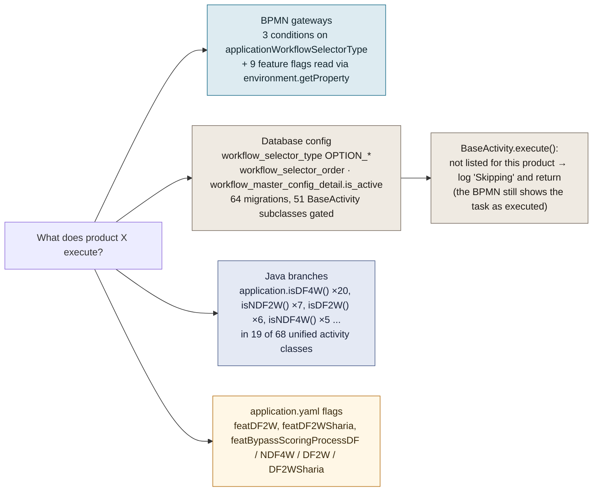
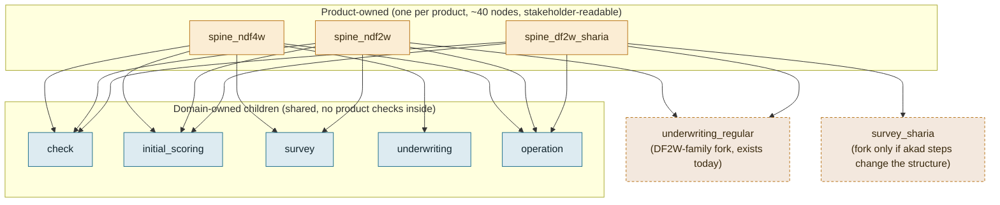
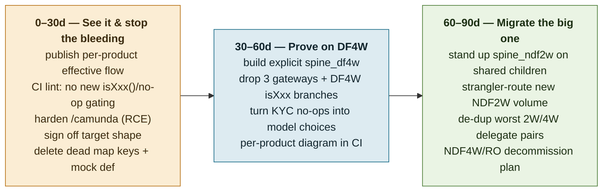

# Workflow gap analysis: one spine for every product, or one spine per product?

Companion to [workflow-analysis.md](workflow-analysis.md). That document draws what exists; this one tests a design claim against the code:

> "A single giant workflow is set up to handle all products. Every loan product is different and has its own business stakeholders, so the complexity is too high in one workflow. Each product should have its own spine and its own domain children (`survey_ndf4w`, `survey_ndf2w`, `underwriting_ndf4w`, `scoring_ndf2w`, ...)."

Evidence is from `bravo-bpm-service` (`src/main/resources/bpmn`, `src/main/java/com/bfi/bravo/activity`, `src/main/resources/db/migration`) and its git history, read on 2026-09-08.

## 1. Verdict in short

1. **"Single workflow for all products" is true. "Giant" is not.** The unified spine is small: 43 top-level nodes, 8 call activities, no user tasks, spread over 33 files. The giant workflows in this codebase are the *per-product* ones: `NDF4W` (223 top-level nodes, 392 commits) and `NDF2W` (174 nodes, 359 commits). The legacy generation is exactly the per-product design being proposed, and it is where the complexity accumulated.
2. **The real gap is not "one spine". It is that product variation is invisible.** In the unified generation a product's behaviour is assembled from four places: three BPMN gateway conditions, a database configuration that silently no-ops service tasks (64 migrations so far), `if (application.isDF4W())` branches inside 19 of the 68 unified Java activities, and 9 feature flags read from the BPMN. No artifact shows what DF2W actually executes.
3. **Per-product copies of every domain child would recreate the legacy problem.** `NDF4W` and `NDF2W` share only 20 of about 125 delegate beans; the rest are largely the same steps re-implemented under product-suffixed names (`createCifActivity` vs `createCif2wActivity`, `preFatalRacActivity` vs `preFatalRac2wActivity`, `pushApplicationToSalesTraxActivity` vs `pushApplicationToSalesTrax2wActivity`, and so on). Full duplication is how the two products drifted apart.
4. **In production the shared spine is a minority path.** Datadog APM for the 30 days to 2026-09-08 shows the shared spine runs one product: 18,806 DF4W applications in 90 days versus 321,000 on the legacy monoliths (NDF2W 248,685, NDF4W 71,995). The spine is 5.5% of volume and serves DF4W only; DF2W is fully configured but unused; NDF2W, NDF4W, RO and Sharia run the giant per-product processes. Section 8 has the verified numbers.
5. **Recommended target: product-owned spines, domain-owned children, explicit variation.** One thin spine per product (cheap, and it is the diagram stakeholders read), shared domain children by default, a product-specific child only where structure really differs, and no silent skipping. The codebase already contains the precedent: `Unified_Process_Workflow_Underwriting_Regular` is a DF2W-specific child called from the shared underwriting orchestrator.

## 2. Checking the premise: which workflows are giant?

| Process | Generation | Products served | Top-level nodes | User tasks | Service tasks | Embedded subprocesses | Commits on the file |
|---|---|---|---|---|---|---|---|
| `NDF4W` | legacy, per product | 4W conventional | 223 | 21 | 111 | 48 | 392 |
| `NDF2W` | legacy, per product | 2W conventional | 174 | 20 | 118 | 45 | 359 |
| `UNSECURED` | legacy, per product | unsecured | 21 | 2 | 22 | 6 | 83 |
| `Unified_Process_Main_Workflow` | unified, shared | NDF4W, DF4W, NDF2W, DF2W, DF2W Sharia | 43 | 0 | 9 | 0 | 36 |
| largest unified child (`Unified_Process_Workflow_Survey`) | unified, shared | all of the above | 22 | 0 | 1 | 0 | 14 |

The unified design moved complexity out of the diagram. The spine and its 32 children together hold 69 distinct delegate beans for five products; the two legacy monoliths hold 145 for two products.

## 3. What per-product separation produced in practice (legacy evidence)

The legacy generation *is* separated by product: one root process per product, chosen in Java from `setting.workflow.map`. Three things followed.

**Shared steps were copied, not shared.** Comparing delegate beans referenced by `ndf4w.bpmn` and `ndf2w.bpmn`:

| | NDF4W | NDF2W |
|---|---|---|
| distinct delegate beans | 71 | 74 |
| shared between the two | 20 | 20 |
| used by this product only | 49 | 52 |

Most of the "product-only" beans are the same domain step under a suffixed name: `dedupeCustomerCheckActivity` / `dedupeCustomerCheck2wActivity`, `getBranchLeadSurveyActivity` / `getBranchLeadSurvey2wActivity`, `highRiskCallPefindoActivity` / `highRiskCallPefindo2wActivity`, `pilotBranchCheckActivity` / `pilotBranchCheckRegular2wActivity`, `escalateRejectedApplicationActivity` / `escalateRejected2WActivity`, `addressVerificationActivity` / `addressVerification2WActivity`, `phoneCheckingActivity` / `phoneChecking2WActivity`. Only 7 of 36 embedded-subprocess names are common to both files. Products do differ, but far less than the two diagrams suggest; the diagrams differ mostly because two teams drew the same stages twice.

**Variants of one product were mostly the parent product again.** `NDF4W_RO` uses 19 delegates, 17 of them also in `NDF4W`. `NDF4W_Sharia` uses 23, 14 also in `NDF4W`. `NDF4W_RO` even calls the whole `NDF4W` process as a child when the RO shortcut does not apply.

**Configuration leaked into the diagrams anyway.** The four legacy root files contain 53 `environment.getProperty(...)` reads across 23 distinct feature flags. Product separation did not remove runtime switches; it added them per copy.

## 4. What the unified design does with product variation (the actual gap)

The unified generation stops copying, but it pays for it by scattering the product axis across four mechanisms.

| Mechanism | Where | Evidence | Why it is a gap |
|---|---|---|---|
| Gateway conditions on product | `unified-main-workflow.bpmn`, `unified-workflow-underwriting.bpmn`, `unified-pd-model.bpmn` | 3 `applicationWorkflowSelectorType` conditions; 10 `environment.getProperty` reads of 9 flags | Product routing is mixed with feature flags inside process XML; the diagram reads as one flow but executes as several. |
| Config-gated no-op tasks | `activity/BaseActivity.isNeedToProceed` + `workflow_*` tables | 51 subclasses; 34 classes appear in `workflow_selector_order` inserts; 64 workflow-config migrations since 2024-03 | A skipped task completes normally, so Camunda history, Cockpit and the BPMN all show steps that did nothing. The only way to know a product's real path is to join the config tables. |
| Product branches in Java | `activity/unified/**` | 19 of 68 classes contain `application.isXxx()`; `isDF4W()` alone appears 20 times | The same activity behaves differently per product with no trace in BPMN or config. This is the layer that will grow silently. |
| Feature flags per product | `application.yaml` | `featDF2W`, `featDF2WSharia`, four `featBypassScoringProcess*` flags | A product can be half-enabled per environment; the BPMN cannot express that. |

Consequences that follow directly:

- **Blast radius.** Commit subjects on `unified-main-workflow.bpmn` name DF4W (4), DF2W (3), Sharia, RO, NDF4W and Company. Every one of those changes redeployed the spine that all five products run. On `unified-workflow-survey.bpmn`, DF4W work (3 commits) changed the survey orchestration NDF2W also runs.
- **No owner-readable artifact.** A product stakeholder cannot be handed a diagram of their product; the diagram is shared and the differences are in SQL and Java.
- **Test matrix.** Correctness of one BPMN file depends on products × config rows × flags. The 64 migrations include repeated "set-active" / "set-inactive" corrections (for example `...pd-model-df4w-set-active`, `...pre-fatal-rac-df4w-set-active`, `...underwriting-return-set-inactive-except-df4w`), which is what a hidden matrix looks like in practice.
- **Silent divergence risk.** With `BaseActivity` returning quietly, a missing config row does not fail a deployment or a process; it removes a check from a loan product.

What the unified design got right, and should be kept:

- Orchestrators contain no user tasks; human work is confined to leaves.
- Domain steps exist once. Onboarding DF2W Sharia in 2026 touched the spine in one commit plus migrations, instead of adding a fourth monolith.
- Escalation, cancellation and rejection are centralised as boundary events on the spine instead of being re-drawn per product.

## 5. Assessing the proposed target: a spine per product and children per product and domain

The proposal is `survey_ndf4w`, `survey_ndf2w`, `underwriting_ndf4w`, `underwriting_ndf2w`, `scoring_ndf4w`, `scoring_ndf2w`, and so on: five products × five domains, so roughly 25 children plus 5 spines.

| Claim in the proposal | What the code says |
|---|---|
| Every product is different | True at the edges, false in the middle. Between NDF2W and DF2W the whole Scoring 2 difference is two config-gated activities (`SurveyRACUnifiedActivity`, `PDModelAlternativeOverlayUnifiedActivity`, per the 2026-07-24 migration). Between NDF4W and its RO variant, 17 of 19 steps are identical. Duplicating Check, KYC, Pefindo, Create CIF and Go Live per product would copy code that is the same for all of them. |
| Each product has its own stakeholders | True, and it is the strongest argument for a per-product *spine*: the spine is the document that says "this is the order of stages for your product", and it is 40 nodes, so five of them are cheap. |
| Complexity is too high in one workflow | The complexity is not in the workflow, which is small; it is in the invisible config and Java branches. Splitting the BPMN by product without removing those would leave the hard part where it is. |
| Domain children per product | Recreates the legacy pattern that produced 145 delegates for two products. Prefer domain children shared by default, forked per product only where the *structure* differs (order of steps, different human roles), which is what `Unified_Process_Workflow_Underwriting_Regular` already does for DF2W. |

Camunda 7 makes the middle path cheap: a call activity's `calledElement` can be an expression, so a product spine can dispatch to `Unified_Process_Workflow_Survey` for most products and to `survey_df2w_sharia` for one, without a gateway.

## 6. Recommended shape

Rules that close the gap, in order of payoff:

1. **One spine per product, generated or hand-drawn, that is the source of truth for stage order and for which child key each stage calls.** Retire `applicationWorkflowSelectorType` gateways from BPMN; the spine *is* the selector.
2. **No silent skipping.** A service task that is not applicable to a product must not exist on that product's path. Replace `BaseActivity.isNeedToProceed` no-ops with either a gateway in the child (when the choice is data-driven, such as risk type) or a product-specific child (when the choice is product-driven). Skipped-by-config should at minimum fail loudly when a config row is missing.
3. **Remove `application.isXxx()` from the 19 unified activities.** Product behaviour belongs in the spine or in a product-specific child, never inside a shared bean.
4. **Fork a domain child only on structural difference.** Order of steps, different human roles, or different external partners justify `underwriting_regular`; a different threshold does not.
5. **Publish the effective flow per product.** Until the above lands, generate it: join `workflow_master_config_detail`, `workflow_selector_order` and `workflow_selector_type` per product and overlay on the BPMN (the parse scripts behind workflow-analysis.md can do this). This is the cheapest immediate fix for the stakeholder-visibility problem.
6. **Keep the DB config for what it is good at:** per-branch, per-customer-type or per-risk-type toggles that change often and do not change structure.

## 7. Gap register

| # | Gap | Evidence | Severity | Remedy (section 6) |
|---|---|---|---|---|
| G1 | Product routing invisible in BPMN | 3 gateways + DB config + Java branches + flags | High | 1, 5 |
| G2 | Config-gated tasks complete as no-ops | `BaseActivity.execute` logs "Skipping" and returns; history shows the task | High | 2 |
| G3 | Product branches inside shared beans | 19 of 68 unified activities; `isDF4W()` ×20 | High | 3 |
| G4 | Shared spine redeployed for single-product changes | `unified-main-workflow.bpmn` commits tagged DF4W, DF2W, Sharia, RO, Company | Medium | 1 |
| G5 | Config drift needs corrective migrations | repeated `set-active` / `set-inactive` migrations for DF4W, DF2W, NDF2W | Medium | 2, 5 |
| G6 | Legacy monoliths still carry ~92% of new applications | Datadog 30d: v1+v2 creates 45,954 vs v2.1 3,734; engine logs show `NDF2W` 14,187 and `NDF4W` 3,806 instances vs 6 unified | High | migrate onto product spines, not onto the shared spine |
| G7 | Dead config: map keys with no process | `PREAPPROVAL`, `DF4W`, `DF2W`, `DF2W_Sharia` in `setting.workflow.map` | Low | delete or point at spines |
| G8 | Unreferenced deployment | `Process_NDF4W_Scoring_1_Mock_Ro` | Low | remove |

## 8. Verified production data (BPM PostgreSQL, 90 days to 2026-09-09)

The earlier Datadog estimates in this section were replaced on 2026-09-09 with direct queries against the production `ms-bpm` database (read-only session, `default_transaction_read_only = on`). Camunda history is retained 90 days, so windows are 90 days unless noted. The application tables and the Camunda `act_*` tables share one schema, so no cross-database work was needed.

### 8.1 Which spine actually runs, by volume

Root workflow instances started (`act_hi_procinst`, `super_process_instance_id_ IS NULL`):

| Root workflow | Started (90d) | Started (30d) |
|---|---|---|
| `NDF2W` (legacy 2W monolith) | 248,682 | 86,049 |
| `NDF4W` (legacy 4W monolith) | 59,909 | 23,006 |
| `NDF4W_RO` (legacy RO) | 11,458 | 4,008 |
| `Unified_Process_Main_Workflow` | 18,809 | 6,826 |

Of the four loan-entry roots, the unified spine is **5.5%** of started applications (18,809 of 338,858). The weekly series is flat across all 90 days: no migration trend. `NDF4W_Sharia` and `UNSECURED` had zero starts in this engine in 90 days (Sharia runs in its own deployment; unsecured is elsewhere or dormant).

### 8.2 Which products the unified spine serves — the sharp finding

`application` joined to `loan` and `act_hi_procinst` on `process_id` (90 days):

| product_id | Product | Root definition | Applications |
|---|---|---|---|
| 2 | NDF2W | `NDF2W` | 248,685 |
| 1 | NDF4W | `NDF4W` | 60,523 |
| 1 | NDF4W (RO) | `NDF4W_RO` | 11,472 |
| 4 | **DF4W** | `Unified_Process_Main_Workflow` | 18,806 |
| 1 | NDF4W (company pilot) | `Unified_Process_Main_Workflow` | 4 |

Confirmed by the selector variable on the unified roots: 18,806 carried `applicationWorkflowSelectorType = OPTION_DF4W`, 3 were `OPTION_NDF4W`. **The "single workflow for all products" is, in production, the DF4W workflow.** DF2W (product 11) has a complete configuration seeded (8.4) but zero applications in 90 days. NDF2W, NDF4W, RO and Sharia — the entire live retail book — run legacy per-product monoliths. The shared spine is not carrying "all products"; it carries one product plus a 3-application pilot.

### 8.3 The config-skip mechanism is real and heavy (gap G2, measured)

`act_hi_actinst` service-task durations (7 days) confirm activities no-op by configuration. In `Unified_Process_KYC_Check` three sub-checks are inactive for most products; their durations collapse to below the network floor:

| Activity (KYC Check) | Active for (8.4) | Execs (7d) | % under 50 ms | p50 |
|---|---|--:|--:|--:|
| Address Verification | DF4W only | 4,822 | 89% | 43 ms |
| Phone Checking | DF4W only | 4,822 | 89% | 43 ms |
| Shopee Score | DF4W only | 4,822 | 86% | 44 ms |
| Pefindo Customer (real call) | DF4W, NDF2W | 3,177 | 42% | 898 ms |
| External Data Check (real call) | DF-family, NDF2W | 1,645 | 0% | 1,874 ms |

Activities that call Pefindo, the PD model or external data sit at hundreds to thousands of ms; the config-skipped ones sit under 50 ms. The phantom-activity problem is measured, not hypothetical: even for the one product on the spine, a large share of the tasks drawn in the BPMN complete as no-ops that still appear in history.

### 8.4 Effective per-product configuration (Q1 — the fact static analysis could not recover)

55 activity classes are gated by the config tables, and active-vs-inactive is genuinely per product. Representative rows (checkmark = active for that OPTION):

| Activity (stage) | NDF4W | NDF2W | DF4W | DF2W | DF2W Sharia |
|---|:--:|:--:|:--:|:--:|:--:|
| Address / Phone / Shopee (KYC) | | | Y | | |
| Soft RAC, Pre-Fatal RAC, External Data (RAC) | | Y | Y | Y | Y |
| Bureau RAC, Survey RAC | | | | Y | Y |
| Collateral / Fatal / Simple Survey (Scoring 2) | | Y | | | |
| PD Model Alternative / Overlay | | overlay | Y | Y | Y |
| Anti Fraud Engine (Check) | | | | Y | Y |
| NST data, CA doc checklist (CA) | Y | | Y | | |
| Approval Engine, Life Insurance | Y | | Y | | |

Initial-scoring for `OPTION_NDF4W` has 0 active / 18 inactive classes: NDF4W scoring does not run through the unified spine at all, consistent with 8.2. This table is the artifact that did not exist before — the actual per-product flow, from the database rather than the BPMN.

### 8.5 Config fragmentation is modest (mutes an earlier risk)

`application_workflow_config` (Q5): `OPTION_DF4W` has 41,537 lead-group rows but only 9 distinct effective config blobs; `OPTION_NDF4W` has 3 rows, 1 config. Behaviour is parameterised by ~9 variants, not fragmented per lead. The variation problem is about *where* it is expressed (config + Java + gateways), not runaway per-instance divergence.

### 8.6 Human work per workflow (Q6)

`act_hi_taskinst`, 90 days, largest queues: `NDF2W` User Survey Task 185,574 (avg 58 h open); `NDF4W` High Risk Survey Task 50,650 (55 h); `Unified_Process_Surveyor_Assignment` Survey Form 15,334 (124 h) and External Survey Form 14,688 (131 h); `Process_Long_Scoring_Survey` CA checklist 36,671. Human work is heavy in both generations, and in the unified generation it stays in the leaf children exactly as section 3 predicted: the orchestrators recorded zero user-task instances.

### 8.7 What this does to the verdict

- "A single giant workflow handles all products" is **false in production**. Five legacy monoliths carry ~94% of applications and the entire retail book; the shared spine carries DF4W (5.5%) plus a 3-application pilot.
- The complexity being paid *now* is the legacy per-product one: the NDF2W and NDF4W monoliths, 359 and 392 commits, 248k and 60k loans a quarter.
- The unified gaps G1 to G3 are real and measured, but are paid on one product. The decision in front of the team is not "unwind a giant shared workflow" — it is "the spine has proven itself on DF4W; do we migrate the legacy products onto it, and if so with product-owned spines and explicit variation rather than today's hidden config."

## 9. Data obtained and the queries used

All six planned queries ran against the BPM database; results are in section 8. Connection was the proxy `sqlproxy.prod.bravo.bfi.co.id:15434`, database `postgres`, via psql, read-only.

- **Q1** effective activity list per option — `workflow_master_config_detail` ⋈ `workflow_selector_order` ⋈ `workflow_selector_type` ⋈ `workflow_selector_activity_sub_process` ⋈ `workflow_selector_activity`. (8.4)
- **Q2** instances per definition per week — `act_hi_procinst`. (8.1)
- **Q3** products per root definition — `application` ⋈ `loan` ⋈ `act_hi_procinst` on `process_id::text = id_`; selector cross-checked in `act_hi_varinst`. (8.2)
- **Q4** config-skipped service tasks — `act_hi_actinst` duration distribution, unified keys, 7-day window (30/90-day windows exceed the statement timeout; the table holds ~50 M rows per 90 days). (8.3)
- **Q5** distinct effective configs — `application_workflow_config`, hashing `workflow_config::text`. (8.5)
- **Q6** human tasks per definition — `act_hi_taskinst`. (8.6)

Full SQL is in `workflow-analysis.md` and in this file's git history; only Q4 was narrowed (7-day window, explicit unified-key list) to fit the timeout.

### Still not obtainable from the database

- **Business ownership per product** — not modelled anywhere; `candidateGroups` is empty on every user task, assignment happens in Java.
- **The per-product branches inside the 19 Java activities that switch on `application.isDF4W()`** — only code review shows these; no runtime row distinguishes the branches.

### Found while querying, recorded separately

While running Q2/Q3 I found 61 injected remote-code-execution process definitions in the BPM Camunda engine, one confirmed to have executed inside the production pod. That is a security exposure, not a workflow matter; it is written up in `SECURITY-FINDING-camunda-rce.md`. The Sharia engine was checked and is clean.

## 10. Best practice: the recommended strategy

The target is not a preference; it is the settled shape for multi-product process orchestration on an engine like Camunda 7. Four principles, each with the industry pattern it comes from and what it means concretely for Bravo.

### 10.1 The model is the source of truth; data only parameterises it

The effective path a loan takes must be derivable **from the process model alone**. Two kinds of variation must be told apart and placed differently:

- **Structural variation** — which steps run, in what order, and which humans act — belongs *in the model*: a gateway, or a different sub-process. It is versioned, diffable, and shown on a diagram.
- **Data variation** — a threshold, a branch/risk toggle, a rate — belongs *in configuration*. It changes often and does not change the shape of the journey.

The failure mode Bravo is in is that structural variation ("DF4W runs Address Verification, NDF2W does not") is expressed as **data** — a `workflow_master_config_detail.is_active` row that makes a modelled task silently no-op. That inverts the rule: the model shows a step that does not run, and the truth lives in five join tables. Best practice: a step that does not run for a product is **not on that product's model**.

### 10.2 Product-owned spines, domain-owned shared children (orchestrator / worker)

This is the Camunda "one process per business-relevant journey, reusable sub-processes for shared capability" pattern, and the DDD bounded-context split applied to process:

- **One thin executable spine per product** (`spine_ndf4w`, `spine_ndf2w`, …): 30–40 nodes, no domain logic, its only job is to name the ordered stages and call the right child for each. This is the artifact a product owner reads and signs.
- **Domain children shared by default** (`check`, `initial_scoring`, `survey`, `underwriting`, `operation`), each owned by the domain that understands it, with **no product `if/else` inside**.
- **Fork a child only on structural difference.** Bravo already has the correct precedent: `Unified_Process_Workflow_Underwriting_Regular` is a DF2W-family underwriting fork called from the shared underwriting orchestrator. That is the pattern; it is simply not applied consistently.

Camunda 7 makes this cheap: a call activity's `calledElement` can be an expression, so a spine dispatches to `survey` for most products and `survey_sharia` for one, with no gateway and no flag.

### 10.3 Keep product out of the domain code (stable service contracts)

Domain activities are workers behind a stable interface. Product-specific behaviour is chosen by the spine (which child it calls) or by explicit configuration passed in, **never** by `application.isDF4W()` inside a shared bean. A shared `KYCCheckActivity` should do KYC the same way for everyone; if DF4W needs an extra check, that is a different step on the DF4W spine, not a hidden branch in the shared one.

### 10.4 Platform governance: least privilege, migration, and a per-product test matrix

- **Least-privilege engine.** The workflow engine's REST/cockpit surface must be authenticated and network-restricted. (Bravo's `/camunda` was `permitAll`, which is how 61 hostile process definitions were deployed — see `SECURITY-FINDING-camunda-rce.md`. Hardening this is a prerequisite for any of the below, not an optional extra.)
- **Explicit versioning and instance migration.** Changing one product must not redeploy the shared graph that four other products are mid-flight on. Product-owned spines give each product its own deployment unit and its own `processDefinitionKey` to migrate.
- **Per-product observability.** Each product's effective flow is generated on every build and published; the CI pipeline diffs it so a change to a shared child that alters a product's path is visible in review.

### 10.5 Migrate by strangler, never big-bang

Stand the new shape up beside the old, route new volume product-by-product, and retire each monolith only once its replacement carries production traffic cleanly. Bravo has already, accidentally, proven this is safe: the unified spine has run **DF4W** in production for months at 5.5% of volume (§8.2). That is a working strangler beachhead — the strategy is to make it deliberate.

## 11. The gap from current Bravo to best practice

Each principle above, versus what production and the code actually show (§8, §3–§4). Severity is the risk of leaving it as-is.

| # | Best-practice principle (§10) | Current Bravo state | Gap | Severity |
|---|---|---|---|---|
| A | Model is source of truth; structure in model, data in config | Structure encoded as `is_active` no-op rows; 55 classes gated; measured phantom tasks completing <50 ms (§8.3) | Effective path not derivable from model; needs a 5-table join | **High** |
| B | Thin product-owned spine per product | One shared spine for all; product chosen by 3 gateways + selector variable | No product owns a readable spine; one graph, five products' blast radius (§4) | **High** |
| C | Domain children shared, no product logic inside | 19 of 68 unified activities branch on `application.isXxx()` (`isDF4W()` ×20) | Product logic hidden in shared beans; grows silently | **High** |
| D | Fork child only on structural difference | Done once correctly (`…Underwriting_Regular`); everywhere else variation is config no-ops | Pattern known but not applied; the good precedent is the exception | Medium |
| E | Product out of domain code via stable contracts | Config + Java + gateways + 9 feature flags all carry product (§4) | Four mechanisms to change to alter one product's flow | **High** |
| F | Least-privilege engine, per-product deployment unit | `/camunda` was `permitAll` (RCE); one deployment unit for all products | Shared blast radius operationally and on the security surface | **High** (security) |
| G | Migrate by strangler | Happening by accident (DF4W on spine, 5.5%), flat, undeliberate | No migration plan; legacy carries ~94% and the whole retail book | Medium |
| H | Dead/duplicated assets removed | `PREAPPROVAL`/`DF4W`/`DF2W`/`DF2W_Sharia` map keys with no process; `…Scoring_1_Mock_Ro` unreferenced; 145 delegates for 2 legacy products | Cleanup backlog; duplication is how NDF4W/NDF2W drifted | Low–Medium |

**The one-sentence gap.** Bravo has the right *building blocks* — an orchestrator/worker split, shared domain children, and one correct fork — but expresses product variation in three places the model cannot show (config no-ops, Java `isXxx()`, feature flags), so no product has a readable, owned, independently-deployable spine, and the legacy monoliths that still carry 94% of volume were never migrated at all.

## 12. Plan: 30 / 60 / 90 days

Sequenced by risk and payoff. Phase 1 buys visibility and stops the bleeding without moving a workflow; phase 2 proves the target shape on the product already on the spine (DF4W, lowest risk); phase 3 attacks the highest-volume legacy product (NDF2W, 248k/quarter). Each phase has an exit metric.

### 0–30 days — Make variation visible and stop adding to it

| Action | Detail | Exit criterion |
|---|---|---|
| Publish effective per-product flow | Generate from `workflow_master_config_detail ⋈ selector_order ⋈ selector_type` overlaid on the BPMN (the §8.4 query + the parse scripts behind this analysis). One diagram per product, in the repo, regenerated on build. | Every live product (NDF2W, NDF4W, RO, DF4W) has a current, owner-readable flow diagram |
| Freeze new hidden variation | PR check that fails a new `application.isXxx()` in `activity/unified/**` and a new config-gated class lacking a doc entry. | CI blocks both; count of `isXxx()` sites can only go down from 19 |
| Harden the engine | Authenticate + network-restrict `/camunda`; complete the RCE remediation in `SECURITY-FINDING-camunda-rce.md`. | `/camunda` not `permitAll`; injected defs purged; verified in prod + sharia |
| Decide the target | One-page ADR: product-owned spines + shared domain children + fork-on-structure. Stakeholder sign-off (product owners per §10.2). | ADR merged |
| Cheap cleanup | Delete `PREAPPROVAL`/`DF4W`/`DF2W`/`DF2W_Sharia` dead `setting.workflow.map` keys (G7); remove `Process_NDF4W_Scoring_1_Mock_Ro` (G8). | Map keys map 1:1 to real processes; no unreferenced deployment |

### 30–60 days — Prove the pattern on DF4W (already the only live spine product)

| Action | Detail | Exit criterion |
|---|---|---|
| Build `spine_df4w` | A thin executable spine that names DF4W's stages and calls each domain child by `calledElement`. Route new DF4W volume to it behind a flag; keep the shared spine for the others. | New DF4W loans run `spine_df4w`; unified spine no longer receives DF4W |
| Remove DF4W's hidden variation | Delete the 3 `applicationWorkflowSelectorType` gateways for the DF4W path and the DF4W arms of the `isXxx()` activities it touches. | DF4W path has zero product gateways and zero `isDF4W()` in shared beans |
| Kill phantom tasks | Convert the KYC/RAC config no-ops (§8.3) on the DF4W path into explicit model choices (gateway when data-driven, fork when product-driven). | No sub-50 ms no-op service tasks in DF4W history for gated KYC steps |
| Lock in observability | Per-product flow diagram generated and diffed in CI; contract tests per domain child. | A change to a shared child that alters DF4W's path shows as a diagram diff in review |

### 60–90 days — Migrate the highest-volume legacy product, retire duplication

| Action | Detail | Exit criterion |
|---|---|---|
| Stand up `spine_ndf2w` | Biggest prize: 248k loans/quarter. Reuse the shared domain children; fork only where NDF2W's structure genuinely differs (e.g. its own survey/underwriting-regular path). | `spine_ndf2w` runs in prod for a strangler slice of new NDF2W volume |
| Strangler cutover | Route a rising % of new NDF2W applications to the spine; legacy `NDF2W` stays for in-flight and rollback. | ≥25% of new NDF2W starts on `spine_ndf2w`, error/latency parity with legacy |
| De-duplicate delegates | Collapse the worst 2W/4W near-duplicate beans (`createCif`/`createCif2w`, `preFatalRac`/`preFatalRac2w`, `pushApplicationToSalesTrax`/`…2w`) behind shared implementations called by both spines. | Distinct delegate count for 2W/4W trending down from 145 |
| Plan the rest | Decommission roadmap for `NDF4W`, `NDF4W_RO`, and the Sharia deployment onto spines; DF2W (configured, 0 volume) either launched on `spine_df2w` or its dead config removed. | Written, dated decommission plan for the remaining monoliths |

**Programme-level metrics** (report monthly):

- % of new-application volume running on explicit product spines (today: 0; DF4W-on-shared-spine 5.5% does not count until it is `spine_df4w`).
- Count of `application.isXxx()` sites in `activity/unified/**` (today: 19; target: 0).
- Config-gated no-op service-task executions per day (today: heavy on the KYC path per §8.3; target: near-zero as gating becomes model structure).
- Distinct delegate beans per legacy product pair (today: 145 for 2W+4W; target: falling).
- Products with a current owner-readable spine diagram (today: 0; target: all live products).

**Explicitly out of scope for 90 days.** Rewriting the survey/underwriting *domain logic*; migrating Sharia's separate deployment; and any change to the LORA/Temporal track — those are separate programmes (see `compare.md`). This plan is only about the *shape* of the Bravo workflows and moving product variation out of hiding and onto owned, readable spines.
